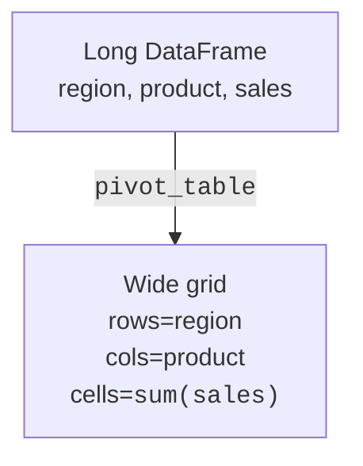

If you've ever made a pivot table in Excel, drag region to
rows, product to columns, sum of sales to values, Pandas's
`pivot_table()` is the exact same idea, expressed in code.

<Figure
  slug="pandas-pivot-tables-cutout"
  alt="Pivot tables, an isometric illustration"
/>

## The shape of a pivot

You're saying: "I want a grid. The rows come from this column,
the columns come from that one, and the cells aggregate this
third one."

## A first pivot

<CodeBlock
  adapter="python"
  files={[
    {
      filename: "main.py",
      starterCode: `import pandas as pd

sales = pd.DataFrame(
    {
        "region": ["N", "N", "S", "S", "E", "W", "W", "N"],
        "product": ["A", "B", "A", "B", "A", "A", "B", "B"],
        "amount": [10, 20, 30, 25, 15, 18, 22, 40],
    }
)

p = sales.pivot_table(
    index="region",
    columns="product",
    values="amount",
    aggfunc="sum",
)
print(p)
`,
    },
  ]}
/>

Each cell is "sum of `amount` where `region` AND `product`
match that row/column".

## Pivot vs pivot_table

| Feature | `pivot` | `pivot_table()` |
| --- | --- | --- |
| Duplicate (index, columns) allowed | ❌ no | ✅ yes |
| Aggregation function | n/a | yes (`sum`, `mean`, ...) |
| Multiple aggregations | n/a | yes (list of funcs) |
| Margins (row/column totals) | n/a | `margins=True` |
| Handling NaN cells | n/a | `fill_value=` |

In practice, `pivot_table()` is almost always the right choice
because it gracefully handles duplicates.

<Figure
  slug="pandas-pivot-tables-inline-cutout"
  alt="A tall narrow stack of records being unfolded into a wide flat board of rows and columns, one record landing in each square"
  caption="When two records land in the same square, something has to combine them."
/>

## Multiple aggregation functions

<CodeBlock
  adapter="python"
  files={[
    {
      filename: "main.py",
      starterCode: `import pandas as pd

sales = pd.DataFrame(
    {
        "region": ["N", "N", "S", "S", "E", "W", "W", "N"],
        "product": ["A", "B", "A", "B", "A", "A", "B", "B"],
        "amount": [10, 20, 30, 25, 15, 18, 22, 40],
    }
)

p = sales.pivot_table(
    index="region",
    columns="product",
    values="amount",
    aggfunc=["sum", "mean", "count"],
)
print(p)
`,
    },
  ]}
/>

The result has a MultiIndex on the columns. Beautiful for
reporting; sometimes annoying for further computation (you may
want to flatten).

## Margins, row and column totals

<CodeBlock
  adapter="python"
  files={[
    {
      filename: "main.py",
      starterCode: `import pandas as pd

sales = pd.DataFrame(
    {
        "region": ["N", "N", "S", "S", "E", "W", "W", "N"],
        "product": ["A", "B", "A", "B", "A", "A", "B", "B"],
        "amount": [10, 20, 30, 25, 15, 18, 22, 40],
    }
)

p = sales.pivot_table(
    index="region",
    columns="product",
    values="amount",
    aggfunc="sum",
    margins=True,
    margins_name="Total",
    fill_value=0,
)
print(p)
`,
    },
  ]}
/>

This produces a row and column called `Total` containing the
overall sums, exactly like an Excel pivot's grand totals.

## Multiple index or column levels

<CodeBlock
  adapter="python"
  files={[
    {
      filename: "main.py",
      starterCode: `import pandas as pd

orders = pd.DataFrame(
    {
        "year": [2023, 2023, 2024, 2024, 2023, 2024],
        "region": ["N", "S", "N", "S", "N", "S"],
        "product": ["A", "B", "A", "A", "B", "B"],
        "amount": [100, 200, 150, 180, 90, 210],
    }
)

p = orders.pivot_table(
    index=["year", "region"],
    columns="product",
    values="amount",
    aggfunc="sum",
    fill_value=0,
)
print(p)
`,
    },
  ]}
/>

Hierarchical indexes are powerful for grouping (`year` is the
outer level, `region` is the inner). You can later slice with
`.loc[(2024, "S")]` or do per-level computations.

## Flattening for downstream use

When you need a "flat" DataFrame for export:

<CodeBlock
  adapter="python"
  files={[
    {
      filename: "main.py",
      starterCode: `import pandas as pd

sales = pd.DataFrame(
    {
        "region": ["N", "N", "S", "S"],
        "product": ["A", "B", "A", "B"],
        "amount": [10, 20, 30, 25],
    }
)

p = sales.pivot_table(index="region", columns="product", values="amount", aggfunc="sum")
print("Pivoted:")
print(p)
print()

flat = p.reset_index()
flat.columns.name = None  # remove the column-axis name
print("Flat:")
print(flat)
`,
    },
  ]}
/>

This is the right shape if you want to write the result back to
CSV with no weird header rows.

## Pivot table as a quick summary

<CodeBlock
  adapter="python"
  datasets={[{ path: "diamonds.csv", stageAs: "diamonds.csv" }]}
  files={[
    {
      filename: "main.py",
      initCode: `import pandas as pd
diamonds = pd.read_csv("diamonds.csv")`,
      starterCode: `# Average price for every cut x color combination
summary = diamonds.pivot_table(
    index="cut",
    columns="color",
    values="price",
    aggfunc="mean",
).round(0)

print(summary)
`,
    },
  ]}
/>

A single call replaces a multi-step `groupby + unstack` and turns
53,940 rows into a compact cut-by-color grid. (Read it carefully and
you will see the same skew from the GroupBy chapter, the "best"
combinations are not always the priciest, because carat varies
across the cells.)

## Mini challenge

<ChallengeCard
  adapter="python"
  title="Build a regional product report"
  instructions={`Given the DataFrame \`sales\` (provided), build a DataFrame \`report\` where:

- Rows are \`region\` (alphabetical)
- Columns are \`product\` (alphabetical)
- Cells are the **mean** of \`amount\`
- Missing (region, product) combinations should be 0, not NaN
- There must be a "Total" row and a "Total" column at the end containing the means across the whole region/product respectively`}
  files={[
    {
      filename: "main.py",
      initCode: `import pandas as pd

sales = pd.DataFrame({
    "region":  ["N","N","S","E","E","W","W","N"],
    "product": ["A","B","A","B","A","A","B","B"],
    "amount":  [10, 20, 30, 25, 15, 18, 22, 40],
})`,
      starterCode: `report = None  # TODO

print(report)
`,
      solutionCode: `import pandas as pd

report = sales.pivot_table(
    index="region",
    columns="product",
    values="amount",
    aggfunc="mean",
    margins=True,
    margins_name="Total",
    fill_value=0,
)

print(report)
`,
    },
  ]}
  tests={[
    {
      id: "type",
      name: "report is a DataFrame",
      description: "Type check",
      code: `import pandas as pd
assert isinstance(report, pd.DataFrame)`,
    },
    {
      id: "has_total_row",
      name: "Has a Total row",
      description: "margins row present",
      code: `assert "Total" in report.index`,
    },
    {
      id: "has_total_col",
      name: "Has a Total column",
      description: "margins column present",
      code: `assert "Total" in report.columns`,
    },
    {
      id: "no_nan",
      name: "No NaN cells",
      description: "fill_value applied",
      code: `assert report.isna().sum().sum() == 0`,
    },
    {
      id: "regions_present",
      name: "All four regions appear as rows",
      description: "N, S, E, W plus Total",
      code: `for r in ["N","S","E","W","Total"]:
    assert r in report.index`,
    },
  ]}
/>

## Check your understanding

<MultipleChoice
  markdown={`What is the key advantage of \`pivot_table()\` over plain \`pivot\`?

- [o] It accepts an aggregation function, so it works even when \`(index, columns)\` combinations have duplicate rows
  > \`pivot\` errors on duplicates; \`pivot_table()\` aggregates them.
- It is newer
  > Both \`pivot\` and \`pivot_table()\` have been in Pandas for many years; novelty is not the distinction, and \`pivot\` is still perfectly valid when there are no duplicates.
- It is faster
  > \`pivot_table()\` performs aggregation in addition to reshaping, which typically makes it slightly slower than plain \`pivot\` on clean data; the advantage is robustness, not speed.
- It supports CSV
  > Both functions operate on in-memory DataFrames regardless of the original file format; CSV support is provided by \`pd.read_csv()\`, not by either pivot function.

That's why \`pivot_table()\` is the workhorse in practice.`}
/>

<MultipleChoice
  markdown={`What does \`margins=True\` add to a pivot table?

- Markdown formatting
  > Markdown formatting is not produced by Pandas DataFrames; \`margins=True\` adds data rows and columns to the pivot result.
- Borders
  > \`margins=True\` is a data operation that adds a "Total" row and column; it does not add any visual formatting or borders to the output.
- Padding around the result
  > \`margins=True\` adds summary rows and columns with aggregated values, not visual whitespace or layout padding.
- [o] A "Total" row and column that contain the aggregation applied to the entire row/column slice (typically grand totals)
  > Just like the totals row in an Excel pivot.

Margins are a small but valuable feature when producing reports.`}
/>

<MultipleChoice
  markdown={`After pivoting, you want to write the result to CSV without weird "product" header rows. What's the right cleanup?

- Delete the index manually
  > Manually deleting index entries would corrupt the DataFrame; the correct approach is to call \`.reset_index()\` to promote index levels into regular columns.
- Use \`pivot\` instead of \`pivot_table()\`
  > Switching to \`pivot\` does not remove the hierarchical column name (\`columns.name = "product"\`); the flattening issue is independent of which pivot function you use.
- [o] Call \`.reset_index()\` (and optionally clear \`columns.name\`) to flatten the pivot back into a regular DataFrame
  > CSV exports work best on flat, name-free DataFrames.
- Convert to JSON instead
  > Converting to JSON does not resolve the "product" header row issue in CSV; the problem is the MultiIndex structure on the column axis, which persists in any format until flattened.

Pivots are great for presentation but often need flattening before export or further joins.`}
/>
