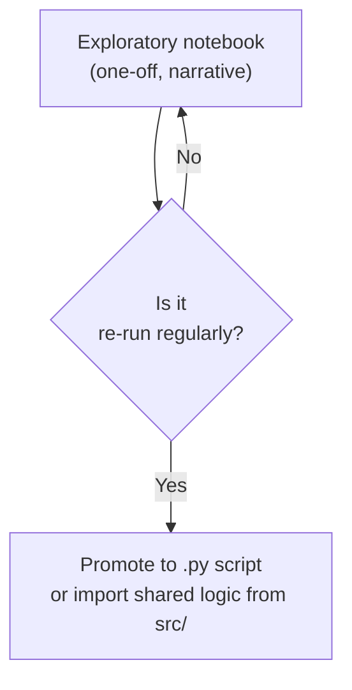

A six-month-old analysis is, for practical purposes, somebody
else's code, even if you wrote it. A small amount of structure
goes a long way toward making it survivable.

<Figure
  slug="pandas-project-organization-cutout"
  alt="Project organization, an isometric illustration"
/>

## A starter layout

```text
my-analysis/
├── README.md
├── requirements.txt
├── data/
│   ├── raw/                ← original files, immutable
│   ├── interim/            ← intermediate output
│   └── processed/          ← analysis-ready
├── notebooks/
│   ├── 01-explore.ipynb
│   ├── 02-clean.ipynb
│   └── 03-analysis.ipynb
├── src/
│   ├── load.py
│   ├── clean.py
│   └── plot.py
├── outputs/
│   ├── figures/
│   └── reports/
└── tests/
    └── test_clean.py
```

You don't need *all* of this on day one. But knowing where
things would go means you'll add them when needed.

## What goes where

- **`data/raw/`**, exactly what you received. Never touched
  again.
- **`data/interim/`**, after parsing, type-fixing, removing
  obviously-wrong rows.
- **`data/processed/`**, the analysis-ready dataset.
- **`notebooks/`**, exploration and narrative. Numbered so
  the reading order is obvious.
- **`src/`**, reusable functions imported from notebooks.
  When a notebook cell grows past ~30 lines or you copy-paste
  it, promote it to `src/`.
- **`outputs/`**, generated charts and final reports.
- **`tests/`**, assertions about your data and helper
  functions.

## The notebook-naming trick

Prefix notebooks with numbers:

```text
01-explore.ipynb
02-clean.ipynb
03-eda.ipynb
04-models.ipynb
```

This guarantees the reading order. It also makes inserting a
new step easy, `02.5-fix-encoding.ipynb` if you must.

## When to graduate to scripts



The crossover happens when:

- You re-run the same analysis weekly.
- Multiple notebooks need the same cleaning step.
- An engineer needs to call your logic from production code.

## Imports across notebooks and src

When you move helpers into `src/clean.py`:

```python
# src/clean.py
import pandas as pd

def standardize_names(df: pd.DataFrame) -> pd.DataFrame:
    df = df.copy()
    df.columns = df.columns.str.lower().str.replace(" ", "_")
    return df
```

You can import them from any notebook:

```python
# in a notebook
import sys
sys.path.insert(0, "..")   # or use a proper package install
from src.clean import standardize_names

df = standardize_names(df)
```

This refactor pays dividends as soon as you need the same logic
in two places.

## A minimal `README.md`

Every project deserves a README, even a small one:

```markdown
# Q1 Sales Analysis

## What this is
An exploratory analysis of Q1 2024 sales by region and product
line.

## How to run
1. Put raw sales export in `data/raw/sales_q1_2024.csv`
2. Install: `pip install -r requirements.txt`
3. Run notebooks in order: 01 → 02 → 03.
4. Final figures land in `outputs/figures/`.

## Key contacts
- Data source: revops@example.com
- Analyst: aiko@example.com
```

Anyone (including future-you) can rerun the project in 60
seconds.

## Naming conventions

- **Files**: `lowercase_with_underscores.csv`
- **Variables**: `lowercase_with_underscores`
- **Functions**: `lowercase_with_underscores`
- **DataFrames**: descriptive (`employees`, `orders`,
  `cleaned_orders`), not `df`, `df2`, `df_final`.

A name like `df_v3_final_REAL_FIXED` is a smell. If you need
versions, use git.

## Git, the missing tool

Use version control for analysis projects, just like
engineers do:

- `git init` at the project root.
- `.gitignore` excludes `data/raw/` and `data/processed/`
  (data should not be in git for size and privacy reasons).
- Commit frequently, with descriptive messages.

<Figure
  slug="pandas-project-organization-git-missing-tool-inline-cutout"
  alt="A marked strip that splits into two strips, each collecting its own marks, and rejoins further along into one"
  caption="A branch is a line of commits, and a merge is where two of them come back together."
/>

Even a one-person analysis benefits, you can roll back when
you break something.

Branches are the part of git most worth understanding early, and they are
easier to see than to describe: a branch is a line of commits, and a merge
is where two of them come back together.

<Chart slug="git-branch-topology" />

## A small `.gitignore`

```text
# Don't commit data
data/raw/
data/interim/
data/processed/

# Python
__pycache__/
*.pyc
.ipynb_checkpoints/

# Notebooks output (optional, divisive, pick a side)
# *.ipynb_checkpoints
```

## Tests for analysis

You don't need 100% test coverage, but a few critical
assertions are gold.

```python
# tests/test_clean.py
import pandas as pd
from src.clean import standardize_names

def test_standardize_names_lowercases():
    df = pd.DataFrame({"First Name": [1], "Last Name": [2]})
    out = standardize_names(df)
    assert list(out.columns) == ["first_name", "last_name"]
```

If `clean.py` changes, this test will catch the regression.

## Documentation lives with the code

Update the README, update notebook markdown cells, update
function docstrings, whenever you change the logic, update the
words that describe it.

<Figure
  slug="pandas-project-organization-documentation-lives-code-inline-cutout"
  alt="A card clipped to the flank of a machine, its markings recut in the same stroke that recuts the machine's own parts"
  caption="Change the logic and the words describing it change in the same commit."
/>

The single greatest cause of "this codebase is a nightmare" is
documentation that *used* to be true.

## Check your understanding

<MultipleChoice
  markdown={`Why number your notebooks (\`01-load\`, \`02-clean\`, ...)?

- It is required by Jupyter
  > Jupyter imposes no naming requirements; numbered prefixes are a human convention for clarity.
- It makes them faster
  > The filename has no effect on notebook execution speed.
- [o] It makes the reading and execution order obvious, important when a future reader (or you, in six months) needs to retrace the analysis
  > Folder listings are alphabetical; numbering forces a meaningful order.
- It saves memory
  > Notebook filename conventions have no impact on memory usage at runtime.

A tiny convention with disproportionate payoff.`}
/>

<MultipleChoice
  markdown={`When should logic move out of a notebook and into a \`.py\` file in \`src/\`?

- When the cell crashes
  > A cell crash indicates a bug to fix in place, not a reason to move code to a separate file.
- Never, notebooks are the deliverable
  > Notebooks are the exploratory interface, not always the final artifact; reusable logic belongs in importable \`.py\` modules once it needs to be shared or tested.
- Immediately, always
  > Moving logic to \`src/\` before it is needed adds overhead without benefit; the promotion makes sense once code is being reused or becomes large.
- [o] When the same logic is needed in multiple notebooks, or when a cell grows large enough to be its own well-named function
  > Notebooks are for narrative; reusable logic belongs in importable modules.

The promotion-when-reused rule is a healthy default.`}
/>

<MultipleChoice
  markdown={`Why is committing raw data to git generally a bad idea?

- Git cannot handle CSV
  > Git can track CSV files; the reason to exclude them is size, privacy, and change-frequency concerns, not a technical limitation.
- It is illegal
  > Committing data to git is not illegal per se, but it is poor practice for size and confidentiality reasons.
- It slows down notebooks
  > Notebook execution speed is unaffected by whether the raw data file is tracked in git or not.
- [o] Data files are often large, change frequently, and may contain PII or confidential information, git is for code, data belongs in dedicated storage
  > \`.gitignore\` should exclude \`data/\` in most projects.

Code in git; data in storage. A clean separation pays off.`}
/>

<MultipleChoice
  markdown={`Which name for a DataFrame is best?

- \`final\`
  > \`final\` is vague and almost always wrong within a week; it says nothing about the data's content or transformation stage.
- \`df_FINAL_v3_real\`
  > Version suffixes like \`FINAL\`, \`v3\`, and \`real\` encode history in a name, that belongs in git commits, not variable names.
- \`df2\`
  > Single-letter or numbered names convey no information about the data the variable holds.
- [o] \`cleaned_orders\`, a descriptive name that says what is in it
  > Names describe *content*, not history. Use git for history.

Good names eliminate whole categories of confusion.`}
/>
