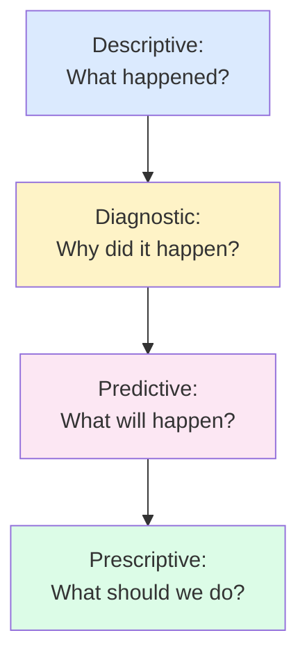
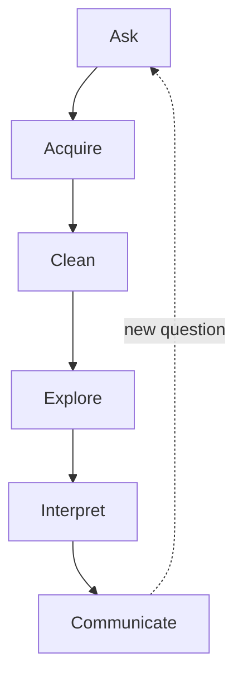

People throw the phrase "data analysis" around as if everyone
knows what it means. In practice, ask ten analysts and you will
get ten subtly different answers. Let us pin it down.

<Figure
  slug="pandas-what-is-data-analysis-cutout"
  alt="What data analysis is, an isometric illustration"
/>

## A working definition

> **Data analysis** is the disciplined process of turning raw
> recorded observations into useful, defensible answers to
> questions humans care about.

Three words in that sentence are doing all the work:

- **Disciplined.** It is not "looking at numbers until something
  feels right." It is a structured workflow with checkpoints,
  validation, and (often) peer review.
- **Useful.** The output is supposed to influence a decision,
  buy or sell, hire or fire, launch or kill, treat or wait.
- **Defensible.** If someone challenges your number, you can
  walk them through every step that produced it. Reproducibility
  again.

Notice what is *not* in the definition: nothing about Python,
nothing about Pandas, nothing about machine learning. Those are
tools. The definition is about the work, which existed centuries
before any of those tools did.

## The four kinds of analysis

A common framework, adapted from the consulting world, divides
analytical work into four kinds, in order of increasing
ambition.

<Figure
  slug="pandas-what-is-data-analysis-inline-cutout"
  alt="A crate of raw records at one end of a bench and a single clear finding pinned at the other, with tools in between"
/>

### Descriptive, *What happened?*

You count, you sum, you average, you slice. "Revenue last
quarter was $12.4M, up 6% year over year." "We onboarded 312
new users in March." "The median time to resolve a support
ticket is 4 hours." This is the bread and butter of every
analyst's day and the focus of most of this course.

### Diagnostic, *Why did it happen?*

You drill in. "Revenue grew because the West region grew 18%,
while every other region was flat." "Support tickets are slower
because two senior engineers left." Diagnostic analysis is
still mostly Pandas, slicing, grouping, comparing, but it
demands more domain knowledge and skepticism.

### Predictive, *What will happen?*

You build a model. "If marketing spend stays flat, we expect
4,200 new users next month." This is where statistics and
machine learning come in. We touch this lightly in the *Hypothesis
Intuition* chapter; it is the subject of its own course.

### Prescriptive, *What should we do?*

You recommend an action and quantify its expected impact. "We
should reduce churn by improving onboarding; based on a 3% lift
estimate that is worth $400k/year." This requires combining all
the previous layers with business judgment.

This course lives almost entirely in the **descriptive** and
**diagnostic** layers. Those are by far the most common kinds of
data work and the foundation for everything above them.

## What analysts actually *do*

Strip away the buzzwords and a working analyst spends their day
doing some mix of:

1. **Asking**, translating a vague business question into a
   specific, answerable analytical question.
2. **Acquiring**, getting the right data into a tool you can
   work with.
3. **Cleaning**, fixing types, missing values, inconsistencies,
   bad rows.
4. **Exploring**, summary statistics, group breakdowns,
   visualizations.
5. **Interpreting**, what does the pattern mean? Could it be a
   data artifact? Could it be noise?
6. **Communicating**, distilling the result for a decision
   maker, in words, charts, and (sometimes) a recommendation.

Notice the dashed feedback arrow. Real analyses almost always
generate new questions, sending you back to "Ask." A good
analyst is comfortable with the loop and resists the temptation
to stop at the first plausible answer.

## The question-asking skill

The single most under-rated skill in data analysis is **asking
the right question**.

A bad analytical question is vague:

> "How is the marketing campaign doing?"

A *good* analytical question is specific:

> "Of users who saw the new banner ad between March 1 and March
> 15, what fraction made a purchase within 7 days, and how does
> that compare with users who saw the old banner during the same
> window?"

The second question has a single, computable, defensible answer.
The first does not.

<Callout type="info" title="A practical tip">
Before writing any code, write the question down in one sentence
and circle the words that have to be defined precisely. *"Users
who saw"*, saw the page or the ad? *"Within 7 days"*, 7 days
of what? *"Compare with"*, on what metric? Every imprecise word
is a fork in the road that you (not the data) will have to pick.
</Callout>

## An end-to-end example, slowly

Let us run the loop once at a relaxed pace, on the penguin dataset
you met on the welcome page. Question:

> Among our Antarctic penguins, does **body mass** differ between
> **Adelie** and **Gentoo** penguins?

Here is the full process explicitly, the same six-step loop you will repeat
on almost every question:

<Steps>
<Step>

**Ask precisely**

Turn the vague question into exact columns and a concrete comparison.

</Step>
<Step>

**Acquire**

Load the data and confirm the columns you need are actually there.

</Step>
<Step>

**Clean**

Check for missing values and unexpected categories before trusting the
numbers.

</Step>
<Step>

**Explore**

Summarize the groups, medians and quartiles, to surface the pattern.

</Step>
<Step>

**Interpret**

Ask what the numbers can and cannot prove; resist jumping to causes.

</Step>
<Step>

**Communicate**

Write an honest, hedged summary a stakeholder can act on.

</Step>
</Steps>

### Step 1: Ask precisely

Define the comparison:

- "Body mass" = the `body_mass_g` column (grams).
- "Adelie" = rows where `species == "Adelie"`.
- "Gentoo" = rows where `species == "Gentoo"`.
- "Differ" = compare the *median* (less sensitive to outliers
  than the mean) and the *25th and 75th percentiles* (to see
  spread).

### Step 2: Acquire

<CodeBlock
  adapter="python"
  datasets={[{ path: "palmer-penguins.csv", stageAs: "penguins.csv" }]}
  files={[
    {
      filename: "main.py",
      initCode: `import pandas as pd
penguins = pd.read_csv("penguins.csv")`,
      starterCode: `print("Rows:", len(penguins))
print("Has body_mass_g?", "body_mass_g" in penguins.columns)
print("Has species?", "species" in penguins.columns)
print()
print(penguins[["species", "body_mass_g"]].head())
`,
    },
  ]}
/>

### Step 3: Clean

Quick check: are there missing values in the two columns we need,
and what species actually appear?

<CodeBlock
  adapter="python"
  datasets={[{ path: "palmer-penguins.csv", stageAs: "penguins.csv" }]}
  files={[
    {
      filename: "main.py",
      initCode: `import pandas as pd
penguins = pd.read_csv("penguins.csv")`,
      starterCode: `print("Missing body_mass_g:", penguins["body_mass_g"].isna().sum())
print("Missing species:   ", penguins["species"].isna().sum())
print("Species present:", penguins["species"].unique())
`,
    },
  ]}
/>

There are two penguins with no body-mass measurement at all, a
real reminder that even a tidy teaching dataset has gaps. Pandas
will skip those automatically when it computes the medians below.

### Step 4: Explore

<CodeBlock
  adapter="python"
  datasets={[{ path: "palmer-penguins.csv", stageAs: "penguins.csv" }]}
  files={[
    {
      filename: "main.py",
      initCode: `import pandas as pd
penguins = pd.read_csv("penguins.csv")`,
      starterCode: `two = penguins[penguins["species"].isin(["Adelie", "Gentoo"])]
summary = (
    two.groupby("species")["body_mass_g"]
    .describe()[["count", "25%", "50%", "75%"]]
    .round(0)
)
print(summary)
`,
    },
  ]}
/>

You can read the quartiles for each species at a glance.

### Step 5: Interpret

You will notice that Gentoo penguins are *substantially* heavier
than Adelie penguins, their median body mass is well over a
kilogram greater (about 5,000 g versus 3,700 g). The difference is
large and consistent, so it is unlikely to be noise. But "Gentoos are heavier" is a *description*, not an
explanation. A careful analyst immediately asks follow-ups:

- Is the gap the same for males and females, or driven mostly by
  one sex?
- Could it be confounded by *island*? Gentoos live only on one
  island in this dataset.
- Is body mass even the right measure of "size," or would flipper
  length tell a different story?

A descriptive comparison is a *starting point*, not a conclusion.
This is why diagnostic analysis usually follows.

### Step 6: Communicate

You would summarize this to a stakeholder as a short, honest note:

> *Among the penguins in this dataset, Gentoos have a median body
> mass about 1,300 g greater than Adelies (≈5,000 g vs ≈3,700 g),
> with little overlap between the two distributions. This is a clear
> descriptive difference; before attributing it to any single factor
> we should check whether sex and island explain part of the gap.*

Notice how the language is hedged. Good analysts are honest about
what their numbers can and cannot prove.

## What data analysis is *not*

- It is not memorizing every method on the DataFrame.
- It is not the same as data engineering (building pipelines).
- It is not the same as machine learning (training models).
- It is not the same as business intelligence (building
  dashboards), though there is heavy overlap.
- It is not a substitute for domain expertise, it *amplifies* it.

## A short pause for skepticism

Every dataset is a *measurement of reality*, not reality itself.
Two analysts can look at the same dataset and reach different
conclusions because they made different (and equally defensible)
choices about cleaning, grouping, or comparison. This is
uncomfortable, but it is fundamental to the work. We will keep
coming back to it.

## Check your understanding

<MultipleChoice
  markdown={`Which of the following best matches the chapter's working definition of data analysis?

- Memorizing Pandas function names
  > Knowing library syntax is a means to an end; the chapter's definition is tool-independent and centers on the analytical process.
- [o] A disciplined process of turning raw recorded observations into useful, defensible answers to questions humans care about
  > Notice the three load-bearing words: *disciplined*, *useful*, *defensible*. None of them mentions a specific tool.
- Building machine-learning models
  > Machine-learning model building is part of the predictive layer; the chapter's definition of data analysis encompasses a broader process that includes but is not limited to modeling.
- Producing as many charts as possible
  > Chart volume is not the goal; the definition emphasizes useful, defensible answers, charts are one communication tool among several.

A useful definition is tool-independent.`}
/>

<MultipleChoice
  markdown={`Which of these is a **descriptive** analytical question (as opposed to diagnostic, predictive, or prescriptive)?

- [o] What was our revenue last quarter?
  > Descriptive analysis answers "what happened", counts, sums, averages, breakdowns. It is the foundation everything else is built on.
- Why did revenue drop last quarter?
  > "Why did revenue drop" is a diagnostic question, it seeks a cause, not just a description of what happened.
- What will revenue be next quarter?
  > Forecasting a future value is predictive analysis, not descriptive.
- What should we do to reduce churn?
  > Recommending an action is prescriptive analysis, the highest level of analytical ambition in the chapter's framework.

Most analyst work falls in the descriptive and diagnostic layers, which is exactly what this course focuses on.`}
/>

<MultipleChoice
  markdown={`Why does the chapter say "asking the right question" is an under-rated skill?

- It impresses your manager
  > The chapter's argument is about analytical quality and defensibility, not perception management.
- It saves keystrokes
  > A well-framed question typically requires *more* careful wording, not fewer; keystroke count is irrelevant to analytical quality.
- It avoids using Pandas
  > Good question-framing is tool-independent; Pandas is still the right library once the question is precise.
- [o] Vague questions ("how is the campaign doing?") have many plausible answers, while specific questions ("of users who saw banner X between dates A and B, what fraction purchased within 7 days?") have one computable answer
  > Precision in the question is what makes the answer defensible. Most arguments about analysis results trace back to ambiguity in the original question.

Spending time sharpening the question before writing code is almost always a good investment.`}
/>

<MultipleChoice
  markdown={`In the penguin body-mass example, the chapter stops at "Gentoos are heavier" and refuses to explain *why*. What is the closest reason given?

- [o] The size gap could be entangled with other factors (sex, island), so a simple two-group comparison describes the difference but does not explain its cause
  > This is the "describe before you explain" discipline. The honest next step is to check whether sex and island account for part of the gap.
- The dataset is too small to trust
  > The chapter does not cite sample size as the issue; the gap is large and consistent. The concern is that a description is not yet an explanation.
- Body mass is a numeric variable
  > The variable's type is not the reason for caution; numeric comparisons are perfectly valid descriptively.
- Pandas cannot compute body mass
  > Pandas computed the medians correctly; the caution is analytical, not a tool limitation.

Hedged, descriptive language is the analyst's friend; jumping from "differs" to "because of X" is a frequent source of bad conclusions.`}
/>
