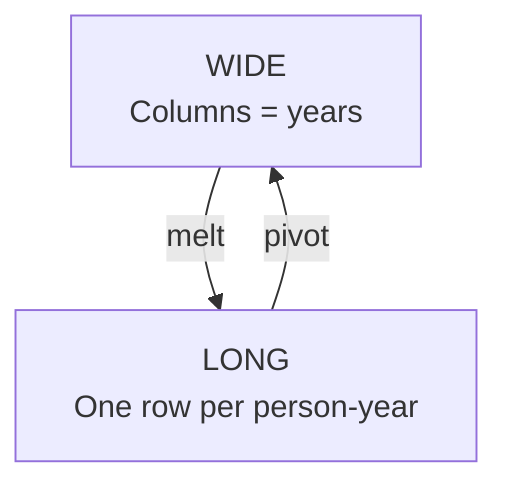
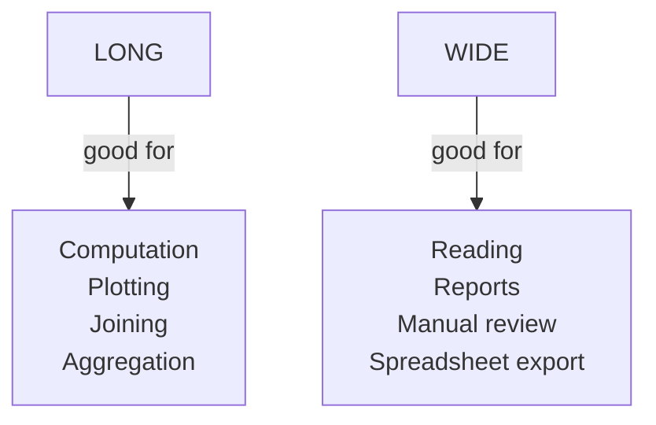

The exact same information can be laid out two very different
ways. Knowing how — and *when* — to switch between them is one
of the most empowering skills in data analysis.

<svg
  viewBox="0 0 640 240"
  role="img"
  aria-label="A wide table with blue, green, and yellow value columns beside a tall narrow table where the same colors repeat down a single column — one dataset, two shapes"
  style={{ display: "block", width: "100%", maxWidth: "640px", height: "auto", margin: "2.5rem auto" }}
>
  <g style={{ color: "var(--ds-blue-500)" }} fill="currentColor">
    <rect x="120" y="34" width="46" height="18" rx="4" fillOpacity="0.9" />
    <rect x="120" y="60" width="46" height="24" rx="4" fillOpacity="0.4" />
    <rect x="120" y="92" width="46" height="24" rx="4" fillOpacity="0.4" />
    <rect x="120" y="124" width="46" height="24" rx="4" fillOpacity="0.4" />
  </g>
  <g style={{ color: "var(--ds-green-500)" }} fill="currentColor">
    <rect x="176" y="34" width="46" height="18" rx="4" fillOpacity="0.9" />
    <rect x="176" y="60" width="46" height="24" rx="4" fillOpacity="0.4" />
    <rect x="176" y="92" width="46" height="24" rx="4" fillOpacity="0.4" />
    <rect x="176" y="124" width="46" height="24" rx="4" fillOpacity="0.4" />
  </g>
  <g style={{ color: "var(--ds-yellow-500)" }} fill="currentColor">
    <rect x="232" y="34" width="46" height="18" rx="4" fillOpacity="0.9" />
    <rect x="232" y="60" width="46" height="24" rx="4" fillOpacity="0.4" />
    <rect x="232" y="92" width="46" height="24" rx="4" fillOpacity="0.4" />
    <rect x="232" y="124" width="46" height="24" rx="4" fillOpacity="0.4" />
  </g>
  <g fill="currentColor" opacity="0.2">
    <rect x="70" y="60" width="40" height="24" rx="4" />
    <rect x="70" y="92" width="40" height="24" rx="4" />
    <rect x="70" y="124" width="40" height="24" rx="4" />
  </g>
  <g fill="currentColor" opacity="0.2">
    <rect x="400" y="40" width="40" height="20" rx="4" />
    <rect x="400" y="66" width="40" height="20" rx="4" />
    <rect x="400" y="92" width="40" height="20" rx="4" />
    <rect x="400" y="118" width="40" height="20" rx="4" />
    <rect x="400" y="144" width="40" height="20" rx="4" />
    <rect x="400" y="170" width="40" height="20" rx="4" />
  </g>
  <g style={{ color: "var(--ds-blue-500)" }} fill="currentColor">
    <rect x="446" y="40" width="46" height="20" rx="4" fillOpacity="0.7" />
    <rect x="446" y="118" width="46" height="20" rx="4" fillOpacity="0.7" />
  </g>
  <g style={{ color: "var(--ds-green-500)" }} fill="currentColor">
    <rect x="446" y="66" width="46" height="20" rx="4" fillOpacity="0.7" />
    <rect x="446" y="144" width="46" height="20" rx="4" fillOpacity="0.7" />
  </g>
  <g style={{ color: "var(--ds-yellow-500)" }} fill="currentColor">
    <rect x="446" y="92" width="46" height="20" rx="4" fillOpacity="0.7" />
    <rect x="446" y="170" width="46" height="20" rx="4" fillOpacity="0.7" />
  </g>
  <g fill="currentColor" opacity="0.12">
    <rect x="498" y="40" width="40" height="20" rx="4" />
    <rect x="498" y="66" width="40" height="20" rx="4" />
    <rect x="498" y="92" width="40" height="20" rx="4" />
    <rect x="498" y="118" width="40" height="20" rx="4" />
    <rect x="498" y="144" width="40" height="20" rx="4" />
    <rect x="498" y="170" width="40" height="20" rx="4" />
  </g>
</svg>

## A concrete example

A small survey asking three people about their happiness across
three years can be stored two ways:

### Wide format

| person | 2022 | 2023 | 2024 |
| --- | --- | --- | --- |
| Aiko  | 7 | 8 | 8 |
| Bilal | 6 | 7 | 9 |
| Chen  | 9 | 8 | 7 |

### Long format

| person | year | happiness |
| --- | --- | --- |
| Aiko  | 2022 | 7 |
| Aiko  | 2023 | 8 |
| Aiko  | 2024 | 8 |
| Bilal | 2022 | 6 |
| ... | ... | ... |

Both are "the same data." But the second form — long, or
*tidy* — is what almost every analytical and plotting library
prefers.

## The tidy data principles

Hadley Wickham's famous tidy data rules:

1. Each **variable** is a column.
2. Each **observation** is a row.
3. Each **type of observational unit** is a table.

In the wide table, `2022`, `2023`, `2024` are *values* of a
variable (year) — but they are sitting in column names. That's
the tell-tale sign of "untidy" data.

`melt` converts wide-to-long. `pivot` (or `pivot_table`) does the
reverse.

## Melt — wide to long

<CodeBlock
  adapter="python"
  files={[
    {
      filename: "main.py",
      starterCode: `import pandas as pd

wide = pd.DataFrame(
    {
        "person": ["Aiko", "Bilal", "Chen"],
        "2022": [7, 6, 9],
        "2023": [8, 7, 8],
        "2024": [8, 9, 7],
    }
)
print("Wide:")
print(wide)
print()

long = wide.melt(
    id_vars="person",  # columns to keep as-is
    value_vars=["2022", "2023", "2024"],  # columns to unpivot
    var_name="year",
    value_name="happiness",
)
print("Long:")
print(long)
`,
    },
  ]}
/>

## Pivot — long to wide

<CodeBlock
  adapter="python"
  files={[
    {
      filename: "main.py",
      starterCode: `import pandas as pd

long = pd.DataFrame(
    {
        "person": ["Aiko", "Aiko", "Aiko", "Bilal", "Bilal", "Bilal"],
        "year": [2022, 2023, 2024, 2022, 2023, 2024],
        "happiness": [7, 8, 8, 6, 7, 9],
    }
)

wide = long.pivot(index="person", columns="year", values="happiness")
print(wide)
`,
    },
  ]}
/>

`pivot` requires the (index, columns) combinations to be
unique. If you have duplicates that need aggregation, reach
for `pivot_table` (next page).

## Why long is usually better for analysis

Long format plays better with:

- **GroupBy** — group by year, average happiness:
  `long.groupby("year")["happiness"].mean()`
- **Plotting libraries** (Plotly, Seaborn) — pass `x="year"`,
  `y="happiness"`, `color="person"`.
- **Joining** other long datasets.

With wide data, year is "trapped" in column names. You'd have
to extract it manually before you could do anything *time-aware*.

## Why wide is sometimes better

Wide format is easier for *humans to read*. It's the format of
spreadsheets, of reports, of dashboards.

A common rhythm:

1. Store the canonical data in **long** form.
2. **Compute and analyse** in long form.
3. **Pivot to wide** for the final presentation.

## A practical melt with stub columns

<CodeBlock
  adapter="python"
  files={[
    {
      filename: "main.py",
      starterCode: `import pandas as pd

sales = pd.DataFrame(
    {
        "store": ["A", "B", "C"],
        "jan_2024": [100, 150, 90],
        "feb_2024": [120, 130, 110],
        "mar_2024": [140, 145, 120],
    }
)

# Melt month columns into rows
long = sales.melt(id_vars="store", var_name="month", value_name="sales")
print(long)
print()

# Now month is a string. Pull it apart:
parsed = long["month"].str.split("_", expand=True)
long["month_name"] = parsed[0]
long["year"] = parsed[1].astype(int)
print(long)
`,
    },
  ]}
/>

This is the typical post-melt cleanup: get the variable out of
the column name, then enrich it (parse, sort, type-cast).

## Mini challenge

<ChallengeCard
  adapter="python"
  title="Reshape and plot-ready"
  instructions={`Given the wide DataFrame \`temps\` (city × month), produce a long DataFrame called \`long\` with these exact columns:

- \`city\` (string)
- \`month\` (string — "jan", "feb", "mar")
- \`temp\` (numeric)

It should have 9 rows (3 cities × 3 months).`}
  files={[
    {
      filename: "main.py",
      initCode: `import pandas as pd

temps = pd.DataFrame({
    "city": ["Tokyo","Karachi","Beijing"],
    "jan":  [5, 18, -3],
    "feb":  [6, 21, 0],
    "mar":  [10, 26, 7],
})`,
      starterCode: `long = None  # TODO

print(long)
`,
      solutionCode: `import pandas as pd

long = temps.melt(id_vars="city", var_name="month", value_name="temp")
print(long)
`,
    },
  ]}
  tests={[
    {
      id: "type",
      name: "long is a DataFrame",
      description: "Type check",
      code: `import pandas as pd
assert isinstance(long, pd.DataFrame)`,
    },
    {
      id: "shape",
      name: "Has 9 rows and 3 columns",
      description: "3 cities × 3 months",
      code: `assert long.shape == (9, 3)`,
    },
    {
      id: "columns",
      name: "Correct column names",
      description: "city, month, temp",
      code: `assert list(long.columns) == ["city","month","temp"]`,
    },
    {
      id: "values",
      name: "Tokyo February is 6",
      description: "Sanity check on values",
      code: `row = long[(long.city == "Tokyo") & (long.month == "feb")]
assert int(row["temp"].iloc[0]) == 6`,
    },
  ]}
/>

## Check your understanding

<MultipleChoice
  markdown={`In the wide table \`person | 2022 | 2023 | 2024\`, why is "year" considered a hidden variable?

- It is not
  > Year is a variable (it has multiple values: 2022, 2023, 2024), but it is encoded in the column names rather than in a dedicated column of values — that is precisely what makes it "hidden."
- Years are integers
  > The data type of the year values is irrelevant; the issue is that they appear as column headers instead of as rows in a dedicated \`year\` column.
- [o] The years are sitting in column *names*, not in a column of *values* — to do anything year-aware you must first lift them out
  > That column-names-are-values smell is the classic signal that you should melt.
- The data is corrupted
  > The data is structurally valid; it is simply in wide format, which encodes a variable (year) in column names rather than in a value column.

Recognizing this pattern is most of the battle.`}
/>

<MultipleChoice
  markdown={`Which operation reshapes wide → long?

- pivot
  > \`pivot\` (and \`pivot_table\`) reshapes in the opposite direction — from long to wide; it takes values from rows and spreads them across new columns.
- merge
  > \`merge\` joins two DataFrames together on a common key; it does not reshape a single DataFrame from wide to long.
- [o] melt
  > Think "melt the wide table down into a tall one".
- concat
  > \`concat\` stacks DataFrames vertically or horizontally; it does not convert column names into row values the way \`melt\` does.

melt unpivots; pivot pivots.`}
/>

<MultipleChoice
  markdown={`Why do plotting libraries usually prefer long format?

- They reject wide DataFrames
  > Plotting libraries can accept wide DataFrames for some chart types, but they require more manual configuration; they prefer long format because column-to-aesthetic mapping is cleaner.
- It uses less memory
  > Long format typically uses *more* memory than wide format for the same data because it repeats identifier columns (like \`person\`) once per observation row.
- [o] They map columns to plot aesthetics (x, y, color, facet) — a single tidy column for each variable plugs straight in
  > Once you internalize the "one column per variable" rule, plotting becomes mechanical.
- Wide format is deprecated
  > Wide format is not deprecated; it remains the preferred form for human-readable reports and spreadsheet exports — the choice depends on the use case.

The same principle underlies Seaborn, Plotly Express, and ggplot2.`}
/>
