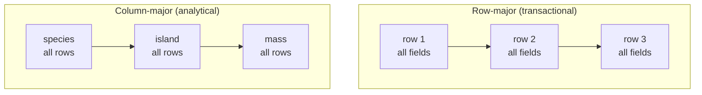

Polars is fast for two reasons. One is that it uses every core on
your machine. The other is memory layout, and that one is worth
understanding because it explains which operations are cheap and
which are not.

<Figure
  slug="pl-columnar-memory-cutout"
  alt="A friendly polar bear with warm cream fur and soft grey shading laying the last of four long horizontal bars in blue, green, red and yellow flat along a wide platform, beside a second platform where the same four colours stand as four thick upright columns"
/>

## Two ways to write a table down

A table is two-dimensional. Memory is one-dimensional. Something has
to give, and there are exactly two reasonable choices.

**Row-major** stores each record's fields together:

```
Adelie Torgersen 39.1 3750 | Adelie Torgersen 39.5 3800 | Gentoo Biscoe 46.1 4500 | …
```

**Column-major** stores each field's values together:

```
species:  Adelie Adelie Gentoo …
island:   Torgersen Torgersen Biscoe …
bill:     39.1 39.5 46.1 …
mass:     3750 3800 4500 …
```



Neither is better in the abstract. They are better at different
questions.

- **"Give me everything about penguin 200."** Row-major wins: one
  contiguous read.
- **"What is the average mass of all 344 penguins?"** Column-major
  wins: read one buffer straight through, ignore every other field.

Transactional databases (PostgreSQL, SQLite, the thing behind a
checkout button) are row-major, because their job is single-record
reads and writes. Analytical engines (DuckDB, Parquet, Polars) are
column-major, because their job is "summarize this column across
millions of rows".

## Why the CPU cares so much

Modern CPUs are not bottlenecked on arithmetic. They are bottlenecked
on waiting for memory. Three mechanisms exist to hide that wait, and
all three reward contiguous access:

1. **Cache lines.** Memory arrives in 64-byte blocks. Reading one
   `Float64` pulls in the seven that follow it. If those seven are
   the next values you need, they are free. If they are other fields
   of the same record, they are wasted.
2. **Prefetching.** The CPU notices a straight-line access pattern
   and fetches ahead. A predictable stride keeps the pipeline full;
   pointer chasing does not.
3. **SIMD.** One instruction can add eight `Float64` values at once,
   but only if they are adjacent. A column is adjacent by
   construction.

A pandas string column is an array of pointers to Python `str`
objects living wherever the allocator put them. Every value read is a
cache miss the prefetcher cannot help with. That single design
decision accounts for a large share of the difference in string-heavy
work.

## What Apache Arrow adds

Columnar layout is an old idea. **Apache Arrow**, started in 2016, is
a *standard* for it: an exact specification of how a column of
integers, strings, or nested structs is laid out in memory, agreed on
across languages.

An Arrow column is a few buffers:

| Buffer | Holds |
| --- | --- |
| validity bitmap | one bit per row: present or null |
| values | the fixed-width data, packed |
| offsets | for variable-width types, where each value starts |

A string column is therefore one long byte buffer plus an offsets
buffer, not an array of objects. Nulls have their own bit, so an
integer column can be missing values and stay integers.

The reason to standardize this is **zero-copy interchange**. If
Polars, DuckDB, PyArrow, and a Parquet file all agree on the bytes,
handing a table from one to another is passing a pointer rather than
serializing and reparsing.

<CodeBlock
  adapter="python"
  datasets={[{ path: "palmer-penguins.csv", stageAs: "penguins.csv" }]}
  files={[
    {
      filename: "main.py",
      initCode: `import polars as pl
penguins = pl.read_csv("penguins.csv", null_values=["NA"])`,
      starterCode: `# Hand the whole table to Arrow. No conversion pass, no re-encoding:
# Polars already stores it this way.
table = penguins.to_arrow()

print(type(table))
print(table.schema)
print("rows:", table.num_rows)
`,
    },
  ]}
/>

## Seeing the layout

Polars will show you the buffers behind a Series, which makes the
validity bitmap concrete. (`_get_buffers` is an internal method, not
something to build on; it is here because seeing the two buffers side
by side explains nulls better than any diagram.)

<CodeBlock
  adapter="python"
  files={[
    {
      filename: "main.py",
      starterCode: `import polars as pl

s = pl.Series("n", [10, 20, None, 40])
buffers = s._get_buffers()

print("values  :", buffers["values"].to_list())
print("validity:", buffers["validity"].to_list())
print("sum ignores the null:", s.sum())
`,
    },
  ]}
/>

The value slot for the null still holds *something*: it is
uninitialized memory that the validity bitmap tells everyone to
ignore. That is why a null costs one bit rather than a whole
sentinel value, and why an integer column keeps its type.

## What this predicts

Once you hold the layout in mind, Polars performance stops being
mysterious. You can usually predict it:

- **Adding a column is cheap.** It appends one buffer; the other
  columns are untouched and can be shared with the original frame.
- **Selecting columns is nearly free.** No data moves, just which
  buffers the new frame points at.
- **Filtering is proportional to the columns you keep**, which is
  why the optimizer works so hard to drop columns early.
- **Row-at-a-time work is the slow path.** `map_elements` with a
  Python function walks the column one value at a time through the
  Python interpreter, giving up the layout, the parallelism, and the
  SIMD in one move. It is the single most common reason "Polars is
  slow" turns out not to be Polars.
- **Wide tables cost you nothing if you use few columns.** A
  thousand-column Parquet file where you read three columns reads
  three buffers.

<Callout type="info" title="Parquet is Arrow on disk">
Parquet is a columnar *file* format: same idea, compressed, with
per-column statistics. That is why `scan_parquet` can skip whole
chunks of a file when your filter rules them out, and why Parquet
plus Polars is a much better pairing than CSV plus Polars.
</Callout>

The prediction is about bytes read, and it is easy to make concrete:
selecting three columns out of thirty reads a tenth of the file in a
column store and all of it in a row store.

<Chart slug="columnar-vs-row-io" />

## Check your understanding

<MultipleChoice
  markdown={`Why is the average of one column much faster over columnar storage than over row storage?

- Columnar storage keeps a precomputed average for every numeric column
  > No averages are precomputed; the values still have to be summed. The saving is in how those values reach the CPU.
- [o] The values are contiguous, so the CPU reads one straight run and can use SIMD
  > Row storage interleaves other fields between the values, wasting most of every cache line fetched.
- Columnar storage compresses numbers so there is simply less arithmetic to perform
  > Compression can reduce bytes read, but the arithmetic count is unchanged and columnar layout wins even with no compression at all.
- Column storage keeps the data sorted, which makes summing cheaper
  > Columns are not sorted by storage, and summing does not benefit from order anyway.

Cache lines, prefetching, and SIMD all reward adjacency, and a column is adjacent by construction.`}
/>

<MultipleChoice
  markdown={`What does Apache Arrow actually standardize?

- A file format for storing tables on disk with compression
  > That describes Parquet. Arrow specifies the layout data takes in RAM while a program is working on it.
- A query language for expressing analytical computations
  > Arrow defines no query language; engines like Polars and DuckDB bring their own and share the memory format underneath.
- [o] The exact in-memory byte layout of a column, so different tools can share it without copying
  > Agreeing on bytes is what makes passing a table between Polars, PyArrow, and DuckDB a pointer pass.
- A network protocol for transferring datasets between machines
  > Arrow Flight is a separate project built on top of Arrow; the core specification is about memory layout.

The interchange, not the speed, is the point of the standard.`}
/>

<MultipleChoice
  markdown={`Which operation gives up the benefits of columnar layout?

- Selecting a subset of columns from a wide table
  > Selecting columns is the operation columnar layout is best at: it changes which buffers the frame points at and moves no data.
- Computing a grouped mean over a numeric column
  > Grouped aggregation is a vectorized scan over contiguous buffers, exactly the case the layout is designed for.
- Adding a new column computed from two existing ones
  > This appends one new buffer and leaves the existing ones untouched, so it stays on the fast path.
- [o] Calling \`map_elements\` with a Python function on every row
  > It walks the column value by value through the Python interpreter, losing vectorization, parallelism, and SIMD at once.

If a Polars program is unexpectedly slow, look for a Python callable in the hot path first.`}
/>
