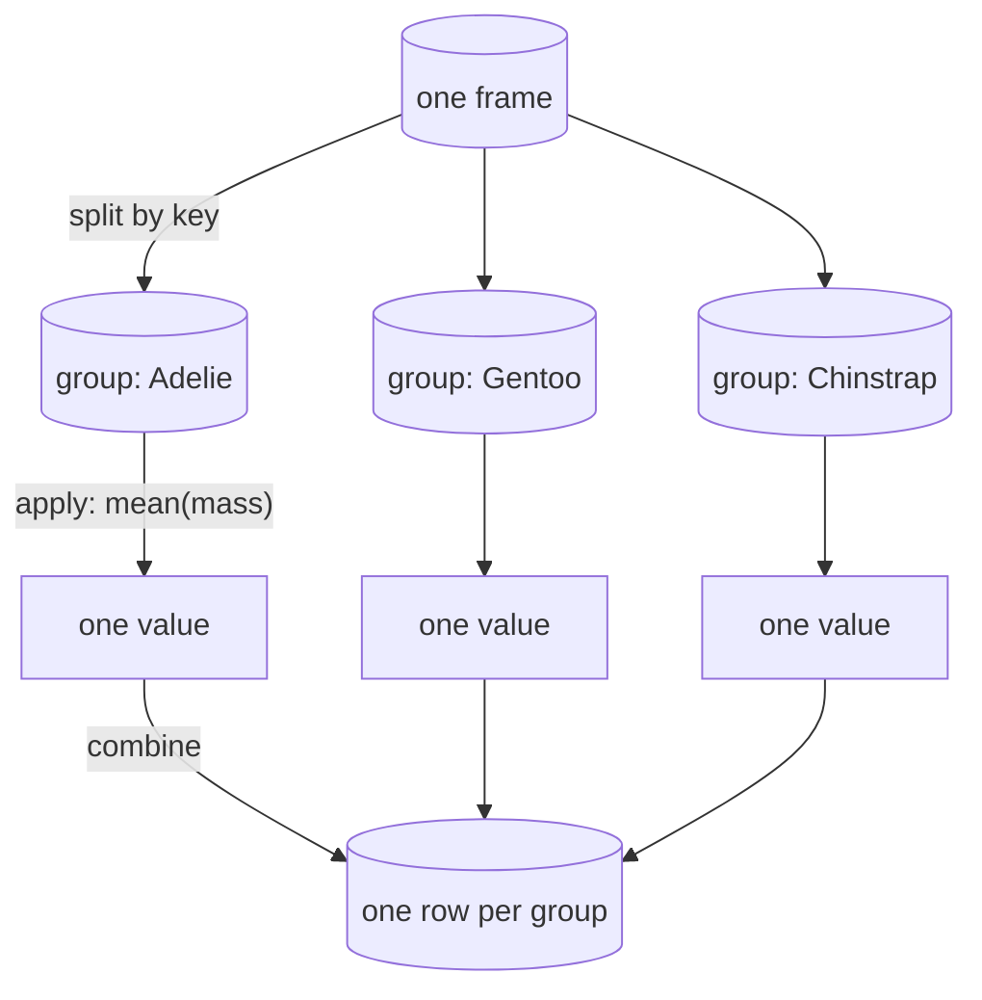

Every "by department", "by month", "by species" question lands here.
`group_by()` splits the frame into groups; `agg()` runs expressions
within each group; the results are stitched back into one frame.

<Figure
  slug="pl-group-by-cutout"
  alt="A friendly polar bear with warm cream fur and soft grey shading lowering a thick blue block into one of three deep open bins on a wide platform, six thick blocks in blue, green and yellow sorted into the bins by colour and one small block of each colour resting on a raised tray beyond them"
/>

## The basic shape

<CodeBlock
  adapter="python"
  datasets={[{ path: "palmer-penguins.csv", stageAs: "penguins.csv" }]}
  files={[
    {
      filename: "main.py",
      initCode: `import polars as pl
penguins = pl.read_csv("penguins.csv", null_values=["NA"])`,
      starterCode: `display(
    penguins.group_by("species").agg(
        pl.len().alias("n"),
        pl.col("body_mass_g").mean().round(0).alias("avg_mass"),
        pl.col("body_mass_g").median().alias("median_mass"),
    ).sort("species")
)
`,
    },
  ]}
/>

There is no equivalent of pandas' named-aggregation-versus-dict
confusion, because there is only one form: expressions, named the
same way expressions are named everywhere else.

## Group order is not guaranteed

Polars groups in parallel, so the output row order depends on which
thread finished first. This is deliberate: guaranteeing order would
cost the parallelism.

<Figure
  slug="pl-group-by-and-agg-inline-cutout"
  alt="A scatter of coloured chips swept into three trays, each tray tipped into a small press that leaves one summary block on top of it"
  caption="Groups are built in parallel, so the output order is not guaranteed."
/>

<CodeBlock
  adapter="python"
  datasets={[{ path: "palmer-penguins.csv", stageAs: "penguins.csv" }]}
  files={[
    {
      filename: "main.py",
      initCode: `import polars as pl
penguins = pl.read_csv("penguins.csv", null_values=["NA"])`,
      starterCode: `# Unordered: fine for a further computation, wrong for a report
display(penguins.group_by("island").agg(pl.len()))

# Either sort afterwards...
display(penguins.group_by("island").agg(pl.len()).sort("island"))

# ...or ask for the original appearance order
display(penguins.group_by("island", maintain_order=True).agg(pl.len()))
`,
    },
  ]}
/>

<Callout type="warn" title="Always sort before showing a result to a human">
An unsorted group result is a common source of "the numbers changed
but the data did not" bug reports. `maintain_order=True` costs
performance; a `.sort()` at the end of the chain usually does not,
and states the order you actually want.
</Callout>

## Grouping by several keys

<CodeBlock
  adapter="python"
  datasets={[{ path: "palmer-penguins.csv", stageAs: "penguins.csv" }]}
  files={[
    {
      filename: "main.py",
      initCode: `import polars as pl
penguins = pl.read_csv("penguins.csv", null_values=["NA"])`,
      starterCode: `display(
    penguins.group_by("species", "island").agg(
        pl.len().alias("n"),
        pl.col("body_mass_g").mean().round(0).alias("avg_mass"),
    ).sort("species", "island")
)
`,
    },
  ]}
/>

No MultiIndex appears. The keys are ordinary columns in the result,
which is one of the places where having no index pays off most
obviously.

<Figure
  slug="pl-group-by-and-agg-grouping-by-several-inline-cutout"
  alt="Chips sorted first into rows by colour and then into columns by shape, each cell of the resulting grid its own small tray"
  caption="Several keys make a grid of groups, and the keys stay ordinary columns."
/>

## Grouping by an expression

The key does not have to be a column.

<CodeBlock
  adapter="python"
  datasets={[{ path: "diamonds.csv", stageAs: "diamonds.csv" }]}
  files={[
    {
      filename: "main.py",
      initCode: `import polars as pl
diamonds = pl.read_csv("diamonds.csv")`,
      starterCode: `display(
    diamonds.group_by(
        (pl.col("carat") // 0.5 * 0.5).alias("carat_bucket")
    ).agg(
        pl.len().alias("n"),
        pl.col("price").median().alias("median_price"),
    ).sort("carat_bucket").head(8)
)
`,
    },
  ]}
/>

## The list trap

If an expression inside `agg()` does *not* reduce to one value, the
group's values are collected into a list. This is a feature and it is
also the single most common surprise.

<CodeBlock
  adapter="python"
  datasets={[{ path: "palmer-penguins.csv", stageAs: "penguins.csv" }]}
  files={[
    {
      filename: "main.py",
      initCode: `import polars as pl
penguins = pl.read_csv("penguins.csv", null_values=["NA"])`,
      starterCode: `# No aggregation: every mass in the group, as a list
lists = penguins.group_by("species").agg(pl.col("body_mass_g")).sort("species")
display(lists)
print(lists.schema)

# Which is genuinely useful when you want it
display(
    penguins.group_by("species").agg(
        pl.col("island").unique().sort().alias("islands"),
        pl.col("body_mass_g").sort(descending=True).head(3).alias("top3"),
    ).sort("species")
)
`,
    },
  ]}
/>

If a result column comes back as `list[i64]` when you expected a
number, you forgot the aggregation.

## Filtering groups

Two different things get called "filtering a group", and they belong
in different places.

<CodeBlock
  adapter="python"
  datasets={[{ path: "palmer-penguins.csv", stageAs: "penguins.csv" }]}
  files={[
    {
      filename: "main.py",
      initCode: `import polars as pl
penguins = pl.read_csv("penguins.csv", null_values=["NA"])`,
      starterCode: `# Filter rows BEFORE grouping
display(
    penguins.filter(pl.col("sex") == "female")
    .group_by("species")
    .agg(pl.len().alias("n_female"))
    .sort("species")
)

# Filter groups AFTER aggregating (SQL's HAVING)
display(
    penguins.group_by("species", "island")
    .agg(pl.len().alias("n"))
    .filter(pl.col("n") >= 50)
    .sort("species", "island")
)
`,
    },
  ]}
/>

## Several statistics, several columns

<CodeBlock
  adapter="python"
  datasets={[{ path: "diamonds.csv", stageAs: "diamonds.csv" }]}
  files={[
    {
      filename: "main.py",
      initCode: `import polars as pl
import polars.selectors as cs
diamonds = pl.read_csv("diamonds.csv")`,
      starterCode: `display(
    diamonds.group_by("cut").agg(
        pl.len().alias("n"),
        cs.by_name("carat", "price").mean().round(2).name.suffix("_mean"),
        cs.by_name("carat", "price").max().name.suffix("_max"),
    ).sort("n", descending=True)
)
`,
    },
  ]}
/>

## Practice

<ChallengeCard
  adapter="python"
  title="A per-species report"
  instructions={`From \`penguins\`, build \`report\` with **one row per species** and exactly these columns, in this order:

1. \`species\`
2. \`n\`, the number of penguins
3. \`n_islands\`, how many distinct islands that species was seen on
4. \`avg_mass\`, mean \`body_mass_g\` rounded to 0 decimals
5. \`pct_heavy\`, the percentage of that species over 4500 g, rounded to 1 decimal

Sort by \`avg_mass\` descending.`}
  datasets={[{ path: "palmer-penguins.csv", stageAs: "penguins.csv" }]}
  files={[
    {
      filename: "main.py",
      initCode: `import polars as pl
penguins = pl.read_csv("penguins.csv", null_values=["NA"])`,
      starterCode: `report = None  # TODO

display(report)
`,
      solutionCode: `report = (
    penguins.group_by("species")
    .agg(
        pl.len().alias("n"),
        pl.col("island").n_unique().alias("n_islands"),
        pl.col("body_mass_g").mean().round(0).alias("avg_mass"),
        ((pl.col("body_mass_g") > 4500).mean() * 100)
        .round(1)
        .alias("pct_heavy"),
    )
    .sort("avg_mass", descending=True)
)

display(report)
`,
    },
  ]}
  tests={[
    {
      id: "shape",
      name: "Three rows, five columns",
      description: "One row per species",
      code: `assert report.shape == (3, 5), report.shape`,
    },
    {
      id: "cols",
      name: "The right columns in order",
      description: "species, n, n_islands, avg_mass, pct_heavy",
      code: `expected = ["species", "n", "n_islands", "avg_mass", "pct_heavy"]
assert report.columns == expected, report.columns`,
    },
    {
      id: "counts",
      name: "Counts are right",
      description: "152 Adelie, 124 Gentoo, 68 Chinstrap",
      code: `counts = dict(zip(report["species"].to_list(), report["n"].to_list()))
assert counts == {"Adelie": 152, "Gentoo": 124, "Chinstrap": 68}, counts`,
    },
    {
      id: "islands",
      name: "Adelie was seen on all three islands",
      description: "Gentoo and Chinstrap on one each",
      code: `islands = dict(zip(report["species"].to_list(), report["n_islands"].to_list()))
assert islands == {"Adelie": 3, "Gentoo": 1, "Chinstrap": 1}, islands`,
    },
    {
      id: "sorted",
      name: "Sorted by avg_mass descending",
      description: "Gentoo first",
      code: `assert report["species"][0] == "Gentoo", report["species"][0]
masses = report["avg_mass"].to_list()
assert masses == sorted(masses, reverse=True), masses`,
    },
    {
      id: "pct",
      name: "pct_heavy is a percentage of that species",
      description: "Most Gentoos are over 4500 g, almost no Adelies",
      code: `row = report.filter(report["species"] == "Gentoo")
assert row["pct_heavy"][0] == 86.2, row["pct_heavy"][0]
adelie = report.filter(report["species"] == "Adelie")
assert adelie["pct_heavy"][0] < 5.0, adelie["pct_heavy"][0]`,
    },
  ]}
/>

## Check your understanding

<MultipleChoice
  markdown={`Why can \`group_by(...).agg(...)\` return its rows in a different order on two runs of the same code?

- The input file is read in a different order each time
  > Reading is deterministic; the variability is introduced later, when groups are processed.
- Hash collisions cause groups to be silently merged and re-split
  > Collisions are handled internally and never change which rows belong to which group.
- [o] Groups are processed in parallel, and thread completion order is not fixed
  > Guaranteeing order would cost the parallelism, so it is opt-in via \`maintain_order=True\` or a \`sort()\`.
- Polars deliberately shuffles output to discourage relying on row order
  > Nothing is shuffled on purpose; the order is simply whatever the parallel execution produced.

Sort at the end of any chain whose output a person will read.`}
/>

<MultipleChoice
  markdown={`Inside \`agg()\`, \`pl.col("mass")\` with no aggregation produces what?

- The first mass value in each group
  > Taking one value requires asking for it, with \`first()\`; the bare column keeps them all.
- An error, because \`agg()\` requires an aggregating expression
  > Non-aggregating expressions are allowed and useful; they are how you collect a group's values.
- The mean of each group, since \`agg()\` aggregates by default
  > No default statistic is applied. Polars never guesses which summary you meant.
- [o] A list column holding every value in the group
  > Useful when you want it, and the usual explanation for a column coming back as \`list[i64]\`.

\`.unique()\`, \`.sort().head(3)\`, and similar produce short lists on purpose.`}
/>

<MultipleChoice
  markdown={`You want only species-island pairs with at least 50 penguins. Where does that condition go?

- In \`group_by()\`, as a second argument alongside the keys
  > \`group_by()\` takes keys, not conditions; it has no way to express a constraint on a group's size.
- In a \`filter()\` before the \`group_by()\`
  > A pre-group filter chooses which *rows* are counted, so it cannot depend on a count that does not exist yet.
- [o] In a \`filter()\` after the \`agg()\`, on the computed count
  > This is SQL's \`HAVING\`: the group must be formed before its size can be tested.
- Inside \`agg()\`, as \`pl.len().filter(pl.len() >= 50)\`
  > An expression-level filter narrows the rows one aggregation sees; it cannot remove the group itself.

Pre-group filters choose rows; post-group filters choose groups.`}
/>
