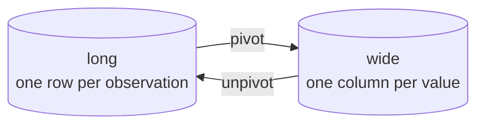

The same data can be laid out two ways, and which one you want
depends entirely on what you are about to do with it.

<Figure
  slug="pl-pivot-cutout"
  alt="A friendly polar bear with warm cream fur and soft grey shading standing beside a curved yellow ramp turning from a tall narrow blue block on one platform to a wide low green block of the same volume on a second platform"
/>

**Long** (also called tidy) puts one observation per row:

| region | month | sales |
| --- | --- | --- |
| North | Jan | 100 |
| North | Feb | 120 |
| South | Jan | 200 |
| South | Feb | 180 |

**Wide** spreads one variable across columns:

| region | Jan | Feb |
| --- | --- | --- |
| North | 100 | 120 |
| South | 200 | 180 |

Wide is easier for a human to read. Long is easier for a computer to
compute on, because "group by month" is a column reference rather
than a list of column names that changes every quarter.

## pivot: long to wide

<CodeBlock
  adapter="python"
  files={[
    {
      filename: "main.py",
      starterCode: `import polars as pl

long = pl.DataFrame(
    {
        "region": ["N", "N", "S", "S"],
        "month": ["Jan", "Feb", "Jan", "Feb"],
        "sales": [100, 120, 200, 180],
    }
)

wide = long.pivot(on="month", index="region", values="sales")
print(wide)
`,
    },
  ]}
/>

The three arguments:

- **`index`**: the columns that stay as rows (one output row per
  distinct combination).
- **`on`**: the column whose *values* become new column names.
- **`values`**: the column that fills the cells.

## When a cell has several values

Pivoting requires one value per cell. If several rows land in the
same cell, say so with `aggregate_function`.

<CodeBlock
  adapter="python"
  datasets={[{ path: "diamonds.csv", stageAs: "diamonds.csv" }]}
  files={[
    {
      filename: "main.py",
      initCode: `import polars as pl
diamonds = pl.read_csv("diamonds.csv")`,
      starterCode: `print(
    diamonds.pivot(
        on="cut",
        index="color",
        values="price",
        aggregate_function="median",
    ).sort("color")
)

# len counts rather than summarizing, which makes a contingency table
print(
    diamonds.pivot(
        on="cut", index="color", values="price", aggregate_function="len"
    ).sort("color")
)
`,
    },
  ]}
/>

<Callout type="warn" title="Pivot is eager only">
`pivot` is a `DataFrame` method, not a `LazyFrame` one, because the
output *schema* depends on the data: Polars cannot know the column
names until it has seen the values. In a lazy pipeline, `collect()`
first, then pivot. This is the one place the lazy API genuinely
cannot follow.
</Callout>

## unpivot: wide to long

<CodeBlock
  adapter="python"
  files={[
    {
      filename: "main.py",
      starterCode: `import polars as pl

wide = pl.DataFrame(
    {"region": ["N", "S"], "Jan": [100, 200], "Feb": [120, 180]}
)

print(
    wide.unpivot(
        index="region",
        on=["Jan", "Feb"],
        variable_name="month",
        value_name="sales",
    )
)
`,
    },
  ]}
/>

`unpivot` *is* available on a `LazyFrame`, because the output schema
is known from the input schema: three columns, whatever the data says.

<Figure
  slug="pl-pivot-and-unpivot-inline-cutout"
  alt="A folded paper fan opened out flat into a wide sheet on the left and pressed back into a narrow column on the right, the same squares visible in both"
/>

## Selectors make unpivot robust

Naming the columns to melt by hand breaks when a month is added.

<CodeBlock
  adapter="python"
  files={[
    {
      filename: "main.py",
      starterCode: `import polars as pl
import polars.selectors as cs

wide = pl.DataFrame(
    {
        "region": ["N", "S"],
        "Jan": [100, 200],
        "Feb": [120, 180],
        "Mar": [90, 240],
    }
)

# "everything except the identifier columns"
print(
    wide.unpivot(
        index=cs.string(),
        on=cs.numeric(),
        variable_name="month",
        value_name="sales",
    ).sort("region", "month")
)
`,
    },
  ]}
/>

## Why long is usually the working format

<CodeBlock
  adapter="python"
  files={[
    {
      filename: "main.py",
      starterCode: `import polars as pl
import polars.selectors as cs

wide = pl.DataFrame(
    {"region": ["N", "S"], "Jan": [100, 200], "Feb": [120, 180], "Mar": [90, 240]}
)

long = wide.unpivot(
    index="region", on=cs.numeric(), variable_name="month", value_name="sales"
)

# In long form these are all ordinary operations
print(long.group_by("month").agg(pl.col("sales").sum()).sort("month"))
print(long.filter(pl.col("sales") > 150))
print(long.group_by("region").agg(pl.col("sales").mean().round(1)).sort("region"))
`,
    },
  ]}
/>

Every one of those would need a hand-maintained list of month columns
in wide form. The usual pipeline is therefore: **unpivot on the way
in, compute in long form, pivot on the way out** for the final
presentation table.

## Transposing

Different operation, worth knowing exists: `transpose` swaps rows and
columns wholesale.

<CodeBlock
  adapter="python"
  files={[
    {
      filename: "main.py",
      starterCode: `import polars as pl

df = pl.DataFrame({"metric": ["mean", "max"], "a": [1.5, 3.0], "b": [2.5, 9.0]})

print(df.transpose(include_header=True, header_name="column", column_names="metric"))
`,
    },
  ]}
/>

Transposing forces every value into one common type, so a frame with
mixed dtypes comes back as strings. It is a display tool, not a
reshaping tool: for real reshaping, `unpivot` is what you want.

## Practice

<ChallengeCard
  adapter="python"
  title="Round-trip a quarterly report"
  instructions={`\`wide\` holds one row per region and one column per quarter (\`Q1\`..\`Q4\`).

Produce two frames:

1. \`long\`: the same data with columns \`region\`, \`quarter\`, \`sales\`, sorted by \`region\` then \`quarter\`. Select the quarter columns with a **selector**, not a hand-written list.
2. \`summary\`: one row per quarter with \`quarter\` and \`total\` (the sum of \`sales\` across regions), sorted by \`quarter\`.`}
  files={[
    {
      filename: "main.py",
      initCode: `import polars as pl
import polars.selectors as cs
wide = pl.DataFrame(
    {
        "region": ["North", "South", "East"],
        "Q1": [100, 200, 150],
        "Q2": [120, 180, 160],
        "Q3": [90, 240, 130],
        "Q4": [140, 210, 170],
    }
)`,
      starterCode: `long = None     # TODO
summary = None  # TODO

print(long)
`,
      solutionCode: `long = wide.unpivot(
    index="region",
    on=cs.numeric(),
    variable_name="quarter",
    value_name="sales",
).sort("region", "quarter")

summary = (
    long.group_by("quarter")
    .agg(pl.col("sales").sum().alias("total"))
    .sort("quarter")
)

print(long.head())
print(summary)
`,
    },
  ]}
  tests={[
    {
      id: "long_shape",
      name: "long has 12 rows and 3 columns",
      description: "Three regions times four quarters",
      code: `assert long.shape == (12, 3), long.shape`,
    },
    {
      id: "long_cols",
      name: "The right column names in order",
      description: "region, quarter, sales",
      code: `assert long.columns == ["region", "quarter", "sales"], long.columns`,
    },
    {
      id: "long_sorted",
      name: "Sorted by region then quarter",
      description: "East first",
      code: `assert long["region"][0] == "East", long["region"][0]
assert long["quarter"][:4].to_list() == ["Q1", "Q2", "Q3", "Q4"], long["quarter"][:4].to_list()`,
    },
    {
      id: "long_values",
      name: "Values survived the reshape",
      description: "North Q1 is still 100",
      code: `import polars as pl
row = long.filter((pl.col("region") == "North") & (pl.col("quarter") == "Q1"))
assert row["sales"][0] == 100, row["sales"][0]`,
    },
    {
      id: "summary",
      name: "summary totals each quarter across regions",
      description: "Q1 = 450, Q2 = 460, Q3 = 460, Q4 = 520",
      code: `assert summary.columns == ["quarter", "total"], summary.columns
assert summary["quarter"].to_list() == ["Q1", "Q2", "Q3", "Q4"]
assert summary["total"].to_list() == [450, 460, 460, 520], summary["total"].to_list()`,
    },
    {
      id: "selector",
      name: "Written with a selector, not a hard-coded list",
      description: "A Q5 column would be picked up too",
      code: `import polars as pl
import polars.selectors as cs
probe = wide.with_columns(Q5=pl.lit(1)).unpivot(
    index="region", on=cs.numeric(), variable_name="quarter", value_name="sales"
)
assert probe.height == 15, probe.height`,
    },
  ]}
/>

## Check your understanding

<MultipleChoice
  markdown={`Why is \`pivot\` unavailable on a \`LazyFrame\` when \`unpivot\` is?

- Pivot needs to sort the data, which the lazy engine cannot do
  > The lazy engine sorts perfectly well; sorting appears in lazy plans constantly.
- Pivot is implemented in Python rather than Rust
  > Both are Rust operations; the difference is what each one's output schema depends on.
- [o] Pivot's output column names come from the *data*, so its schema is unknown until it runs
  > Unpivot always produces the index columns plus a variable and a value column, which the input schema already determines.
- Lazy frames cannot produce more columns than they started with
  > Adding columns in a lazy plan is routine; \`with_columns\` does it in every lazy query.

Collect first, then pivot. It is the one place the lazy API cannot follow.`}
/>

<MultipleChoice
  markdown={`You have monthly sales in wide form and want a total per month. Why unpivot first?

- Wide frames cannot be aggregated at all
  > They can, by summing each month column individually; the objection is to maintaining that list.
- Unpivoting reduces the amount of data that has to be scanned
  > The same values are read either way; long form actually stores slightly more, since keys repeat.
- [o] In long form the month is a column value, so adding a month needs no code change
  > In wide form, the same computation needs a hand-maintained list of column names.
- Aggregations in Polars require the input to be sorted by the grouping key
  > Grouping works on any row order; \`group_by\` hashes the key rather than relying on order.

Unpivot on the way in, compute in long form, pivot on the way out for presentation.`}
/>

<MultipleChoice
  markdown={`A pivot raises because several rows map to the same cell. What is the fix?

- Deduplicate the input with \`unique()\` before pivoting
  > That discards real observations. The rows are usually all legitimate and need combining, not deleting.
- Add the extra columns to \`values\` so each row gets its own cell
  > \`values\` names which column fills the cells; adding more does not change which rows collide.
- [o] Pass \`aggregate_function\`, saying how the several values should be combined
  > \`"sum"\`, \`"mean"\`, \`"median"\`, \`"len"\`, \`"first"\` are all available, and \`"len"\` gives a contingency table.
- Add the colliding column to \`index\` so the rows land in different cells
  > This does resolve the collision, but by changing the report's shape rather than answering the question asked.

Polars refuses to pick a combining rule for you, which is the right default.`}
/>
