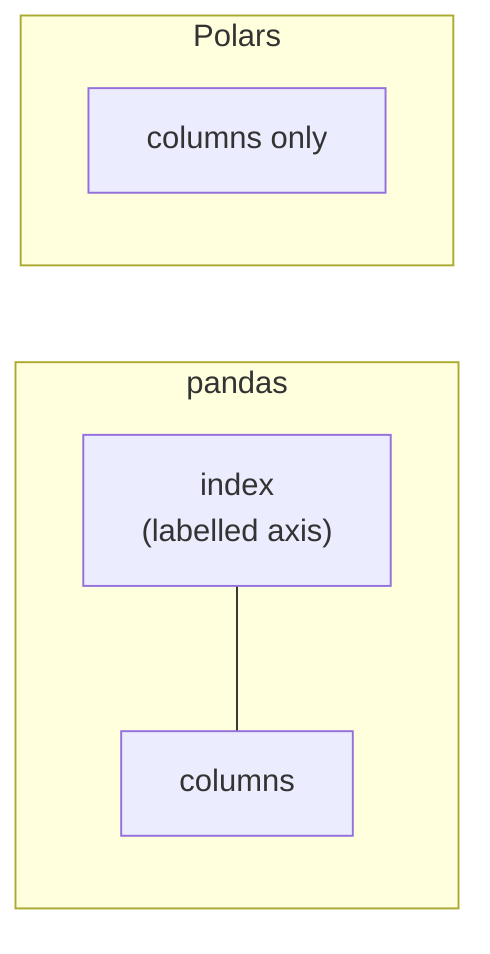

If you have never used pandas, skim this page and move on; nothing
later depends on it. If you have, this is the page that saves you a
week of confusion.

<Figure
  slug="pl-vs-pandas-cutout"
  alt="A panda and a friendly polar bear with warm cream fur and soft grey shading sitting side by side on a wide platform, the panda resting one paw on a thick yellow block and the bear resting one paw on a thick blue block of the same size"
/>

## 1. There is no index

In pandas every DataFrame carries an index: a labelled axis used for
alignment, joins, `loc` lookups, and a surprising amount of implicit
behaviour. It is powerful and it is the source of most pandas
surprises, because two frames with different indexes silently align
rather than fail.

Polars has no index. A DataFrame is columns and rows, and row order
is just row order. If you want a key, make it a column and join on
it. If you want a row number, ask for one with `pl.int_range`.

Everything that used to be an index trick becomes an ordinary
operation on an ordinary column, which is longer to type and far
easier to reason about.

## 2. You write expressions, not slices

This is the big one. In pandas you reach into a frame and pull out
data, then operate on what you pulled out. In Polars you hand the
frame a description of what you want.

<CodeBlock
  adapter="python"
  files={[
    {
      filename: "main.py",
      starterCode: `import polars as pl

df = pl.DataFrame(
    {
        "city": ["Oslo", "Lisbon", "Oslo", "Lisbon", "Oslo"],
        "temp_c": [-3.0, 17.5, 1.0, 21.0, -8.5],
    }
)

# pandas:  df["temp_f"] = df["temp_c"] * 9 / 5 + 32
# Polars:  describe the new column, hand it to with_columns
df = df.with_columns((pl.col("temp_c") * 9 / 5 + 32).alias("temp_f"))

print(df)
`,
    },
  ]}
/>

`pl.col("temp_c") * 9 / 5 + 32` does not compute anything. Run this
to see what it actually is:

<CodeBlock
  adapter="python"
  files={[
    {
      filename: "main.py",
      starterCode: `import polars as pl

recipe = (pl.col("temp_c") * 9 / 5 + 32).alias("temp_f")
print(type(recipe))

# One recipe, applied to two completely different frames
nordics = pl.DataFrame({"temp_c": [-3.0, 1.0, -8.5]})
iberia = pl.DataFrame({"temp_c": [17.5, 21.0, 33.0]})

print(nordics.with_columns(recipe))
print(iberia.with_columns(recipe))
`,
    },
  ]}
/>

It is an `Expr`, a value describing a computation. You can build it
before you have any data, store it in a list, pass it to a function,
and apply it to three different frames. Nothing in pandas is quite
like it, and the whole of Polars is built from it.

## 3. Null is null, and NaN is a number

pandas historically used `NaN` (a floating-point value meaning "not a
number") to mean "missing", which forced integer columns holding a
missing value to become floats. It has since added `pd.NA` and
nullable dtypes, so there are now several missing-value systems
coexisting.

<Figure
  slug="pl-polars-vs-pandas-1-there-no-inline-cutout"
  alt="Two boards side by side, the left one carrying a column of tags down its edge and the right one having that column removed entirely, its rows bare at the edge"
/>

Polars has one. Every column has a validity bitmap saying which
entries are present. A missing integer stays an integer.

<CodeBlock
  adapter="python"
  files={[
    {
      filename: "main.py",
      starterCode: `import polars as pl

df = pl.DataFrame({"n": [1, 2, None, 4]})

print(df.dtypes)          # still Int64, not Float64
print(df["n"].sum())      # nulls are skipped
print(df["n"].null_count())

# NaN is a separate thing: a float that is genuinely not a number
nan_df = pl.DataFrame({"x": [1.0, float("nan"), 3.0]})
print(nan_df["x"].is_nan().to_list())
print(nan_df["x"].is_null().to_list())
`,
    },
  ]}
/>

`is_null` and `is_nan` ask different questions and you will
occasionally need both.

## 4. Types are strict, and that is a feature

pandas will happily give you an `object` column holding integers,
strings, and a dictionary. Polars refuses: a column has one type,
known before the data arrives, and operations that would violate it
raise instead of silently producing `object`.

<CodeBlock
  adapter="python"
  files={[
    {
      filename: "main.py",
      starterCode: `import polars as pl

try:
    pl.DataFrame({"mixed": [1, "two", 3.0]})
except Exception as error:
    print(type(error).__name__)
    print(error)
`,
    },
  ]}
/>

The error arrives when the frame is built rather than three
transformations later, when the mystery `object` column breaks an
aggregation.

## 5. Nothing mutates in place

pandas has `inplace=True`, `SettingWithCopyWarning`, and a genuinely
hard question ("is this a view or a copy?") that has consumed a
generation of Stack Overflow answers.

Polars operations return new frames. Always. The underlying Arrow
buffers are shared where possible, so this is cheap rather than a
full copy, but from your side the rule is simple: a method never
changes the frame you called it on.

## The translation table

| pandas | Polars |
| --- | --- |
| `df[df.a > 3]` | `df.filter(pl.col("a") > 3)` |
| `df["b"] = df.a * 2` | `df.with_columns((pl.col("a") * 2).alias("b"))` |
| `df[["a", "b"]]` | `df.select("a", "b")` |
| `df.groupby("g").mean()` | `df.group_by("g").agg(pl.all().mean())` |
| `df.rename(columns={"a": "z"})` | `df.rename({"a": "z"})` |
| `df.sort_values("a", ascending=False)` | `df.sort("a", descending=True)` |
| `df.head()` | `df.head()` |
| `df.shape` | `df.shape` |
| `df.dropna()` | `df.drop_nulls()` |
| `df.fillna(0)` | `df.fill_null(0)` |
| `df.merge(o, on="k", how="left")` | `df.join(o, on="k", how="left")` |
| `pd.concat([a, b])` | `pl.concat([a, b])` |
| `df.assign(...)` | `df.with_columns(...)` |
| `df.query("a > 3")` | `df.filter(pl.col("a") > 3)` |
| `df.nlargest(5, "a")` | `df.top_k(5, by="a")` |
| `df.a.value_counts()` | `df["a"].value_counts()` |

Two naming rules explain most of the rest: Polars uses
`snake_case` consistently (`group_by`, not `groupby`), and it names
the operation rather than the axis (`descending`, not `ascending`).

## Try the translation yourself

<ChallengeCard
  adapter="python"
  title="Translate a pandas one-liner"
  instructions={`The frame \`df\` is loaded for you with columns \`species\`, \`island\`, and \`body_mass_g\`.

Write the Polars equivalent of this pandas expression, assigning the result to \`heavy\`:

\`\`\`python
heavy = df[df["body_mass_g"] > 5000][["species", "body_mass_g"]]
\`\`\`

Keep the same two columns, in that order.`}
  datasets={[{ path: "palmer-penguins.csv", stageAs: "penguins.csv" }]}
  files={[
    {
      filename: "main.py",
      initCode: `import polars as pl
df = pl.read_csv("penguins.csv", null_values=["NA"]).select(
    "species", "island", "body_mass_g"
)`,
      starterCode: `heavy = None  # TODO

print(heavy)
`,
      solutionCode: `heavy = df.filter(pl.col("body_mass_g") > 5000).select(
    "species", "body_mass_g"
)

print(heavy)
`,
    },
  ]}
  tests={[
    {
      id: "is_frame",
      name: "heavy is a DataFrame",
      description: "Type check",
      code: `import polars as pl
assert isinstance(heavy, pl.DataFrame)`,
    },
    {
      id: "cols",
      name: "Has species then body_mass_g",
      description: "Two columns, in order",
      code: `assert heavy.columns == ["species", "body_mass_g"], heavy.columns`,
    },
    {
      id: "rows",
      name: "Keeps only the heavy penguins",
      description: "61 rows weigh more than 5000 g",
      code: `assert heavy.height == 61, heavy.height`,
    },
    {
      id: "no_nulls",
      name: "No null masses slipped through",
      description: "A null comparison is null, not True",
      code: `assert heavy["body_mass_g"].null_count() == 0`,
    },
  ]}
/>

## Check your understanding

<MultipleChoice
  markdown={`What does \`pl.col("a") * 2\` evaluate to on its own, with no DataFrame in sight?

- A Series of doubled values
  > A Series holds actual data. This expression has never seen any data, so it cannot hold values.
- [o] An expression object describing a computation
  > It is a plan, not a result. Contexts like \`select\` and \`with_columns\` are what run it.
- An error, because no DataFrame has been supplied to it yet
  > Building an expression without data is the normal case; expressions are designed to be created, stored, and reused before any frame exists.
- A string that Polars parses later when the expression is finally used
  > Polars builds a typed expression tree rather than deferred text, which is how it can type-check and optimize your query.

Being able to build a computation before you have the data is what makes Polars composable.`}
/>

<MultipleChoice
  markdown={`In Polars, why does a column of integers with a missing value stay an integer column?

- Because Polars converts missing integers to zero behind the scenes
  > Substituting zero would corrupt sums and means. Nulls are tracked, not replaced.
- Because Polars stores every column as a Python object array
  > Object arrays are what Polars specifically avoids; every column is a typed, contiguous Arrow buffer.
- Because integer columns in Polars are not allowed to contain missing values at all
  > They are allowed to. The validity bitmap exists precisely so any column type can carry nulls.
- [o] Nulls live in a separate validity bitmap rather than in the values buffer
  > pandas historically used NaN, a float, which forced the whole column to become float.

One missing-value system rather than three is a quiet but constant simplification.`}
/>

<MultipleChoice
  markdown={`You call \`df.filter(pl.col("a") > 3)\` and then print \`df\`. What do you see?

- Only the rows where \`a\` is greater than 3, because filter modifies the frame
  > That would be in-place mutation. Polars methods return new frames and leave the original alone.
- An error, because \`df\` was consumed by the filter operation
  > Frames are not consumed by operations; \`df\` remains a perfectly usable value afterwards.
- [o] The original frame, unchanged
  > Polars never mutates in place, which is why there is no \`inplace=\` argument anywhere.
- An empty frame, because the rows were moved into the filtered result
  > Nothing is moved. The filtered result is a new frame that shares buffers where it can.

No mutation means no \`SettingWithCopyWarning\` and no view-versus-copy question.`}
/>
