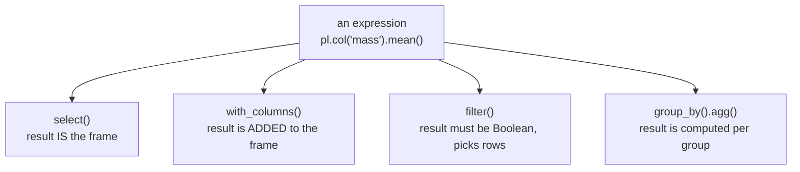

An expression on its own does nothing. It has to be handed to a
**context**: a method that supplies data and decides what the result
means. There are four, and knowing which one a problem needs is most
of knowing Polars.

<Figure
  slug="pl-contexts-cutout"
  alt="A wide platform divided into four raised bays in blue, green, red and yellow, each bay holding one thick solid block of a different shape"
/>

## select: the result is the whole frame

`select` returns a new frame made only of the expressions you gave
it. Anything you did not mention is gone.

<CodeBlock
  adapter="python"
  datasets={[{ path: "palmer-penguins.csv", stageAs: "penguins.csv" }]}
  files={[
    {
      filename: "main.py",
      initCode: `import polars as pl
penguins = pl.read_csv("penguins.csv", null_values=["NA"])`,
      starterCode: `print(
    penguins.select(
        "species",
        (pl.col("body_mass_g") / 1000).round(2).alias("kg"),
    ).head(3)
)

# Aggregations in select collapse the frame to one row
print(
    penguins.select(
        pl.len().alias("n"),
        pl.col("body_mass_g").mean().round(0).alias("avg_mass"),
        pl.col("species").n_unique().alias("species"),
    )
)
`,
    },
  ]}
/>

Use `select` when you are building a *new* table: a summary, a
projection, a reshaped view.

## with_columns: the result is added

`with_columns` keeps everything and adds (or replaces) the columns
you describe. It is the same machinery, with the original columns
implicitly kept.

<CodeBlock
  adapter="python"
  datasets={[{ path: "palmer-penguins.csv", stageAs: "penguins.csv" }]}
  files={[
    {
      filename: "main.py",
      initCode: `import polars as pl
penguins = pl.read_csv("penguins.csv", null_values=["NA"]).select(
    "species", "body_mass_g"
)`,
      starterCode: `print(
    penguins.with_columns(
        (pl.col("body_mass_g") / 1000).round(2).alias("kg"),
        # An aggregation broadcasts: every row gets the overall mean
        pl.col("body_mass_g").mean().round(0).alias("overall_mean"),
    ).head(3)
)
`,
    },
  ]}
/>

An expression whose output name matches an existing column
**replaces** it. That is how you clean a column in place:

<CodeBlock
  adapter="python"
  files={[
    {
      filename: "main.py",
      starterCode: `import polars as pl

df = pl.DataFrame({"name": ["  Ada ", "GRACE", "alan  "]})

print(df.with_columns(pl.col("name").str.strip_chars().str.to_titlecase()))
`,
    },
  ]}
/>

No `alias` is needed because the expression already carries the name
`name`, so the new column lands on top of the old one.

## filter: the expression must be Boolean

`filter` takes an expression that evaluates to a Boolean column and
keeps the rows where it is `True`.

<CodeBlock
  adapter="python"
  datasets={[{ path: "palmer-penguins.csv", stageAs: "penguins.csv" }]}
  files={[
    {
      filename: "main.py",
      initCode: `import polars as pl
penguins = pl.read_csv("penguins.csv", null_values=["NA"])`,
      starterCode: `heavy = penguins.filter(pl.col("body_mass_g") > 5000)
print("heavy:", heavy.height)

# Several expressions are combined with AND
gentoo_heavy = penguins.filter(
    pl.col("species") == "Gentoo",
    pl.col("body_mass_g") > 5000,
)
print("heavy gentoos:", gentoo_heavy.height)

# For OR, use | and parenthesise each side
either = penguins.filter(
    (pl.col("species") == "Chinstrap") | (pl.col("body_mass_g") > 5500)
)
print("either:", either.height)
`,
    },
  ]}
/>

<Callout type="warn" title="Parentheses are not optional">
Python binds `|` and `&` more tightly than `>` and `==`, so
`pl.col("a") > 1 & pl.col("b") < 2` parses as
`pl.col("a") > (1 & pl.col("b")) < 2` and produces a confusing error.
Wrap each comparison: `(pl.col("a") > 1) & (pl.col("b") < 2)`.
</Callout>

## group_by().agg(): the expression runs per group

Inside `agg`, an expression sees one group at a time rather than the
whole column.

<CodeBlock
  adapter="python"
  datasets={[{ path: "palmer-penguins.csv", stageAs: "penguins.csv" }]}
  files={[
    {
      filename: "main.py",
      initCode: `import polars as pl
penguins = pl.read_csv("penguins.csv", null_values=["NA"])`,
      starterCode: `print(
    penguins.group_by("species").agg(
        pl.len().alias("n"),
        pl.col("body_mass_g").mean().round(0).alias("avg_mass"),
        pl.col("island").n_unique().alias("islands"),
    ).sort("species")
)
`,
    },
  ]}
/>

`pl.col("body_mass_g").mean()` is the *same expression* you would
write in `select`. Only the context changed, and with it what "the
column" refers to.

## The same expression in all four

This is the point of the design. One description, four meanings,
decided by where you put it.

<CodeBlock
  adapter="python"
  datasets={[{ path: "palmer-penguins.csv", stageAs: "penguins.csv" }]}
  files={[
    {
      filename: "main.py",
      initCode: `import polars as pl
penguins = pl.read_csv("penguins.csv", null_values=["NA"]).select(
    "species", "body_mass_g"
)`,
      starterCode: `above_average = pl.col("body_mass_g") > pl.col("body_mass_g").mean()

# select: build a frame of just this Boolean
print(penguins.select(above_average.alias("above")).head(3))

# with_columns: attach it to the existing frame
print(penguins.with_columns(above_average.alias("above")).head(3))

# filter: keep the rows where it holds
print("above average:", penguins.filter(above_average).height)

# agg: evaluate it within each species
print(
    penguins.group_by("species")
    .agg(above_average.sum().alias("n_above_own_species_mean"))
    .sort("species")
)
`,
    },
  ]}
/>

Look carefully at the last one. Inside `agg`, `pl.col("body_mass_g").mean()`
is *the group's* mean, so the final line counts penguins heavier than
their own species' average, not heavier than the overall average.
Same expression, different question, because the context changed.

## Practice

<ChallengeCard
  adapter="python"
  title="Pick the right context"
  instructions={`Using \`penguins\` (columns \`species\`, \`island\`, \`body_mass_g\`), produce three results:

1. \`summary\`: a **one-row** frame with columns \`n\` (row count) and \`avg_mass\` (mean \`body_mass_g\`, rounded to 0 decimals).
2. \`tagged\`: the full frame with one extra column \`heavy\`, a Boolean that is true when \`body_mass_g\` exceeds 4500.
3. \`by_island\`: one row per island with columns \`island\` and \`n\` (row count), sorted by \`island\`.

Each one needs a different context.`}
  datasets={[{ path: "palmer-penguins.csv", stageAs: "penguins.csv" }]}
  files={[
    {
      filename: "main.py",
      initCode: `import polars as pl
penguins = pl.read_csv("penguins.csv", null_values=["NA"]).select(
    "species", "island", "body_mass_g"
)`,
      starterCode: `summary = None    # TODO
tagged = None     # TODO
by_island = None  # TODO

print(summary)
`,
      solutionCode: `summary = penguins.select(
    pl.len().alias("n"),
    pl.col("body_mass_g").mean().round(0).alias("avg_mass"),
)

tagged = penguins.with_columns(
    (pl.col("body_mass_g") > 4500).alias("heavy")
)

by_island = (
    penguins.group_by("island")
    .agg(pl.len().alias("n"))
    .sort("island")
)

print(summary)
print(tagged.head(3))
print(by_island)
`,
    },
  ]}
  tests={[
    {
      id: "summary_shape",
      name: "summary is one row, two columns",
      description: "select collapses to a single row",
      code: `assert summary.shape == (1, 2), summary.shape
assert summary.columns == ["n", "avg_mass"], summary.columns`,
    },
    {
      id: "summary_values",
      name: "summary holds the right numbers",
      description: "344 rows, mean mass 4202",
      code: `assert summary["n"][0] == 344, summary["n"][0]
assert summary["avg_mass"][0] == 4202.0, summary["avg_mass"][0]`,
    },
    {
      id: "tagged_shape",
      name: "tagged keeps every row and adds one column",
      description: "344 rows, four columns",
      code: `assert tagged.shape == (344, 4), tagged.shape
assert tagged.columns[-1] == "heavy", tagged.columns`,
    },
    {
      id: "tagged_values",
      name: "heavy is Boolean and counts correctly",
      description: "115 penguins over 4500 g",
      code: `import polars as pl
assert tagged["heavy"].dtype == pl.Boolean, tagged["heavy"].dtype
assert tagged["heavy"].sum() == 115, tagged["heavy"].sum()`,
    },
    {
      id: "by_island",
      name: "by_island has one row per island, sorted",
      description: "Biscoe, Dream, Torgersen",
      code: `assert by_island.columns == ["island", "n"], by_island.columns
assert by_island["island"].to_list() == ["Biscoe", "Dream", "Torgersen"]
assert by_island["n"].to_list() == [168, 124, 52], by_island["n"].to_list()`,
    },
  ]}
/>

## Check your understanding

<MultipleChoice
  markdown={`You want to keep every existing column and add one computed column. Which context?

- \`select\`, listing the new expression
  > \`select\` returns only what you list, so every existing column would have to be named again to survive.
- [o] \`with_columns\`
  > It keeps the frame and adds to it, which is the difference between it and \`select\`.
- \`filter\`, with the computed expression as its argument
  > \`filter\` chooses rows and returns no new columns; its expression has to be Boolean.
- \`group_by().agg()\`, grouping by the existing columns
  > That collapses the frame to one row per group, which is the opposite of keeping every row intact.

\`select\` builds a new table; \`with_columns\` extends the one you have.`}
/>

<MultipleChoice
  markdown={`Inside \`group_by("species").agg(...)\`, what does \`pl.col("mass").mean()\` compute?

- The mean over the whole frame, repeated once per group
  > That would be the same number on every row. Grouping changes what "the column" refers to inside \`agg\`.
- [o] The mean within each group, one value per species
  > Only the context changed; the expression is identical to the one you would write in \`select\`.
- The mean of the group keys rather than the mass values
  > The expression names \`mass\` explicitly, so the group keys are not what is being averaged.
- An error, because aggregations are not permitted inside \`agg\`
  > Aggregations are exactly what \`agg\` is for; a non-aggregating expression is the case that needs care there.

One expression, four meanings, chosen by the context it runs in.`}
/>

<MultipleChoice
  markdown={`Why does \`pl.col("a") > 1 & pl.col("b") < 2\` fail?

- Polars requires \`and\` rather than \`&\` for combining conditions
  > Python's \`and\` cannot be overloaded to build an expression, which is exactly why Polars uses \`&\`.
- \`filter\` accepts only one condition per call
  > Multiple conditions are fine, either as separate arguments (combined with AND) or joined with \`&\`.
- Comparison operators cannot be used on expressions in Polars
  > Comparisons on expressions are the standard way to build Boolean masks and work as written.
- [o] Python binds \`&\` tighter than \`>\`, so it groups as \`1 & pl.col("b")\`
  > Parenthesise each comparison: \`(pl.col("a") > 1) & (pl.col("b") < 2)\`.

This is Python's operator precedence, not a Polars rule, and it bites in pandas identically.`}
/>
