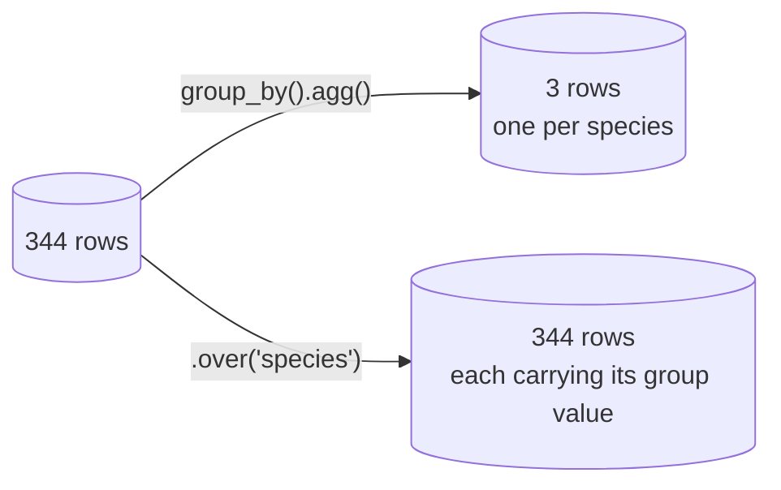

`group_by().agg()` collapses a frame: many rows in, one row per group
out. Often you want the group's statistic *without* losing the rows,
so each row can be compared with its own group. That is `.over()`.

<Figure
  slug="pl-window-cutout"
  alt="A wide platform holding six thick upright columns, three blue and three green, with one low blue bar lying across the tops of the blue columns and one low green bar across the tops of the green ones"
/>

## The one-line version

<CodeBlock
  adapter="python"
  datasets={[{ path: "palmer-penguins.csv", stageAs: "penguins.csv" }]}
  files={[
    {
      filename: "main.py",
      initCode: `import polars as pl
penguins = pl.read_csv("penguins.csv", null_values=["NA"]).select(
    "species", "body_mass_g"
)`,
      starterCode: `print(
    penguins.with_columns(
        species_avg=pl.col("body_mass_g").mean().round(0).over("species"),
    )
    .with_columns(
        vs_species=(pl.col("body_mass_g") - pl.col("species_avg")).round(0)
    )
    .head(6)
)
`,
    },
  ]}
/>

Every row now knows its own species' average and how far it sits from
it. The frame still has 344 rows.

## Anything that aggregates can be windowed

<CodeBlock
  adapter="python"
  datasets={[{ path: "diamonds.csv", stageAs: "diamonds.csv" }]}
  files={[
    {
      filename: "main.py",
      initCode: `import polars as pl
diamonds = pl.read_csv("diamonds.csv")`,
      starterCode: `price = pl.col("price")

print(
    diamonds.select(
        "cut",
        "price",
        cut_n=pl.len().over("cut"),
        cut_median=price.median().over("cut"),
        cut_max=price.max().over("cut"),
        share_of_cut=(price / price.sum().over("cut") * 100).round(4),
    ).head(5)
)
`,
    },
  ]}
/>

## Windowing over several keys

<CodeBlock
  adapter="python"
  datasets={[{ path: "palmer-penguins.csv", stageAs: "penguins.csv" }]}
  files={[
    {
      filename: "main.py",
      initCode: `import polars as pl
penguins = pl.read_csv("penguins.csv", null_values=["NA"])`,
      starterCode: `print(
    penguins.select(
        "species",
        "island",
        "body_mass_g",
        pair_avg=pl.col("body_mass_g").mean().round(0).over("species", "island"),
    ).head(5)
)
`,
    },
  ]}
/>

## Ranking within a group

The classic "top N per group" is a window plus a filter.

<CodeBlock
  adapter="python"
  datasets={[{ path: "palmer-penguins.csv", stageAs: "penguins.csv" }]}
  files={[
    {
      filename: "main.py",
      initCode: `import polars as pl
penguins = pl.read_csv("penguins.csv", null_values=["NA"])`,
      starterCode: `ranked = penguins.drop_nulls("body_mass_g").with_columns(
    rank=pl.col("body_mass_g")
    .rank("ordinal", descending=True)
    .over("species")
)

print(
    ranked.filter(pl.col("rank") <= 2)
    .select("species", "island", "body_mass_g", "rank")
    .sort("species", "rank")
)
`,
    },
  ]}
/>

## Order-dependent windows: shift, cumulative, rolling

These need the rows in a meaningful order, so sort first.

<CodeBlock
  adapter="python"
  files={[
    {
      filename: "main.py",
      starterCode: `import polars as pl

sales = pl.DataFrame(
    {
        "region": ["N", "N", "N", "S", "S", "S"],
        "month": [1, 2, 3, 1, 2, 3],
        "amount": [100, 120, 90, 200, 180, 260],
    }
).sort("region", "month")

print(
    sales.with_columns(
        prev=pl.col("amount").shift(1).over("region"),
        running=pl.col("amount").cum_sum().over("region"),
        moving_2=pl.col("amount")
        .rolling_mean(window_size=2)
        .over("region")
        .round(1),
    ).with_columns(
        change=(pl.col("amount") - pl.col("prev"))
    )
)
`,
    },
  ]}
/>

Look at row 4 (the first `S` row): `prev` is null and `running`
restarts at 200. `.over("region")` keeps each region's window
separate, so the North total never leaks into the South.

<Callout type="warn" title="Sort before an order-dependent window">
`shift`, `cum_sum`, `rolling_*`, `diff`, `first` and `last` all read
the rows in their current order. If the frame is not sorted the way
your question assumes, the answer is wrong and nothing warns you.
</Callout>

## mapping_strategy, when the result is not one-per-row

By default `over` broadcasts a group result back to that group's
rows. Two other strategies exist for cases where it cannot.

<CodeBlock
  adapter="python"
  files={[
    {
      filename: "main.py",
      starterCode: `import polars as pl

df = pl.DataFrame(
    {"g": ["a", "a", "a", "b", "b"], "x": [3, 1, 2, 9, 7]}
)

print(
    df.with_columns(
        # group_to_rows (default): one value per row
        sorted_in_group=pl.col("x").sort().over("g"),
        # explode: flatten the group's values back out, in group order
        exploded=pl.col("x").sort().over("g", mapping_strategy="explode"),
        # join: collect the group's values into a list on every row
        as_list=pl.col("x").sort().over("g", mapping_strategy="join"),
    )
)
`,
    },
  ]}
/>

You will use the default nearly always. `"explode"` is the fast path
when the expression already returns one value per row of the group,
and `"join"` is for attaching the whole group to each row.

## group_by versus over

| Question | Use |
| --- | --- |
| "Average mass per species" | `group_by().agg()` |
| "Each penguin's mass minus its species average" | `.over()` |
| "How many penguins per island" | `group_by().agg()` |
| "Keep only islands with more than 100 penguins" | `.over()` in a `filter` |
| "The two heaviest per species" | `.over()` plus `filter` |

The rule: if the answer has one row per group, group. If it has one
row per original row, window.

## Practice

<ChallengeCard
  adapter="python"
  title="Each diamond against its own cut"
  instructions={`From \`diamonds\`, build \`out\` with these columns, in this order:

1. \`cut\`
2. \`price\`
3. \`cut_median\`, the median \`price\` of that diamond's cut
4. \`premium\`, \`price\` minus \`cut_median\`
5. \`rank_in_cut\`, the diamond's price rank within its cut, most expensive first, using \`"ordinal"\` ranking

Keep every row: this is a windowing exercise, not a grouping one.`}
  datasets={[{ path: "diamonds.csv", stageAs: "diamonds.csv" }]}
  files={[
    {
      filename: "main.py",
      initCode: `import polars as pl
diamonds = pl.read_csv("diamonds.csv")`,
      starterCode: `out = None  # TODO

print(out)
`,
      solutionCode: `out = diamonds.select(
    "cut",
    "price",
    cut_median=pl.col("price").median().over("cut"),
).with_columns(
    premium=pl.col("price") - pl.col("cut_median"),
    rank_in_cut=pl.col("price")
    .rank("ordinal", descending=True)
    .over("cut"),
)

print(out.head())
`,
    },
  ]}
  tests={[
    {
      id: "rows",
      name: "Every row survives",
      description: "53,940 rows, five columns",
      code: `assert out.shape == (53940, 5), out.shape`,
    },
    {
      id: "cols",
      name: "The right columns in order",
      description: "cut, price, cut_median, premium, rank_in_cut",
      code: `expected = ["cut", "price", "cut_median", "premium", "rank_in_cut"]
assert out.columns == expected, out.columns`,
    },
    {
      id: "median",
      name: "cut_median is per cut, not overall",
      description: "Five distinct medians",
      code: `assert out["cut_median"].n_unique() == 5, out["cut_median"].n_unique()`,
    },
    {
      id: "premium",
      name: "premium is price minus the cut median",
      description: "Consistent on every row",
      code: `import polars as pl
bad = out.filter(
    (pl.col("price") - pl.col("cut_median") - pl.col("premium")).abs() > 1e-9
)
assert bad.height == 0, bad.height`,
    },
    {
      id: "rank",
      name: "Ranks restart within each cut",
      description: "Exactly one rank-1 diamond per cut",
      code: `import polars as pl
tops = out.filter(pl.col("rank_in_cut") == 1)
assert tops.height == 5, tops.height
assert tops["cut"].n_unique() == 5, tops["cut"].to_list()`,
    },
  ]}
/>

## Check your understanding

<MultipleChoice
  markdown={`What is the difference between \`group_by("g").agg(pl.col("x").mean())\` and \`pl.col("x").mean().over("g")\`?

- The first skips nulls and the second includes them
  > Both use the same aggregation and therefore the same null handling; only the output shape differs.
- The second computes an overall mean rather than a per-group one
  > \`over("g")\` is precisely what makes the mean per-group; without it the mean would be overall.
- [o] The first returns one row per group; the second returns one value per original row
  > Group when the answer has one row per group, window when it has one row per input row.
- The first works only on numeric columns while the second works on any type
  > Both accept whatever the aggregation itself accepts; the column's type plays no part in the distinction.

They compute the same numbers and put them in different shapes.`}
/>

<MultipleChoice
  markdown={`Why sort before \`pl.col("amount").cum_sum().over("region")\`?

- Because \`over\` requires its key column to be sorted before grouping
  > Grouping is done by hashing the key, which works on any order; the ordering requirement is about the rows within each group.
- Because an unsorted frame makes \`cum_sum\` raise an error
  > It runs happily on any order, which is exactly why the wrong answer is silent rather than loud.
- Because sorting is what makes the running total use the right column
  > Which column is summed is fixed by the expression; sorting decides the sequence the values are summed in.
- [o] A running total accumulates in row order, so unsorted rows give a meaningless sequence
  > The same applies to \`shift\`, \`diff\`, \`rolling_*\`, \`first\` and \`last\`.

Nothing warns you: the numbers are simply wrong.`}
/>

<MultipleChoice
  markdown={`How do you keep the two heaviest penguins per species while keeping all their columns?

- \`group_by("species").agg(pl.col("body_mass_g").top_k(2))\`
  > This returns a list of two masses per species and discards every other column, which is not what was asked for.
- \`sort("body_mass_g", descending=True).head(2)\`
  > This gives the two heaviest penguins overall, which may all belong to one species.
- [o] Rank the mass with \`.over("species")\`, then filter on the rank
  > Windowing computes the rank per species while leaving the rows and their columns intact.
- \`group_by("species").head(2)\`
  > This takes the first two rows of each group in whatever order they appear, which has nothing to do with mass.

"Top N per group, keeping the rows" is the canonical window-plus-filter problem.`}
/>
