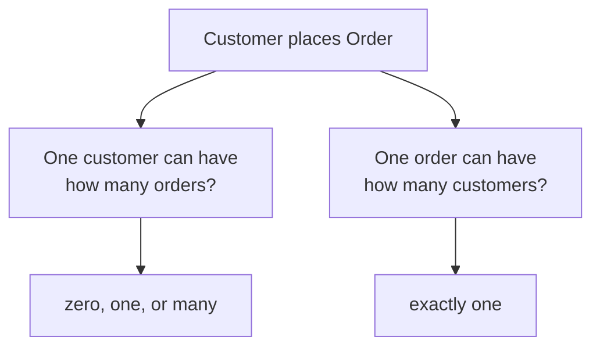
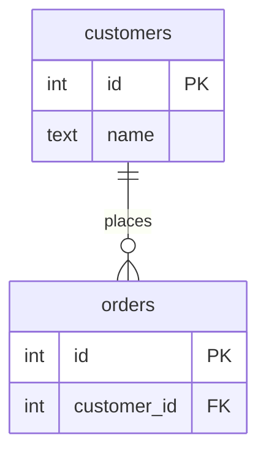
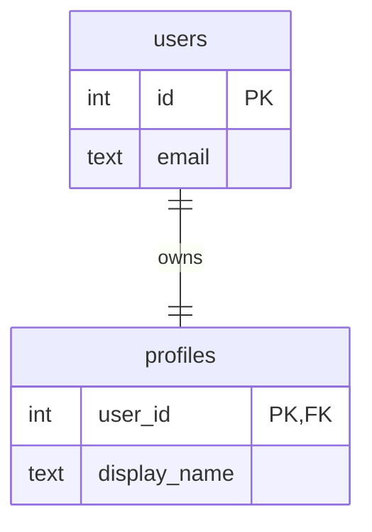
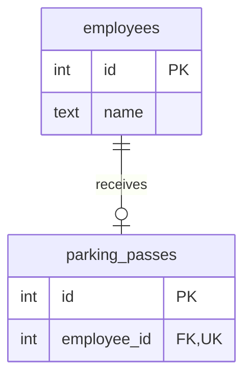
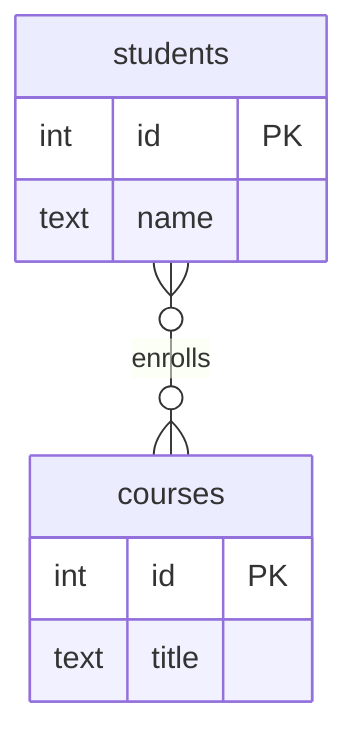
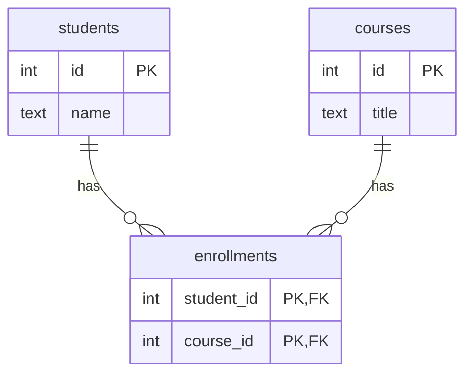
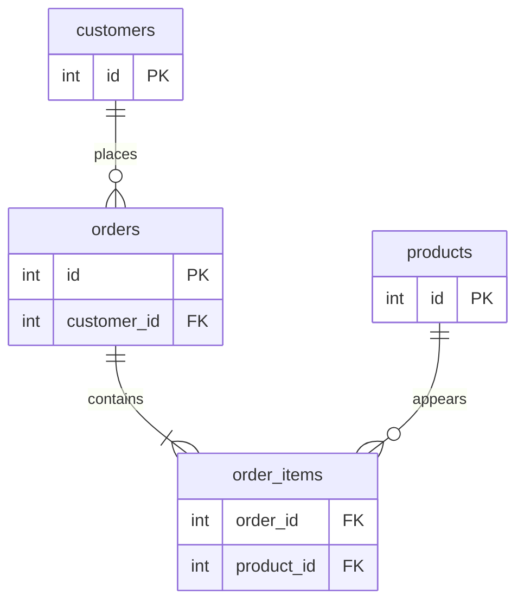
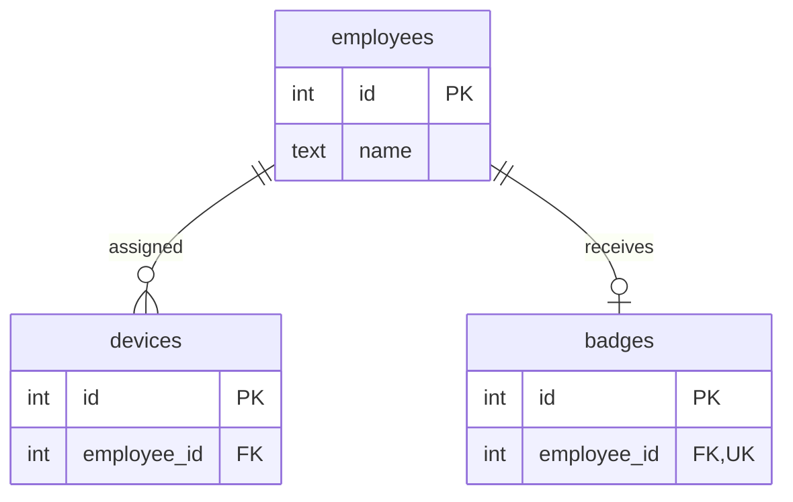

Two entities can be related, but that is not enough detail. A customer
places orders — but how many orders can one customer place? Must every
order have a customer? Can one product appear on many orders?

**Cardinality** answers: *how many rows on one side may relate to how
many rows on the other side?*

<svg
  viewBox="0 0 640 210"
  role="img"
  aria-label="Three connector endings — double bars meaning exactly one, a crow's foot fanning to three rows, and a ring meaning optional — the small marks that answer how many"
  style={{ display: "block", width: "100%", maxWidth: "640px", height: "auto", margin: "2.5rem auto" }}
>
  <g style={{ color: "var(--ds-blue-500)" }} fill="currentColor">
    <circle cx="150" cy="60" r="10" />
    <path
      d="M166 60 H 360"
      fill="none"
      stroke="currentColor"
      strokeWidth="3"
      strokeLinecap="round"
      strokeOpacity="0.4"
    />
    <rect x="368" y="46" width="6" height="28" rx="3" />
    <rect x="384" y="46" width="6" height="28" rx="3" />
    <circle cx="470" cy="60" r="8" fillOpacity="0.8" />
  </g>
  <g style={{ color: "var(--ds-green-500)" }} fill="currentColor">
    <circle cx="150" cy="115" r="10" />
    <g
      fill="none"
      stroke="currentColor"
      strokeWidth="3"
      strokeLinecap="round"
      strokeOpacity="0.4"
    >
      <path d="M166 115 H 358" />
      <path d="M358 115 L 400 97" />
      <path d="M358 115 H 400" />
      <path d="M358 115 L 400 133" />
    </g>
    <circle cx="470" cy="97" r="7" fillOpacity="0.8" />
    <circle cx="470" cy="115" r="7" fillOpacity="0.8" />
    <circle cx="470" cy="133" r="7" fillOpacity="0.8" />
  </g>
  <g style={{ color: "var(--ds-yellow-500)" }} fill="currentColor">
    <circle cx="150" cy="170" r="10" />
    <path
      d="M166 170 H 344"
      fill="none"
      stroke="currentColor"
      strokeWidth="3"
      strokeLinecap="round"
      strokeOpacity="0.4"
    />
    <circle
      cx="357"
      cy="170"
      r="9"
      fill="none"
      stroke="currentColor"
      strokeWidth="5"
    />
    <rect x="378" y="156" width="6" height="28" rx="3" />
    <circle cx="470" cy="170" r="8" fillOpacity="0.25" />
  </g>
</svg>

## Cardinality is about counts

When you read a relationship, ask both directions:

- For one row on the left, how many rows on the right can connect?
- For one row on the right, how many rows on the left can connect?

That gives us a one-to-many relationship: one customer, many orders.

## One-to-many

A **one-to-many** relationship means one row on the first side can
connect to many rows on the second side, while each row on the second
side connects back to one row on the first side.

Read `||--o{` as "one to zero-or-many." The order side is optional
and many: a customer may have no orders yet, or many orders later.

<SqlCodeBlock
  dialect="postgres"
  title="One customer can have many orders"
  initSql={`CREATE TABLE customers (
  id   INTEGER PRIMARY KEY,
  name TEXT NOT NULL
);
CREATE TABLE orders (
  id          INTEGER PRIMARY KEY,
  customer_id INTEGER NOT NULL REFERENCES customers(id)
);
INSERT INTO customers VALUES (1, 'Ada'), (2, 'Grace');
INSERT INTO orders VALUES (101, 1), (102, 1), (103, 2);`}
  starterCode={`SELECT
  c.name,
  COUNT(o.id) AS order_count
FROM
  customers c
  LEFT JOIN orders o ON o.customer_id = c.id
GROUP BY
  c.id,
  c.name
ORDER BY
  c.id;`}
/>

The foreign key goes on the "many" side. Many order rows can store the
same `customer_id`.

## One-to-one

A **one-to-one** relationship means one row on each side can connect to
at most one row on the other side. A common example is a user and a
profile.

The `||--||` line says each side is exactly one. In practice, some
one-to-one relationships are optional on one side.

Here an employee may have zero or one parking pass. A parking pass, if
it exists, belongs to one employee.

## Quick check

<MultipleChoice
  markdown={`In a one-to-many relationship between customers and orders, where does the foreign key usually go?

- On the customers table, storing a list of order ids.
  > A single customer row may relate to many orders, and a single cell should not store a list of ids.
- [o] On the orders table, because each order points to one customer.
  > The many-side table can repeat the same customer id across many rows.
- On both tables, with each side copying all columns from the other.
  > Copying columns duplicates data and does not create a clean relationship.
- On neither table, because one-to-many relationships cannot be stored.
  > One-to-many relationships are commonly stored with a foreign key on the many side.

The many side carries the foreign key because each many-side row chooses one parent.`}
/>

## Many-to-many

A **many-to-many** relationship means many rows on each side can
connect to many rows on the other side. Students and courses are the
classic example.

This diagram describes the real-world cardinality, but the relational
schema needs a junction table to store the pairings.

The junction table turns many-to-many into two one-to-many
relationships.

## Optional vs mandatory participation

Cardinality also includes the minimum number of related rows. This is
sometimes called **participation**.

- **Optional** means zero is allowed, shown by `o` on the line.
- **Mandatory** means at least one is required, shown by `|` on the line.
- **Many** is the crow's foot, `{`, marking the maximum as many.

Crow's-foot symbols combine minimum and maximum. `o{` means zero or
many. `||` means exactly one. `o|` means zero or one.

This says a customer can have zero or many orders, but an order has one
or more order items. The `|{` end means "one or many."

## Quick check

<MultipleChoice
  markdown={`What does optional participation mean in a relationship?

- The relationship is not important and should be ignored.
  > Optional still matters; it only means a row can exist without a related row on that side.
- [o] A row is allowed to have zero related rows on that side of the relationship.
  > Optional participation means the minimum cardinality is zero.
- Every row must have at least two related rows.
  > That describes a different minimum, not optional participation.
- The foreign key must always be text.
  > Participation is about row counts, not data type.

Optionality is the minimum side of cardinality: zero allowed or not.`}
/>

## Cardinality changes the schema

If one employee can have many devices, the devices table can store
`employee_id`. If one employee can have at most one active badge, the
badge table needs a uniqueness rule on `employee_id`.

The difference between `o{` and `o|` is not decorative. It changes the
constraints you need.

<SqlCodeBlock
  dialect="postgres"
  title="Uniqueness turns many into at-most-one"
  initSql={`CREATE TABLE employees (
  id   INTEGER PRIMARY KEY,
  name TEXT NOT NULL
);
CREATE TABLE badges (
  id          INTEGER PRIMARY KEY,
  employee_id INTEGER NOT NULL UNIQUE REFERENCES employees(id)
);
INSERT INTO employees VALUES (1, 'Ada');
INSERT INTO badges VALUES (10, 1);`}
  starterCode={`-- This tries to give Ada a second badge.
-- The UNIQUE rule on employee_id rejects it.
INSERT INTO
  badges
VALUES
  (11, 1);

SELECT
  *
FROM
  badges;`}
/>

PostgreSQL does not understand the picture directly. You translate the
picture into keys, `NOT NULL`, `UNIQUE`, and sometimes additional
constraints or application rules.

## Check your understanding

<MultipleChoice
  markdown={`What does **cardinality** describe?

- The color used for a table in a diagram.
  > Diagram styling is not the meaning of cardinality.
- [o] How many rows on each side of a relationship may relate to rows on the other side.
  > Cardinality is about counts: one, many, optional, and mandatory.
- The exact order in which SQL statements must be typed.
  > SQL order is separate from the modeling concept of cardinality.
- Whether a column stores text or numbers.
  > Data type describes values inside a column, not relationship counts.

Cardinality turns a vague relationship into a precise modeling rule.`}
/>

<MultipleChoice
  markdown={`Which relationship is best described as many-to-many?

- One order is placed by one customer, and a customer may place many orders.
  > That is one-to-many from customers to orders.
- One user has one required profile.
  > That is one-to-one.
- [o] A student can take many courses, and a course can contain many students.
  > Both sides can have many related rows, so the relationship is many-to-many.
- One parking pass belongs to one employee, and an employee may have no pass.
  > That is one-to-zero-or-one, not many-to-many.

Many-to-many means "many" is possible in both directions.`}
/>

<MultipleChoice
  markdown={`In Crow's-foot notation, what does o{ usually mean at one end of a relationship?

- Exactly one.
  > The two-bar symbol, ||, represents exactly one.
- Zero or one.
  > Zero or one is represented by o|.
- [o] Zero or many.
  > The circle means optional, and the crow's foot means many.
- One or many, with zero forbidden.
  > One or many is represented by |{.

The two symbols together show minimum and maximum cardinality.`}
/>

<MultipleChoice
  markdown={`Why does a one-to-zero-or-one relationship often need a UNIQUE constraint on the foreign key?

- To make the foreign key store several ids in one cell.
  > A unique foreign key still stores one value per row; it prevents repeats across rows.
- [o] To prevent many rows from pointing to the same parent row.
  > Without uniqueness, the same parent id could appear on many child rows, making the relationship one-to-many.
- To remove the need for a primary key on the parent table.
  > The foreign key still needs a reliable target, usually the parent's primary key.
- To make optional rows mandatory.
  > Uniqueness controls the maximum count; optionality controls the minimum count.

Maximum cardinality often becomes a uniqueness rule in the schema.`}
/>
