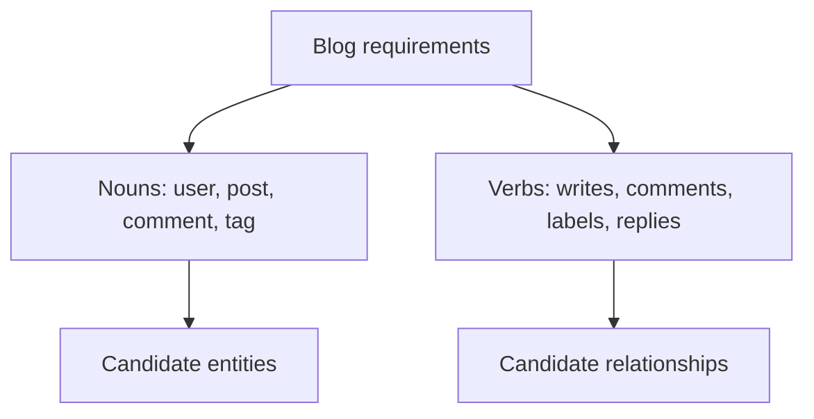
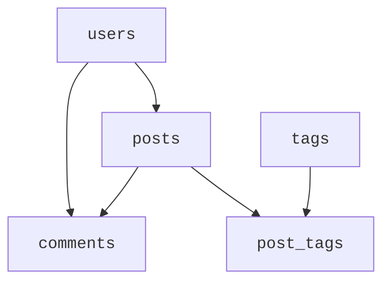
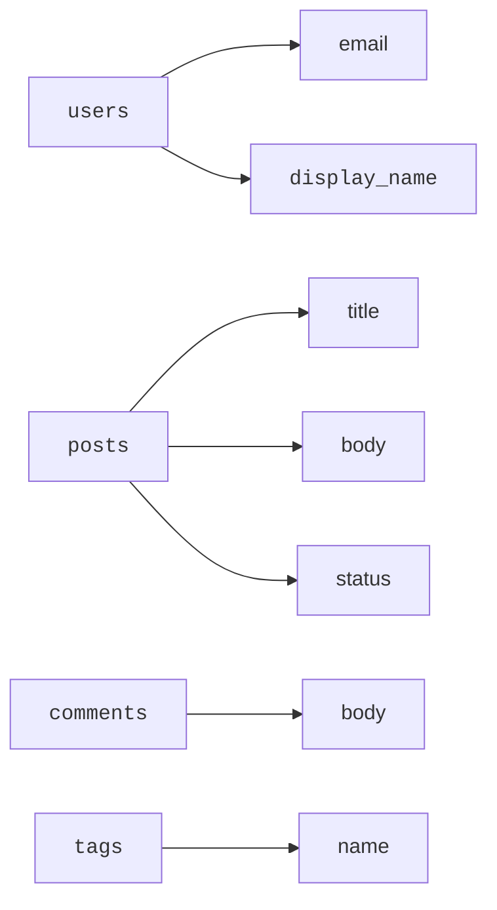
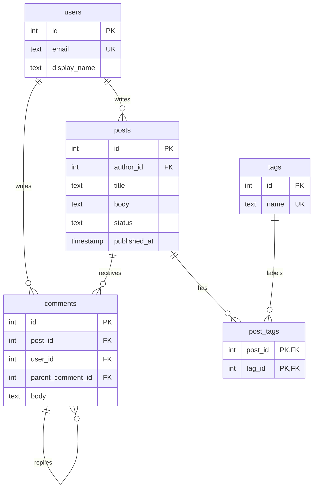
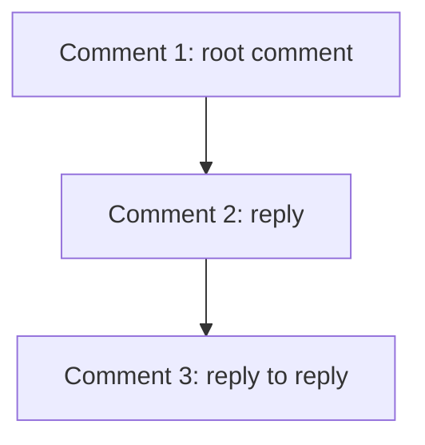
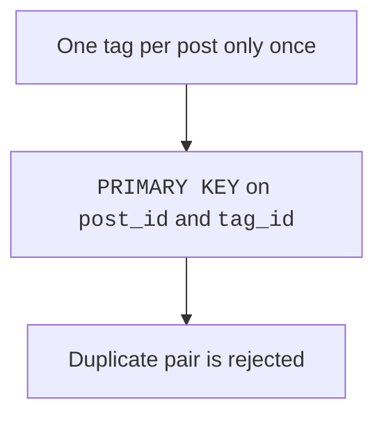

Suppose you are asked to design the database for a small blog.

<Figure
  slug="db-case-study-blog-cutout"
  alt="Designing a blog, an isometric illustration"
/>

The first request sounds simple: users write posts, readers comment,
and posts have tags. But those few sentences already contain several
important design decisions.

This page applies the design process end to end.

## Start with requirements

Write the requirements as plain sentences before you write tables:

- A user has an email and display name.
- A user writes many posts.
- A post has a title, body, status, and publish time.
- A post can have many comments.
- A comment belongs to one post and one user.
- A comment may reply to another comment.
- A post can have many tags, and a tag can label many posts.

The nouns become candidates. The verbs tell us how those candidates
connect.

<Figure
  slug="db-case-study-blog-start-requirements-inline-cutout"
  alt="A solid dark easel board with a figure pinning bright plain cards across it before any cabinet is built"
  caption="The plan is pinned up before any table is created, not after."
/>

## Choose entities

The main entities are `users`, `posts`, `comments`, and `tags`.
The many-to-many relationship between posts and tags needs a fifth
table: `post_tags`.

<Figure
  slug="db-case-study-blog-choose-entities-inline-cutout"
  alt="Three crates being lifted out of a heap of loose cards and set apart on a bench"
  caption="Design starts by lifting the real things out of the requirements."
/>

`post_tags` is not just a technical trick. It represents the fact
that one post can have many tags and one tag can appear on many posts.

<MultipleChoice
  markdown={`Why does the blog need a \`post_tags\` table?

- Because tags cannot have primary keys.
  > Tags can and should have primary keys like other entities.
- Because comments are optional.
  > Optional comments do not explain the post-tag relationship.
- [o] Because posts and tags have a many-to-many relationship.
  > One post can have many tags, and one tag can label many posts.
- Because every blog table must have a junction table.
  > Junction tables are used when the relationship needs them, not automatically.

Many-to-many relationships become their own table in a relational design.`}
/>

## Assign attributes

Each attribute belongs with the entity it describes.

The post does not store the author's email. It stores `author_id`, a
foreign key to `users`. That keeps user facts in one place.

## Draw the full model

Now the ER diagram can show the whole shape of the schema.

<Figure
  slug="db-case-study-blog-inline-cutout"
  alt="Three crates on a bench, one of posts, one of authors and one of comments, joined by cords"
  caption="Posts, authors and comments joined by keys is the whole blog schema."
/>

The self-reference on `comments.parent_comment_id` is optional. It
lets a comment reply to another comment while still keeping every
comment in the same table.

## Turn the model into tables

The SQL below creates the complete blog schema and inserts a tiny
sample dataset.

<SqlCodeBlock
  dialect="postgres"
  title="Create a blog schema"
  initSql={`DROP TABLE IF EXISTS post_tags;
DROP TABLE IF EXISTS comments;
DROP TABLE IF EXISTS posts;
DROP TABLE IF EXISTS tags;
DROP TABLE IF EXISTS users;

CREATE TABLE users (
    id INT GENERATED ALWAYS AS IDENTITY PRIMARY KEY,
    email TEXT NOT NULL UNIQUE,
    display_name TEXT NOT NULL
);

CREATE TABLE posts (
    id INT GENERATED ALWAYS AS IDENTITY PRIMARY KEY,
    author_id INT NOT NULL REFERENCES users(id),
    title TEXT NOT NULL,
    body TEXT NOT NULL,
    status TEXT NOT NULL CHECK (status IN ('draft', 'published')),
    published_at TIMESTAMP
);

CREATE TABLE comments (
    id INT GENERATED ALWAYS AS IDENTITY PRIMARY KEY,
    post_id INT NOT NULL REFERENCES posts(id),
    user_id INT NOT NULL REFERENCES users(id),
    parent_comment_id INT REFERENCES comments(id),
    body TEXT NOT NULL,
    created_at TIMESTAMP NOT NULL
);

CREATE TABLE tags (
    id INT GENERATED ALWAYS AS IDENTITY PRIMARY KEY,
    name TEXT NOT NULL UNIQUE
);

CREATE TABLE post_tags (
    post_id INT NOT NULL REFERENCES posts(id),
    tag_id INT NOT NULL REFERENCES tags(id),
    PRIMARY KEY (post_id, tag_id)
);

INSERT INTO users (email, display_name) VALUES
    ('ana@example.com', 'Ana'),
    ('ben@example.com', 'Ben'),
    ('cam@example.com', 'Cam');

INSERT INTO posts (author_id, title, body, status, published_at) VALUES
    (1, 'Designing Tables', 'Start with entities.', 'published', '2025-03-01 09:00'),
    (1, 'Draft Notes', 'Still thinking.', 'draft', NULL);

INSERT INTO comments (post_id, user_id, parent_comment_id, body, created_at) VALUES
    (1, 2, NULL, 'This helped me see why keys matter.', '2025-03-02 10:00'),
    (1, 3, 1, 'The comment thread example helped too.', '2025-03-02 11:00');

INSERT INTO tags (name) VALUES
    ('postgres'),
    ('design'),
    ('beginner');

INSERT INTO post_tags (post_id, tag_id) VALUES
    (1, 1),
    (1, 2),
    (1, 3);
`}
  starterCode={`SELECT
  p.title,
  u.display_name AS author,
  string_agg(
    t.name,
    ', '
    ORDER BY
      t.name
  ) AS tags
FROM
  posts AS p
  JOIN users AS u ON u.id = p.author_id
  JOIN post_tags AS pt ON pt.post_id = p.id
  JOIN tags AS t ON t.id = pt.tag_id
WHERE
  p.status = 'published'
GROUP BY
  p.id,
  p.title,
  u.display_name;`}
/>

The query joins across the design: post to author, post to junction
table, and junction table to tags.

## Why these decisions?

The design choices come from the rules:

- `users.email` is unique because one account should own one email.
- `posts.author_id` is required because every post needs an author.
- `posts.status` is constrained because only known states are valid.
- `comments.parent_comment_id` is nullable because top-level comments
  are not replies.
- `post_tags` has a composite primary key so the same tag cannot be
  attached to the same post twice.

<SqlCodeBlock
  expectError
  dialect="postgres"
  title="The junction key prevents duplicate tags"
  initSql={`DROP TABLE IF EXISTS post_tags;
DROP TABLE IF EXISTS posts;
DROP TABLE IF EXISTS tags;

CREATE TABLE posts (
    id INT GENERATED ALWAYS AS IDENTITY PRIMARY KEY,
    title TEXT NOT NULL
);

CREATE TABLE tags (
    id INT GENERATED ALWAYS AS IDENTITY PRIMARY KEY,
    name TEXT NOT NULL UNIQUE
);

CREATE TABLE post_tags (
    post_id INT NOT NULL REFERENCES posts(id),
    tag_id INT NOT NULL REFERENCES tags(id),
    PRIMARY KEY (post_id, tag_id)
);

INSERT INTO posts (title) VALUES ('Designing Tables');
INSERT INTO tags (name) VALUES ('postgres');
INSERT INTO post_tags (post_id, tag_id) VALUES (1, 1);
`}
  starterCode={`INSERT INTO
  post_tags (post_id, tag_id)
VALUES
  (1, 1);`}
/>

## Try it: ask the schema a question

A schema earns its keep when new questions are easy. Here is one the
product team will ask on day two: *how active is each post?* The full
blog schema and its sample data are loaded below.

<SqlChallengeCard
  dialect="postgres"
  title="Count comments per post"
  instructions={`Return one row per post with the columns \`title\` and \`comment_count\` (the number of comments on that post). Posts with **zero comments must still appear** with a count of 0, use a \`LEFT JOIN\`. Sort by \`title\` ascending.`}
  initSql={`CREATE TABLE users (
    id INT GENERATED ALWAYS AS IDENTITY PRIMARY KEY,
    email TEXT NOT NULL UNIQUE,
    display_name TEXT NOT NULL
);

CREATE TABLE posts (
    id INT GENERATED ALWAYS AS IDENTITY PRIMARY KEY,
    author_id INT NOT NULL REFERENCES users(id),
    title TEXT NOT NULL,
    body TEXT NOT NULL,
    status TEXT NOT NULL CHECK (status IN ('draft', 'published')),
    published_at TIMESTAMP
);

CREATE TABLE comments (
    id INT GENERATED ALWAYS AS IDENTITY PRIMARY KEY,
    post_id INT NOT NULL REFERENCES posts(id),
    user_id INT NOT NULL REFERENCES users(id),
    parent_comment_id INT REFERENCES comments(id),
    body TEXT NOT NULL,
    created_at TIMESTAMP NOT NULL
);

INSERT INTO users (email, display_name) VALUES
    ('ana@example.com', 'Ana'),
    ('ben@example.com', 'Ben'),
    ('cam@example.com', 'Cam');

INSERT INTO posts (author_id, title, body, status, published_at) VALUES
    (1, 'Designing Tables', 'Start with entities.', 'published', '2025-03-01 09:00'),
    (1, 'Draft Notes', 'Still thinking.', 'draft', NULL);

INSERT INTO comments (post_id, user_id, parent_comment_id, body, created_at) VALUES
    (1, 2, NULL, 'This helped me see why keys matter.', '2025-03-02 10:00'),
    (1, 3, 1, 'The comment thread example helped too.', '2025-03-02 11:00');`}
  starterCode={`SELECT
  p.title,
  0 AS comment_count
FROM
  posts p
ORDER BY
  p.title;`}
  solutionSql={`SELECT
  p.title,
  COUNT(c.id) AS comment_count
FROM
  posts p
  LEFT JOIN comments c ON c.post_id = p.id
GROUP BY
  p.id,
  p.title
ORDER BY
  p.title;`}
  tests={[
    {
      id: "row_count",
      name: "Returns 2 rows",
      description: "One per post, including the draft with no comments",
      expectedRowCount: 2,
    },
    {
      id: "columns",
      name: "Has title and comment_count",
      description: "In that exact order",
      expectedColumns: ["title", "comment_count"],
    },
    {
      id: "matches",
      name: "Matches the reference solution",
      description: "Designing Tables has 2 comments; Draft Notes has 0",
      matchesSolution: true,
      ordered: true,
    },
  ]}
/>

Notice what you did *not* have to do: parse any text, deduplicate any
names, or guess which comment belongs to which post. The design
already answered those questions.

## Check your understanding

<MultipleChoice
  markdown={`In the blog design, why does \`posts\` store \`author_id\` instead of \`author_email\`?

- The post title already identifies the author.
  > A title is not a reliable identifier for a user.
- Email addresses cannot be stored in PostgreSQL.
  > Text values such as email addresses can be stored, but that is not the design reason.
- [o] The post should reference the user row, while user facts stay in \`users\`.
  > A foreign key connects the post to its author without duplicating author details.
- The author is a many-to-many relationship.
  > This design says each post has one author.

Foreign keys connect entities without repeating their attributes.`}
/>

<MultipleChoice
  markdown={`What does nullable \`comments.parent_comment_id\` allow?

- A comment can have many authors.
  > Authorship is represented by \`user_id\`, not the parent comment column.
- Comments can belong to no post.
  > The separate \`post_id\` column is still required.
- Every comment must be a reply.
  > A nullable column allows no parent for top-level comments.
- [o] Some comments can be top-level, while others can reply to a comment.
  > Null means no parent comment; a value means this comment replies to another one.

Self-references can model simple hierarchies inside one table.`}
/>

<MultipleChoice
  markdown={`Which constraint prevents the same tag from being attached to the same post twice?

- \`posts.author_id REFERENCES users(id)\`
  > That constraint protects post authorship, not tag pairs.
- \`tags.name UNIQUE\`
  > That constraint prevents duplicate tag names, not duplicate post-tag pairs.
- \`comments.parent_comment_id REFERENCES comments(id)\`
  > That constraint protects comment replies.
- [o] \`PRIMARY KEY (post_id, tag_id)\` on \`post_tags\`.
  > The pair itself is unique, so the same relationship cannot be inserted twice.

A junction table often uses the pair of foreign keys as its identity.`}
/>
