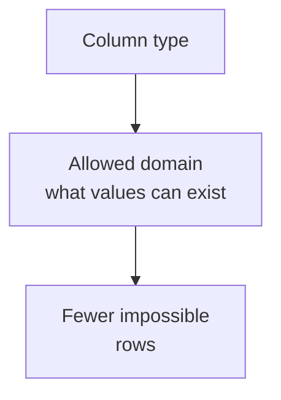
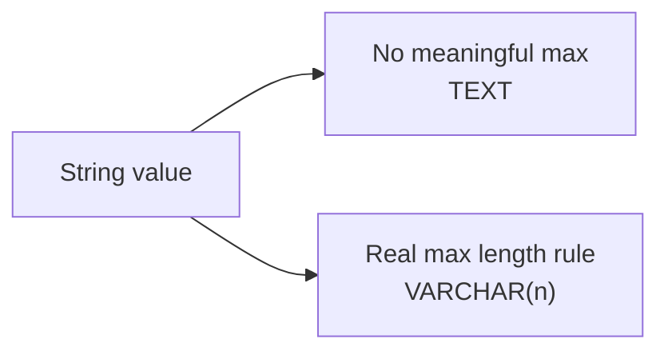
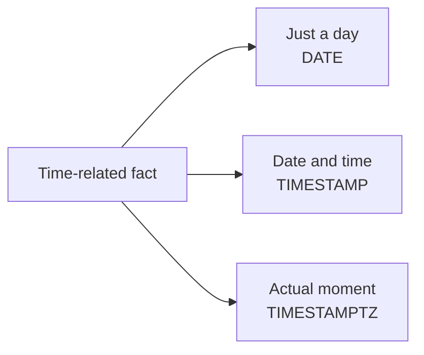
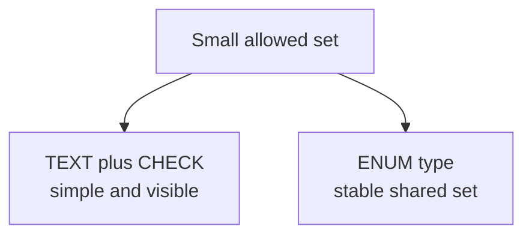
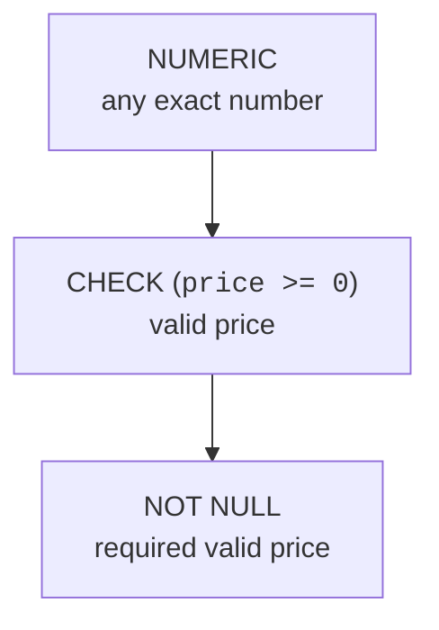

Before you add `NOT NULL`, `UNIQUE`, or `CHECK`, every column already
has a rule: its **data type**. A column declared as `INTEGER` does not
accept arbitrary text. A column declared as `DATE` does not accept a
random sentence.

That is why data types are the first constraint in a schema.

<svg
  viewBox="0 0 640 220"
  role="img"
  aria-label="A padlock with a keyhole and two keys: the green key's teeth match the lock while a red key with the wrong teeth tilts away, a column's data type admits only matching values"
  style={{ display: "block", width: "100%", maxWidth: "640px", height: "auto", margin: "2.5rem auto" }}
>
  <g
    style={{ color: "var(--ds-gray-400)" }}
    fill="none"
    stroke="currentColor"
    strokeWidth="9"
    strokeLinecap="round"
  >
    <path d="M446 88 V 62 A 34 34 0 0 1 514 62 V 88" />
  </g>
  <g style={{ color: "var(--ds-blue-500)" }} fill="currentColor">
    <rect x="420" y="88" width="120" height="94" rx="16" />
  </g>
  <g style={{ color: "var(--ds-white)" }} fill="currentColor">
    <circle cx="480" cy="126" r="11" />
    <rect x="475" y="134" width="10" height="24" rx="3" />
  </g>
  <g style={{ color: "var(--ds-green-500)" }} fill="currentColor">
    <circle cx="140" cy="126" r="14" fill="none" stroke="currentColor" strokeWidth="7" />
    <rect x="154" y="122" width="140" height="8" rx="4" />
    <rect x="252" y="130" width="9" height="11" rx="2" />
    <rect x="270" y="130" width="9" height="16" rx="2" />
  </g>
  <g
    style={{ color: "var(--ds-red-500)" }}
    fill="currentColor"
    transform="rotate(14 210 188)"
  >
    <circle cx="140" cy="188" r="14" fill="none" stroke="currentColor" strokeWidth="7" />
    <rect x="154" y="184" width="120" height="8" rx="4" />
    <rect x="232" y="176" width="9" height="8" rx="2" />
    <rect x="250" y="172" width="9" height="12" rx="2" />
  </g>
</svg>

## Type equals domain

A **domain** is the set of values a column is allowed to hold. Choosing a
type chooses the broad domain before any other constraint narrows it.

If `quantity` is `INTEGER`, PostgreSQL rejects `two`. If `ordered_at` is
`TIMESTAMPTZ`, PostgreSQL stores a timestamp rather than a vague text
label. The type makes many invalid values unrepresentable.

## Watch a type reject bad input

This table says quantity is an integer. PostgreSQL will not store text
that cannot be converted into an integer.

<SqlCodeBlock
  dialect="postgres"
  title="The type system rejects the wrong kind of value"
  initSql={`CREATE TABLE order_items (
  id       SERIAL PRIMARY KEY,
  sku      TEXT NOT NULL,
  quantity INTEGER NOT NULL CHECK (quantity > 0)
);

INSERT INTO order_items (sku, quantity) VALUES ('PEN-1', 3);`}
  starterCode={`-- The type INTEGER rejects text that is not a number.
INSERT INTO
  order_items (sku, quantity)
VALUES
  ('BOOK-1', 'many');

SELECT
  id,
  sku,
  quantity
FROM
  order_items;`}
/>

The `CHECK` adds the rule that quantity must be positive, but the data
type catches an even earlier problem: the value must be an integer at
all.

## Choosing common types

You do not need every PostgreSQL type on day one. Start with the common
modeling choices, matched to the kind of value you are storing.

- Use `TEXT` for ordinary strings. `VARCHAR(n)` is useful when the
  length limit is a real business rule, not just habit.
- Use `INTEGER` for normal whole numbers, `BIGINT` for very large whole
  numbers.
- Use `NUMERIC` for exact decimal values such as money.
- Use `BOOLEAN` for true/false facts.
- Use `DATE` for a calendar day with no time of day.
- Use `TIMESTAMP` or `TIMESTAMPTZ` for a date plus time.

<Callout type="info" title="A type is a design statement">
`price NUMERIC` says the value is an exact number. `price TEXT` says the
database will accept almost any string. Those schemas do not mean the
same thing.
</Callout>

## Text vs. VARCHAR

For most free-form text in PostgreSQL, `TEXT` is the simple choice:
names, descriptions, titles, notes. Use `VARCHAR(20)` only when "at most
20 characters" is a true rule of the domain.

A product description probably does not have a meaningful database-level
maximum. A two-letter country code does, though for that, you might use
`CHAR(2)` or `TEXT CHECK (length(code) = 2)` depending on the design.

## Numbers: integer, bigint, numeric

Use whole-number types when fractions do not make sense. A count of
items should be `INTEGER`, not text and not a decimal.

Use `BIGINT` when the number may grow beyond the normal integer range,
such as very large identifiers or counters.

Use `NUMERIC` when exact decimal arithmetic matters. Money is the
classic example.

## Why not float for money?

Floating-point types are approximate. They are excellent for scientific
measurements, but money usually needs exact decimal behavior.

<SqlCodeBlock
  dialect="postgres"
  title="NUMERIC is exact; floating point is approximate"
  initSql={`CREATE TABLE money_demo (
  id SERIAL PRIMARY KEY,
  exact_amount NUMERIC,
  approximate_amount DOUBLE PRECISION
);

INSERT INTO money_demo (exact_amount, approximate_amount)
VALUES (0.1 + 0.2, 0.1::double precision + 0.2::double precision);`}
  starterCode={`SELECT
  exact_amount,
  approximate_amount,
  exact_amount = 0.3 AS numeric_is_exact,
  approximate_amount = 0.3::double precision AS float_equals_point_three
FROM
  money_demo;`}
/>

The exact result is what you want for prices, invoices, balances, and
other financial values. Floating point may display surprising tiny
rounding differences because it stores approximate binary fractions.

If a fraction of a cent sounds too small to matter, consider what
happened to the Vancouver Stock Exchange. When the exchange launched
its index in 1982 it set the value at 1,000. The index was
recalculated after every trade, and each recalculation *truncated*
the result to three decimal places instead of rounding it, shaving
off a microscopic sliver of value, thousands of times a day, always
in the same direction. By late 1983 the index had drifted down to
around 520 even though the market it tracked had not crashed at all.
When analysts finally diagnosed the bug and recomputed the index
correctly, it jumped overnight to roughly 1,098, the error had
quietly eaten about half the index. Tiny numeric errors do not stay
tiny when an automated system repeats them; choosing exact arithmetic
for values that accumulate is a design decision, not a nicety.

## Quick check

<MultipleChoice
  markdown={`Why is \`NUMERIC\` usually a better choice than floating point for money?

- NUMERIC stores only whole numbers.
  > NUMERIC can store decimals; that is why it is useful for money.
- [o] NUMERIC stores exact decimal values, while floating point is approximate.
  > Financial values usually need exact decimal arithmetic rather than tiny representation errors.
- Floating point cannot store numbers less than one.
  > Floating-point types can store small fractions; the issue is approximation.
- NUMERIC automatically creates invoices.
  > A data type controls stored values, not application behavior.

Money needs exact decimal semantics, so NUMERIC is the safer design choice.`}
/>

## Boolean and dates

Use `BOOLEAN` for true/false facts: `is_active`, `is_public`,
`email_verified`. Avoid storing these as text like `'yes'` and `'no'`
unless the values are genuinely more varied than a boolean.

Use `DATE` when the fact is a day on the calendar: birth date, due date,
start date. Use `TIMESTAMP` when the time of day matters. Use
`TIMESTAMPTZ` when the value represents a real moment that should be
understood consistently across time zones, such as `created_at`.

You do not have to become a time-zone expert here. The design habit is
to ask what the value means, then choose the narrowest honest type.

## ENUM-like choices

Some columns should hold one value from a small allowed set: order
status, user role, product state. There are two common schema designs:

- `TEXT` plus a `CHECK`, such as `status IN ('draft', 'paid', 'shipped')`
- A PostgreSQL `ENUM` type

For beginner schema design, a `CHECK` is often easier to change and to
see directly in the table definition. A real enum can be useful when the
set is stable and reused across many tables.

## Types work with constraints

Types are broad constraints. Other constraints narrow the rule.

The strongest designs combine them. A product price might be `NUMERIC`
for exact decimals, `NOT NULL` because every product needs a price, and
`CHECK (price >= 0)` because negative prices are invalid.

## Quick check

<MultipleChoice
  markdown={`A column stores whether an account is active or inactive. Which type usually best expresses that domain?

- TEXT.
  > Text could store many unrelated strings such as \`'maybe'\` or \`'banana'\` unless extra constraints are added.
- INTEGER.
  > Integers make readers remember what 0 and 1 mean; the domain is really true/false.
- [o] BOOLEAN.
  > BOOLEAN directly represents a true/false fact.
- DATE.
  > A date represents a calendar day, not a yes/no state.

Choose the type that matches the meaning of the value.`}
/>

## Check your understanding

<MultipleChoice
  markdown={`Why are data types called the **first constraint** in a schema?

- They are checked only after all other constraints fail.
  > Types are part of the column definition and restrict values before more specific rules matter.
- [o] They define the broad set of values a column can store before other constraints narrow it further.
  > Choosing INTEGER, DATE, TEXT, or NUMERIC already determines which kinds of values are possible.
- They replace primary keys and foreign keys.
  > Types do not replace relationship and identity constraints.
- They are optional labels for documentation.
  > PostgreSQL enforces column types; they are not merely comments.

A column's type defines its broad domain of allowed values.`}
/>

<MultipleChoice
  markdown={`Which type is usually appropriate for a product quantity that must be a whole number?

- TEXT.
  > Text would allow values like \`'many'\`, which are not quantities PostgreSQL can reason about numerically.
- NUMERIC with many decimal places.
  > Decimal fractions are unnecessary if only whole counts make sense.
- [o] INTEGER.
  > INTEGER represents whole numbers and fits ordinary counts.
- BOOLEAN.
  > BOOLEAN represents true or false, not a count.

Use a whole-number type for whole-number facts.`}
/>

<MultipleChoice
  markdown={`A column stores the exact moment an order was created. Which type is usually the strongest choice?

- DATE.
  > DATE loses the time of day, so it does not store the exact moment.
- TEXT.
  > Text accepts many invalid date strings and makes time logic unreliable.
- [o] TIMESTAMPTZ.
  > TIMESTAMPTZ represents a timestamped moment consistently across time zones.
- BOOLEAN.
  > BOOLEAN cannot represent dates or times.

Use a timestamp type when the time of day and actual moment matter.`}
/>

<MultipleChoice
  markdown={`Which design best represents an order status with a small allowed set such as draft, paid, and shipped?

- \`status TEXT\` with no other rule.
  > Plain text allows any string, including invalid statuses.
- [o] \`status TEXT CHECK (status IN ('draft', 'paid', 'shipped'))\`.
  > The type stores text, and the CHECK narrows it to the allowed set.
- \`status INTEGER\` with no explanation.
  > Numeric codes hide meaning and still need constraints or documentation.
- \`status BOOLEAN\`.
  > A boolean has only true or false, but order status has more than two states.

Small controlled vocabularies need a type plus an allowed-value rule.`}
/>
