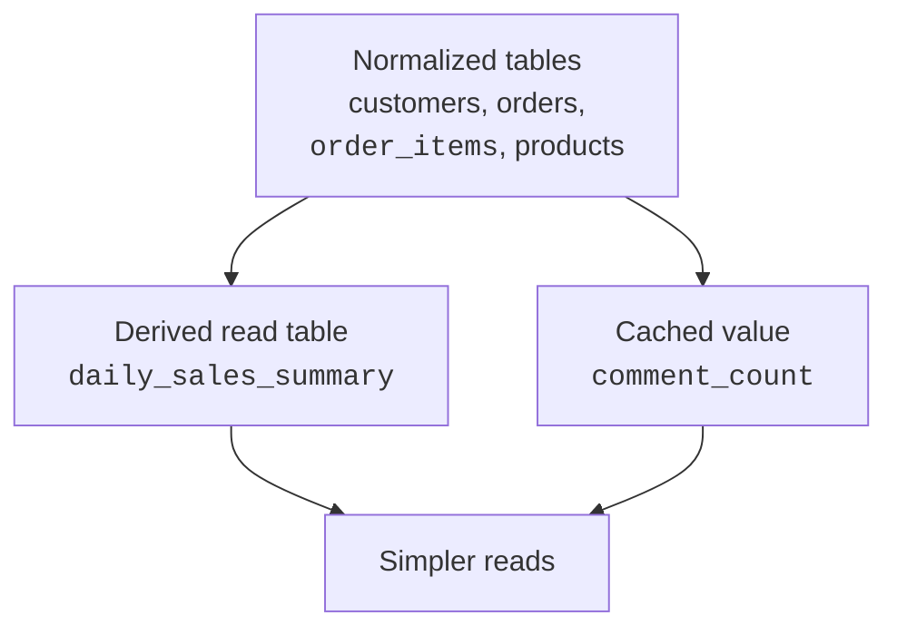
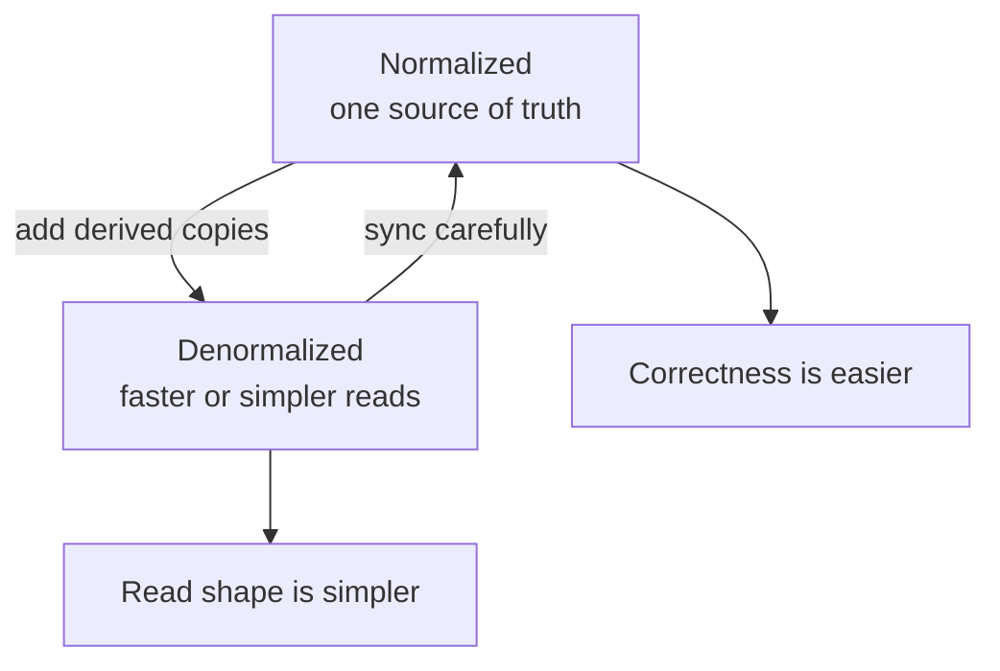
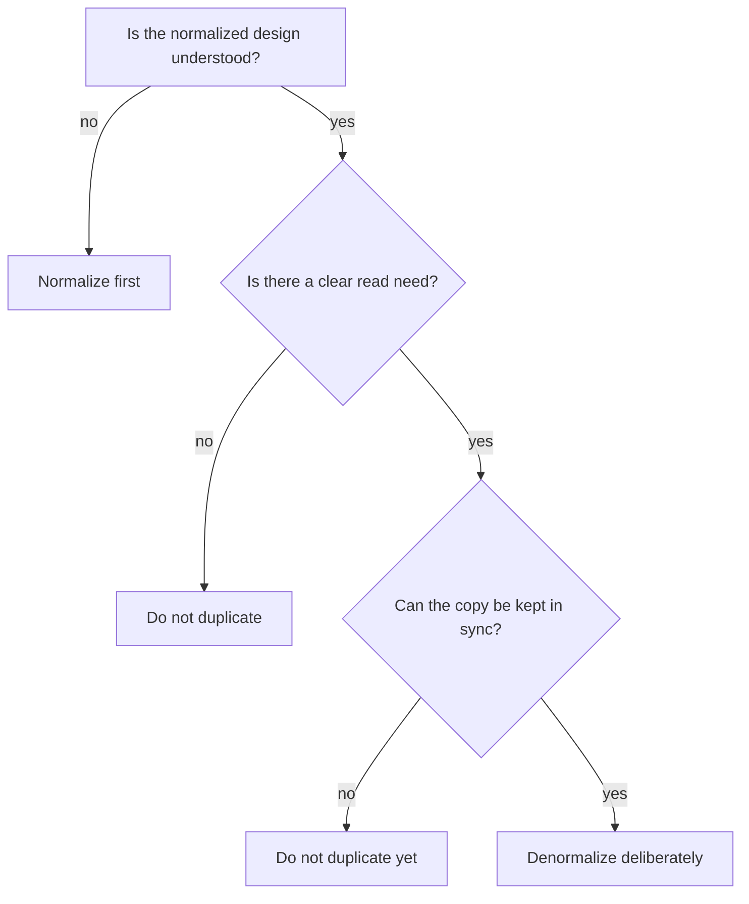

Normalization is the default because correctness is hard to regain once
duplicated facts spread through a database. But real systems sometimes
choose a controlled amount of duplication.

**Denormalization** means deliberately storing data that could be derived
from normalized tables. The word deliberately matters. This is not a
shortcut around design; it is a trade-off you make with your eyes open.

<svg
  viewBox="0 0 640 200"
  role="img"
  aria-label="A green fact from one table is copied into another, but the copy wears a yellow badge ring and a thin sync line back to its source — duplication done deliberately, with eyes open"
  style={{ display: "block", width: "100%", maxWidth: "640px", height: "auto", margin: "2.5rem auto" }}
>
  <g style={{ color: "var(--ds-blue-500)" }} fill="currentColor">
    <rect x="80" y="56" width="180" height="92" rx="16" fillOpacity="0.14" />
    <rect x="156" y="76" width="84" height="10" rx="5" fillOpacity="0.4" />
    <rect x="106" y="116" width="70" height="10" rx="5" fillOpacity="0.25" />
  </g>
  <g style={{ color: "var(--ds-green-500)" }} fill="currentColor">
    <circle cx="126" cy="81" r="10" />
    <rect x="380" y="56" width="180" height="92" rx="16" fillOpacity="0.1" />
    <circle cx="495" cy="112" r="10" />
  </g>
  <g style={{ color: "var(--ds-blue-500)" }} fill="currentColor">
    <circle cx="416" cy="81" r="8" />
    <rect x="436" y="75" width="86" height="10" rx="5" fillOpacity="0.4" />
  </g>
  <g style={{ color: "var(--ds-yellow-500)" }} fill="currentColor">
    <path fillRule="evenodd" d="M477 112 a18 18 0 1 0 36 0 a18 18 0 1 0 -36 0 M481 112 a14 14 0 1 0 28 0 a14 14 0 1 0 -28 0" fillOpacity="0.8" />
  </g>
  <g style={{ color: "var(--ds-green-500)" }} fill="currentColor">
    <path
      d="M482 132 C 400 186, 230 186, 150 100"
      fill="none"
      stroke="currentColor"
      strokeWidth="2"
      strokeLinecap="round"
      strokeOpacity="0.5"
    />
    <polygon points="142,90 147,104 158,95" fillOpacity="0.5" />
  </g>
</svg>

## Normalize first

Start with the clean design. Give each fact one home. Use keys and
relationships to connect the facts. The normal forms build on each other:

**UNF (mixed and repeated facts) → 1NF (atomic values) → 2NF (whole key) → 3NF (nothing but the key)**

Only once you reach a clean, normalized design do you ask whether you
need a deliberate read model. If not, keep the normalized design. If you
do, add controlled denormalized data on top of it.

A normalized design is easier to trust because updates happen in one
place. If Ada changes her city, the `customers` row changes once. Every
order can still show Ada's city by joining to `customers`.

Denormalization should come after you understand the clean version and
can name the cost of breaking it.

## Why denormalize at all?

Sometimes a system needs a read shape that is simpler than the clean
write shape. Examples include:

- a reporting table that stores one row per day of sales
- a cached count such as `post_comment_count`
- a precomputed total such as `invoice_total`
- a read-heavy screen that repeatedly needs the same joined summary

These are not random copies. They are **derived facts** stored because a
particular read path benefits from having them ready.

## The trade-off

Denormalization trades some correctness simplicity for read simplicity.
The normalized side has one source of truth. The denormalized side may
be easier to read, but now duplicated or derived data must be kept in
sync.

The danger is familiar. If `posts.comment_count` says 12 but the
`comments` table contains 13 rows for that post, the database disagrees
with itself. Denormalization reintroduces duplication on purpose, so the
sync plan is part of the design.

## Quick check

<MultipleChoice
  markdown={`What makes denormalization different from an accidental messy table?

- It never duplicates data.
  > Denormalization often stores duplicated or derived data by design.
- [o] It is a deliberate trade-off with a known reason and a sync plan.
  > The designer can explain why the copy exists and how it stays trustworthy.
- It removes the need for normalized source tables.
  > Denormalized data usually depends on normalized source-of-truth tables.
- It is required before using foreign keys.
  > Foreign keys belong naturally in normalized designs.

Denormalization should be intentional, measured, and maintained.`}
/>

<MultipleChoice
  markdown={`Which example is the best candidate for deliberate denormalization?

- Storing phone1, phone2, and phone3 because a child table feels unfamiliar.
  > That is a 1NF design problem, not a measured denormalization choice.
- Copying customer_city into every order without knowing why.
  > Unexplained copying recreates anomalies without a clear benefit.
- [o] Storing a daily_sales_summary table for a reporting screen that repeatedly reads the same aggregate.
  > A reporting summary is a common derived read model when maintained from source data.
- Removing all primary keys to make inserts shorter.
  > Primary keys are core design tools, not overhead to discard.

A good denormalized value has a clear read purpose and a maintenance plan.`}
/>

## Keeping duplicated data in sync

Every denormalized design needs an answer to one question: *when the
source fact changes, how does the copy change too?*

At a conceptual level, the answer might be:

- update the cached value in the same application workflow
- rebuild a reporting table on a schedule
- calculate the value from source tables when correctness matters most
- use database constraints where possible to protect the source data

This course stays at the design level, so the important point is not a
specific mechanism. The important point is ownership: someone must know
which data is the source of truth and which data is a maintained copy.

<SqlCodeBlock
  dialect="postgres"
  title="A small derived summary table"
  initSql={`CREATE TABLE orders (
  id         INTEGER PRIMARY KEY,
  order_date DATE NOT NULL
);

CREATE TABLE order_items (
  id       INTEGER PRIMARY KEY,
  order_id INTEGER NOT NULL REFERENCES orders(id),
  amount   NUMERIC NOT NULL CHECK (amount >= 0)
);

INSERT INTO orders VALUES
  (1, DATE '2026-01-10'),
  (2, DATE '2026-01-10'),
  (3, DATE '2026-01-11');

INSERT INTO order_items VALUES
  (101, 1, 20.00),
  (102, 1, 5.00),
  (103, 2, 7.50),
  (104, 3, 12.00);

CREATE TABLE daily_sales_summary (
  sales_date DATE PRIMARY KEY,
  order_count INTEGER NOT NULL,
  total_amount NUMERIC NOT NULL
);`}
  starterCode={`-- A reporting table stores a derived read shape.
INSERT INTO
  daily_sales_summary (sales_date, order_count, total_amount)
SELECT
  o.order_date,
  COUNT(DISTINCT o.id) AS order_count,
  SUM(oi.amount) AS total_amount
FROM
  orders o
  JOIN order_items oi ON oi.order_id = o.id
GROUP BY
  o.order_date;

SELECT
  *
FROM
  daily_sales_summary
ORDER BY
  sales_date;`}
/>

The summary table is not the source of truth. The orders and order items
are. If an order changes later, the summary must be refreshed or updated
according to the system's rules.

## Spot it in the wild: Northwind's "duplicated" prices

The classic **Northwind** sample database — Microsoft's demo store,
ported to PostgreSQL — is a nice place to see this thinking in a
finished schema. Its `products` table stores `unit_price`, the
catalog price today. Its `order_details` table *also* stores a
`unit_price` on every order line. Duplication? Run the query and
look at the rows where the two prices disagree.

<SqlCodeBlock
  dialect="postgres"
  title="Catalog price now vs. price actually charged"
  remoteInitSql="postgres/northwind_postgres.sql"
  tables={["products", "order_details"]}
  starterCode={`SELECT
  p.product_name,
  p.unit_price AS catalog_price_now,
  od.unit_price AS price_charged,
  COUNT(*) AS order_lines
FROM
  order_details od
  JOIN products p ON p.product_id = od.product_id
WHERE
  od.unit_price <> p.unit_price
GROUP BY
  p.product_name,
  p.unit_price,
  od.unit_price
ORDER BY
  p.product_name
LIMIT
  12;`}
/>

Those disagreements are not bugs — they are history. Prices rose, and
the old order lines kept the price the customer actually paid. This
is the most important nuance on the page: what looks like a
duplicated fact is sometimes *two different facts that happen to
share a name*. "What does this product cost?" and "what did this
customer pay on that day?" have different answers, different owners,
and different update rules, so they each deserve a column. A copied
fact needs a sync plan; a historical fact needs the opposite — a
guarantee that nobody will ever "fix" it to match the catalog. Part
of designing well is telling those two situations apart.

You will see the same move again in the e-commerce case study later
in this course, where we put `unit_price` on `order_items` for
exactly this reason.

## A decision checklist

Before denormalizing, ask:

This is the core rule: **normalize first, denormalize on purpose, and
keep the duplicated data in sync**.

## What denormalization is not

Denormalization is not an excuse to ignore 1NF, 2NF, or 3NF while you
are still learning the shape of the data. It is not a replacement for
clear entities and relationships. It is not a promise that every query
will be better.

It is a design choice for specific read needs, weighed against the cost
of maintaining duplicated facts.

## Check your understanding

<MultipleChoice
  markdown={`What should usually happen before denormalization?

- Skip keys so the table is easier to copy.
  > Keys are still needed to understand and maintain relationships.
- [o] Build and understand the normalized source-of-truth design.
  > You can only make a controlled exception after knowing the clean design.
- Store every report column in every table.
  > Copying everything everywhere creates uncontrolled anomalies.
- Remove all joins from the schema.
  > Joins remain the normal way to read related normalized facts.

Normalize first; then decide whether a controlled read copy is worth it.`}
/>

<MultipleChoice
  markdown={`What is the main cost of denormalization?

- It makes all reads impossible.
  > Denormalization is usually chosen to simplify or speed specific reads.
- It prevents using PostgreSQL.
  > PostgreSQL can store normalized and denormalized structures.
- [o] Duplicated or derived data must be kept in sync with the source of truth.
  > The copy can become stale or inconsistent unless the design maintains it.
- It requires every table to have a composite key.
  > Composite keys are unrelated to the basic denormalization trade-off.

The maintenance cost is the price paid for the simpler read shape.`}
/>

<MultipleChoice
  markdown={`Which statement best summarizes the rule for denormalization?

- Denormalize first, then discover the entities later.
  > Starting with copies makes it harder to know which facts are authoritative.
- Never denormalize under any circumstances.
  > Controlled denormalization can be useful for reporting or cached read models.
- [o] Normalize first, denormalize on purpose, and keep the duplicated data in sync.
  > This keeps correctness as the default while allowing measured exceptions.
- Denormalize whenever a table has more than three columns.
  > Column count is not the decision rule.

Denormalization is a deliberate exception, not the default design style.`}
/>

<MultipleChoice
  markdown={`A cached comment_count column disagrees with the actual number of comment rows. What has gone wrong?

- The database has too many foreign keys.
  > Foreign keys do not cause a cached count to become stale.
- [o] The denormalized copy was not kept in sync with the source data.
  > The count is a maintained copy of facts stored in the comments table.
- The table is in 1NF.
  > Atomic values do not guarantee derived copies stay synchronized.
- The query used a SELECT statement.
  > Reading the data did not create the inconsistency.

A denormalized value is only trustworthy when its maintenance path is trustworthy.`}
/>
