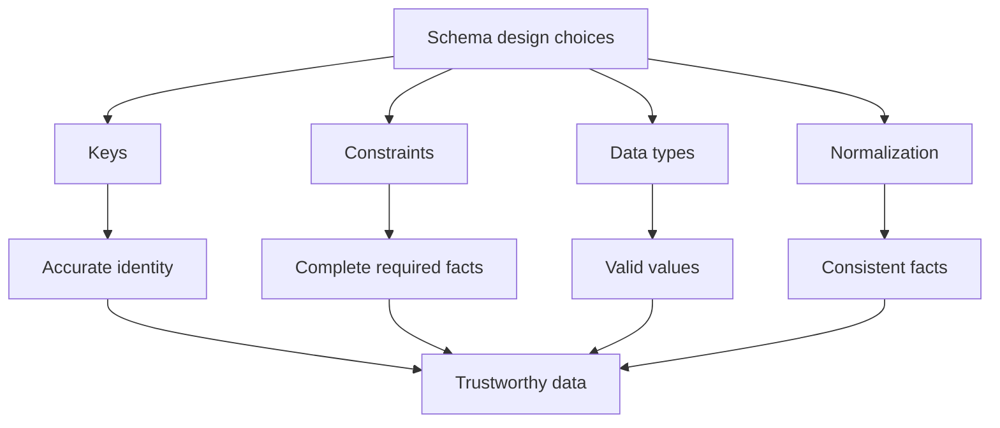
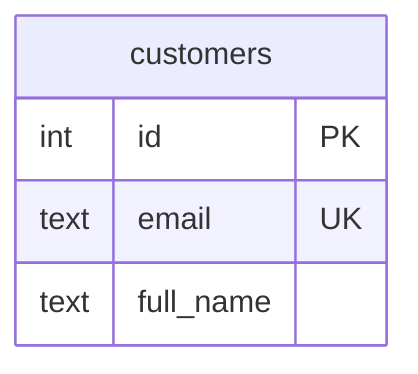
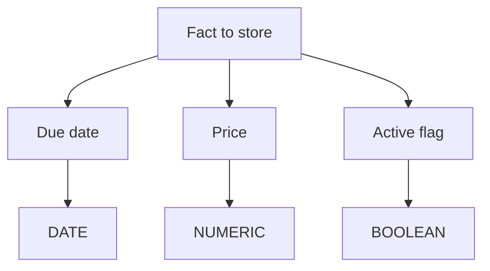
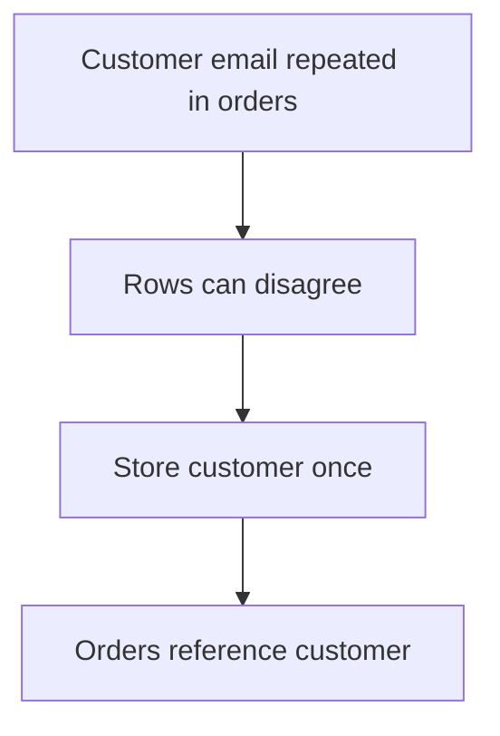
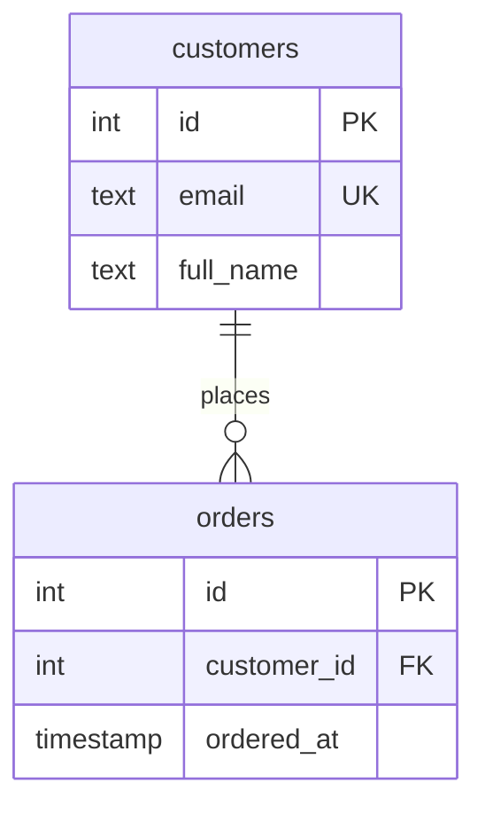
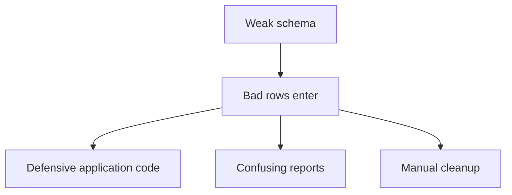

Bad data rarely looks dramatic at first. It starts as one missing
email, one misspelled status, one order pointing to no customer.

<Figure
  slug="db-design-and-data-quality-cutout"
  alt="How design drives data quality, an isometric illustration"
/>

Database design decides whether those mistakes can enter at all.

Garbage cannot get in if the schema forbids it.

## Data quality is designed in

**Data quality** means the data is accurate, complete, consistent, and
trustworthy enough for the software that depends on it.

Schema design affects each part.

The schema is not a passive container. It is an active quality gate.

## Keys protect identity

A primary key says each row has one stable identity. A unique
constraint says a real-world fact cannot repeat.

Without a unique email rule, the same person might appear twice and
reports may count them twice.

<SqlCodeBlock
  dialect="postgres"
  title="Unique constraints protect identity rules"
  initSql={`DROP TABLE IF EXISTS customers;

CREATE TABLE customers (
    id INT GENERATED ALWAYS AS IDENTITY PRIMARY KEY,
    email TEXT NOT NULL UNIQUE,
    full_name TEXT NOT NULL
);

INSERT INTO customers (email, full_name) VALUES
    ('ana@example.com', 'Ana Rivera');
`}
  starterCode={`INSERT INTO
  customers (email, full_name)
VALUES
  ('ana@example.com', 'Ana R.');`}
/>

The database rejects the duplicate email because the design says email
must be unique.

## Constraints protect completeness and validity

`NOT NULL` protects required facts. `CHECK` protects allowed values.
Foreign keys protect relationships.

A task status should not be any random text. If the design knows the
allowed states, the schema can enforce them.

<MultipleChoice
  markdown={`Which design choice best prevents random task statuses such as \`maybe\` or \`almost done\`?

- Removing the primary key.
  > Primary keys protect identity, not allowed status values.
- [o] A \`CHECK\` constraint listing allowed statuses.
  > The database can reject values outside the allowed set.
- A longer column name.
  > Naming can improve clarity, but it does not restrict values.
- Storing every task in one text column.
  > Combining facts in one text column makes validation harder.

Constraints turn quality rules into enforceable rules.`}
/>

## Types shape valid data

A column's type is also a design decision. Dates should use date or
timestamp types, prices should use numeric types, and booleans should
represent true-or-false facts.

If a due date is stored as arbitrary text, the database cannot know
whether `soon` is a valid date.

Encoding meaning into data is not a pedantic habit, entire missions
have failed for lack of it. In 1999, NASA lost the Mars Climate
Orbiter, a $125 million spacecraft, because one piece of ground
software produced thruster data in pound-force units while the
navigation software consumed it as metric newton-second values.
Nothing in the data's format flagged the mismatch; the numbers were
just numbers, and they were silently wrong by a factor of about 4.45.
The spacecraft skimmed too deep into the Martian atmosphere and was
destroyed. A database column is a chance to do better: a type, a
clear name like `total_cents` or `mass_kg`, and a constraint together
say not just *here is a number* but *here is what this number means*,
so that the wrong kind of value cannot quietly pass for the right
one.

## Normalization protects consistency

Normalization keeps each fact in the right place. That prevents one
fact from disagreeing with itself.

A normalized order stores `customer_id`, not a copied customer name and
email on every row. If the customer changes their name, one row changes
instead of many.

## Quality problems become software problems

If the schema allows bad data, every query and every screen has to
compensate.

A strong schema does not eliminate every bug, but it removes entire
classes of mistakes from the system.

## Check your understanding

<MultipleChoice
  markdown={`What does a foreign key do for data quality?

- It stores every related row in one column.
  > A foreign key stores a reference, not a nested table.
- [o] It prevents relationships from pointing to missing rows.
  > A foreign key requires the referenced row to exist.
- It makes a text value uppercase.
  > Text formatting is not the job of a foreign key.
- It allows duplicate primary keys.
  > Primary keys remain unique.

Foreign keys protect relational consistency.`}
/>

<MultipleChoice
  markdown={`Why does normalization improve consistency?

- [o] It gives each fact one proper home, reducing disagreement between copies.
  > When a fact is stored once, updates are less likely to leave conflicting values.
- It removes every constraint.
  > Normalized designs still need constraints.
- It stores the same fact in many places.
  > Repetition is what normalization tries to reduce.
- It avoids all relationships.
  > Normalization often uses relationships and foreign keys.

Consistency improves when one fact has one source of truth.`}
/>

<MultipleChoice
  markdown={`Which design most directly protects completeness for a required email?

- A separate unrelated \`orders\` table.
  > Orders do not make customer email required.
- A comment in the application code.
  > Comments do not enforce database rules.
- [o] \`email TEXT NOT NULL\`
  > The \`NOT NULL\` rule prevents the required fact from being missing.
- \`email TEXT\` with no constraint.
  > This allows missing email values.

Required facts should be required in the schema.`}
/>
