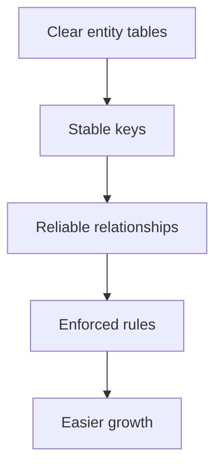
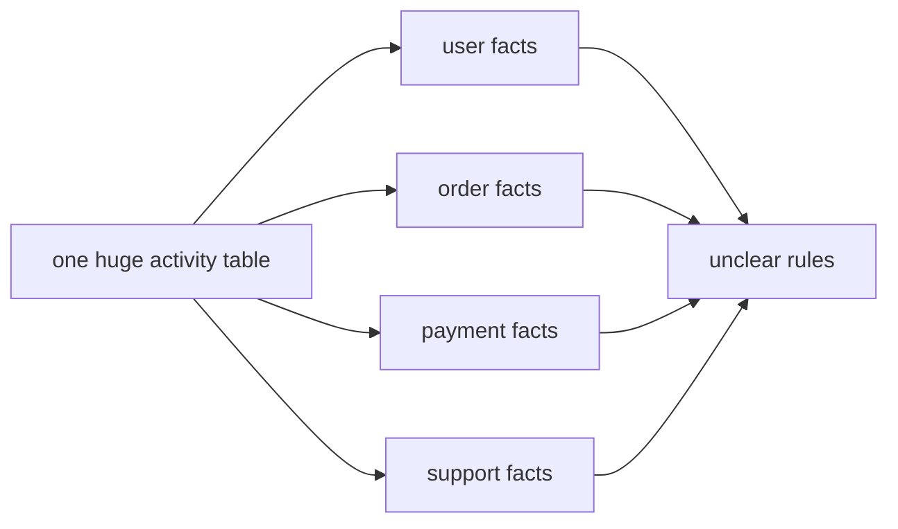
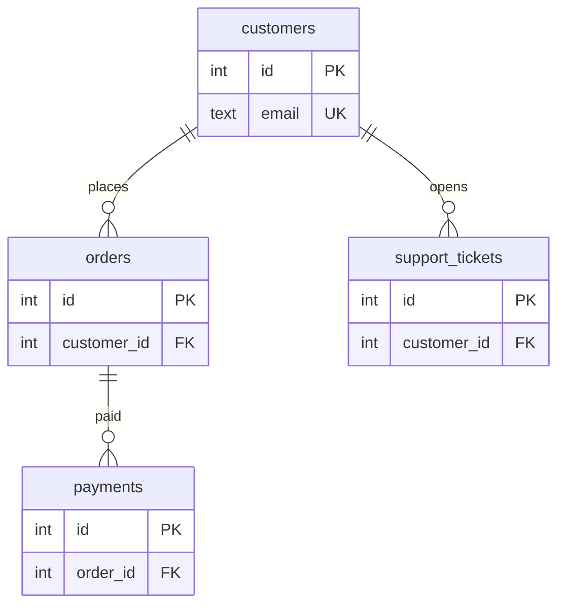
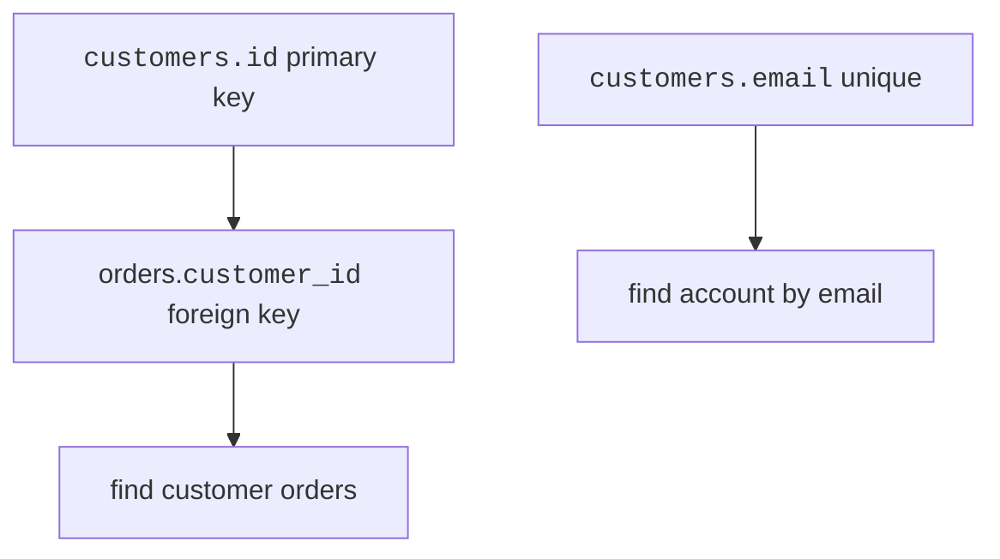
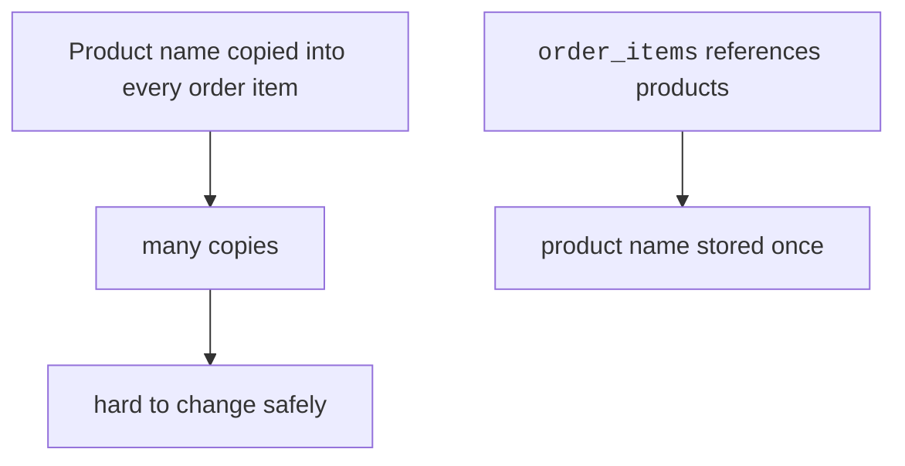
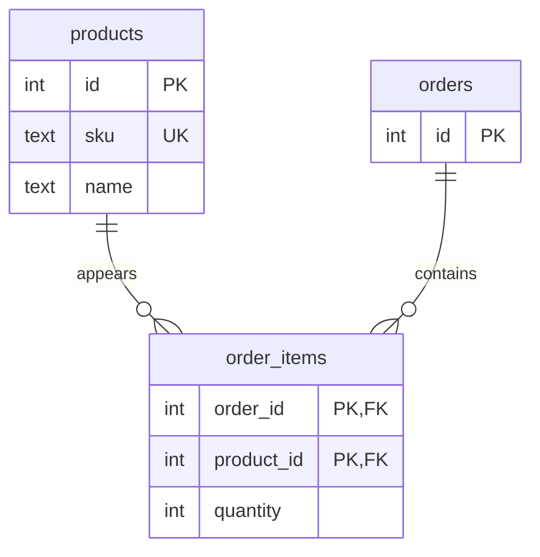
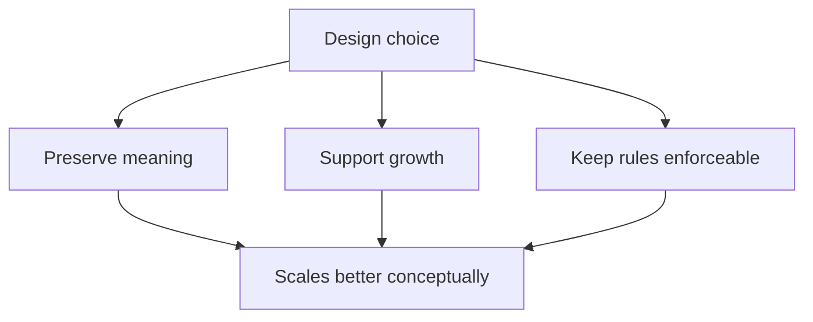

Scalability is not only about servers. Long before a database needs
advanced operations work, the schema either helps the product grow or
gets in the way.

<Figure
  slug="db-design-and-scale-cutout"
  alt="How design affects scalability, an isometric illustration"
/>

This page keeps the focus on design: structure, relationships, keys,
and duplication.

## Designs scale when meaning is clear

A schema that scales well has clear tables, stable keys, and
relationships that match the real world.

<Figure
  slug="db-design-and-scale-inline-cutout"
  alt="The same cabinet drawn small on one bench and very large on the next, its fittings identical in both"
/>

When the schema expresses meaning clearly, new features can reuse the
model instead of working around it.

## Avoid wide god-tables

A **god-table** tries to store too many kinds of things in one place.
It often has many nullable columns, repeated groups, and confusing
rules.

A cleaner design separates entities and connects them.

Each table can grow according to its own rules.

<MultipleChoice
  markdown={`Why does a wide god-table usually scale poorly as a design?

- It has rows.
  > All relational tables have rows.
- [o] It mixes several entity types, creating unclear columns and rules.
  > Different kinds of facts need different constraints and relationships.
- It has a primary key.
  > A primary key is useful; the problem is mixing unrelated meanings.
- It uses too many foreign keys to separate entities.
  > Separating entities with foreign keys is usually the cleaner design.

A table should represent one kind of thing with coherent rules.`}
/>

## Keys and relationships guide future lookups

The classic way a good schema still performs badly is a loop that queries
per row. Each pass is a network round trip, so the cost is the *count*
times the latency and has almost nothing to do with query speed:

<Chart slug="n-plus-one-queries" />

Primary keys, foreign keys, and unique constraints are design tools.
They also imply the paths software will use to find related data.

This is not a performance-tuning lesson. The design point is simpler:
clean keys make the common paths obvious and enforceable.

The reason an index is worth its write cost is a curve, not a constant:
the scan grows with the table and the index lookup barely does.

<Chart slug="index-vs-scan-rows" />

## Normalize enough to avoid unbounded duplication

Some duplication is deliberate, like copying an order line's historical
unit price. Unbounded duplication is different. It repeats the same
fact across many rows for no good reason.

A normalized structure lets related data grow without copying every
fact into every row.

## Design trade-offs still matter

Good design is not "normalize everything forever." It is choosing the
structure that preserves meaning while supporting expected growth.

For example:

- Store product names once on `products`.
- Store `unit_price` on `order_items` to preserve history.
- Use a junction table when many rows relate to many rows.
- Avoid columns that contain comma-separated lists.

## What this page is not about

Later, you may learn about indexes, query plans, caching, sharding,
replication, and administration. Those are important topics, but they
come after the schema has a clear model.

A poor model is hard to rescue with operational tricks. A clear model
is easier to improve later.

## Check your understanding

<MultipleChoice
  markdown={`Which design is usually easier to grow?

- One table that stores customers, orders, payments, and tickets together.
  > Mixing unrelated entities creates unclear rules and many irrelevant columns.
- [o] Separate tables for separate entities, connected by keys.
  > Each table can enforce rules for one kind of thing while relationships connect them.
- A table with comma-separated product IDs.
  > Comma-separated lists hide relationships inside text.
- A schema with no primary keys.
  > Stable identity is important for relationships and growth.

Clear structure gives future features a reliable foundation.`}
/>

<MultipleChoice
  markdown={`Why are comma-separated lists in a column a poor fit for scalable relational design?

- They create too many tables by themselves.
  > The list is inside one column, which hides structure rather than creating tables.
- They are too normalized.
  > A comma-separated list is not normalized relational structure.
- They automatically preserve history.
  > A list of IDs does not explain historical meaning.
- [o] The database cannot easily enforce relationships for each listed value.
  > Individual relationships should be rows that can use keys and constraints.

Relationships should be represented as relationships, not packed text.`}
/>

<MultipleChoice
  markdown={`What is the design-level benefit of clean primary and foreign keys?

- [o] They make identity and relationship paths explicit.
  > Software can follow reliable references between tables.
- They remove the need to understand requirements.
  > Keys should come from a clear understanding of the model.
- They require all tables to have the same columns.
  > Different entities need different attributes.
- They force every query to be fast in every situation.
  > Performance depends on more than the existence of keys.

Keys are the backbone of a schema that can grow coherently.`}
/>
