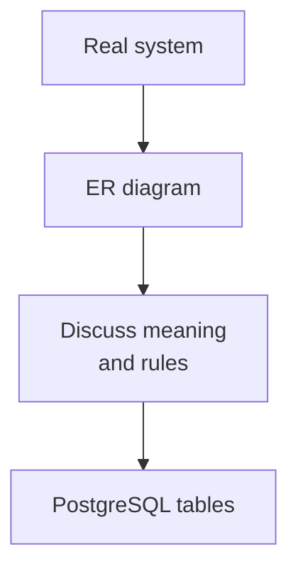
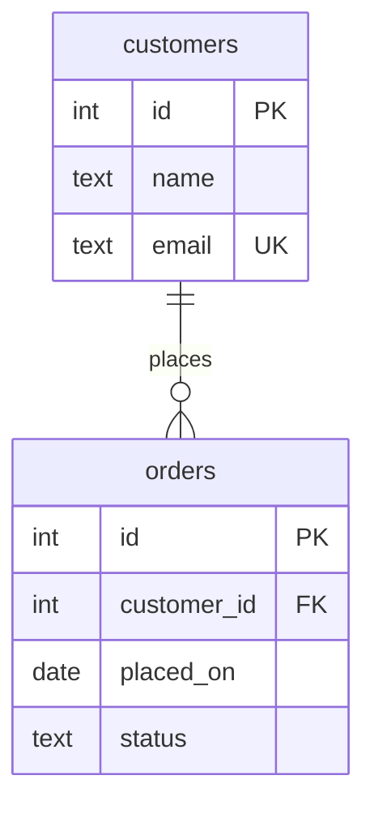
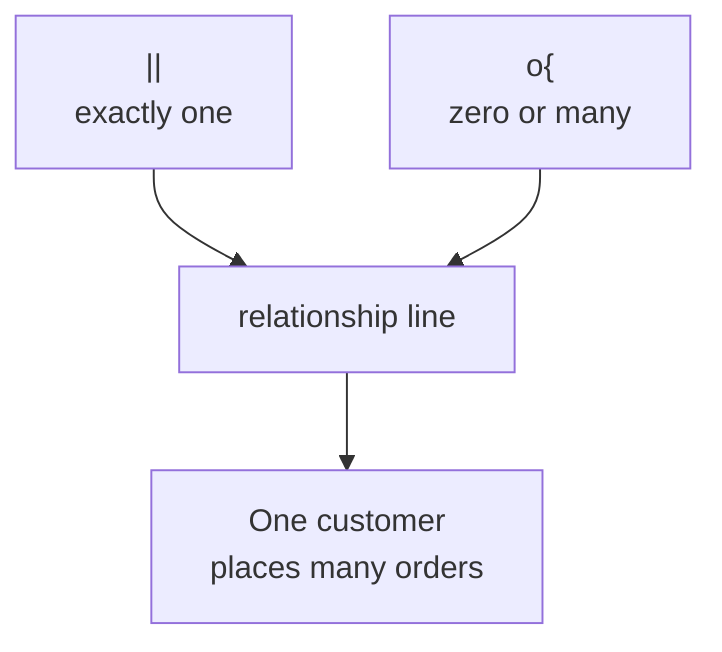
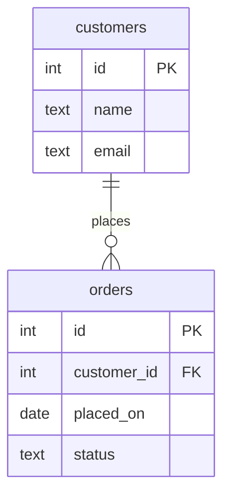
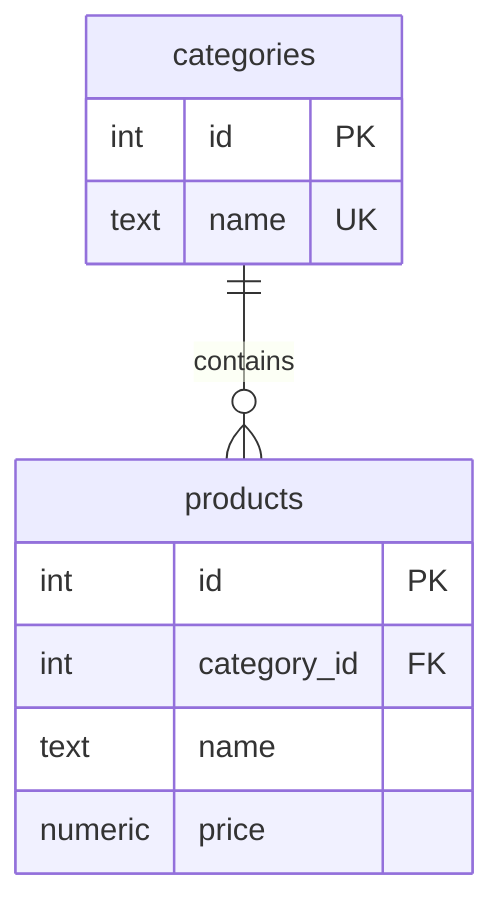
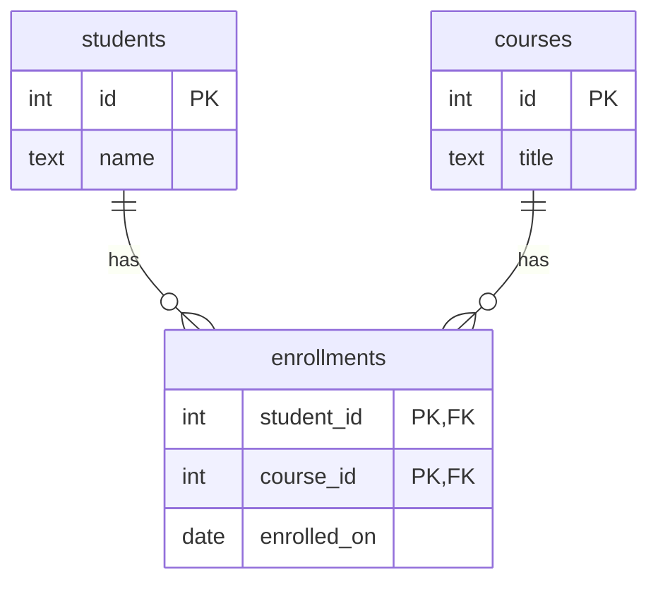
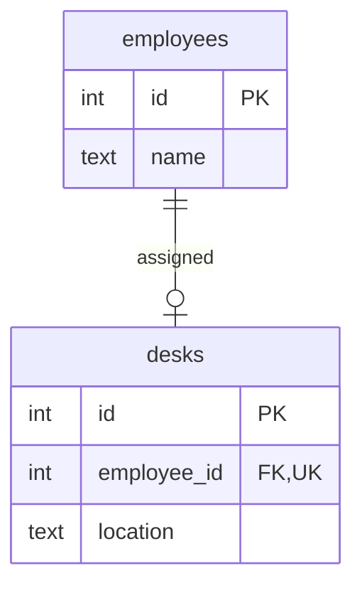
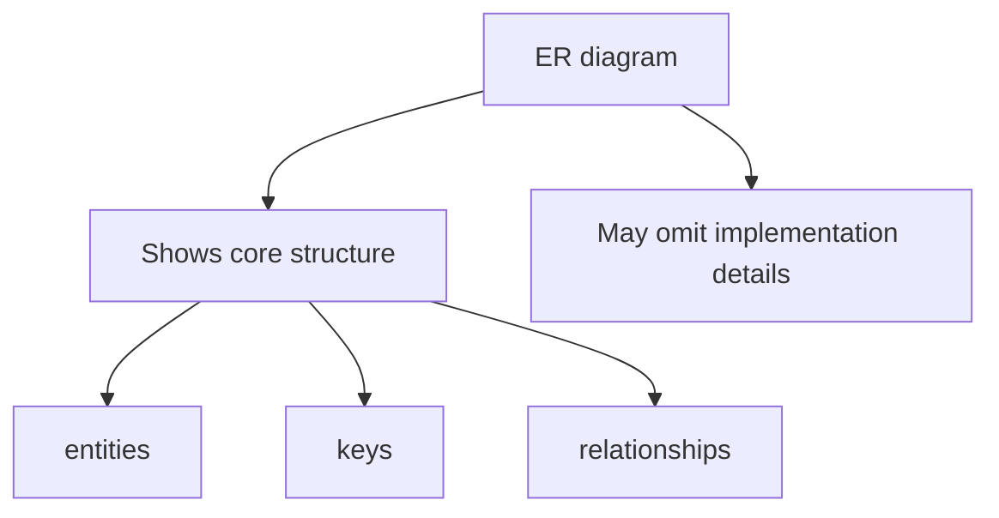

Before you build a schema, it helps to draw it. An
**entity-relationship diagram** — usually called an **ER diagram** — is
a picture of the main things in your system and how they connect.

The idea has a precise birthday: computer scientist Peter Chen
introduced the entity-relationship model in a 1976 paper, "The
Entity-Relationship Model — Toward a Unified View of Data," arguing
that designers should describe a system's *meaning* — its entities
and relationships — before committing to any particular database
structure. Half a century later, his diagrams (in various visual
dialects) are still the standard way design conversations happen on
whiteboards.

The goal is not art. The goal is shared understanding before the SQL
hardens your choices into a database.

<svg
  viewBox="0 0 640 220"
  role="img"
  aria-label="On a faint whiteboard, two entity boxes are already linked while a third is still being sketched as a dotted outline with a pen nib — drawing the schema before building it"
  style={{ display: "block", width: "100%", maxWidth: "640px", height: "auto", margin: "2.5rem auto" }}
>
  <g fill="currentColor" opacity="0.06">
    <rect x="56" y="26" width="528" height="168" rx="18" />
  </g>
  <g style={{ color: "var(--ds-blue-500)" }} fill="currentColor">
    <rect x="104" y="58" width="124" height="66" rx="12" fillOpacity="0.35" />
    <circle cx="134" cy="84" r="7" />
    <rect x="150" y="98" width="58" height="9" rx="4.5" fillOpacity="0.5" />
  </g>
  <g style={{ color: "var(--ds-green-500)" }} fill="currentColor">
    <rect x="300" y="118" width="124" height="66" rx="12" fillOpacity="0.35" />
    <circle cx="330" cy="144" r="7" />
    <rect x="346" y="158" width="58" height="9" rx="4.5" fillOpacity="0.5" />
  </g>
  <g fill="currentColor" opacity="0.3">
    <circle cx="244" cy="100" r="3" />
    <circle cx="266" cy="112" r="3" />
    <circle cx="288" cy="124" r="3" />
  </g>
  <g style={{ color: "var(--ds-yellow-500)" }} fill="currentColor">
    <circle cx="452" cy="48" r="3.5" />
    <circle cx="480" cy="48" r="3.5" />
    <circle cx="508" cy="48" r="3.5" />
    <circle cx="536" cy="48" r="3.5" />
    <circle cx="452" cy="70" r="3.5" />
    <circle cx="452" cy="92" r="3.5" />
    <circle cx="452" cy="114" r="3.5" />
    <circle cx="478" cy="114" r="3.5" />
    <polygon points="548,40 562,48 548,56 552,48" />
  </g>
</svg>

## Why draw before building?

A schema is easier to change on a whiteboard than after data depends on
it. ER diagrams let you discuss questions like:

- What are the entities?
- Which attributes belong to each entity?
- Which column identifies a row?
- How do the entities relate?
- Is the relationship one-to-many, many-to-many, or something else?

Drawing first slows you down just enough to prevent expensive design
mistakes.

## The pieces of an ER diagram

Most ER diagrams show three ideas:

1. **Entities** — the boxes, usually future tables.
2. **Attributes** — the facts inside each box, usually future columns.
3. **Relationships** — the lines between boxes.

Read this as: one customer can place zero or many orders, and each
order belongs to exactly one customer. The `PK` marker means primary
key. The `FK` marker means foreign key. The `UK` marker means unique
key or unique constraint.

## Reading the relationship line

The diagrams in this course use **crow's-foot notation**, the most
common dialect in industry tools. It gets its name from the
three-pronged "many" symbol, which looks like a bird's footprint.
Crow's-foot puts symbols at both ends of the relationship line, and
the symbols tell you how many rows may connect on each side.

You do not have to memorize every symbol at once. Start by reading the
plain-English relationship label, then inspect the ends of the line.

## Example: customers and orders

This is the classic one-to-many model. Customers are independent
entities. Orders are also entities, but each order points back to the
customer who placed it.

The diagram already hints at the SQL: `orders.customer_id` will
reference `customers.id`.

<SqlCodeBlock
  dialect="postgres"
  title="Turning a simple ER diagram into tables"
  initSql={`CREATE TABLE customers (
  id    INTEGER PRIMARY KEY,
  name  TEXT NOT NULL,
  email TEXT NOT NULL UNIQUE
);
CREATE TABLE orders (
  id          INTEGER PRIMARY KEY,
  customer_id INTEGER NOT NULL REFERENCES customers(id),
  placed_on   DATE NOT NULL,
  status      TEXT NOT NULL
);
INSERT INTO customers VALUES (1, 'Ada', 'ada@example.com');
INSERT INTO orders VALUES (101, 1, DATE '2025-02-01', 'placed');`}
  starterCode={`SELECT
  c.name,
  o.id AS order_id,
  o.status
FROM
  customers c
  JOIN orders o ON o.customer_id = c.id;`}
/>

The diagram is not separate from the schema. It is a compact way to
reason about the same structure.

## Quick check

<MultipleChoice
  markdown={`In an ER diagram, what does FK usually mark?

- A column that formats text for display.
  > Display formatting is not what ER diagram key markers describe.
- [o] A foreign key column that points to a row in another table.
  > A foreign key is how a relationship is usually realized in the relational schema.
- A column that must be first alphabetically.
  > Alphabetical order has no relationship to the FK marker.
- A table that cannot have relationships.
  > Foreign keys exist specifically to connect tables.

Key markers connect the diagram to the constraints the database will enforce.`}
/>

## Example: products and categories

Here is another one-to-many relationship. A category can contain many
products. In this simplified model, each product belongs to one
category.

The diagram does not show every business rule. For example, it does
not say whether prices can be negative. ER diagrams show the core
shape; constraints fill in more detail.

## Example: students and courses

A student can take many courses, and a course can have many students.
The ER diagram shows this by placing a junction entity in the middle.

`enrollments` is an entity because each enrollment is a real fact: one
student in one course, possibly with its own date or grade.

## Example: employees and desks

Sometimes a relationship is one-to-one or optional. Here, an employee
may have zero or one desk, and a desk is assigned to exactly one
employee when it is assigned.

The `UK` marker on `desks.employee_id` hints that the same employee
cannot appear on many desk rows. That uniqueness is what keeps the
relationship one-to-one rather than one-to-many.

## Diagrams are models, not screenshots

An ER diagram is a simplified model of what matters for the design.
It may leave out indexes, UI labels, seed data, or rarely used columns.
That is okay. The diagram's job is to make the structure discussable.

## Check your understanding

<MultipleChoice
  markdown={`Why do database designers often draw an ER diagram before writing CREATE TABLE statements?

- Because PostgreSQL requires a diagram file before tables can be created.
  > PostgreSQL does not require diagrams; the benefit is design clarity.
- [o] Because the diagram makes entities, attributes, keys, and relationships easier to discuss before implementation.
  > Drawing first helps the team find modeling mistakes while changes are still cheap.
- Because diagrams automatically generate perfect application code.
  > Some tools generate SQL, but the main learning value is reasoning about the model.
- Because tables cannot be changed after creation.
  > Tables can be changed, but changes are riskier once real data depends on them.

ER diagrams are thinking tools for schema design.`}
/>

<MultipleChoice
  markdown={`In the customers/orders diagram, why does orders contain customer_id FK?

- To copy the customer's name into every order.
  > The foreign key stores the customer's identity, not a duplicate of all customer attributes.
- [o] To connect each order row to the customer row that placed it.
  > The foreign key realizes the relationship shown by the line in the ER diagram.
- To make every customer have exactly one order.
  > A foreign key on orders allows many orders to point to the same customer.
- To sort orders by customer name automatically.
  > Sorting requires ORDER BY; foreign keys express relationships.

A foreign key column is the schema's link from one entity to another.`}
/>

<MultipleChoice
  markdown={`What does the PK marker inside an ER diagram entity usually mean?

- The column is optional.
  > Optionality is a participation/cardinality idea, not the meaning of PK.
- The column stores a password key.
  > In this context, PK means primary key, not password key.
- [o] The column is part of the primary key that identifies rows of that entity.
  > Primary key columns give each row a reliable identity.
- The column is hidden from all queries.
  > Primary key columns are ordinary columns with identity constraints.

Primary keys are how rows get dependable identities in a table.`}
/>
