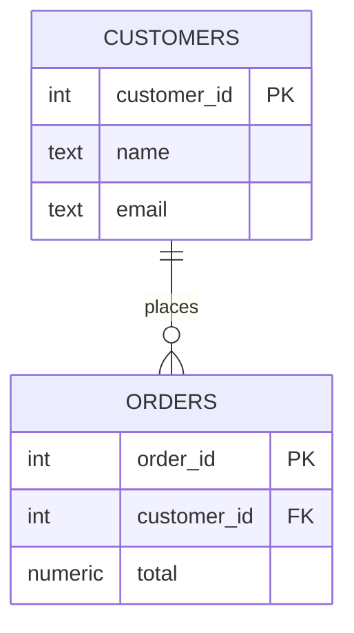
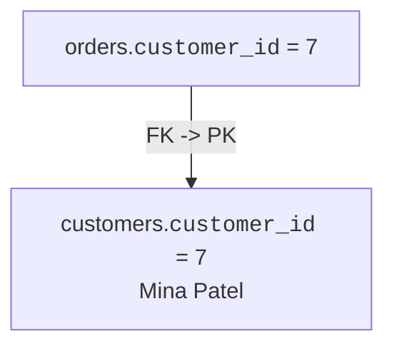
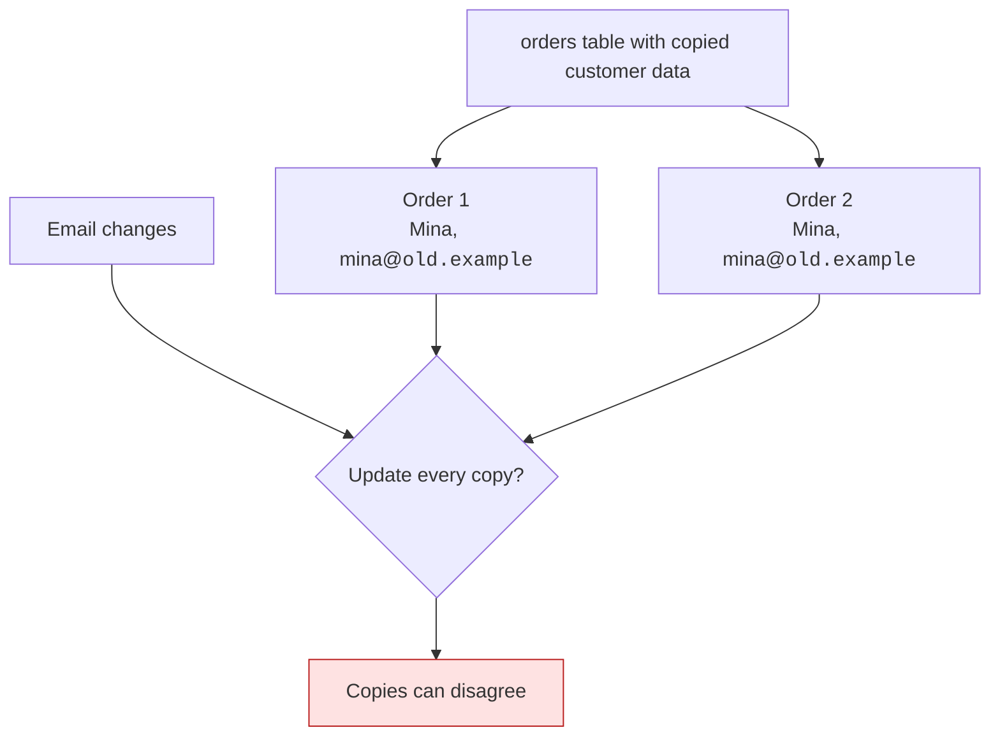
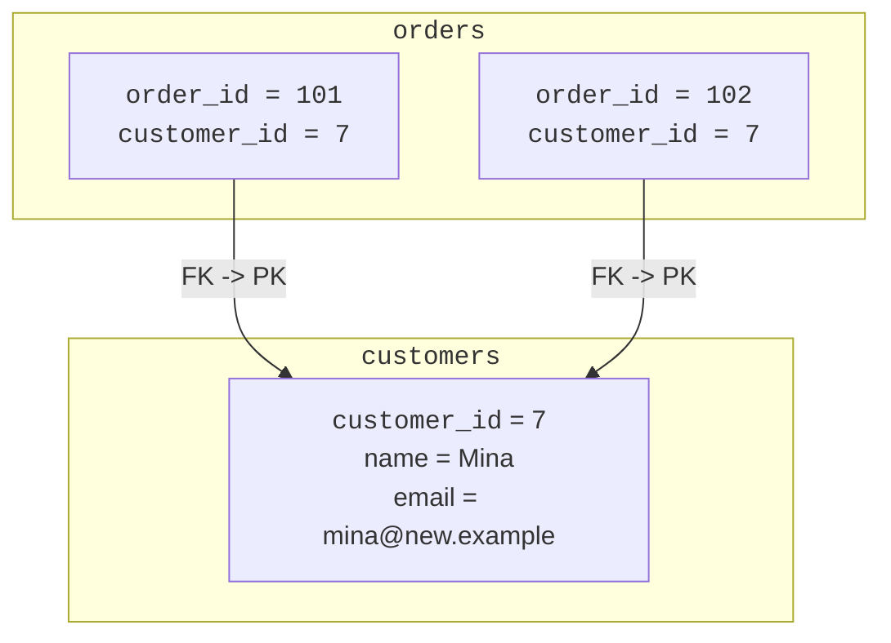
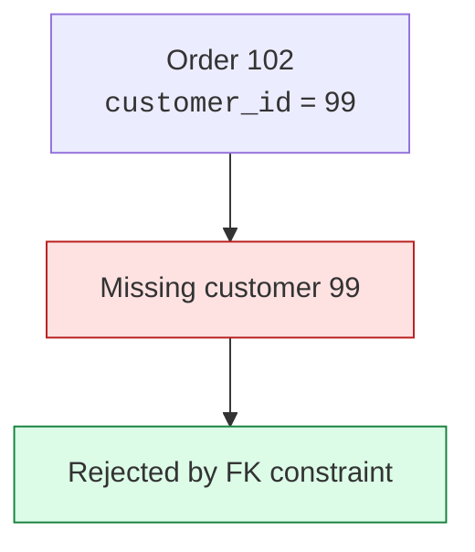
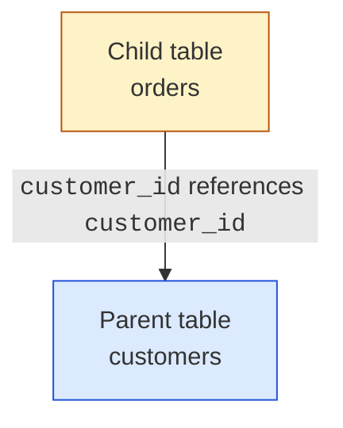
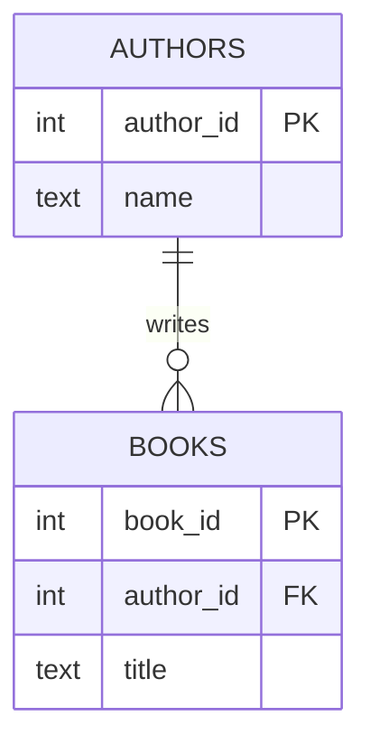

An order belongs to a customer. A comment belongs to a post. A payment
belongs to an invoice. In a database design, those sentences must become
columns and constraints.

<Figure
  slug="db-foreign-keys-cutout"
  alt="Foreign keys, an isometric illustration"
/>

A **foreign key** is the design tool that turns "belongs to" into a
trustworthy relationship.

## A relationship needs a reference

A foreign key is a column in one table that stores the primary key value
of a related row in another table.

The `orders.customer_id` column points at `customers.customer_id`. One
customer can have many orders, and each order belongs to one customer.

That arrow is more than a drawing. When you declare the constraint,
PostgreSQL checks that the referenced customer actually exists.

## Why store an id instead of duplicating data?

A tempting design is to copy the customer's name and email onto every
order. That feels simple until the data changes.

A foreign key keeps the customer's facts in one place and stores only
the stable identity on related rows.

This is a design for consistency. The order does not need its own copy
of the customer's email; it needs a reliable reference to the customer.

## Quick check

<MultipleChoice
  markdown={`In a well-designed \`orders\` table, why store \`customer_id\` instead of \`customer_email\` and \`customer_name\` on every order?

- Because names and emails cannot be queried with SQL.
  > SQL can query those values; duplication and identity are the design issues.
- Because every order must have a different customer.
  > Many orders can share the same \`customer_id\`; that is the point of a one-to-many relationship.
- [o] Because the customer row stays the single source of truth while orders keep a stable reference.
  > A foreign key avoids repeated customer details and keeps orders connected when attributes change.
- Because PostgreSQL refuses to store text in an orders table.
  > PostgreSQL can store text; the question is whether duplicated text is a good design.

Foreign keys reduce duplication by storing identity instead of repeated descriptions.`}
/>

## Foreign keys enforce the relationship

A foreign key is not just documentation. It is a rule the database
defends. If an order points to customer `999` and no such customer row
exists, PostgreSQL rejects the order.

<SqlCodeBlock
  dialect="postgres"
  title="A foreign key blocks an order for a missing customer"
  initSql={`CREATE TABLE customers (
  customer_id INTEGER PRIMARY KEY,
  name        TEXT NOT NULL
);

CREATE TABLE orders (
  order_id    INTEGER PRIMARY KEY,
  customer_id INTEGER NOT NULL REFERENCES customers(customer_id),
  total       NUMERIC NOT NULL
);

INSERT INTO customers (customer_id, name)
VALUES (1, 'Ada'), (2, 'Grace');`}
  starterCode={`-- Customer 1 exists, so this order is valid.
INSERT INTO
  orders (order_id, customer_id, total)
VALUES
  (101, 1, 25.00);

-- Customer 99 does not exist, so the foreign key rejects this row.
INSERT INTO
  orders (order_id, customer_id, total)
VALUES
  (102, 99, 18.00);

SELECT
  *
FROM
  orders;`}
/>

The rejected insert prevents an **orphan row**: a child row whose parent
row does not exist.

## Parent and child tables

When discussing foreign keys, people often say **parent table** and
**child table**.

- The parent table is the table being referenced.
- The child table is the table holding the foreign key.

The child points to the parent because the child row depends on the
parent's identity. An order cannot meaningfully belong to a customer who
does not exist.

## Quick check

<MultipleChoice
  markdown={`What does a foreign key constraint add beyond simply naming a column \`customer_id\`?

- It causes all customers to have exactly one order.
  > A foreign key from orders to customers allows many orders per customer unless other constraints say otherwise.
- [o] It makes PostgreSQL verify that each stored id points to an existing parent row.
  > The constraint turns the relationship into an enforced rule, not just a naming convention.
- It copies the customer's name into the order automatically.
  > A foreign key stores a reference; it does not duplicate parent attributes.
- It makes the column display with a special color in SQL results.
  > Column names do not enforce data integrity by themselves.

A foreign key makes the relationship checkable by the database.`}
/>

## Foreign keys describe cardinality

Foreign keys often encode **cardinality**, the shape of a relationship.
In the common one-to-many case, many child rows can reference one parent
row.

The foreign key lives on the many side: each book stores the author it
belongs to. If a book could have many authors too, the design would need
a separate junction table, not just one `author_id` column.

## Check your understanding

<MultipleChoice
  markdown={`What is a foreign key?

- A column that stores a random value unrelated to other tables.
  > A foreign key is specifically about referencing another row.
- [o] A column or columns that reference a primary key or unique key in another table.
  > The foreign key stores values that must match existing parent key values.
- A required copy of every column from the parent table.
  > Foreign keys avoid copying all parent data by storing a compact reference.
- A second table name written inside a query.
  > Queries may use table names, but the foreign key is part of the schema design.

A foreign key is how one row points to a related row.`}
/>

<MultipleChoice
  markdown={`In a customer-order design, which table is usually the child table?

- \`customers\`, because customers have names.
  > Having descriptive attributes does not make a table the child.
- Neither table, because parent and child only apply to file systems.
  > Parent and child are common terms for referenced and referencing tables.
- [o] \`orders\`, because each order stores \`customer_id\` and depends on a customer.
  > The table containing the foreign key is the child in this relationship.
- Both tables, because every table must have the same columns.
  > Related tables usually have different columns and roles.

The child table contains the foreign key that points to the parent.`}
/>

<MultipleChoice
  markdown={`What happens when a foreign key blocks \`customer_id = 99\` in \`orders\`?

- [o] The insert is rejected because no referenced customer row exists.
  > Rejecting the row prevents an orphan order.
- The whole database is deleted.
  > A failed insert affects the attempted statement, not the database itself.
- PostgreSQL creates customer 99 automatically.
  > The database does not invent parent rows to satisfy a reference.
- PostgreSQL changes 99 to null silently.
  > A constraint failure is not silently rewritten into a different value.

Foreign keys protect referential integrity by refusing dangling references.`}
/>

<MultipleChoice
  markdown={`Where does the foreign key usually live in a one-to-many relationship?

- In a separate database that stores only keys.
  > Foreign keys are columns in the child table, not a separate database requirement.
- In every column of both tables.
  > Only the referencing column or columns form the foreign key.
- On the one side, because it has fewer rows.
  > The one side is usually the referenced parent table.
- [o] On the many side, because each child row points to the one parent row it belongs to.
  > Many orders can each store the same \`customer_id\` to point to one customer.

The many-side rows carry references back to the one-side row.`}
/>
