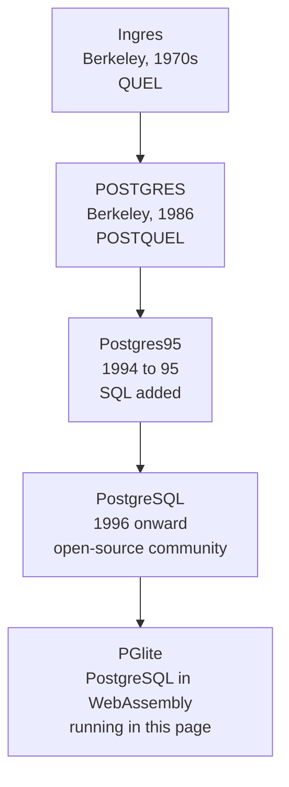

The previous page ended with IBM's System R proving the relational
model could work. This page follows the West Coast branch of the
family tree, the one that leads directly to the PostgreSQL engine
running inside this course.

<Figure
  slug="db-ingres-to-postgresql-cutout"
  alt="From Ingres to PostgreSQL, an isometric illustration"
/>

## Berkeley reads the papers

In the early 1970s, Michael Stonebraker and Eugene Wong at the
University of California, Berkeley read Codd's relational papers and
decided to build their own relational database. The result, developed
through the mid-1970s, was **Ingres**, a working relational system
with its own query language, QUEL, built by professors and a rotating
cast of graduate students on Unix machines.

<Figure
  slug="db-from-ingres-to-postgresql-berkeley-reads-papers-inline-cutout"
  alt="A plain bound paper open on a workbench with a half-built machine taking shape beside it"
  caption="PostgreSQL grew out of a research project, which is why its lineage runs so deep."
/>

Ingres mattered for a reason beyond its technology: its source code
was distributed freely, at the cost of a tape. People could study a
real relational database the way you might read code on GitHub today.
Ingres alumni and the Ingres codebase seeded much of the early
database industry, among others, Sybase was co-founded by an Ingres
alum, and Sybase's SQL Server was later licensed to Microsoft, where
its descendants became Microsoft SQL Server. Trace back far enough,
and a surprising amount of the database world has Berkeley in its
ancestry.

## POSTGRES: what comes after Ingres

By the mid-1980s Stonebraker wanted to fix what he saw as the
relational model's practical limits, among them, that commercial
systems of the day handled only a fixed menu of simple types. In 1986
he launched a new Berkeley project to build a database that could be
*extended*: user-defined types, rules, smarter handling of complex
data. He named it **POSTGRES**, literally "after Ingres."[^postgres]

<Figure
  slug="db-ingres-to-postgresql-postgres95-cutout"
  alt="Two figures unbolting the front panel of a database drum and fitting a new one, the old panel leaning nearby"
  caption="1994 to 1996: POSTQUEL swapped for SQL by two graduate students, and the name settled as PostgreSQL."
/>

POSTGRES was a research vehicle, and it had a research-grade quirk:
it did not speak SQL. It used its own language, POSTQUEL. By the
1990s, that was a problem, SQL had won.

## Two grad students and a rename

In 1994, two Berkeley graduate students, Andrew Yu and Jolly Chen,
replaced POSTQUEL with SQL and released the result as **Postgres95**.
When the Berkeley project wound down, the code did something unusual
for academic software: it refused to die. A volunteer community
picked it up, and in 1996 the project was renamed **PostgreSQL**, a
compromise that kept the Postgres heritage while advertising the SQL
support. The community has maintained and advanced it continuously
ever since, which is why the version numbers seem to start
mysteriously high: the 1996 release was numbered 6.0, continuing the
Berkeley lineage rather than starting over.

<Figure
  slug="db-from-ingres-to-postgresql-two-grad-students-rename-inline-cutout"
  alt="Two figures swapping the query panel on a working machine and leaving its nameplate freshly blank"
  caption="Yu and Chen, 1994: POSTQUEL swapped for SQL, and the project renamed with it."
/>

The name is widely considered the project's worst design decision,
the official pronunciation is "post-gres-cue-ell," nearly everyone
just says "Postgres," and the documentation cheerfully accepts both.
The project's elephant mascot is named Slonik. Stonebraker, like Codd
before him, eventually received the Turing Award (2014) for his
contributions to database systems.

## The part where it ends up in your browser

PostgreSQL is written in portable C, and WebAssembly lets browsers
run compiled languages at near-native speed. **PGlite** is exactly
what it sounds like: PostgreSQL compiled to WebAssembly, booting as a
library inside a web page, no server anywhere. It is the engine
behind every runnable block in this course.

Which means you can do something pleasantly circular: ask the
database to tell you its own version, and read the answer from a
lineage that runs Codd → System R's SQL → Ingres → POSTGRES →
Postgres95 → PostgreSQL → the tab you have open right now.

<SqlCodeBlock
  dialect="postgres"
  title="Ask the database who it is"
  starterCode={`SELECT version();`}
/>

## Why this matters to your designs

PostgreSQL's history explains some of its personality. Because
POSTGRES was built around extensibility, PostgreSQL has unusually
rich types and lets you define your own, which is why the
data-types chapter could treat types as a real design vocabulary
rather than a fixed menu. Because it grew up in a research lab and
then a volunteer community rather than a sales organization, it has a
long tradition of saying *no* to writes that violate declared rules,
the strictness you have been relying on every time a constraint
rejected a bad row in this course.

Tools shape habits. It is easier to design carefully on a database
that takes your declared rules seriously, and now you know why this
one does.

[^postgres]:
    Michael Stonebraker and Lawrence A. Rowe,
    ["The Design of POSTGRES"](https://dsf.berkeley.edu/papers/ERL-M85-95.pdf)
    (UC Berkeley ERL memo M85/95, 1986). The opening section is a list
    of what the authors thought Ingres and the commercial relational
    systems had got wrong, which makes it the clearest statement of why
    the project existed at all. Stonebraker received the ACM Turing
    Award in 2014 for this line of work.
