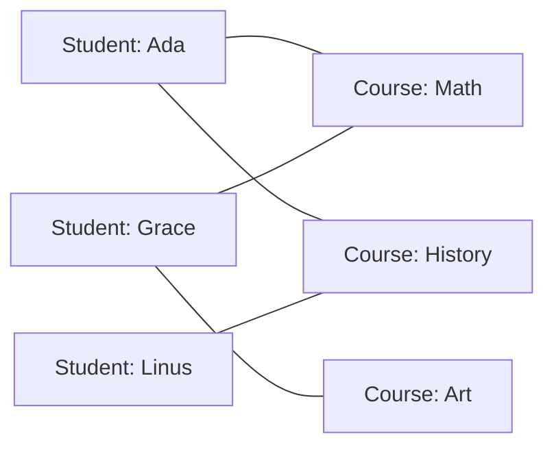
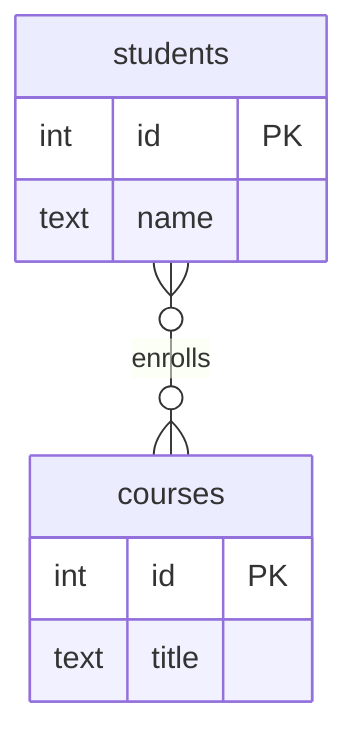
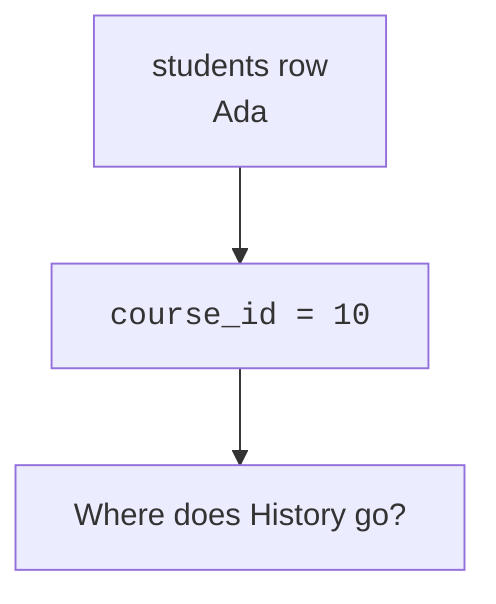
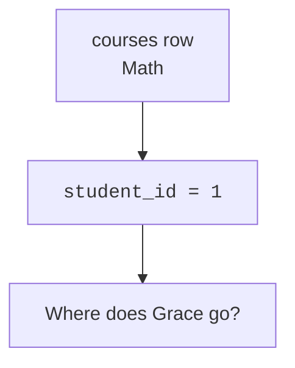
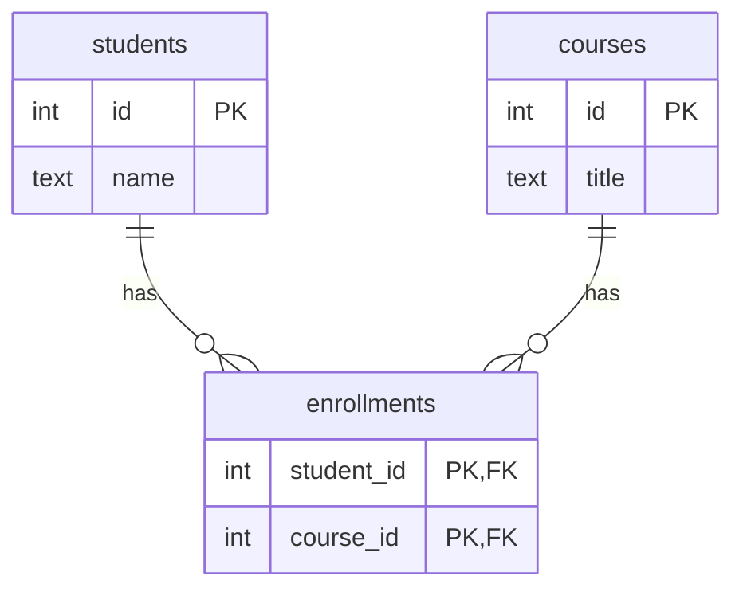
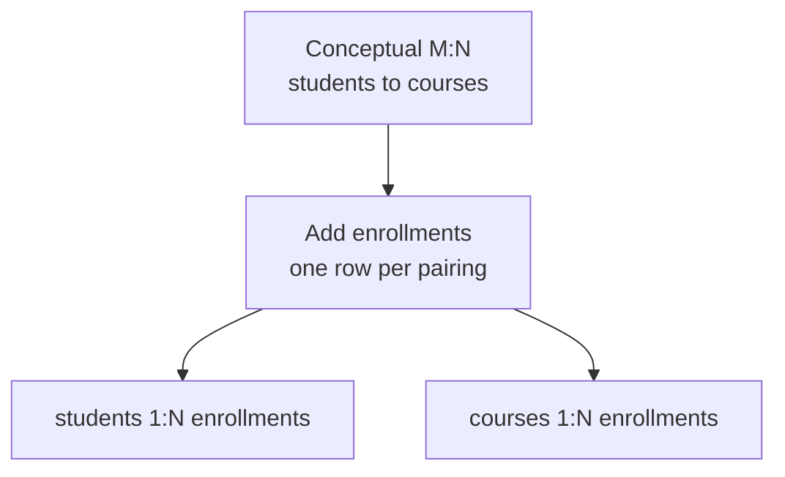
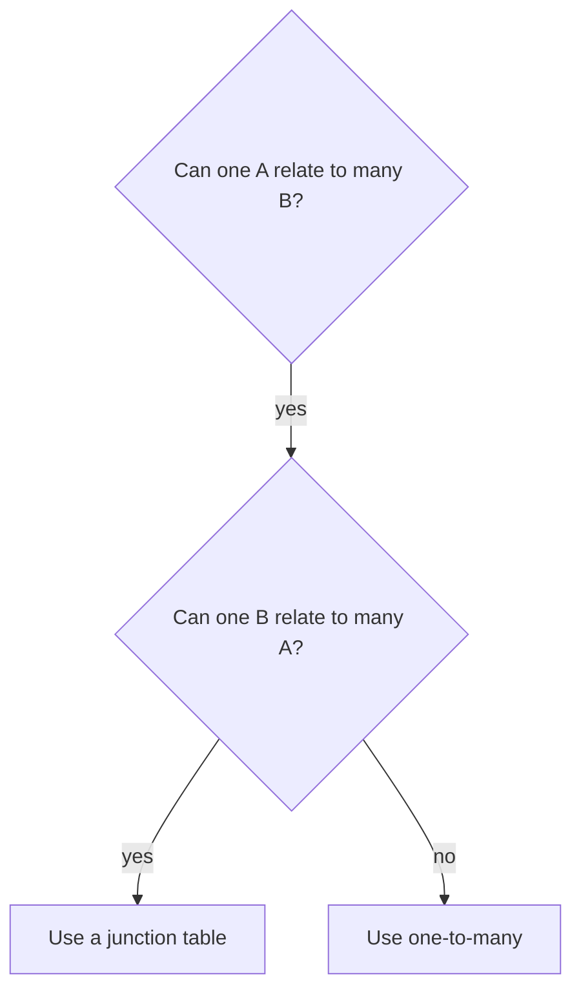

A student can take many courses. A course can contain many students.
Neither side is naturally the single parent of the other.

<Figure
  slug="db-many-to-many-cutout"
  alt="Many-to-many relationships, an isometric illustration"
/>

That is a **many-to-many relationship**: many rows on the left can
connect to many rows on the right. It is common, but it cannot be
stored directly with one foreign key.

## Seeing both sides as many

Start with the real-world picture, before tables. Ada takes Math and
History. Grace takes Math and Art. Math has both Ada and Grace.

The links cross because neither side is single. If you ask from the
student side, the answer can be many courses. If you ask from the
course side, the answer can be many students.

In conceptual ER notation, you may draw it directly like this:

That diagram is useful for conversation, but it is not the final
PostgreSQL table design. Tables need columns, and one column can hold
one value in one row.

## Why one foreign key cannot express it

Suppose you put `course_id` on `students`. Then each student row has
room for one course id.

Now try the opposite: put `student_id` on `courses`. Each course row
has room for one student id.

A single foreign key can make one side many, but it forces the other
side to be one. Many-to-many needs a place where each **pairing** can
become its own row.

## Quick check

<MultipleChoice
  markdown={`Why can't \`students.course_id\` fully model students and courses when students take many courses and courses have many students?

- Because students and courses must always be stored in the same table.
  > They are separate entities and usually belong in separate tables.
- Because PostgreSQL does not allow joins across three tables.
  > PostgreSQL can join many tables; the design still needs a table to store the pairings.
- Because foreign keys cannot reference tables named \`courses\`.
  > Table names do not prevent foreign keys; the problem is the relationship shape.
- [o] Because each student row would have only one \`course_id\` slot, but a student may need many course links.
  > One foreign key column can store one referenced row per student row, not many pairings.

A single foreign key cannot store many pairings for both sides at once.`}
/>

## Resolving the design

The relational solution is to add a third table. It stores one row for
each student-course pairing. We will study this table in depth on the
next page; for now, focus on the shape.

The many-to-many has been replaced by two one-to-many relationships:
one student has many enrollment rows, and one course has many
enrollment rows.

The new table is not just a technical trick. It names the relationship
itself: an **enrollment**. Once the relationship has a row, the
schema has a clear place to store and enforce the connection.

## Running the resolved design

This example lists every student-course pairing by joining through the
middle table.

<SqlCodeBlock
  dialect="postgres"
  title="Resolving students and courses"
  initSql={`CREATE TABLE students (
  id   INTEGER PRIMARY KEY,
  name TEXT NOT NULL
);

CREATE TABLE courses (
  id    INTEGER PRIMARY KEY,
  title TEXT NOT NULL
);

CREATE TABLE enrollments (
  student_id INTEGER NOT NULL REFERENCES students(id),
  course_id  INTEGER NOT NULL REFERENCES courses(id),
  PRIMARY KEY (student_id, course_id)
);

INSERT INTO students (id, name) VALUES
  (1, 'Ada'), (2, 'Grace'), (3, 'Linus');

INSERT INTO courses (id, title) VALUES
  (10, 'Math'), (11, 'History'), (12, 'Art');

INSERT INTO enrollments (student_id, course_id) VALUES
  (1, 10), (1, 11),
  (2, 10), (2, 12),
  (3, 11);`}
  starterCode={`SELECT
  s.name AS student,
  c.title AS course
FROM
  enrollments e
  JOIN students s ON s.id = e.student_id
  JOIN courses c ON c.id = e.course_id
ORDER BY
  s.name,
  c.title;`}
/>

Notice that the readable result looks like the original crossing-links
picture. The difference is that the database stores each link as a
normal row that can be constrained, queried, and extended.

## Design questions to ask

When you suspect a many-to-many relationship, ask both directions:

- Can one student take many courses?
- Can one course have many students?

If both answers are yes, do not choose one table to hold the foreign
key. Name the relationship and give it a table.

## Check your understanding

<MultipleChoice
  markdown={`What makes a relationship many-to-many?

- [o] Rows on both sides can each connect to multiple rows on the other side.
  > The defining feature is many possible links when viewed from either direction.
- The two tables have the same number of columns.
  > Column counts do not determine relationship cardinality.
- Each row on one side must connect to exactly one row on the other side.
  > That describes a one-to-one or many-to-one shape, not many-to-many.
- The tables cannot be joined.
  > Many-to-many relationships are joined through an intermediate table.

Many-to-many means both directions can produce multiple related rows.`}
/>

<MultipleChoice
  markdown={`In the resolved students-courses design, what does one row in \`enrollments\` represent?

- One course, with all student details copied into it.
  > The course row remains in \`courses\`; the enrollment row is only the connection.
- One student, with all course details copied into it.
  > The student row remains in \`students\`; the enrollment row is only the connection.
- [o] One pairing between one student and one course.
  > Each row records that a specific student is connected to a specific course.
- A summary count of all students in all courses.
  > Counts are query results; the table stores individual pairings.

The middle table turns each relationship instance into a row.`}
/>

<MultipleChoice
  markdown={`Why is the conceptual \`}o--o{\` diagram not enough by itself as a PostgreSQL schema?

- Because many-to-many relationships should always be ignored.
  > They are common and important; they simply need the right structure.
- Because PostgreSQL can store many-to-many links with invisible columns.
  > PostgreSQL stores relationships through explicit columns and constraints.
- [o] Because the actual schema still needs a table to store each pairing as data.
  > The conceptual diagram explains cardinality, while the resolved schema supplies columns and rows.
- Because ER diagrams are illegal in documentation.
  > ER diagrams are useful; they just are not table definitions.

Conceptual modeling identifies the shape; physical schema design resolves it into tables and keys.`}
/>
