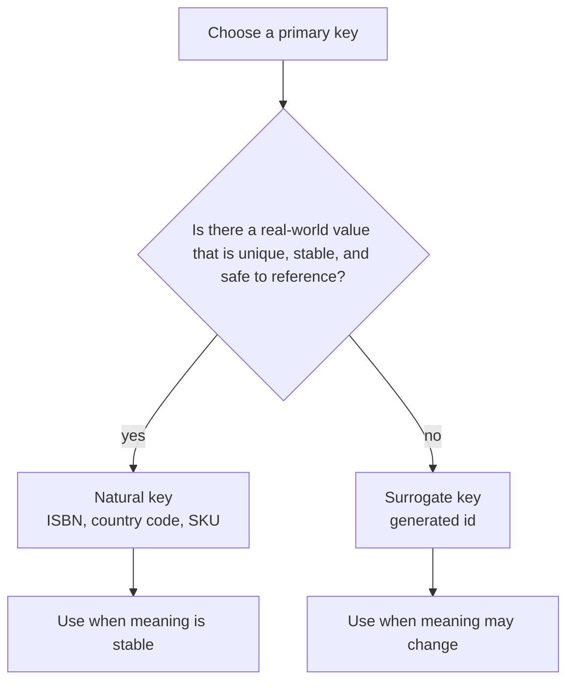
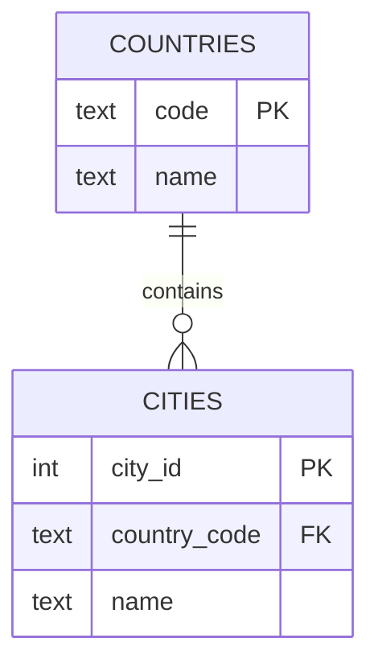
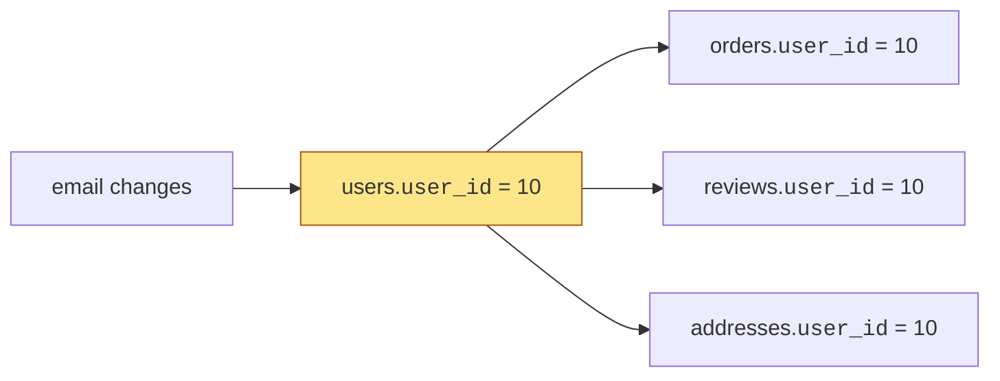
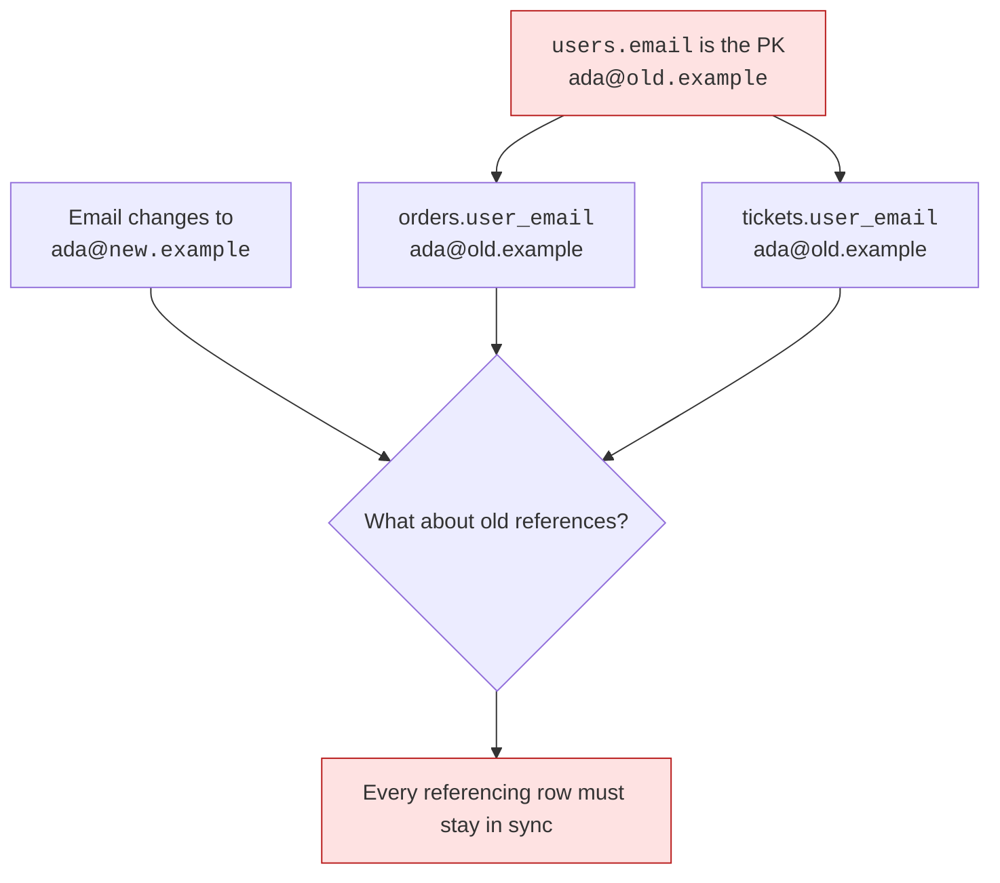
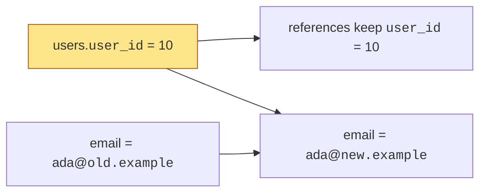
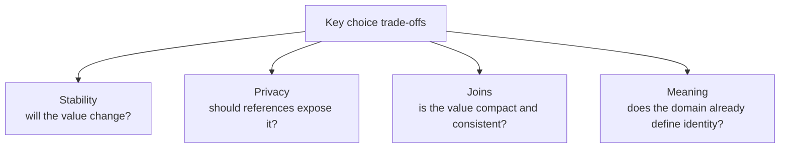
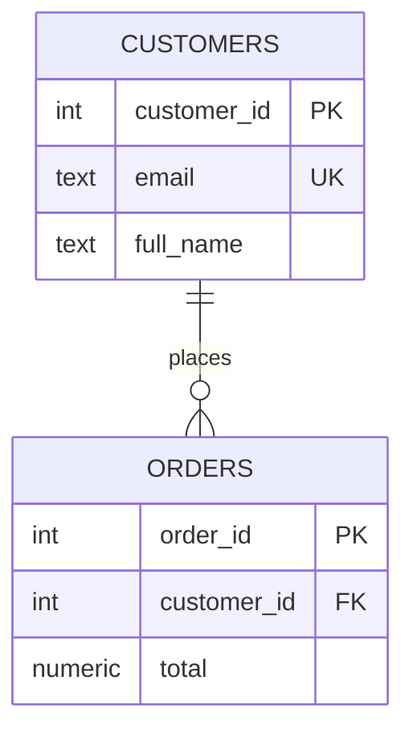

You know a table needs a primary key. The next design question is: what
kind of value should that key be?

Should a `books` table use the book's ISBN? Should a `users` table use
an email address? Or should the table use a generated `id` that has no
meaning outside the database?

That choice is the difference between **natural keys** and **surrogate
keys**.

<svg
  viewBox="0 0 640 230"
  role="img"
  aria-label="A balance scale weighs a punched luggage tag carrying real-world meaning against a plain minted number coin — choosing between natural and surrogate keys"
  style={{ display: "block", width: "100%", maxWidth: "640px", height: "auto", margin: "2.5rem auto" }}
>
  <g fill="currentColor" opacity="0.2">
    <rect x="317" y="64" width="6" height="120" rx="3" />
    <rect x="276" y="184" width="88" height="10" rx="5" />
    <rect x="140" y="56" width="360" height="8" rx="4" opacity="0.9" />
    <rect x="118" y="118" width="96" height="8" rx="4" />
    <rect x="426" y="118" width="96" height="8" rx="4" />
  </g>
  <g
    style={{ color: "var(--ds-gray-400)" }}
    fill="none"
    stroke="currentColor"
    strokeWidth="2"
    strokeLinecap="round"
  >
    <path d="M166 68 V 114" />
    <path d="M474 68 V 114" />
  </g>
  <g style={{ color: "var(--ds-blue-500)" }} fill="currentColor">
    <path fillRule="evenodd" d="M118 80 a8 8 0 0 1 8 -8 h40 l24 18 v18 a8 8 0 0 1 -8 8 h-56 a8 8 0 0 1 -8 -8 Z M176 84 a5 5 0 1 0 10 0 a5 5 0 1 0 -10 0" fillOpacity="0.85" />
  </g>
  <g style={{ color: "var(--ds-white)" }} fill="currentColor">
    <rect x="128" y="86" width="28" height="5" rx="2.5" fillOpacity="0.9" />
    <rect x="128" y="98" width="20" height="5" rx="2.5" fillOpacity="0.7" />
  </g>
  <g style={{ color: "var(--ds-teal-500)" }} fill="currentColor">
    <circle cx="474" cy="94" r="19" />
    <circle cx="474" cy="94" r="14" fillOpacity="0.5" />
  </g>
  <g style={{ color: "var(--ds-white)" }} fill="currentColor">
    <text x="474" y="100" textAnchor="middle" fontFamily="var(--font-mono), ui-monospace, monospace" fontSize="16" fontWeight="bold">7</text>
  </g>
</svg>

## Two ways to identify a row

A **natural key** is a real-world value that already belongs to the
thing you are storing: an ISBN, a country code, a SKU, or sometimes an
email address.

A **surrogate key** is an artificial value created only to identify the
row, such as `user_id` or `book_id` generated by PostgreSQL.

Neither option is automatically right. Good design asks what might
change, what must stay private, and what other tables will need to
reference for years.

## Natural keys: meaningful but fragile

Natural keys are attractive because they are readable. If `countries`
uses `code = 'JP'`, people can recognize the row without joining to see
an internal id.

A natural key can be a good design when the value is:

- truly unique in the domain,
- unlikely to change,
- not sensitive or private,
- already used by people outside your system.

Country codes and ISBNs often fit. A person's email address often does
not.

<Callout type="warn" title="Natural does not mean permanent">
Real-world values are controlled by the real world, not by your schema.
If the value can be corrected, reassigned, merged, privatized, or
changed by policy, it may be risky as a primary key.
</Callout>

## A cautionary tale: the most-used number in America

If you want one story to carry into every key discussion for the rest
of your career, take this one. In 1938, a wallet manufacturer in
Lockport, New York decided to show off how well a Social Security
card fit into its product by tucking a sample card into every wallet
it sold. The sample was a real card — it carried the actual Social
Security number of Hilda Schrader Whitcher, a secretary at the
company. Wallets went out to department stores across the country,
and thousands of buyers, finding an official-looking card already in
the pocket, simply adopted the number as their own. By 1943, more
than five thousand people were using Mrs. Whitcher's number; the
Social Security Administration eventually had to void it and issue
her a new one, and stray uses of the original were still turning up
decades later.

Every assumption a designer might make about a natural identifier
failed at once: the "unique" value was shared by thousands of
people, the "stable" value had to be changed, and the system that
issued it had no power over how the outside world used it. Real-world
identifiers live in the real world, and the real world is under no
obligation to respect your schema.

The pattern repeats in quieter ways. ISBNs — the textbook example of
a good natural key — were reissued in a new 13-digit format in 2007,
and every system that had keyed its tables on the 10-digit form had
to migrate. Usernames get recycled. Email addresses change employers.
Even national tax numbers get corrected. None of this means natural
keys are forbidden; it means a natural primary key is a bet that an
organization you do not control will keep its promises forever.

## Quick check

<MultipleChoice
  markdown={`Which value is the best candidate for a natural key?

- A customer's display name.
  > Display names can repeat and change, so they are poor identifiers.
- [o] A standardized country code such as \`US\` or \`JP\`.
  > Standardized codes are often unique, compact, and stable enough to identify countries.
- A user's current password.
  > Passwords are sensitive and changeable; they should never be used as row identity.
- A product description.
  > Descriptions are editable text, not stable identifiers.

A natural key is strongest when the outside world already treats the value as stable identity.`}
/>

## Surrogate keys: meaningless on purpose

A surrogate key has no business meaning. That is the point. If a user's
email changes, `user_id` does not. If a product is renamed, `product_id`
does not. Other tables can keep pointing at the same row.

In PostgreSQL, a common modern way to create a generated surrogate key
is `GENERATED ALWAYS AS IDENTITY`.

<SqlCodeBlock
  dialect="postgres"
  title="PostgreSQL can generate surrogate keys"
  initSql={`CREATE TABLE customers (
  customer_id INTEGER GENERATED ALWAYS AS IDENTITY PRIMARY KEY,
  email       TEXT NOT NULL UNIQUE,
  full_name   TEXT NOT NULL
);`}
  starterCode={`INSERT INTO
  customers (email, full_name)
VALUES
  ('ada@example.com', 'Ada Lovelace'),
  ('grace@example.com', 'Grace Hopper');

-- PostgreSQL generated the customer_id values.
SELECT
  *
FROM
  customers
ORDER BY
  customer_id;`}
/>

Notice the design: `customer_id` is the primary key, while `email` still
has a `UNIQUE` constraint. The email must not duplicate, but it does not
have to carry every reference in the database.

## When a natural key changes

The biggest danger with a natural key is not the first insert. It is the
future update.

You can configure databases to update references, but the design is
still telling every related table to depend on a value whose business
meaning can change.

With a surrogate key, the changing value becomes an attribute instead of
an identity.

## Trade-offs to consider

Use a natural key when the value is stable, public, and central to the
domain. Use a surrogate key when the real-world value may change, may be
private, or may be awkward in joins.

Surrogate keys often make joins smaller and references less sensitive.
Natural keys often make data more readable and can prevent unnecessary
extra ids. The design goal is not to memorize a rule; it is to protect
future relationships.

## Quick check

<MultipleChoice
  markdown={`Why might \`email\` be better as \`UNIQUE\` than as the primary key of \`users\`?

- Because PostgreSQL cannot enforce uniqueness on email addresses.
  > PostgreSQL can enforce a \`UNIQUE\` constraint on an email column.
- Because email values are never useful in queries.
  > Email can be useful for lookup; that does not make it ideal as row identity.
- [o] Because email may change or expose private information, while a surrogate id can stay stable.
  > A separate id lets references remain valid even when the email is corrected or replaced.
- Because primary keys must always be named \`id\`.
  > Primary keys can have many names; the issue is stability, not naming.

A value can be unique enough for validation without being stable enough for identity.`}
/>

## Choosing in practice

A practical pattern is:

- Use generated surrogate keys for entities like users, customers,
  orders, payments, and tickets.
- Add `UNIQUE` constraints to natural values that must not duplicate,
  such as email, SKU, or ISBN.
- Consider natural primary keys for small reference tables where the
  code is the identity, such as countries or currencies.

The primary key answers "which row is this?" A unique natural attribute
can answer "what real-world value must not be duplicated?" Those are
related, but they are not the same design job.

## Check your understanding

<MultipleChoice
  markdown={`What is a surrogate key?

- A real-world value such as an ISBN.
  > That is a natural key because it comes from the domain being modeled.
- [o] An artificial value created only to identify a row.
  > A generated id is a common surrogate key because it has no outside business meaning.
- A column that is allowed to be null.
  > Primary keys, including surrogate primary keys, are not null.
- A copy of every descriptive column in the table.
  > A surrogate key is usually a single identifier, not duplicated descriptive data.

Surrogate keys are intentionally meaningless so they can stay stable.`}
/>

<MultipleChoice
  markdown={`What is the strongest reason to avoid a changeable natural key as a primary key?

- Queries cannot filter by natural keys.
  > Queries can filter by natural values; change over time is the design risk.
- It prevents the table from having text columns.
  > A table can still have text columns regardless of its primary key choice.
- [o] Other tables may reference it, so changing it can force many references to change too.
  > Primary key values often become foreign key values elsewhere, making instability expensive.
- PostgreSQL requires natural keys to be stored twice.
  > PostgreSQL has no such requirement.

The more tables reference a key, the more important key stability becomes.`}
/>

<MultipleChoice
  markdown={`Which design is often appropriate for a \`customers\` table?

- Use \`full_name\` as the primary key and allow duplicates.
  > A primary key cannot allow duplicates, and names are not reliable identities.
- Use no primary key because customers have emails.
  > The table still needs a stable identity even if it stores unique attributes.
- [o] Use a generated \`customer_id\` as the primary key and make \`email\` unique if duplicates are not allowed.
  > This separates stable row identity from a real-world value that may still need uniqueness.
- Use the order total as the customer key.
  > Order totals describe transactions, not customers.

Stable identity and real-world uniqueness can be modeled with different constraints.`}
/>

<MultipleChoice
  markdown={`When is a natural primary key most reasonable?

- When the value is long, private, and frequently corrected.
  > Those traits make a value risky to use as a key.
- [o] When the domain already has a stable, public, unique code for the entity.
  > Stable codes such as country codes can make clear and compact natural keys.
- When every row has the same value.
  > A primary key must distinguish rows, so identical values cannot work.
- When the value should be hidden from all queries.
  > A primary key is often referenced, so hidden or sensitive data is a poor fit.

Natural keys work best when the real world provides identity that is genuinely stable.`}
/>
