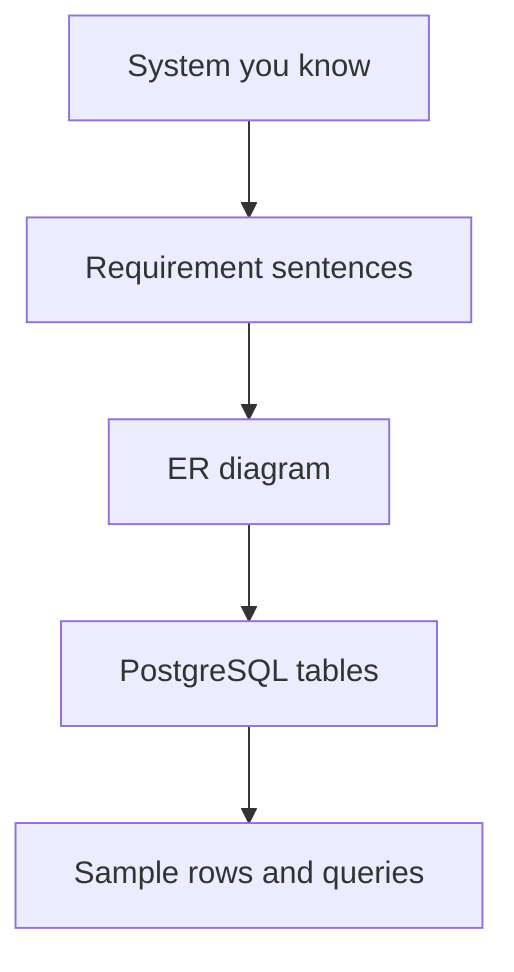
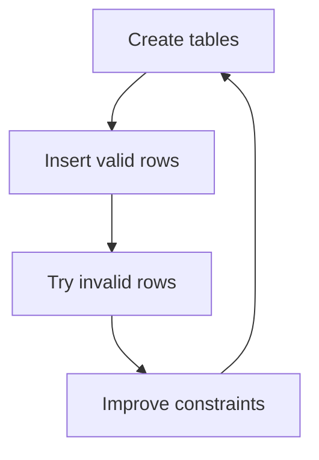
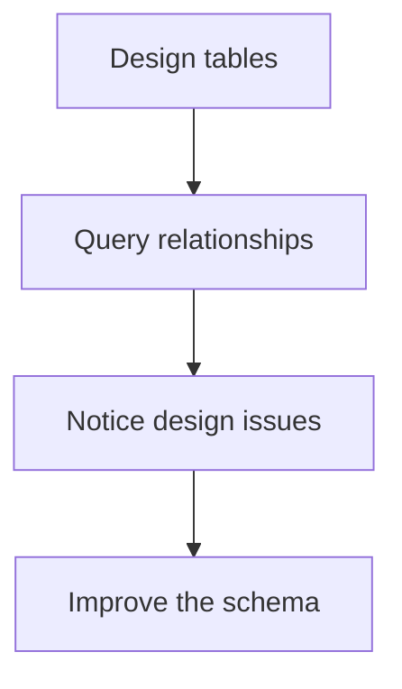

You have reached the end of the design course. The big idea is simple,
but powerful: a database schema is a model of the world your software
cares about.

<Figure
  slug="db-next-steps-cutout"
  alt="Where to go next, an isometric illustration"
/>

A good model makes true things easy to store and impossible things hard
to insert.

## The journey you took

You started with the reason design matters, then built up the tools for
making design decisions deliberately.

Each topic answers a different question:

- What things do we track?
- What facts describe those things?
- How do those things relate?
- What must be unique, required, or valid?
- Where should each fact live?
- How can the design change safely?

And if you skipped the [Interesting
Discussions](/courses/database-design-postgresql/the-relational-revolution)
section, go back for the stories: how a 1970 paper by an IBM
mathematician invented everything in this course, and how a Berkeley
research project became the PostgreSQL engine that ran your queries
here.

## Practice by modeling something familiar

The best next step is to design a small schema for a system you already
understand.

Try one of these:

- a recipe collection
- a workout tracker
- a school course catalog
- a volunteer scheduling system
- a personal library
- a simple invoicing app

Start with sentences. Circle the nouns and verbs. Draw an ER diagram.
Then write the tables.

## Use the PostgreSQL Playground

You can practice table design in the PostgreSQL Playground:

[/playground/postgres](/playground/postgres)

Try creating a schema, inserting a few rows, and then testing the rules
that should reject bad data.

That loop is how design skill grows.

## Practice querying too

Design and querying support each other. When you understand joins, you
can test whether your relationships feel natural. When you understand
relationships, joins make more sense.

For query practice, visit the sibling course:

[/courses/intro-sql-postgres](/courses/intro-sql-postgres)

It covers the SQL skills you will use to explore the schemas you
design.

## What comes after design

After you are comfortable modeling data, other database topics become
more useful:

- indexing
- query performance
- migrations in production systems
- backups and administration
- security and permissions
- larger operational architectures

Those topics are beyond this course. They matter, but they work best
when the underlying schema already has clear entities, relationships,
keys, and constraints.

## Check your understanding

<MultipleChoice
  markdown={`What is the best way to keep practicing database design?

- [o] Pick a familiar system, write requirements, draw relationships, and create tables.
  > Practicing the full loop builds judgment about entities, keys, and constraints.
- Memorize table names from someone else's schema only.
  > Reading examples helps, but design skill grows by modeling real requirements.
- Avoid inserting sample rows.
  > Sample rows help test whether the design represents real examples.
- Start with sharding and replication.
  > Those topics come after a clear schema model.

Practice the design loop on small systems you understand.`}
/>

<MultipleChoice
  markdown={`Why keep practicing SQL queries after a design course?

- Queries and design are completely unrelated.
  > Querying relationships helps reveal whether the design is easy to use.
- [o] Queries help you test and understand the relationships you modeled.
  > Joins and filters show whether the schema supports real questions.
- SQL only works on single-table schemas.
  > SQL is especially useful for relational schemas with multiple tables.
- Query practice removes the need for constraints.
  > Constraints still protect data quality.

Design and querying reinforce each other.`}
/>
