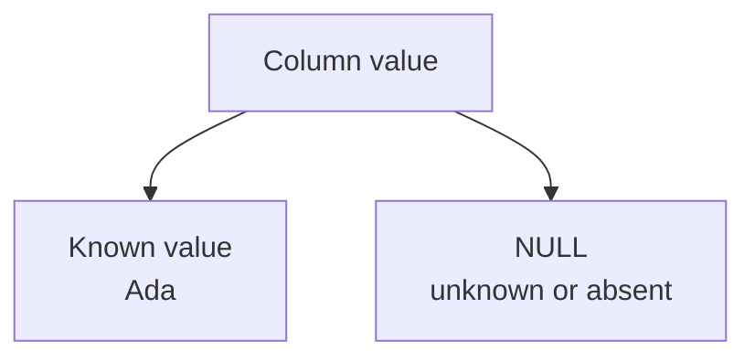
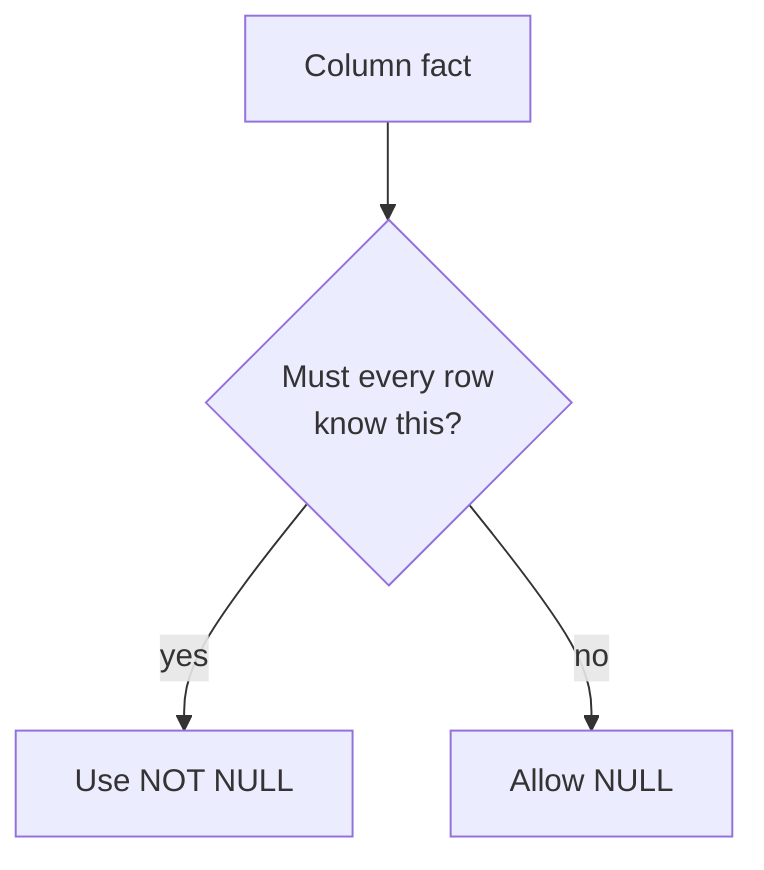
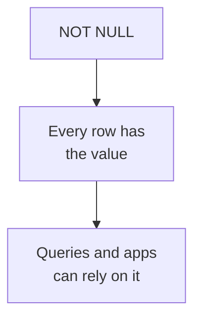

When a new customer signs up, can their email be missing? Can their
nickname be missing? Those two questions may look similar, but they are
design decisions with very different consequences.

<Figure
  slug="db-not-null-and-defaults-cutout"
  alt="NOT NULL and default values, an isometric illustration"
/>

`NULL`, `NOT NULL`, and `DEFAULT` are how the schema answers them.

## NULL means unknown or absent

In SQL, **NULL** means "there is no value here." It might mean the
value is unknown, not applicable, not collected yet, or deliberately
absent. The important part is that NULL is not the same as an empty
string, zero, or false.

Allowing NULL is a real design choice. It says, "this fact is optional
for this kind of row." Sometimes that is exactly right. A customer may
not have a `middle_name`. A shipped order may have a `delivered_at`,
while a new order does not yet.

But if the value is essential to what the row *is*, allowing NULL makes
invalid rows possible.

## Required vs. optional columns

A **NOT NULL** constraint says every row must provide a value for that
column. PostgreSQL rejects any insert or update that would leave the
column empty.

Use `NOT NULL` for values the row cannot make sense without: account
email, product name, order date, line-item quantity. Allow NULL for
values that are genuinely optional or not known yet.

<Callout type="info" title="Optional is not sloppy">
Allowing NULL is not automatically bad. The design mistake is allowing
NULL when the business rule says the value is required.
</Callout>

## DEFAULT fills in an omitted value

A **DEFAULT** is the value PostgreSQL uses when an insert leaves a
column out. Defaults are useful when there is a safe, honest value the
schema can choose.

Examples:

- `created_at TIMESTAMPTZ DEFAULT now()`
- `status TEXT DEFAULT 'draft'`
- `is_active BOOLEAN DEFAULT true`

A default is not the same as `NOT NULL`. A column can have a default and
still allow someone to explicitly insert NULL unless you also declare
`NOT NULL`.

## Quick check

<MultipleChoice
  markdown={`What does \`NULL\` mean in SQL?

- An empty string.
  > An empty string is still a text value; NULL means missing or unknown.
- The number zero.
  > Zero is a known numeric value; NULL means there is no value.
- The word "null" stored as text.
  > Text containing those letters is a value; SQL NULL is a special marker for absence.
- [o] A missing, unknown, or absent value.
  > NULL represents the lack of a value, which is different from ordinary values like zero or false.

NULL means the column does not currently hold a known value.`}
/>

## Watch NOT NULL and DEFAULT work

This table requires `email`, but it supplies a default account status.
The first insert works and receives the default. The second insert is
rejected because the required email is missing.

<SqlCodeBlock
  expectError
  dialect="postgres"
  title="NOT NULL rejects missing required data"
  initSql={`CREATE TABLE accounts (
  id     SERIAL PRIMARY KEY,
  email  TEXT NOT NULL,
  status TEXT NOT NULL DEFAULT 'active'
);`}
  starterCode={`-- status is omitted, so the DEFAULT fills in 'active'.
INSERT INTO
  accounts (email)
VALUES
  ('ada@example.com');

-- email is required, so this insert is rejected.
INSERT INTO
  accounts (status)
VALUES
  ('active');

SELECT
  id,
  email,
  status
FROM
  accounts;`}
/>

The schema is doing two jobs: it refuses a row without its required
identity information, and it chooses a safe default status when the
writer does not specify one.

## The beginner NULL comparison gotcha

NULL has one surprising behavior: comparisons with NULL do not return
ordinary true or false. If the value is unknown, then `email = NULL` is
also unknown.

Use `IS NULL` and `IS NOT NULL` when you want to test for missing data.

| Comparison         | Result                  |
| ------------------ | ----------------------- |
| `email = NULL`     | Unknown, never true     |
| `email IS NULL`    | True when the value is missing |
| `email IS NOT NULL` | True when a value is present  |

This is called **three-valued logic**: SQL conditions can be true,
false, or unknown. The reasoning behind it is worth one slow pass,
because it explains every NULL surprise you will ever hit. NULL means
*the value is unknown*. So ask: is an unknown value equal to 5?
Unknown, it might be. Is an unknown value equal to another unknown
value? Also unknown, they might both be 5, or not. SQL refuses to
guess in either direction, so any ordinary comparison touching NULL
produces neither true nor false. And a `WHERE` clause only keeps rows
whose condition is *true*, unknown rows are dropped. That is why
`WHERE nickname = NULL` matches nothing, and why `IS NULL` exists as
a separate operator that asks a different question: not "what is the
value?" but "is there a value at all?"

Run the comparisons yourself, the result of each one appears as its
own column:

<SqlCodeBlock
  dialect="postgres"
  title="Three-valued logic, demonstrated"
  starterCode={`SELECT
  NULL = NULL AS null_equals_null,
  NULL <> NULL AS null_not_equals_null,
  NULL = 5 AS null_equals_five,
  (NULL IS NULL) AS null_is_null,
  (5 IS NULL) AS five_is_null;`}
/>

The first three columns come back empty, that blank is PostgreSQL
displaying *unknown*. Only the `IS NULL` tests produce a definite
`true` or `false`.

<Callout type="info" title="NULL has been controversial for fifty years">
NULL was part of E. F. Codd's relational model from its early days,
and database theorists have argued about it ever since. Codd himself
eventually decided one kind of missing was not enough, his later
writing proposed separate markers for "missing and applicable"
(a salary we have not recorded) and "missing and inapplicable" (a
salary for a volunteer who has none). Christopher J. Date, one of the
field's most prominent authors, has spent decades arguing the
opposite: that NULL was a mistake and well-designed databases should
avoid it almost entirely. Working designers land in the middle,
allow NULL where a fact is genuinely optional, require values
everywhere else, and never use `=` to look for missing data.
</Callout>

<SqlCodeBlock
  dialect="postgres"
  title="Finding missing values with IS NULL"
  initSql={`CREATE TABLE contacts (
  id       SERIAL PRIMARY KEY,
  name     TEXT NOT NULL,
  nickname TEXT
);

INSERT INTO contacts (name, nickname) VALUES
  ('Ada', 'A'),
  ('Grace', NULL),
  ('Linus', NULL);`}
  starterCode={`-- This is the correct way to find missing nicknames.
SELECT
  name,
  nickname
FROM
  contacts
WHERE
  nickname IS NULL;`}
/>

## Required data is part of meaning

Think of `NOT NULL` as a promise: every row has this fact. That promise
makes the table easier to trust and easier to query.

If every order has `ordered_at NOT NULL`, reports do not need to wonder
whether some orders have no date. If every product has `name NOT NULL`,
interfaces can show product names without inventing placeholders.

Defaults make a different promise: when the writer omits the value, the
database will use a standard one.

## Quick check

<MultipleChoice
  markdown={`A column has \`status TEXT DEFAULT 'draft'\` but does **not** have \`NOT NULL\`. What can happen?

- PostgreSQL rejects every insert that omits status.
  > The default exists specifically so omitted values can be filled in.
- The default value must be unique.
  > Defaults do not imply uniqueness; many rows can receive the same default.
- [o] Omitted status values become \`'draft'\`, but an explicit NULL may still be stored.
  > DEFAULT handles omitted values; NOT NULL is the rule that blocks NULL.
- The column can never contain NULL.
  > DEFAULT alone does not forbid someone from explicitly inserting NULL.

DEFAULT and NOT NULL solve different problems and are often used together.`}
/>

## Check your understanding

<MultipleChoice
  markdown={`When should a column usually be declared \`NOT NULL\`?

- Whenever you want the column to sort faster.
  > NOT NULL is about integrity, not sorting speed.
- Whenever the value might be unknown at first.
  > Values that may be unknown are often nullable unless the row cannot exist without them.
- [o] When every valid row must have that value for the row to make sense.
  > NOT NULL encodes that the value is required for all rows.
- Whenever the column stores text.
  > Text columns can be required or optional; the type alone does not decide nullability.

Use NOT NULL when missing the value would make the row invalid.`}
/>

<MultipleChoice
  markdown={`What is the role of a \`DEFAULT\` value?

- [o] To supply a value when an insert omits the column.
  > PostgreSQL uses the default only when the writer does not provide a value.
- To turn NULL into zero in comparisons.
  > DEFAULT does not change SQL's NULL comparison rules.
- To make a column optional in every query.
  > Query behavior is separate; DEFAULT affects inserted rows.
- To reject duplicate values.
  > Duplicate prevention is handled by UNIQUE, not DEFAULT.

A default is the schema's standard answer when a write leaves a value out.`}
/>

<MultipleChoice
  markdown={`Which condition correctly finds rows where \`nickname\` is missing?

- [o] \`nickname IS NULL\`
  > IS NULL is the SQL operator designed to test for missing values.
- \`nickname = ''\`
  > An empty string is a present text value, not SQL NULL.
- \`nickname = NULL\`
  > Ordinary equality with NULL evaluates to unknown, not true.
- \`nickname DEFAULT NULL\`
  > DEFAULT belongs in table definitions, not in a WHERE condition.

NULL needs IS NULL or IS NOT NULL rather than ordinary equality.`}
/>
