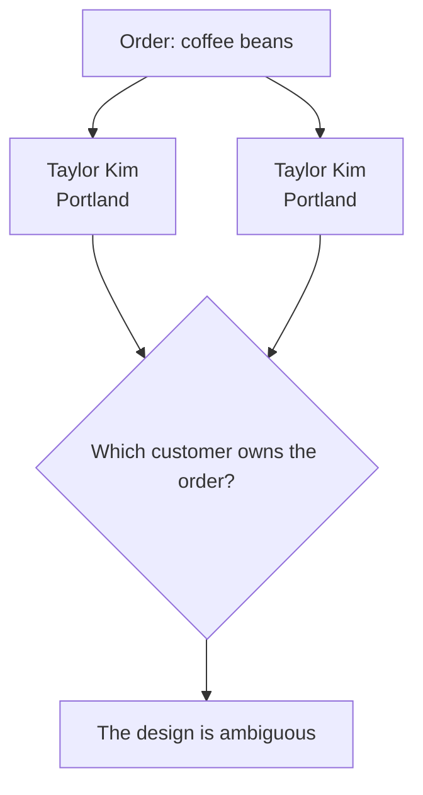
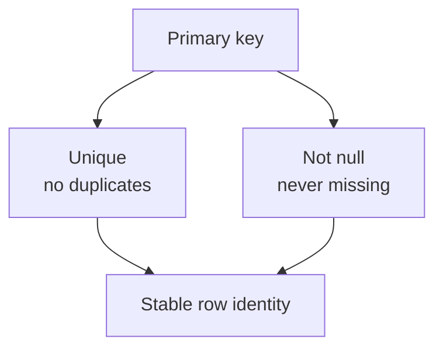
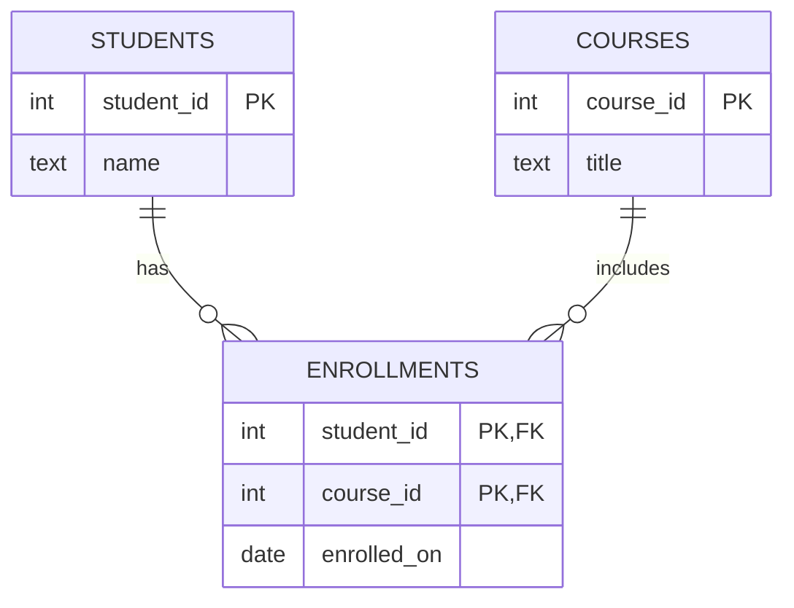
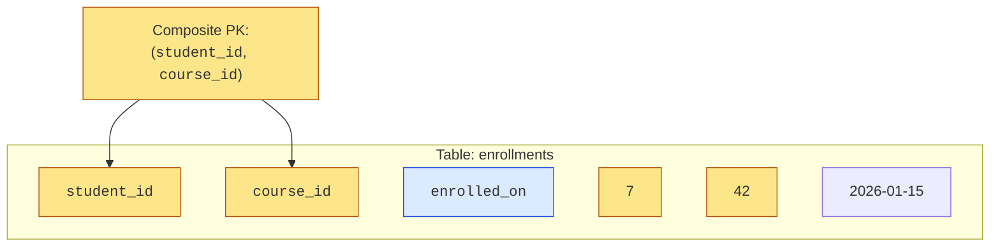

Suppose your app has two customers named Taylor Kim. Same city, same
signup date, maybe even the same birthday. If an order belongs to
"Taylor Kim," which row should it point to?

<Figure
  slug="db-primary-keys-cutout"
  alt="Primary keys, an isometric illustration"
/>

That is the **identity problem**. A table does not just need values; it
needs a reliable way to say *this exact row, not that similar-looking
one*.

## Rows need identity

Human descriptions are often messy. Names repeat. Titles change. Email
addresses get corrected. A row needs an identity that survives all of
that.

A **primary key** is the table's answer to this problem. It is the
column, or group of columns, whose job is to identify each row.

Table: `customers`

| customer_id (PK) | name       | city     |
| ---------------- | ---------- | -------- |
| 101              | Taylor Kim | Portland |
| 102              | Taylor Kim | Portland |

Now there are not two vague Taylors. There is customer `101` and
customer `102`. The values can look similar everywhere else, but the
identity is still clear.

## The two guarantees

A primary key matters because PostgreSQL enforces two guarantees:

1. **Unique**, no two rows can have the same key value.
2. **Not null**, every row must have a key value.

Those two rules are a design promise: every row can be pointed at, and
no pointer has to mean "maybe this row, maybe that one."

<Callout type="info" title="A primary key is not just convenient">
A primary key is part of the *meaning* of the table. It says what counts
as one distinct thing in your model: one customer, one order, one
invoice, one enrollment, one saved address.
</Callout>

## Quick check

<MultipleChoice
  markdown={`Why is a primary key a design decision, not just a SQL detail?

- Because it makes every column in the table unique.
  > A primary key applies to the key column or columns, not automatically to every column.
- Because it decides which rows are shown first in query results.
  > Row order is controlled by \`ORDER BY\`; identity is a separate design concern.
- [o] Because it defines how the table tells one real-world thing apart from another.
  > The chosen key becomes the dependable identity that other rows can reference.
- Because it prevents anyone from updating non-key columns.
  > Non-key attributes can still change; the key is meant to keep identity stable.

Choosing a primary key is choosing the table's answer to "which row is this?"`}
/>

## Watch PostgreSQL protect identity

Run this block. The first row creates customer `1`. The second insert
tries to reuse the same primary key, so PostgreSQL rejects it.

<SqlCodeBlock
  expectError
  dialect="postgres"
  title="A duplicate primary key is rejected"
  initSql={`CREATE TABLE customers (
  customer_id INTEGER PRIMARY KEY,
  name        TEXT NOT NULL
);

INSERT INTO customers (customer_id, name)
VALUES (1, 'Ada');`}
  starterCode={`-- This tries to create a second row with the same identity.
INSERT INTO
  customers (customer_id, name)
VALUES
  (1, 'Grace');

-- The failed insert protects the table from ambiguous identity.
SELECT
  *
FROM
  customers;`}
/>

The error is useful. It is the database refusing a design state where
two rows claim to be the same thing.

## Composite primary keys

A primary key does not have to be one column. A **composite primary key**
uses multiple columns together.

This is common when the row represents a relationship. In a class
roster, neither `student_id` nor `course_id` is unique by itself. A
student can take many courses, and a course can have many students. But
the pair should appear only once.

The key is the combination: student `7` in course `42`. That design says
"there can be only one enrollment row for this student in this course."

## Stability matters

A primary key should rarely, ideally never, change. If many other tables
point to it, changing the key means changing every reference too.

| Key behavior | Consequence | Outcome |
| --- | --- | --- |
| Stable key | References stay valid | Reliable joins |
| Changing key | Every reference must change too | Risk of broken links |

That is why many designs use an artificial `id`: not because numbers are
magical, but because a generated id can stay stable even when human data
changes.

## Quick check

<MultipleChoice
  markdown={`In an \`enrollments\` table, why might \`(student_id, course_id)\` be a good composite primary key?

- Because each course can only ever have one student.
  > A course normally has many students; \`course_id\` alone would not identify one enrollment.
- [o] Because the pair identifies one specific student-course enrollment.
  > The combination can be unique even when each individual column appears many times.
- Because composite keys allow null values in the key columns.
  > Primary key columns are not null, whether the key is one column or many.
- Because each student can only ever take one course.
  > Composite keys are often useful precisely when each single column repeats.

A composite key is useful when the identity of a row is a combination of facts.`}
/>

## Check your understanding

<MultipleChoice
  markdown={`What problem does a primary key solve first?

- It makes duplicate names impossible in the table.
  > Duplicate names may be valid; duplicate primary key values are not.
- It automatically creates a report for each row.
  > Reports are written with queries; primary keys provide reliable identity.
- It stores long text more efficiently.
  > Storage format is not the main issue; the key is about identifying rows.
- [o] It gives every row a stable way to be distinguished from every other row.
  > A primary key removes ambiguity by assigning each row a unique, non-empty identity.

Primary keys solve the identity problem before they solve anything else.`}
/>

<MultipleChoice
  markdown={`Which two guarantees does PostgreSQL enforce for a primary key?

- [o] The value must be unique, and it must not be null.
  > These two guarantees make the key dependable as a row identity.
- The value must be copied into every other table.
  > Other tables may reference the key, but copying it everywhere is not required.
- The value must be visible to users.
  > Many primary keys are internal identifiers users never see.
- The value must be short and lowercase.
  > Text style is not a primary key rule.

A primary key is trustworthy because it is both unique and always present.`}
/>

<MultipleChoice
  markdown={`Why is \`name\` usually a weak primary key for a \`customers\` table?

- [o] Names can repeat, change, or be corrected over time.
  > A primary key should be stable and unique, while real-world names often are neither.
- Names make joins impossible in SQL.
  > SQL can join on text, but doing so may create ambiguous or fragile references.
- Names are always private and cannot be stored.
  > Names can be stored, but they are not reliable identifiers.
- PostgreSQL cannot compare text values.
  > PostgreSQL can compare text; the problem is the meaning of names.

A good key should remain reliable even when descriptive attributes change.`}
/>

<MultipleChoice
  markdown={`What does a composite primary key use to identify a row?

- A hidden timestamp created by PostgreSQL.
  > PostgreSQL does not silently make a timestamp into a primary key.
- The first non-null column in the table.
  > A composite key is explicitly declared; it is not chosen automatically from any non-null column.
- [o] Two or more columns considered together as the row's identity.
  > The combined values form one key, such as \`(student_id, course_id)\`.
- Every text column in alphabetical order.
  > Column type and alphabetic order do not define a composite key.

Composite keys are useful when one fact alone is not enough to identify the row.`}
/>
