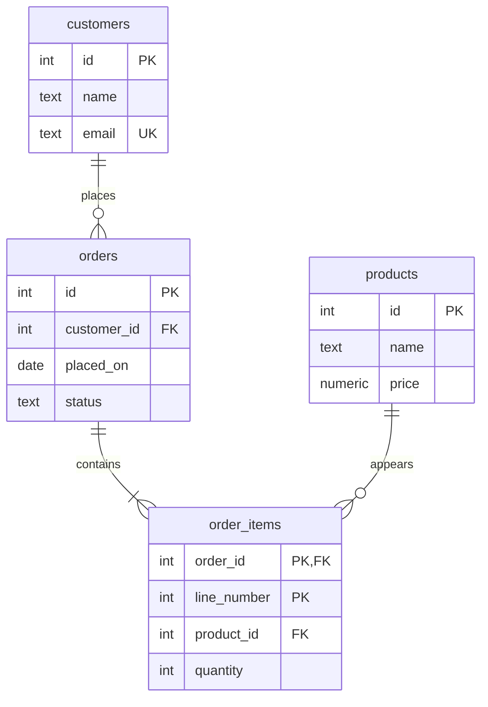
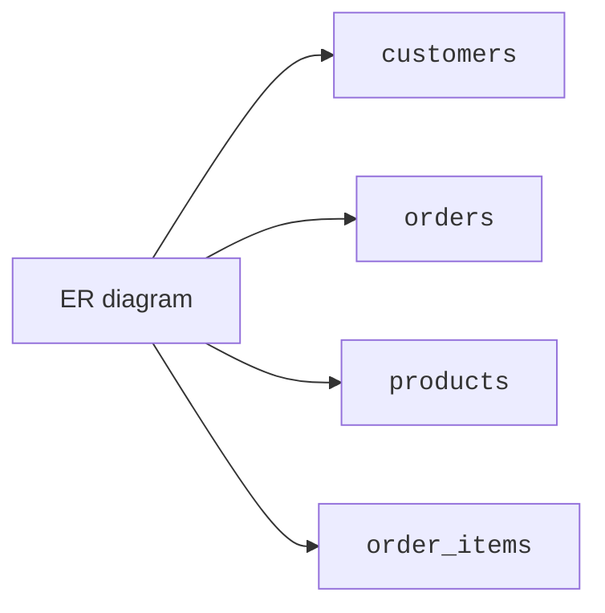
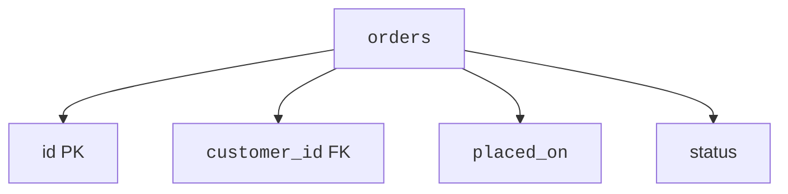
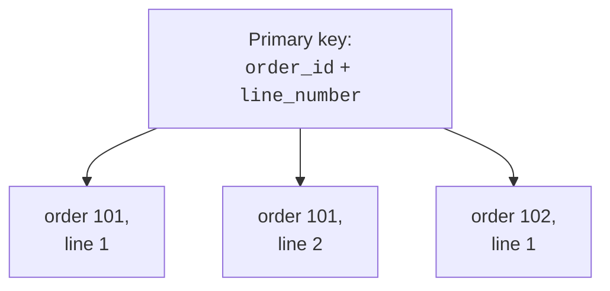
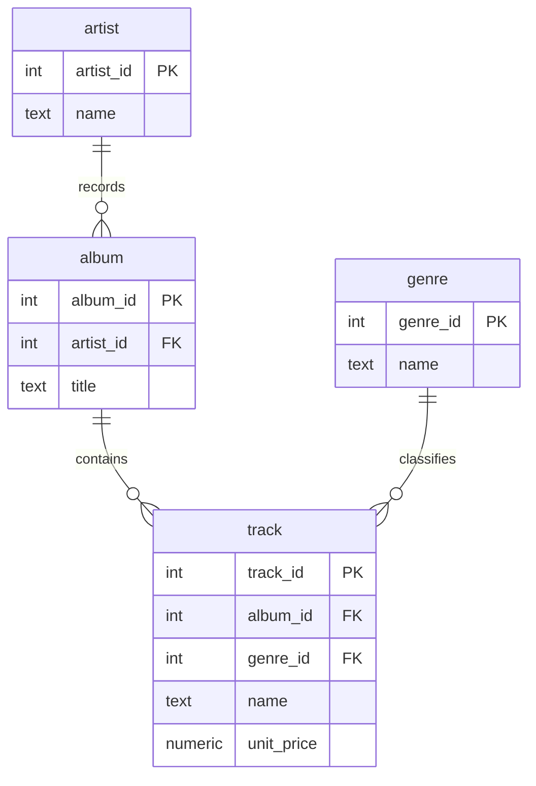
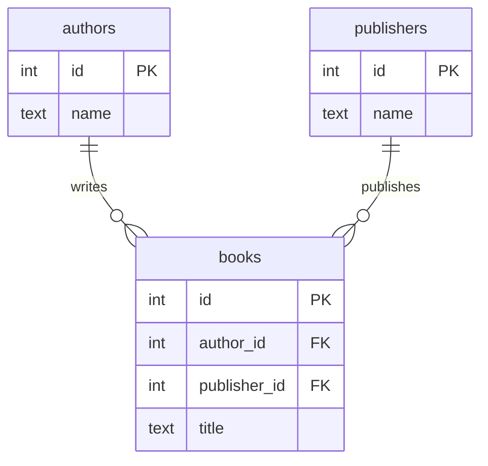

Now that you have seen entities, attributes, relationships, and
cardinality separately, it is time to read a whole ER diagram as a
story.

We will use a small shop model: customers place orders, orders contain
order items, and order items point to products.

<svg
  viewBox="0 0 640 220"
  role="img"
  aria-label="Four entity containers zigzag across the canvas like a constellation, joined by thin links, reading a whole model as one story"
  style={{ display: "block", width: "100%", maxWidth: "640px", height: "auto", margin: "2.5rem auto" }}
>
  <g style={{ color: "var(--ds-blue-500)" }} fill="currentColor">
    <rect x="56" y="36" width="116" height="60" rx="12" fillOpacity="0.35" />
    <circle cx="84" cy="60" r="6" />
    <rect x="98" y="72" width="58" height="8" rx="4" fillOpacity="0.5" />
  </g>
  <g style={{ color: "var(--ds-green-500)" }} fill="currentColor">
    <rect x="212" y="124" width="116" height="60" rx="12" fillOpacity="0.35" />
    <circle cx="240" cy="148" r="6" />
    <rect x="254" y="160" width="58" height="8" rx="4" fillOpacity="0.5" />
  </g>
  <g style={{ color: "var(--ds-yellow-500)" }} fill="currentColor">
    <rect x="368" y="36" width="116" height="60" rx="12" fillOpacity="0.35" />
    <circle cx="396" cy="60" r="6" />
    <rect x="410" y="72" width="58" height="8" rx="4" fillOpacity="0.5" />
  </g>
  <g style={{ color: "var(--ds-blue-500)" }} fill="currentColor">
    <rect x="508" y="124" width="116" height="60" rx="12" fillOpacity="0.18" />
    <circle cx="536" cy="148" r="6" fillOpacity="0.7" />
    <rect x="550" y="160" width="58" height="8" rx="4" fillOpacity="0.3" />
  </g>
  <g
    style={{ color: "var(--ds-gray-400)" }}
    fill="none"
    stroke="currentColor"
    strokeWidth="2"
    strokeLinecap="round"
  >
    <path d="M170 96 L 216 124" />
    <path d="M324 124 L 370 96" />
    <path d="M482 96 L 512 124" />
  </g>
</svg>

## The full model

Start by looking at the diagram without worrying about SQL syntax.
Ask: what are the boxes, what are the keys, and what do the lines say?

This one picture contains most of the design vocabulary we have built.
Let's read it slowly.

## Step 1: identify the entities

The entity boxes are `customers`, `orders`, `products`, and
`order_items`.

Each box is a kind of thing the system tracks. Each will usually
become a table.

## Step 2: read the attributes

Inside each box are attributes. For example, `customers` has `id`,
`name`, and `email`. The `orders` entity has `id`, `customer_id`,
`placed_on`, and `status`.

The markers matter. `PK` says a column helps identify rows in that
entity. `FK` says a column points to another entity. `UK` says values
must be unique.

## Step 3: read the relationships as sentences

Every relationship line can become an English sentence.

| Relationship | In plain English |
| --- | --- |
| `customers \|\|--o{ orders` | One customer places zero or many orders. |
| `orders \|\|--\|{ order_items` | One order contains one or many order items. |
| `products \|\|--o{ order_items` | One product appears in zero or many order items. |

The words are just as important as the symbols. If the sentence sounds
wrong to the business, the diagram needs work.

## Quick check

<MultipleChoice
  markdown={`In the shop diagram, which entity acts as the line between orders and products?

- customers.
  > Customers place orders, but they do not represent individual product lines inside an order.
- [o] order_items.
  > Each order item connects one order to one product and stores facts about that line.
- products.
  > Products are the things being purchased, not the per-order line rows.
- email.
  > Email is an attribute of customers, not an entity connecting orders and products.

Order items turn the order-product association into rows that can store quantity and line number.`}
/>

## Step 4: connect the keys to the lines

The relationship lines are stored using foreign keys:

- `orders.customer_id` points to `customers.id`.
- `order_items.order_id` points to `orders.id`.
- `order_items.product_id` points to `products.id`.

Those keys tell you where joins will happen, but they also tell you
where integrity rules should exist.

<SqlCodeBlock
  dialect="postgres"
  title="Querying through the diagram"
  initSql={`CREATE TABLE customers (
  id    INTEGER PRIMARY KEY,
  name  TEXT NOT NULL,
  email TEXT NOT NULL UNIQUE
);
CREATE TABLE orders (
  id          INTEGER PRIMARY KEY,
  customer_id INTEGER NOT NULL REFERENCES customers(id),
  placed_on   DATE NOT NULL,
  status      TEXT NOT NULL
);
CREATE TABLE products (
  id    INTEGER PRIMARY KEY,
  name  TEXT NOT NULL,
  price NUMERIC NOT NULL
);
CREATE TABLE order_items (
  order_id    INTEGER NOT NULL REFERENCES orders(id),
  line_number INTEGER NOT NULL,
  product_id  INTEGER NOT NULL REFERENCES products(id),
  quantity    INTEGER NOT NULL CHECK (quantity > 0),
  PRIMARY KEY (order_id, line_number)
);
INSERT INTO customers VALUES (1, 'Ada', 'ada@example.com');
INSERT INTO orders VALUES (101, 1, DATE '2025-04-01', 'placed');
INSERT INTO products VALUES (10, 'Notebook', 8.50), (11, 'Pen', 1.25);
INSERT INTO order_items VALUES (101, 1, 10, 2), (101, 2, 11, 3);`}
  starterCode={`SELECT
  c.name AS customer,
  o.id AS order_id,
  oi.line_number,
  p.name AS product,
  oi.quantity
FROM
  customers c
  JOIN orders o ON o.customer_id = c.id
  JOIN order_items oi ON oi.order_id = o.id
  JOIN products p ON p.id = oi.product_id
ORDER BY
  o.id,
  oi.line_number;`}
/>

The joins follow the foreign keys from the diagram. Reading the diagram
helps you predict the query path.

## Step 5: notice composite keys

`order_items` uses `(order_id, line_number)` as its primary key. That
means line `1` can appear in many different orders, but only once
inside the same order.

Composite keys are common for line-item tables because the line number
only has meaning within its parent order.

## Reading checklist

When you meet a new ER diagram, use this order:

1. Find the entity boxes.
2. Read the attributes.
3. Mark `PK`, `FK`, and `UK`.
4. Turn the lines into sentences.
5. Check cardinality in both directions.
6. Imagine the joins.

This keeps you from staring at symbols randomly. You are translating a
picture into plain English and then into schema rules.

## Read a real schema: the Chinook music store

Toy diagrams are good for learning symbols, but the skill pays off on
schemas you did not design. The block below loads **Chinook**, a
sample database modeled on a digital music store, with eleven tables.
Here is the corner of it that describes the catalog:

Practice the checklist on it. The entities are `artist`, `album`,
`track`, and `genre`. The sentences: one artist records zero or many
albums; one album contains zero or many tracks; one genre classifies
zero or many tracks. The foreign keys predict the joins, and the
query below follows exactly the path the diagram promises, from
artist through album to track.

<SqlCodeBlock
  dialect="postgres"
  title="Follow the diagram through a real database"
  remoteInitSql="postgres/chinook_postgres_AutoIncrementPKs.sql"
  tables={["artist", "album", "track", "genre"]}
  starterCode={`SELECT
  ar.name AS artist,
  a.title AS album,
  COUNT(t.track_id) AS tracks
FROM
  artist ar
  JOIN album a ON a.artist_id = ar.artist_id
  JOIN track t ON t.album_id = a.album_id
GROUP BY
  ar.name,
  a.title
ORDER BY
  tracks DESC
LIMIT
  10;`}
/>

Browse the **Tables** viewer above the editor and you can verify the
diagram against reality: every `album` row carries an `artist_id`,
exactly as the `FK` marker predicted. Try rewriting the query to join
`track` to `genre` instead, the diagram already tells you which
columns to match.

Now prove you can navigate the diagram on your own. The challenge
uses the same database.

<SqlChallengeCard
  dialect="postgres"
  title="Walk one relationship line"
  instructions={`Using the Chinook database, list every **album by the artist named 'Queen'**. Return two columns named exactly \`album_title\` and \`artist_name\` (alias \`album.title\` and \`artist.name\`), sorted by \`album_title\` ascending. The diagram above shows you the join path: \`album.artist_id\` points at \`artist.artist_id\`.`}
  remoteInitSql="postgres/chinook_postgres_AutoIncrementPKs.sql"
  tables={["artist", "album"]}
  starterCode={`SELECT
  a.title AS album_title,
  ar.name AS artist_name
FROM
  album a
  -- your JOIN and WHERE here
ORDER BY
  album_title;`}
  solutionSql={`SELECT
  a.title AS album_title,
  ar.name AS artist_name
FROM
  album a
  JOIN artist ar ON ar.artist_id = a.artist_id
WHERE
  ar.name = 'Queen'
ORDER BY
  album_title;`}
  tests={[
    {
      id: "columns",
      name: "Has album_title and artist_name",
      description: "In that exact order",
      expectedColumns: ["album_title", "artist_name"],
    },
    {
      id: "matches",
      name: "Matches the reference solution",
      description: "Only Queen's albums, sorted by title",
      matchesSolution: true,
      ordered: true,
    },
  ]}
/>

## Check your understanding

Use this small diagram for the questions below:

<MultipleChoice
  markdown={`According to the diagram, how many books can one author write?

- Exactly one book.
  > The books side shows o{, which allows zero or many books for one author.
- [o] Zero or many books.
  > The circle plus crow's foot on the books side means an author may have no books or many books.
- Exactly two books.
  > Crow's-foot notation does not express a fixed count of two here.
- No books, because authors and books are separate entities.
  > Separate entities can still be related through foreign keys.

The symbol at the far side tells how many rows can connect to one row on the near side.`}
/>

<MultipleChoice
  markdown={`Which column in books stores the relationship to publishers?

- books.id.
  > The book id identifies the book row itself.
- books.title.
  > The title describes the book but does not point to a publisher row.
- [o] books.publisher_id.
  > The FK marker shows this column points to publishers.id.
- authors.name.
  > The author's name belongs to the authors entity, not the books-to-publishers relationship.

Foreign key attributes are the stored links between entities.`}
/>

<MultipleChoice
  markdown={`What is the primary key of authors in the diagram?

- name.
  > The diagram does not mark name as the primary key.
- [o] id.
  > The PK marker beside id identifies it as the primary key.
- book_id.
  > No book_id attribute appears inside authors.
- publisher_id.
  > Publisher ids appear in the books table, not as the authors primary key.

The PK marker tells you which attribute identifies rows in that entity.`}
/>

<MultipleChoice
  markdown={`Which plain-English sentence best matches publishers ||--o{ books : publishes?

- One book publishes zero or many publishers.
  > The sentence reverses the meaning of the relationship.
- Every publisher must publish exactly one book.
  > The o{ symbol allows zero or many books, not exactly one.
- [o] One publisher can publish zero or many books, and each book points to one publisher.
  > This matches the one-to-many cardinality shown by the line and the foreign key in books.
- Publishers and books cannot be joined.
  > The publisher_id FK column is exactly the join path.

Reading ER diagrams means turning symbols into careful English statements.`}
/>
