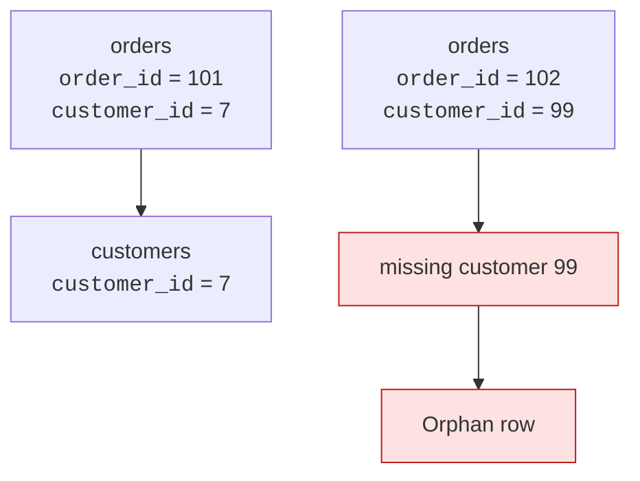
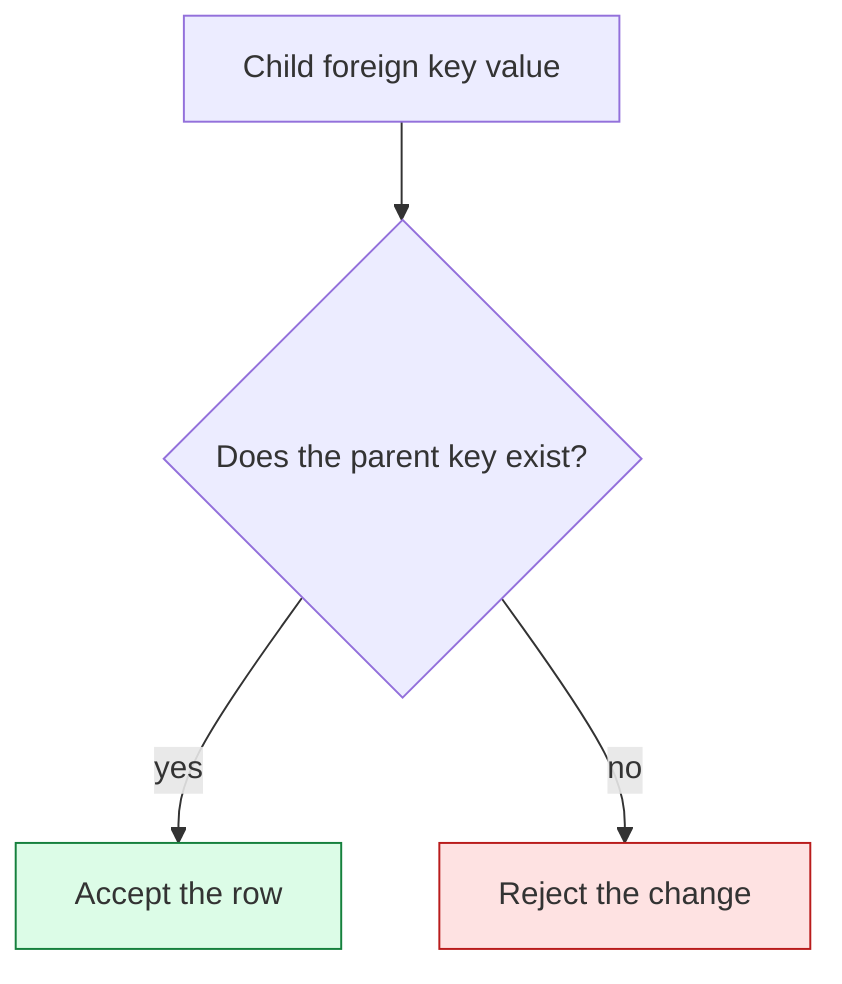
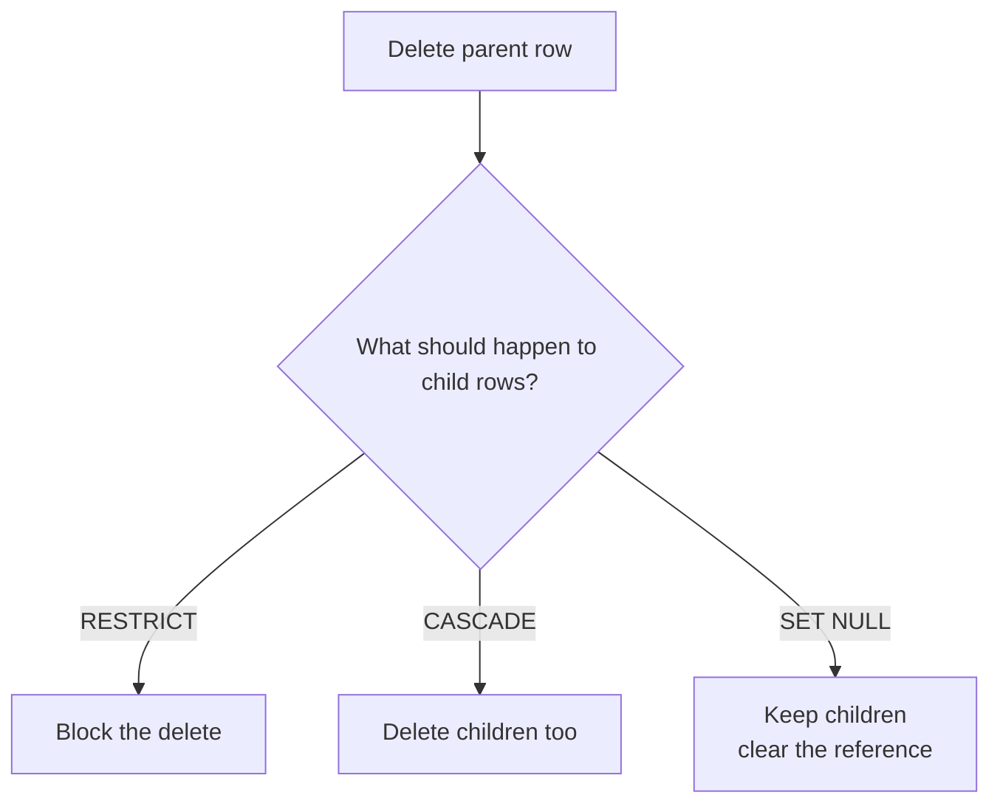
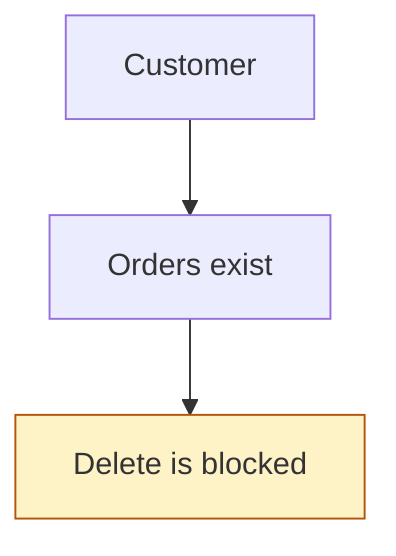
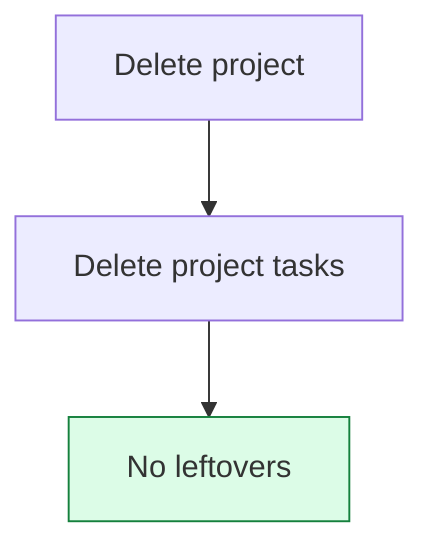
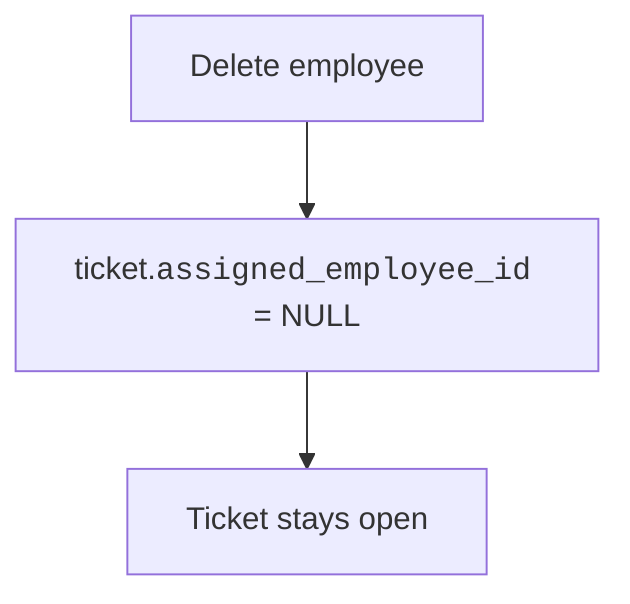
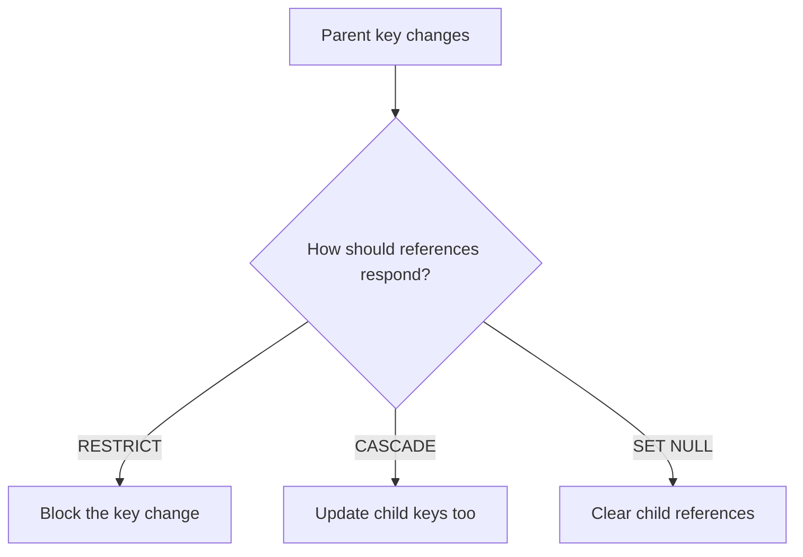
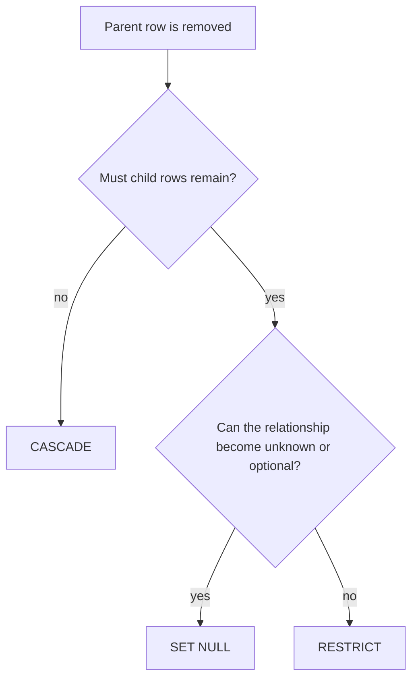

A foreign key says one row points to another. **Referential integrity**
is the guarantee that the pointer is not a lie.

If an order stores `customer_id = 7`, then customer `7` must exist. If a
comment stores `post_id = 20`, then post `20` must exist. The database
protects those promises so your design cannot quietly drift into broken
links.

<svg
  viewBox="0 0 640 210"
  role="img"
  aria-label="Three child squares point up at their parents, but one pointer ends at a ghost outline crossed in red — an orphan reference to a parent that does not exist"
  style={{ display: "block", width: "100%", maxWidth: "640px", height: "auto", margin: "2.5rem auto" }}
>
  <g style={{ color: "var(--ds-blue-500)" }} fill="currentColor">
    <circle cx="170" cy="58" r="13" />
    <circle cx="320" cy="58" r="13" />
  </g>
  <g fill="currentColor" opacity="0.3">
    <circle cx="483" cy="58" r="2.5" />
    <circle cx="479" cy="48" r="2.5" />
    <circle cx="470" cy="45" r="2.5" />
    <circle cx="461" cy="48" r="2.5" />
    <circle cx="457" cy="58" r="2.5" />
    <circle cx="461" cy="68" r="2.5" />
    <circle cx="470" cy="71" r="2.5" />
    <circle cx="479" cy="68" r="2.5" />
  </g>
  <g style={{ color: "var(--ds-red-500)" }} fill="currentColor">
    <rect x="460" y="55" width="20" height="5" rx="2.5" transform="rotate(45 470 58)" />
    <rect x="460" y="55" width="20" height="5" rx="2.5" transform="rotate(-45 470 58)" />
  </g>
  <g style={{ color: "var(--ds-green-500)" }} fill="currentColor">
    <rect x="158" y="138" width="24" height="24" rx="7" />
    <rect x="308" y="138" width="24" height="24" rx="7" />
    <rect x="458" y="138" width="24" height="24" rx="7" />
  </g>
  <g fill="currentColor" opacity="0.32">
    <circle cx="170" cy="122" r="3" />
    <circle cx="170" cy="104" r="3" />
    <circle cx="170" cy="86" r="3" />
    <circle cx="320" cy="122" r="3" />
    <circle cx="320" cy="104" r="3" />
    <circle cx="320" cy="86" r="3" />
  </g>
  <g style={{ color: "var(--ds-red-500)" }} fill="currentColor">
    <circle cx="470" cy="122" r="3" fillOpacity="0.5" />
    <circle cx="470" cy="104" r="3" fillOpacity="0.6" />
    <circle cx="470" cy="86" r="3" fillOpacity="0.7" />
  </g>
</svg>

## The orphan-row problem

An **orphan row** is a child row that points to a parent row that does
not exist.

Orphans are not just untidy. They break the meaning of the data. A join
may lose the order. A report may count revenue without a customer. A UI
may try to show details that do not exist.

Referential integrity says: every reference must point to something
real.

## Enforcement is part of the design

When you declare a foreign key, PostgreSQL checks inserts and updates on
the child table. It also checks changes to the parent table. If deleting
a parent would leave children pointing nowhere, the database needs a
rule for what should happen.

That rule is not just a DBA setting. It expresses what the relationship
*means*.

## Quick check

<MultipleChoice
  markdown={`What does referential integrity guarantee?

- Every table has the same number of rows.
  > Related tables usually have different row counts.
- [o] Every foreign key value points to an existing referenced row.
  > Referential integrity keeps child references from dangling.
- Every text value is spelled correctly.
  > Spelling is a data quality issue, but not the meaning of referential integrity.
- Every primary key starts at 1.
  > Key numbering is unrelated; the guarantee is about valid references.

Referential integrity means references remain real, not imaginary.`}
/>

## Delete behavior is a design choice

Imagine deleting a customer who has orders. What should happen to the
orders? PostgreSQL can enforce several designs.

The right answer depends on the meaning of the relationship.

### RESTRICT: child rows must keep their parent

`RESTRICT` means the parent cannot be deleted while children still refer
to it. This is a good fit when child rows make no sense without the
parent, or when deleting history would be dangerous.

Examples: orders that must keep their customer, invoice lines that must
keep their invoice, payments that must keep their account.

### CASCADE: child rows belong entirely to the parent

`CASCADE` means deleting the parent also deletes the children. This is a
good fit when child rows are dependent details that should disappear
with the parent.

Examples: comments on a deleted draft, line items in a temporary cart,
settings owned by a removed profile.

### SET NULL: the child can survive without a parent

`SET NULL` means the child row remains, but the foreign key is cleared.
This only works when the foreign key column allows `NULL`.

Examples: a support ticket whose assigned employee left, or a blog post
whose optional editor was removed.

## Quick check

<MultipleChoice
  markdown={`Which delete behavior best matches "a task should disappear when its temporary project is deleted"?

- RESTRICT.
  > RESTRICT would block deleting the project while tasks exist.
- [o] CASCADE.
  > CASCADE matches dependent child rows that should be removed with their parent.
- SET NULL on a NOT NULL column.
  > SET NULL requires the foreign key column to allow nulls.
- No foreign key.
  > Removing the constraint would allow broken references instead of defining the intended behavior.

Delete behavior should match the real meaning of the parent-child relationship.`}
/>

## Watch CASCADE and RESTRICT differ

This block creates two parent-child designs. Deleting a draft cascades to
its comments. Deleting an account with invoices is restricted.

<SqlCodeBlock
  dialect="postgres"
  title="ON DELETE CASCADE versus RESTRICT"
  initSql={`CREATE TABLE drafts (
  draft_id INTEGER PRIMARY KEY,
  title    TEXT NOT NULL
);

CREATE TABLE draft_comments (
  comment_id INTEGER PRIMARY KEY,
  draft_id   INTEGER NOT NULL REFERENCES drafts(draft_id) ON DELETE CASCADE,
  body       TEXT NOT NULL
);

CREATE TABLE accounts (
  account_id INTEGER PRIMARY KEY,
  name       TEXT NOT NULL
);

CREATE TABLE invoices (
  invoice_id INTEGER PRIMARY KEY,
  account_id INTEGER NOT NULL REFERENCES accounts(account_id) ON DELETE RESTRICT,
  total      NUMERIC NOT NULL
);

INSERT INTO drafts VALUES (1, 'Temporary plan');
INSERT INTO draft_comments VALUES (10, 1, 'Needs revision');

INSERT INTO accounts VALUES (1, 'Ada Co');
INSERT INTO invoices VALUES (100, 1, 250.00);`}
  starterCode={`-- CASCADE: deleting the draft also deletes its comments.
DELETE FROM drafts
WHERE
  draft_id = 1;

SELECT
  *
FROM
  draft_comments;

-- RESTRICT: deleting this account would orphan an invoice, so it fails.
DELETE FROM accounts
WHERE
  account_id = 1;

SELECT
  *
FROM
  invoices;`}
/>

The first delete removes dependent comments. The second delete is
blocked because invoices are treated as records that must not lose their
account.

## ON UPDATE is the same kind of question

Primary keys should be stable, but natural keys sometimes change. `ON
UPDATE` actions define what happens to child references if the parent
key changes.

The design lesson is the same: choose the behavior that matches the
meaning of your data. If a key change would be dangerous, restrict it.
If the child should follow the parent identity, cascade may make sense.
If the relationship is optional, setting null may be appropriate.

<Callout type="info" title="Prefer stable keys">
If you often need `ON UPDATE CASCADE`, ask whether the parent key is too
changeable. A generated surrogate key usually avoids that pressure by
keeping identity separate from editable real-world attributes.
</Callout>

## How to choose

Use this decision path as a design conversation, not a mechanical rule.

Ask what the child row means without the parent. If it means nothing,
cascade may be honest. If it must preserve history, restrict the delete.
If it can exist unattached, set the reference to null.

## Try it: one delete, no leftovers

Time to use a cascade yourself. The schema below has posts and
comments, and `comments.post_id` is declared `ON DELETE CASCADE` —
comments are dependent details that should not outlive their post.
Your job is a single statement.

<SqlChallengeCard
  dialect="postgres"
  title="Delete a post and let the cascade clean up"
  instructions={`Post 1 ('Spam post') must go. Write a single \`DELETE\` statement that removes the post with \`id = 1\` from \`posts\`. Do **not** delete from \`comments\` yourself — the foreign key's \`ON DELETE CASCADE\` should remove that post's comments automatically. Post 2 and its comment must survive.`}
  initSql={`CREATE TABLE posts (
  id    INTEGER PRIMARY KEY,
  title TEXT NOT NULL
);

CREATE TABLE comments (
  id      INTEGER PRIMARY KEY,
  post_id INTEGER NOT NULL REFERENCES posts(id) ON DELETE CASCADE,
  body    TEXT NOT NULL
);

INSERT INTO posts VALUES
  (1, 'Spam post'),
  (2, 'Keep this post');

INSERT INTO comments VALUES
  (10, 1, 'Spam comment one'),
  (11, 1, 'Spam comment two'),
  (12, 2, 'A real comment');`}
  starterCode={`-- One DELETE on posts. The cascade handles the comments.`}
  solutionSql={`DELETE FROM posts
WHERE
  id = 1;`}
  tests={[
    {
      id: "post_gone",
      name: "Post 1 is deleted",
      description: "No row with id = 1 remains in posts",
      runAfterSql: "SELECT COUNT(*) FROM posts WHERE id = 1;",
      runAfterEquals: 0,
    },
    {
      id: "post_kept",
      name: "Post 2 survives",
      description: "Exactly one post should remain",
      runAfterSql: "SELECT COUNT(*) FROM posts;",
      runAfterEquals: 1,
    },
    {
      id: "comments_cascaded",
      name: "Post 1's comments are gone",
      description: "The cascade removed both spam comments",
      runAfterSql: "SELECT COUNT(*) FROM comments WHERE post_id = 1;",
      runAfterEquals: 0,
    },
    {
      id: "comments_kept",
      name: "Post 2's comment survives",
      description: "Exactly one comment should remain",
      runAfterSql: "SELECT COUNT(*) FROM comments;",
      runAfterEquals: 1,
    },
  ]}
/>

If you ran it correctly, you never touched `comments`, yet two of its
rows are gone. That is the point of declaring the behavior in the
schema: the rule travels with the data, not with whoever happens to
be writing the delete.

## Check your understanding

<MultipleChoice
  markdown={`What is an orphan row?

- A parent row with many children.
  > Having many children is a normal one-to-many relationship.
- [o] A child row whose foreign key points to a parent row that does not exist.
  > Orphans are exactly the broken references referential integrity prevents.
- A row with a primary key.
  > Primary keys identify rows; they do not make rows orphaned.
- A row that appears at the top of a result set.
  > Result order is unrelated to parent-child validity.

Orphan rows are broken links in the data model.`}
/>

<MultipleChoice
  markdown={`When is \`ON DELETE RESTRICT\` a good design choice?

- When children should always be deleted automatically with the parent.
  > That meaning is modeled by \`CASCADE\`, not \`RESTRICT\`.
- [o] When child rows must not lose their parent, so deleting the parent should be blocked.
  > RESTRICT protects child rows by refusing a parent delete that would orphan them.
- When the foreign key should become null every time.
  > That meaning is modeled by \`SET NULL\` when the column allows nulls.
- When there is no relationship between the tables.
  > Delete behavior only matters because a relationship exists.

RESTRICT is the "do not break this relationship" option.`}
/>

<MultipleChoice
  markdown={`What does \`ON DELETE CASCADE\` mean?

- Deleting a child row deletes the whole database.
  > Cascade applies to related rows through the declared foreign key, not to the entire database.
- Deleting a parent sets every child foreign key to zero.
  > Cascade deletes child rows; it does not invent a replacement value.
- [o] Deleting a parent row automatically deletes child rows that reference it.
  > CASCADE is useful for dependent data that should not outlive its parent.
- Deleting a parent is always blocked.
  > Blocking the delete is the role of RESTRICT.

CASCADE treats child rows as dependent parts of the parent.`}
/>

<MultipleChoice
  markdown={`What must be true for \`ON DELETE SET NULL\` to work?

- The child foreign key column must be \`NOT NULL\`.
  > A NOT NULL column cannot be set to null, so this would conflict with SET NULL.
- [o] The child foreign key column must allow \`NULL\`.
  > SET NULL needs somewhere to put the cleared reference, so the column cannot be \`NOT NULL\`.
- The parent table must have no primary key.
  > A referenced parent key is still required.
- The child row must be deleted first.
  > SET NULL keeps the child row instead of requiring its deletion.

SET NULL models an optional relationship where the child can survive unattached.`}
/>

<MultipleChoice
  markdown={`Why are \`ON DELETE\` and \`ON UPDATE\` actions design choices?

- Because they change the font used in ER diagrams.
  > They affect data behavior, not diagram appearance.
- Because they decide whether SQL keywords are uppercase.
  > Keyword style is unrelated to relationship meaning.
- [o] Because they define what the relationship means when referenced rows change or disappear.
  > The action encodes whether children are dependent, historical, optional, or protected.
- Because PostgreSQL chooses a random behavior unless you draw a diagram.
  > PostgreSQL follows declared constraints and defaults; designers should choose intentionally.

Reference actions turn relationship meaning into enforced database behavior.`}
/>
