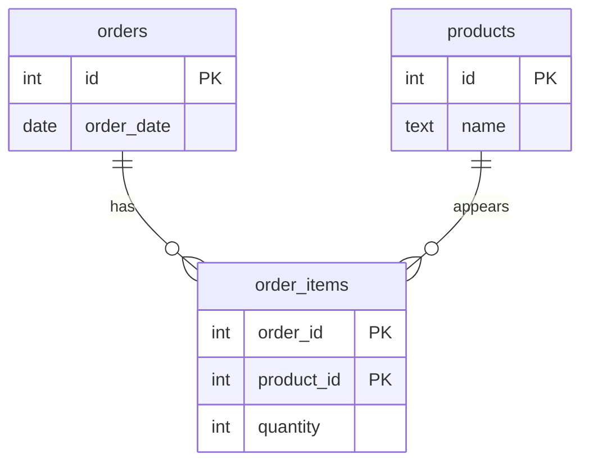
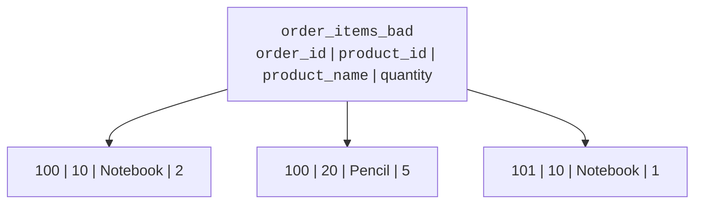
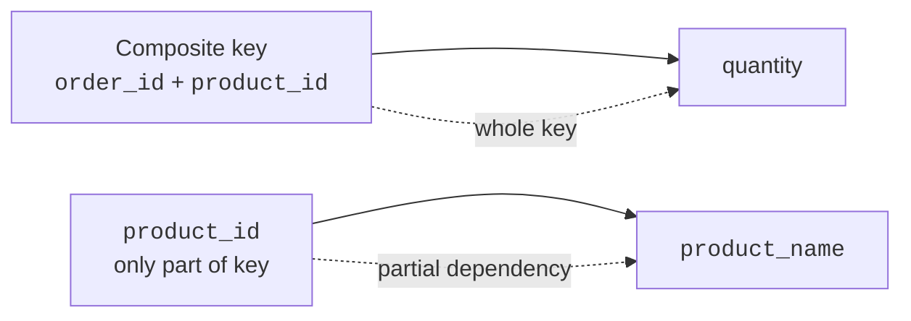
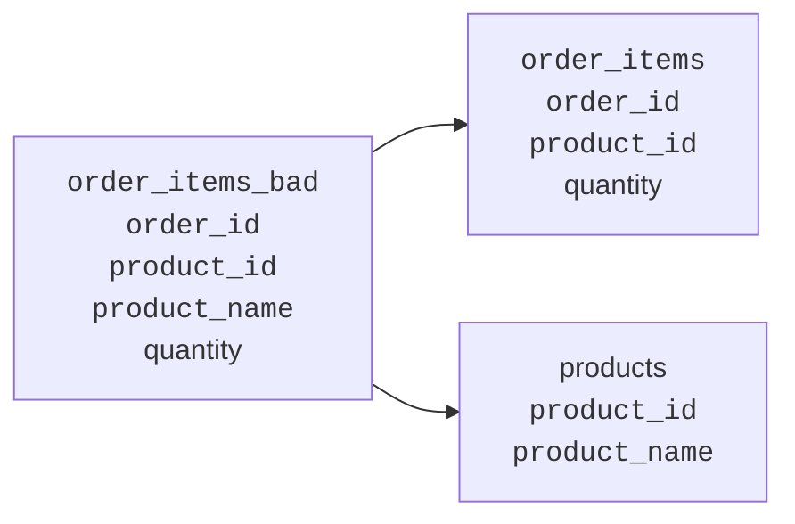
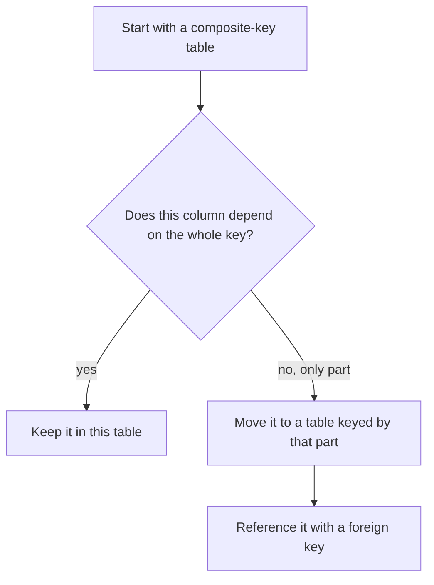
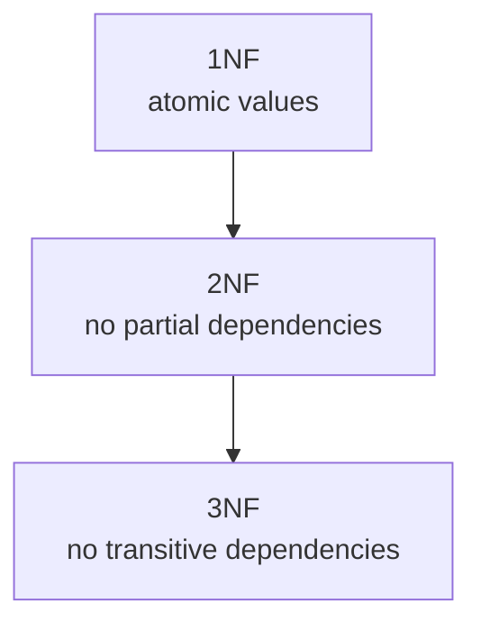

Some normalization problems appear only after 1NF is already fixed. Your
cells are atomic. Your repeating groups are gone. But a table can still
store facts in the wrong place.

<Figure
  slug="db-second-normal-form-cutout"
  alt="Second normal form, an isometric illustration"
/>

**Second normal form (2NF)** asks one focused question: when a table has
a composite key, does every non-key column depend on the whole key?

## 2NF only matters with composite keys

A **composite key** is a primary key made from more than one column. For
example, an order item can be identified by the pair `(order_id,
product_id)`: the same product can appear on many orders, and the same
order can contain many products, but the pair identifies one line.

<Figure
  slug="db-second-normal-form-2nf-only-matters-inline-cutout"
  alt="A card held by two tabs at once, a fact that depends on only one of them being lifted out to its own card"
  caption="A fact that depends on only part of a composite key belongs in its own table."
/>

If a table has a single-column primary key, it cannot have a dependency
on only *part* of the key. There is no part to split off. That is why
2NF is specifically about composite-key tables.

## Partial dependency: the 2NF problem

A **partial dependency** happens when a non-key column depends on only
one part of a composite key.

Consider this 1NF table:

The key is `(order_id, product_id)`. The `quantity` depends on the whole
key: order 100 bought 2 of product 10, while order 101 bought 1 of the
same product.

But `product_name` depends only on `product_id`. Product 10 is Notebook
no matter which order it appears on.

That partial dependency means the product name is copied into every
order line for that product. If the name changes from Notebook to Field
Notebook, many rows must be updated.

## Quick check

<MultipleChoice
  markdown={`When does 2NF become relevant?

- [o] When a table has a composite key and a non-key column may depend on only part of it.
  > 2NF is about removing partial dependencies from composite-key tables.
- Only after denormalizing a reporting table.
  > Denormalization is a later deliberate trade-off, not the condition for 2NF.
- Whenever a table has any text column.
  > Text columns do not determine whether 2NF is relevant.
- Only when a table has no primary key at all.
  > 2NF assumes you can reason about a key and how columns depend on it.

2NF is narrow but important: composite key, whole-key dependency.`}
/>

<MultipleChoice
  markdown={`In an order item keyed by order and product, which column most clearly depends on the whole key?

- Product name.
  > The product name depends on the product, not on the particular order-product pair.
- Product category.
  > The category is a product fact, so it depends on product only.
- [o] Quantity ordered.
  > Quantity describes how many of that product appear on that specific order.
- Customer email.
  > The customer email depends on the customer, not on the order-product pair.

A whole-key fact needs all parts of the composite key to make sense.`}
/>

## The fix: split facts by what they depend on

To reach 2NF, move each partial dependency to the table where its
determinant is the key. Product facts belong in `products`. Order-line
facts stay in `order_items`.

The split removes the repeated product name from the order-items table.
The order item keeps only facts about the complete `(order_id,
product_id)` pair.

<SqlCodeBlock
  dialect="postgres"
  title="Splitting a partial dependency"
  initSql={`CREATE TABLE orders (
  id         INTEGER PRIMARY KEY,
  order_date DATE NOT NULL
);

CREATE TABLE products (
  id   INTEGER PRIMARY KEY,
  name TEXT NOT NULL
);

CREATE TABLE order_items (
  order_id   INTEGER NOT NULL REFERENCES orders(id),
  product_id INTEGER NOT NULL REFERENCES products(id),
  quantity   INTEGER NOT NULL CHECK (quantity > 0),
  PRIMARY KEY (order_id, product_id)
);

INSERT INTO orders VALUES
  (100, DATE '2026-01-10'),
  (101, DATE '2026-01-11');

INSERT INTO products VALUES
  (10, 'Notebook'),
  (20, 'Pencil');

INSERT INTO order_items VALUES
  (100, 10, 2),
  (100, 20, 5),
  (101, 10, 1);`}
  starterCode={`-- Product names are stored once, then joined when needed.
SELECT
  oi.order_id,
  p.name AS product_name,
  oi.quantity
FROM
  order_items oi
  JOIN products p ON p.id = oi.product_id
ORDER BY
  oi.order_id,
  p.name;`}
/>

## A step-by-step 2NF test

When you see a composite-key table, walk through each non-key column:

For `order_items`, the test looks like this:

- `quantity`: depends on both `order_id` and `product_id`, so it stays.
- `product_name`: depends only on `product_id`, so it moves.
- `order_date`: depends only on `order_id`, so it belongs in `orders`.

<Callout type="warn" title="2NF is not about every duplicate value">
Two rows can naturally contain the same quantity, such as `1`. That is
not a 2NF problem. 2NF cares about dependency: whether a column's value
is determined by the whole composite key or only part of it.
</Callout>

## 2NF in the normal-forms path

1NF made every cell atomic. 2NF now checks whether each non-key column
belongs with the whole composite key. 3NF will ask whether non-key
columns depend on other non-key columns.

<Figure
  slug="db-second-normal-form-inline-cutout"
  alt="A wide table split so that facts depending on only part of its key move out into their own smaller table"
  caption="Second normal form applies only where the key is made of several columns."
/>

## Check your understanding

<MultipleChoice
  markdown={`A table has primary key (order_id, product_id) and columns product_name and quantity. Which column violates 2NF?

- Quantity, because it is numeric.
  > Numeric values can be valid whole-key facts.
- Order_id, because it repeats across rows.
  > Repetition of a key value across different line items is expected.
- [o] Product name, because it depends only on product_id.
  > Product name is determined by one part of the composite key, not by the whole pair.
- Product_id, because it is part of the key.
  > Key columns are not the non-key columns tested for partial dependency.

A 2NF violation is a non-key column depending on part of a composite key.`}
/>

<MultipleChoice
  markdown={`Where should product_name go when fixing the order_items example?

- In the orders table keyed by order_id.
  > Product name does not depend on the order alone.
- In no table at all.
  > The fact still matters; it just needs the correct home.
- [o] In a products table keyed by product_id.
  > Product name is a fact about the product, so product_id should determine it once.
- In every order_items row for readability.
  > Repeating the name in order_items keeps the partial dependency.

Move a partial dependency to the table keyed by the determinant.`}
/>

<MultipleChoice
  markdown={`Which statement best describes a column that is safe to keep in a 2NF order_items table?

- It depends only on product_id.
  > A column depending only on product_id belongs in products.
- [o] It depends on the specific combination of order_id and product_id.
  > A line-item fact needs the whole composite key.
- It depends only on order_id.
  > A column depending only on order_id belongs in orders.
- It is repeated in many rows.
  > Repetition alone does not prove the dependency is correct.

In 2NF, non-key columns must describe the whole composite-key row.`}
/>

<MultipleChoice
  markdown={`A table has a single-column primary key. What should you remember about 2NF?

- It must be checked for partial dependencies in the same way as a composite-key table.
  > Partial dependency means depending on part of a composite key, so a one-column key changes the question.
- Every non-key column must be deleted.
  > Single-key tables can have many valid non-key columns.
- It must be converted to a composite key before it can be normalized.
  > Composite keys are not required for normalization.
- [o] It automatically has no possible partial dependency on part of a composite key.
  > With a one-column key, there is no separate key part for a non-key column to depend on.

2NF is only a separate concern when a key has multiple columns.`}
/>
