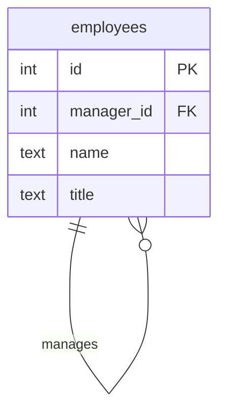
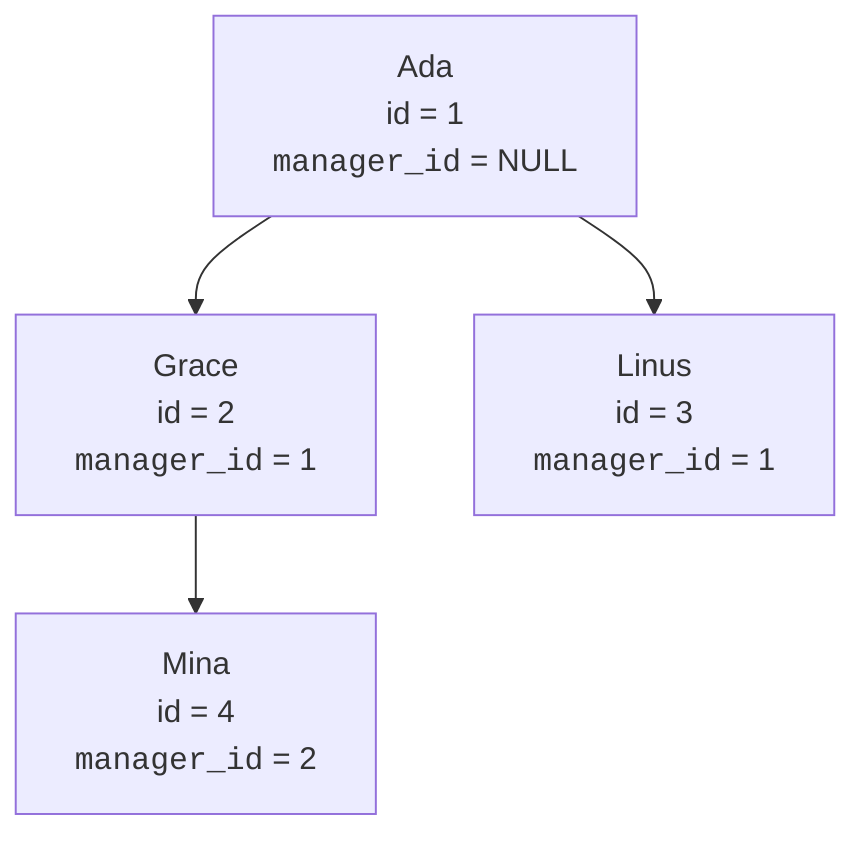
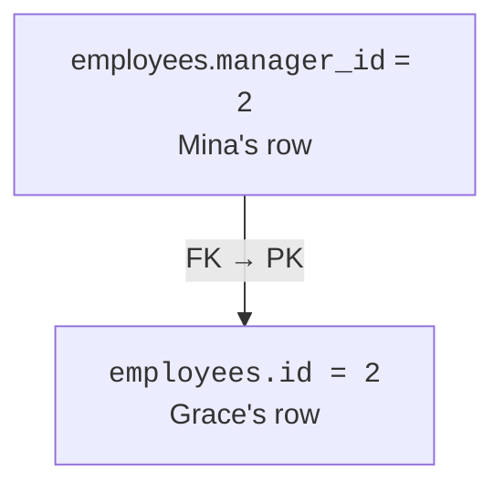
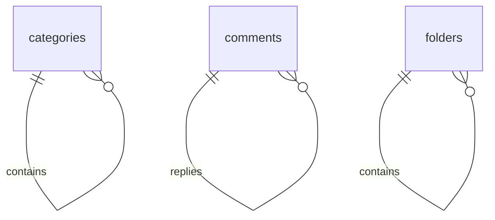
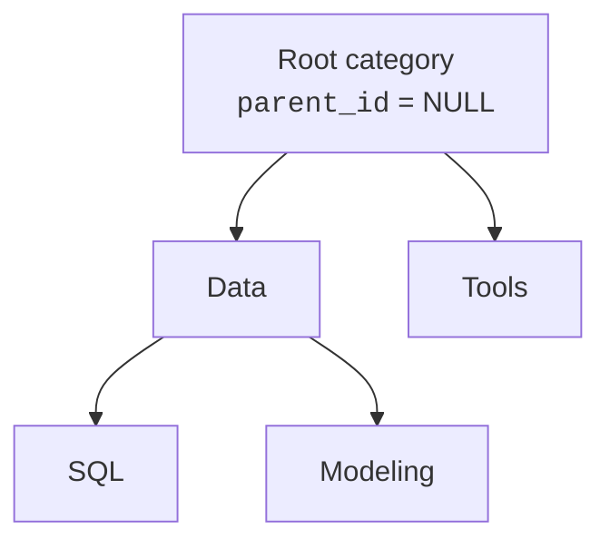
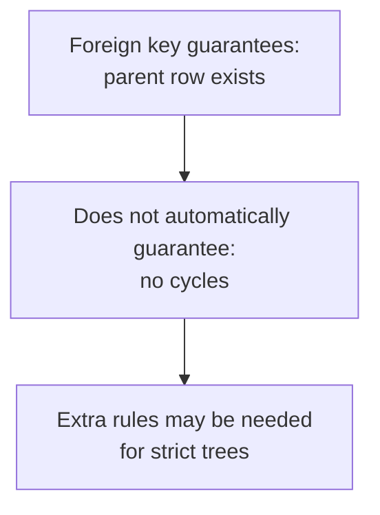

Sometimes a row relates to another row in the **same table**. An
employee has a manager, who is also an employee. A category has a
parent category. A comment may reply to another comment.

<Figure
  slug="db-self-referencing-cutout"
  alt="Self-referencing relationships, an isometric illustration"
/>

This is a **self-referencing relationship**. The foreign key points
back to the table's own primary key.

## One table, two roles

The table appears twice in your thinking: once as the child row, and
once as the parent row it points to.

`manager_id` stores another employee's `id`. The table is not two
different tables; it is one table used in two relationship roles.

The top row often has no parent. In an org chart, the CEO has no
manager. In a category tree, the root category has no parent.

## The foreign key points back to the same table

A self-reference is still just a foreign key. The referenced table
happens to be the same table.

This design gives you a flexible hierarchy without creating separate
tables for manager, employee, grandmanager, and so on. Each row stores
only its immediate parent.

## Quick check

<MultipleChoice
  markdown={`In an \`employees\` table, what does \`manager_id REFERENCES employees(id)\` mean?

- The manager must be stored in a separate \`managers\` table.
  > The reference points back to the same \`employees\` table.
- [o] Each employee row can point to another employee row as its manager.
  > The same table supplies both the child employee and the parent manager.
- Every employee must manage themselves.
  > The foreign key allows a row to point to another row; a self-management rule would require a separate check.
- The table cannot be joined because it references itself.
  > Self-referencing tables are commonly joined by using aliases.

A self-referencing foreign key connects rows within one table.`}
/>

## Querying parent rows with aliases

When a table joins to itself, SQL needs aliases so each role has a
name. Here `e` means the employee row, and `m` means the manager row.

<SqlCodeBlock
  dialect="postgres"
  title="Employees and their managers"
  initSql={`CREATE TABLE employees (
  id         INTEGER PRIMARY KEY,
  name       TEXT NOT NULL,
  title      TEXT NOT NULL,
  manager_id INTEGER REFERENCES employees(id)
);

INSERT INTO employees (id, name, title, manager_id) VALUES
  (1, 'Ada', 'CEO', NULL),
  (2, 'Grace', 'Engineering Manager', 1),
  (3, 'Linus', 'Operations Manager', 1),
  (4, 'Mina', 'Developer', 2),
  (5, 'Noor', 'Developer', 2),
  (6, 'Rosa', 'Finance Manager', 1),
  (7, 'Omar', 'Developer', 2),
  (8, 'Priya', 'Senior Developer', 2),
  (9, 'Quinn', 'Site Reliability Engineer', 2),
  (10, 'Ruth', 'Support Lead', 3),
  (11, 'Sam', 'Support Engineer', 10),
  (12, 'Tariq', 'Support Engineer', 10),
  (13, 'Uma', 'Logistics Coordinator', 3),
  (14, 'Viktor', 'Logistics Coordinator', 3),
  (15, 'Wen', 'Accountant', 6),
  (16, 'Xenia', 'Accountant', 6),
  (17, 'Yusuf', 'Payroll Officer', 6),
  (18, 'Zara', 'Junior Developer', 8),
  (19, 'Bruno', 'Junior Developer', 8),
  (20, 'Chidi', 'Intern', 18),
  (21, 'Dara', 'Intern', 19),
  (22, 'Elif', 'QA Engineer', 9),
  (23, 'Farid', 'QA Engineer', 9),
  (24, 'Nadia', 'Office Manager', 1);`}
  starterCode={`SELECT
  e.name AS employee,
  e.title,
  m.name AS manager
FROM
  employees e
  LEFT JOIN employees m ON m.id = e.manager_id
ORDER BY
  e.id;`}
/>

The `LEFT JOIN` matters because Ada has no manager. An inner join would
hide the root row, which is usually not what you want when showing a
whole hierarchy.

## Trees, threads, and folders

The same pattern models many structures:

A `parent_id` column gives each row one parent. Many rows can share the
same parent, which creates a tree.

## A self-reference in the wild

This pattern is not a textbook curiosity. The Chinook sample database,
a model of a digital music store, stores its staff in a single
`employee` table with a `reports_to` column pointing back at
`employee_id`. The whole org chart lives in one table. Run the query
and read the result from the top down: the general manager has no
manager, and everyone else's `reports_to` chain ends at him.

<Figure
  slug="db-self-referencing-relationships-inline-cutout"
  alt="One crate with a cord that leaves it and comes back to another crate of the very same kind"
  caption="One table and one column hold an entire hierarchy, however deep it runs."
/>

<SqlCodeBlock
  dialect="postgres"
  title="Chinook's org chart is one self-referencing table"
  remoteInitSql="postgres/chinook_postgres_AutoIncrementPKs.sql"
  tables={["employee"]}
  starterCode={`SELECT
  e.first_name || ' ' || e.last_name AS employee,
  e.title,
  m.first_name || ' ' || m.last_name AS manager
FROM
  employee e
  LEFT JOIN employee m ON m.employee_id = e.reports_to
ORDER BY
  e.employee_id;`}
/>

Notice it is the same query shape you wrote above, two aliases, one
table, a `LEFT JOIN` to keep the root row. Once you can read this
pattern, you will spot it everywhere: ticketing systems, folder
trees, category hierarchies, comment threads.

## Guardrails and design limits

A basic self foreign key proves that the parent exists. It does not by
itself prevent every possible bad hierarchy.

For example, a foreign key does not automatically prevent cycles such
as A parent of B, B parent of C, and C parent of A. It also does not
stop a row from pointing to itself unless you add a check.

For this course, the core idea is the table shape: one nullable foreign
key points back to the same table's primary key.

## Another quick check

<MultipleChoice
  markdown={`Why do self-joins use aliases like \`employees e\` and \`employees m\`?

- Because aliases create temporary copies of the table on disk.
  > Aliases are just query names for roles; they do not copy the table.
- Because foreign keys require aliases in table definitions.
  > Aliases are used in queries, not in the foreign key definition itself.
- [o] Because the same table is playing two roles in the query, employee and manager.
  > Aliases let SQL distinguish which role each column reference belongs to.
- Because \`employees\` is too long for PostgreSQL to parse.
  > PostgreSQL can parse long names; aliases clarify roles.

Aliases make one table readable when it appears more than once in a query.`}
/>

## Check your understanding

<MultipleChoice
  markdown={`Which real-world design is a good fit for a self-referencing relationship?

- Orders pointing to customers.
  > That uses two different entity tables, not one table pointing to itself.
- [o] Categories where each category may have a parent category.
  > Parent and child categories are rows in the same table, so a self-reference fits.
- Users having one profile.
  > That is usually a one-to-one relationship between two tables.
- Students taking courses.
  > That is many-to-many between two different entity types.

Self-references fit hierarchies or threads where parent and child are the same kind of thing.`}
/>

<MultipleChoice
  markdown={`Why is \`manager_id\` often nullable in an \`employees\` table?

- [o] Because the top employee in the hierarchy may have no manager.
  > A null parent represents the root of the hierarchy.
- Because foreign keys only work when columns are nullable.
  > Foreign keys can be nullable or not nullable; nullability is a design choice.
- Because every employee must have two managers.
  > Null does not mean two managers; it means no referenced manager row.
- Because primary keys are nullable too.
  > Primary keys are never null.

A nullable self-reference can represent the root row of a tree.`}
/>

<MultipleChoice
  markdown={`What does a basic self-referencing foreign key guarantee?

- That rows are displayed in tree order automatically.
  > Display order is controlled by queries, not by the foreign key itself.
- [o] That any non-null parent id points to an existing row in the same table.
  > The foreign key enforces referential integrity within the table.
- That every row has at least three children.
  > A foreign key does not require child rows to exist.
- That the hierarchy can never contain a cycle.
  > Cycle prevention requires additional logic beyond a basic foreign key.

The self foreign key protects references, while stricter hierarchy rules may need extra constraints or application logic.`}
/>

<MultipleChoice
  markdown={`In the employee-manager query, why use a \`LEFT JOIN\` from employees to managers?

- [o] To keep employees who have no manager, such as the top-level CEO.
  > The root row has \`manager_id = NULL\`, so a left join preserves it with a null manager name.
- To duplicate every employee row twice.
  > A left join keeps unmatched employees, but it does not intentionally duplicate every row.
- To prevent the foreign key from being checked.
  > Joins do not disable constraints.
- To require every manager to have the same title.
  > Join type does not impose title rules.

A left join is useful when the parent row is optional.`}
/>
