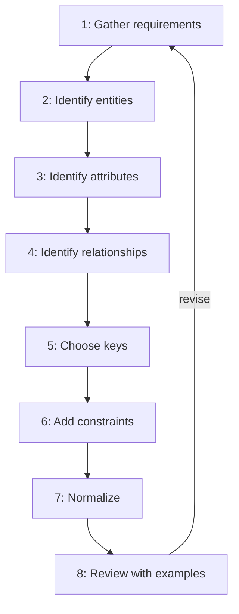
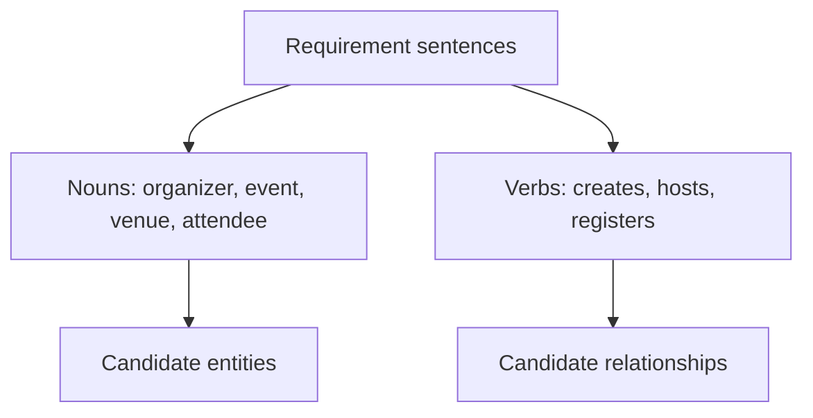
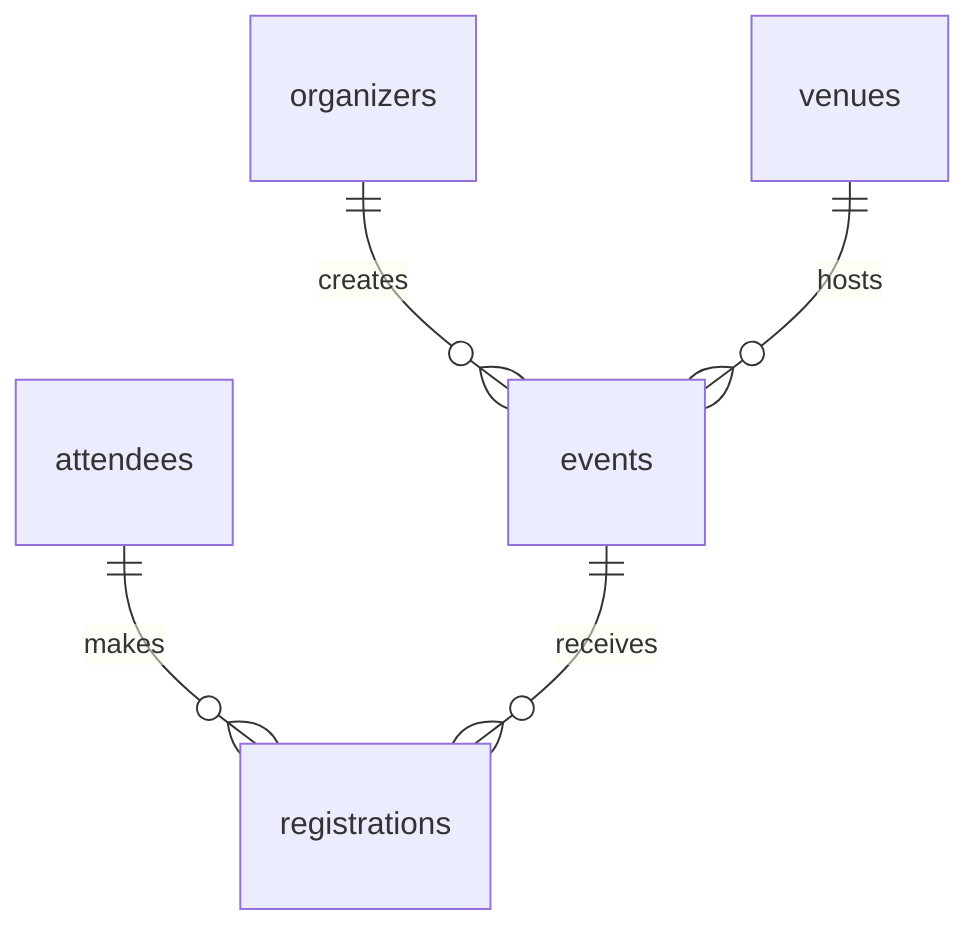
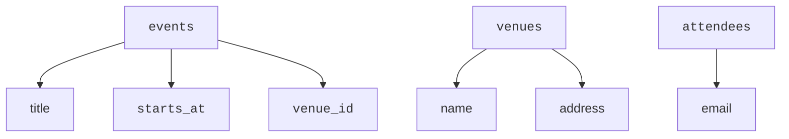
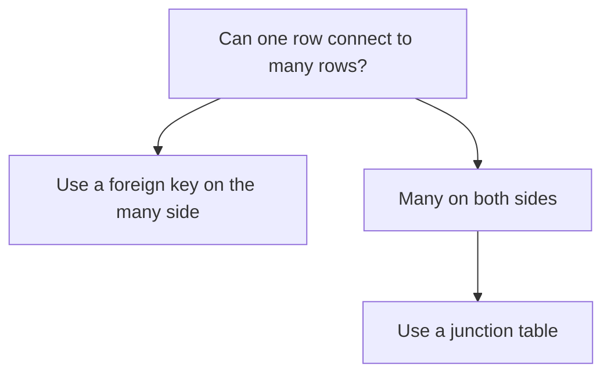
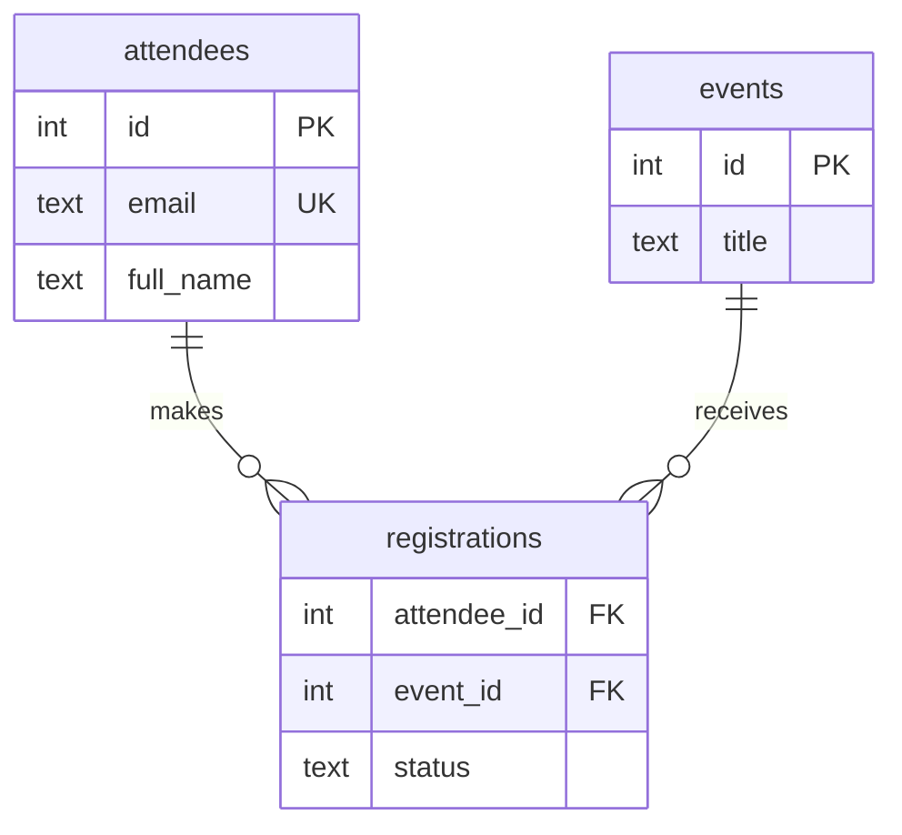
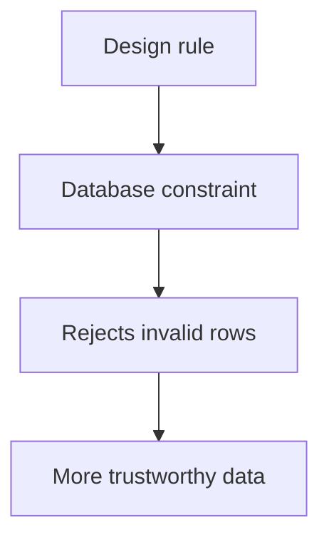
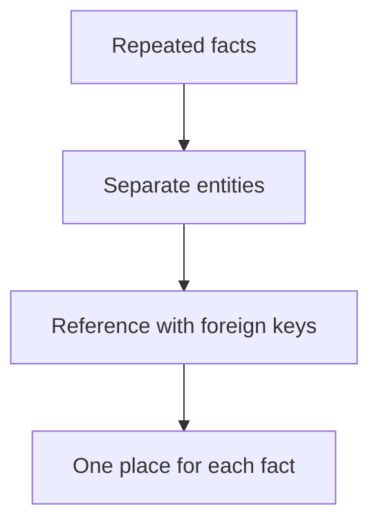
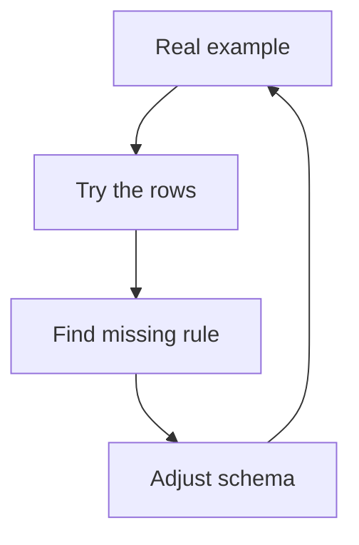

Imagine someone asks you to design a database for a product you
barely know yet.

<Figure
  slug="db-the-design-process-cutout"
  alt="A repeatable design process, an isometric illustration"
/>

You could start typing `CREATE TABLE`, but that usually means the
schema will reflect your first guess. A better design starts with a
repeatable process.

<Figure
  slug="db-the-design-process-inline-cutout"
  alt="Four benches in a row, a design moving from loose sketch to ruled frame to fitted parts to a working cabinet"
  caption="Sketch, model, tables, constraints: the same four steps for every schema."
/>

The goal is not to make design mechanical. The goal is to make sure
you ask the important questions every time.

The flowchart shows the loop; here is what each step actually asks of you,
as a checklist you can carry into any design:

<Steps>
<Step>

**Gather requirements**

Write plain sentences about what the system must remember. **Nouns** hint at
entities; **verbs** hint at relationships.

</Step>
<Step>

**Identify entities**

Pick out the kinds of things worth their own table, each with its own
identity and facts.

</Step>
<Step>

**Identify attributes**

Place each fact on the entity it actually describes, not on a neighbour.

</Step>
<Step>

**Identify relationships**

Ask "how many connect to how many?" in both directions to find the
cardinality.

</Step>
<Step>

**Choose keys**

Give each row a stable primary key, and connect rows to others with foreign
keys.

</Step>
<Step>

**Add constraints**

Turn design rules into `NOT NULL`, `UNIQUE`, `CHECK`, and `REFERENCES` so the
database itself rejects bad data.

</Step>
<Step>

**Normalize**

Check that every fact lives in exactly one place, with no harmful repetition.

</Step>
<Step>

**Review with examples**

Walk real scenarios through the schema; when one breaks, loop back and revise.

</Step>
</Steps>

## Step 1: gather requirements

Start with plain sentences about what the system must remember and
what people will do with it.

For a small event system, requirements might say:

- An organizer creates events.
- A venue hosts many events.
- An attendee registers for events.
- A registration has a status and registration time.

In those sentences, **nouns** hint at things and **verbs** hint at
relationships.

Requirements are never perfect. Write down examples, exceptions, and
rules while they are still cheap to change.

## Step 2: identify entities

An **entity** is a kind of thing your system tracks. It usually has
its own identity, attributes, and relationships.

<Figure
  slug="db-the-design-process-step-1-gather-inline-cutout"
  alt="A figure at a bench collecting plain cards into a tray before any tool is picked up"
  caption="Gather the requirements before picking up a tool, or the schema will be a guess."
/>

From the event requirements, likely entities are:

- `organizers`
- `venues`
- `events`
- `attendees`
- `registrations`

`registrations` may sound like an action, but it deserves a table
because it has facts of its own: status, time, and the two things it
connects.

## Step 3: identify attributes

An **attribute** is a fact about one entity. Put each fact where it
belongs.

Ask whether each attribute describes the row itself. A venue address
does not describe one event; it describes the venue. That is why it
belongs on `venues`, not repeated on every `events` row.

<MultipleChoice
  markdown={`A requirement says, "A venue has a street address, and many events happen at the same venue." Where should the address usually live?

- [o] On the \`venues\` table.
  > The address describes the venue itself, so one venue row can store the fact once.
- In the application only.
  > A fact that the system must remember usually belongs in the database design.
- On every \`events\` row.
  > Repeating the same address on many event rows makes updates harder and can create disagreement.
- On the \`organizers\` table.
  > The address is not a fact about the organizer unless the requirement says organizers have addresses.

Attributes belong with the entity they describe.`}
/>

## Step 4: identify relationships and cardinality

A **relationship** says how entities connect. **Cardinality** says how
many rows may be connected.

Ask questions in both directions:

- Can one venue host many events?
- Must every event have one venue?
- Can one attendee register for many events?
- Can one event have many attendees?

The attendee-event relationship is many-to-many, so it becomes the
`registrations` table.

## Step 5: choose keys

A **primary key** gives each row stable identity. A **foreign key**
connects a row to another row.

Most learning schemas use generated integer primary keys because they
are simple and stable. Natural facts such as email addresses can still
be protected with `UNIQUE`.

<MultipleChoice
  markdown={`Why might a table use a generated \`id\` as the primary key and still make \`email\` unique?

- [o] Because \`id\` is stable for references, while \`email\` still must not repeat.
  > The generated key supports foreign keys, and the unique email rule protects real-world meaning.
- Because primary keys and unique constraints do the same job.
  > A primary key identifies rows for relationships, while a unique constraint protects a business rule.
- Because PostgreSQL requires every text column to be unique.
  > PostgreSQL only enforces uniqueness when the schema declares it.
- Because foreign keys cannot reference generated columns.
  > Foreign keys commonly reference generated primary keys.

Keys identify rows and constraints protect additional rules.`}
/>

## Step 6: add constraints

**Constraints** turn design decisions into database rules. They prevent
bad data from becoming everyone else's problem.

Common constraints include:

- `NOT NULL` for required facts
- `UNIQUE` for facts that cannot repeat
- `CHECK` for allowed values or ranges
- `REFERENCES` for valid relationships

<SqlCodeBlock
  expectError
  dialect="postgres"
  title="Turn design rules into constraints"
  initSql={`DROP TABLE IF EXISTS registrations;
DROP TABLE IF EXISTS attendees;
DROP TABLE IF EXISTS events;

CREATE TABLE attendees (
    id INT GENERATED ALWAYS AS IDENTITY PRIMARY KEY,
    email TEXT NOT NULL UNIQUE,
    full_name TEXT NOT NULL
);

CREATE TABLE events (
    id INT GENERATED ALWAYS AS IDENTITY PRIMARY KEY,
    title TEXT NOT NULL,
    starts_at TIMESTAMP NOT NULL
);

CREATE TABLE registrations (
    attendee_id INT NOT NULL REFERENCES attendees(id),
    event_id INT NOT NULL REFERENCES events(id),
    status TEXT NOT NULL CHECK (status IN ('reserved', 'cancelled')),
    registered_at TIMESTAMP NOT NULL,
    PRIMARY KEY (attendee_id, event_id)
);

INSERT INTO attendees (email, full_name) VALUES
    ('ana@example.com', 'Ana Rivera'),
    ('ben@example.com', 'Ben Cho');

INSERT INTO events (title, starts_at) VALUES
    ('Schema Design Night', '2025-05-01 18:00'),
    ('PostgreSQL Practice', '2025-05-08 18:00');

INSERT INTO registrations (attendee_id, event_id, status, registered_at)
VALUES (1, 1, 'reserved', '2025-04-01 09:00');
`}
  starterCode={`INSERT INTO
  registrations (attendee_id, event_id, status, registered_at)
VALUES
  (1, 2, 'waiting', '2025-04-02 10:00');`}
/>

The example rejects `waiting` because the design only allows
`reserved` and `cancelled`.

## Step 7: normalize

**Normalization** checks whether each fact is stored in the right
place. It reduces duplication and prevents one fact from disagreeing
with itself.

If venue names and addresses repeat on every event, changing a venue's
address means updating many rows. A normalized design stores the venue
once and points events to it.

## Step 8: review with real examples

Review the design by walking through real scenarios:

- Create a new event.
- Register the same attendee twice.
- Cancel a registration.
- Change a venue address.
- Delete or archive old data.

A design is ready when the schema can represent valid examples and
reject the examples that should be impossible.

## Check your understanding

<MultipleChoice
  markdown={`Which step should usually happen before choosing columns and constraints?

- Removing all foreign keys.
  > Foreign keys are often how relationships become enforceable.
- Writing every \`CREATE TABLE\` statement.
  > SQL syntax is easier to write after the model is clear.
- Adding indexes for every column.
  > Indexing is not the first design question in this course.
- [o] Understanding requirements and candidate entities.
  > Tables and columns should come from the things the system must remember.

A good schema starts with meaning, not syntax.`}
/>

<MultipleChoice
  markdown={`What does cardinality help you decide?

- [o] Whether a relationship is one-to-one, one-to-many, or many-to-many.
  > Cardinality describes how many rows can connect in each direction.
- Whether a table needs sample data.
  > Sample data helps review a design, but cardinality answers a different question.
- Whether a column should be uppercase.
  > Naming style is separate from relationship structure.
- Which SQL keyword starts a query.
  > Cardinality is about relationships, not query syntax.

Cardinality turns real-world rules into table structure.`}
/>

<MultipleChoice
  markdown={`Why is reviewing with real examples part of the design process?

- It makes every table have the same columns.
  > Different entities usually need different attributes.
- It replaces the need for constraints.
  > Examples reveal constraints; they do not enforce them by themselves.
- It guarantees requirements will never change.
  > Requirements can still change after careful review.
- [o] It exposes missing entities, relationships, and rules.
  > Concrete rows often reveal assumptions that abstract diagrams hide.

Examples test whether the model matches the world it describes.`}
/>

<MultipleChoice
  markdown={`Which statement best describes the whole process?

- Avoid revisiting earlier decisions.
  > Review often sends you back to improve earlier parts of the design.
- [o] Move from requirements to entities, relationships, keys, constraints, normalization, and review.
  > The process turns product meaning into enforceable schema structure.
- Start with foreign keys, then invent requirements around them.
  > Foreign keys should represent relationships found in the requirements.
- Normalize first, before knowing what facts exist.
  > Normalization needs candidate facts and dependencies to inspect.

Database design is iterative, but the checklist keeps the iteration focused.`}
/>
