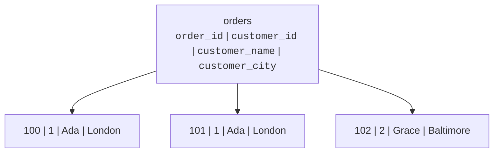
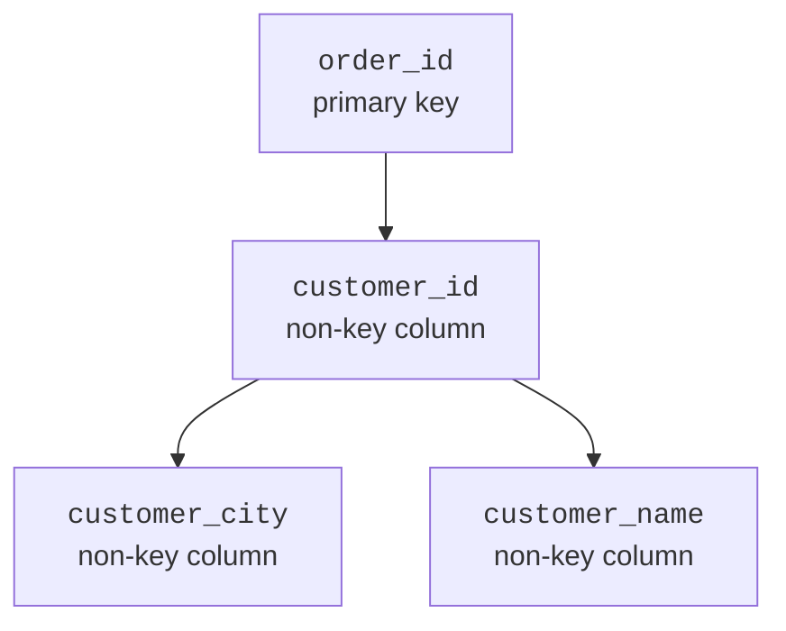
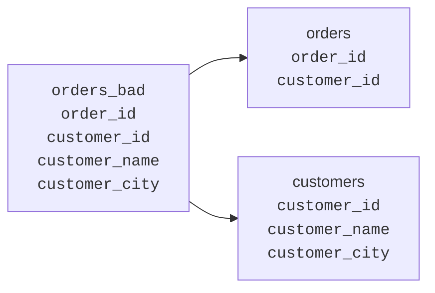
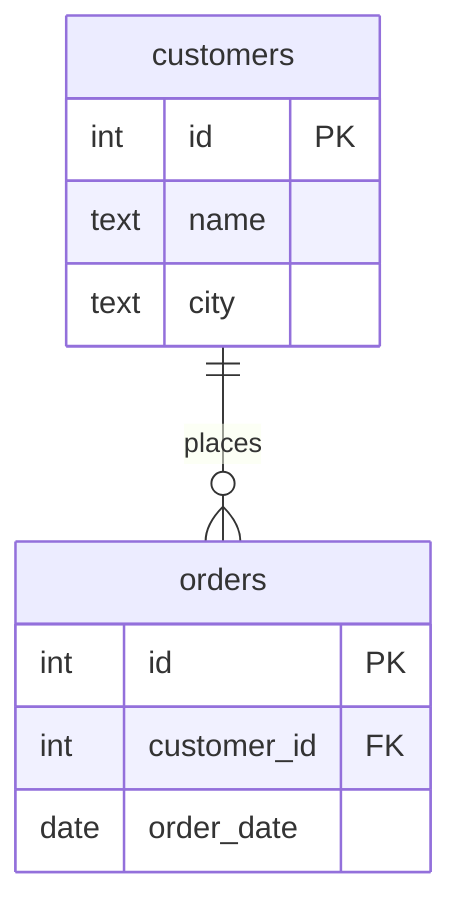
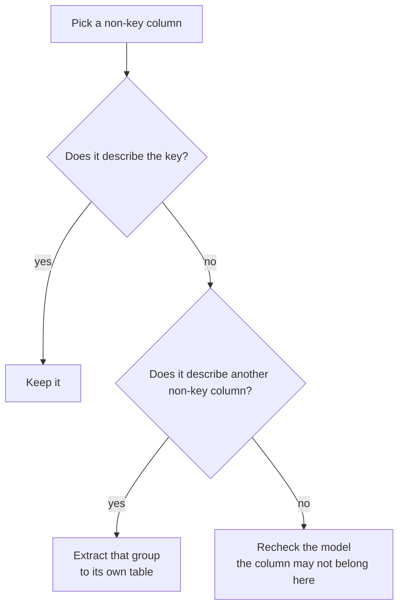
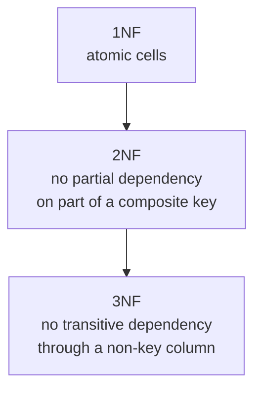

A table can pass 1NF and 2NF and still store a fact in the wrong place.
The warning sign is subtler: a non-key column explains another non-key
column.

<Figure
  slug="db-third-normal-form-cutout"
  alt="Third normal form, an isometric illustration"
/>

**Third normal form (3NF)** says non-key columns should depend on the
key, the whole key, and nothing but the key.

## The transitive dependency problem

A **transitive dependency** happens when a non-key column depends on
another non-key column instead of depending directly on the key.

Imagine an `orders` table like this:

The key is `order_id`. The `customer_id` tells you which customer placed
the order. But `customer_name` and `customer_city` are not facts about
the order itself. They are facts about the customer.

The dependency travels through another column: `order_id` determines
`customer_id`, and `customer_id` determines `customer_city`. That is why
it is called transitive.

## Why 3NF matters

If Ada moves from London to Oxford, every order row containing Ada's
city must be updated. Miss one row and the database claims the same
customer lives in two cities.

That is the same disease you saw earlier: one fact has many homes. 3NF
finds this particular version of the disease by looking for non-key
columns that depend on other non-key columns.

<SqlCodeBlock
  dialect="postgres"
  title="A transitive dependency in an orders table"
  initSql={`CREATE TABLE orders_bad (
  order_id      INTEGER PRIMARY KEY,
  customer_id   INTEGER NOT NULL,
  customer_name TEXT NOT NULL,
  customer_city TEXT NOT NULL
);

INSERT INTO orders_bad VALUES
  (100, 1, 'Ada',   'London'),
  (101, 1, 'Ada',   'London'),
  (102, 2, 'Grace', 'Baltimore');`}
  starterCode={`-- A partial update makes one customer appear to live in two cities.
UPDATE orders_bad
SET
  customer_city = 'Oxford'
WHERE
  order_id = 100;

SELECT
  customer_id,
  customer_name,
  customer_city,
  COUNT(*) AS rows
FROM
  orders_bad
GROUP BY
  customer_id,
  customer_name,
  customer_city
ORDER BY
  customer_id,
  customer_city;`}
/>

## Quick check

<MultipleChoice
  markdown={`In an orders table keyed by order_id, customer_city is stored because customer_id identifies the customer. What is the 3NF problem?

- customer_city is a text column.
  > Text columns can be valid; the issue is what determines the value.
- order_id is too short.
  > Key length is not the issue in this design.
- The table contains more than one row.
  > Multiple rows are normal; the problem is the dependency path.
- [o] customer_city depends on customer_id, a non-key column, rather than directly on order_id.
  > That non-key-to-non-key dependency is transitive.

3NF asks whether non-key columns depend on the key and nothing else.`}
/>

<MultipleChoice
  markdown={`Which phrase is the classic memory aid for 3NF?

- One cell, one value.
  > That phrase is closest to the intuition for 1NF.
- The left key joins the right key.
  > Joins matter, but this is not the 3NF memory aid.
- Denormalize early and often.
  > Denormalization is deliberate and later, not the 3NF rule.
- [o] The key, the whole key, and nothing but the key.
  > The phrase captures direct dependency on the key rather than other non-key columns.

3NF keeps each non-key column loyal to the table's key.`}
/>

## The fix: extract the dependent group

If customer details depend on the customer, give customers their own
table. Orders should keep the customer foreign key, not a copied set of
customer attributes.

The customer facts now have one home. The order row keeps the fact that
really belongs to the order: which customer placed it.

<SqlCodeBlock
  dialect="postgres"
  title="A 3NF-friendly orders design"
  initSql={`CREATE TABLE customers (
  id   INTEGER PRIMARY KEY,
  name TEXT NOT NULL,
  city TEXT NOT NULL
);

CREATE TABLE orders (
  id          INTEGER PRIMARY KEY,
  customer_id INTEGER NOT NULL REFERENCES customers(id),
  order_date  DATE NOT NULL
);

INSERT INTO customers VALUES
  (1, 'Ada',   'London'),
  (2, 'Grace', 'Baltimore');

INSERT INTO orders VALUES
  (100, 1, DATE '2026-01-10'),
  (101, 1, DATE '2026-01-11'),
  (102, 2, DATE '2026-01-12');`}
  starterCode={`-- Ada moves once, in the one row that stores Ada's city.
UPDATE customers
SET
  city = 'Oxford'
WHERE
  id = 1;

SELECT
  o.id AS order_id,
  c.name,
  c.city,
  o.order_date
FROM
  orders o
  JOIN customers c ON c.id = o.customer_id
ORDER BY
  o.id;`}
/>

## A step-by-step 3NF test

Use this walkthrough after a table has reached 1NF and 2NF:

For the bad orders table:

- `customer_id` belongs in `orders` because it identifies who placed the
  order.
- `customer_name` belongs in `customers` because it describes the
  customer.
- `customer_city` belongs in `customers` for the same reason.

## How 3NF differs from 2NF

2NF and 3NF both ask dependency questions, but they catch different
mistakes.

2NF says a non-key column cannot depend on only part of a composite key.
3NF says a non-key column cannot depend on another non-key column.
Together, they push every fact toward the table where it naturally
belongs.

<Callout type="info" title="The jingle, and where it came from">
The memory aid you met earlier, every non-key column should depend
on *"the key, the whole key, and nothing but the key"*, compresses
2NF and 3NF into one sentence: "the whole key" rules out partial
dependencies, and "nothing but the key" rules out transitive ones.
The phrasing comes from William Kent's 1983 article "A Simple Guide
to Five Normal Forms in Relational Database Theory," which translated
the normalization papers into plain English for working programmers.
Later wags appended "...so help me Codd," and the joke stuck,
database people have repeated the oath ever since.
</Callout>

## Beyond 3NF: a normal form named for two people

3NF is where this course stops, and where most practical designs
stop, but the ladder continues. In 1974, E. F. Codd and Raymond
Boyce, the IBM researcher who co-designed SQL itself, described a
slightly stricter rule now called **Boyce–Codd normal form (BCNF)**.
It closes a subtle loophole: a table can technically satisfy 3NF
while a non-key column still determines part of a key, which can
happen when a table has overlapping candidate keys. The cases are
rare enough that many working designers never meet one outside a
textbook.

<Figure
  slug="db-third-normal-form-inline-cutout"
  alt="A table where one column is found to depend on another column rather than on the key, and is lifted out to its own table"
/>

The practical takeaway: if every table you design keeps each non-key
column loyal to the key, the whole key, and nothing but the key, you
are in the territory where update anomalies go to die. The exotic
higher forms (BCNF, 4NF, 5NF) refine the same instinct you have
already built, every fact gets exactly one home. (Boyce's story, and
how SQL got its name, is told in [The Relational
Revolution](/courses/database-design-postgresql/the-relational-revolution).)

## Check your understanding

<MultipleChoice
  markdown={`What is a transitive dependency?

- A primary key references a foreign key.
  > Foreign keys reference primary keys, but that is not the definition here.
- [o] A non-key column depends on another non-key column.
  > This dependency path is what 3NF removes.
- A column contains a comma-separated list.
  > That is a 1NF problem, not a transitive dependency.
- A non-key column depends on part of a composite key.
  > That is a 2NF partial dependency.

Transitive dependencies are the central problem 3NF addresses.`}
/>

<MultipleChoice
  markdown={`In an orders table, customer_city depends on customer_id. Where should customer_city usually be stored?

- In the order_items table.
  > Order items describe products on an order, not the customer's city.
- [o] In the customers table.
  > City is a customer fact, so it belongs with the customer key.
- In every order row for that customer.
  > Repeating the city across orders creates update anomalies.
- In a table with no key.
  > The extracted table still needs a key so rows can be identified and referenced.

A column belongs where its determining key lives.`}
/>

<MultipleChoice
  markdown={`Which design best matches 3NF for orders and customers?

- orders(order_id, customer_city) only
  > The order no longer references a clear customer record.
- orders(order_id, customer_id, customer_name, customer_city)
  > Customer name and city are customer facts copied into orders.
- [o] customers(customer_id, name, city) and orders(order_id, customer_id, order_date)
  > Customer facts live once, and orders reference the customer.
- customers(order_id, name, city)
  > The customer table should be keyed by the customer, not by the order.

3NF separates facts according to what they describe.`}
/>

<MultipleChoice
  markdown={`Why does 3NF still allow joins?

- 3NF requires every query to join every table.
  > Queries join only the tables needed for the question.
- [o] Tables store facts once, and joins rebuild the combined view when needed.
  > The joined result can be wide without storing duplicated customer facts.
- Joins are a sign that normalization failed.
  > Joins are how normalized facts are recombined for reading.
- Joins replace the need for primary keys.
  > Joins rely on keys to connect related rows correctly.

Normalization changes where facts are stored, not what reports can show.`}
/>
