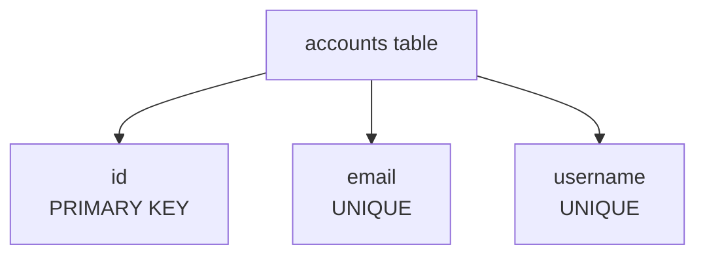
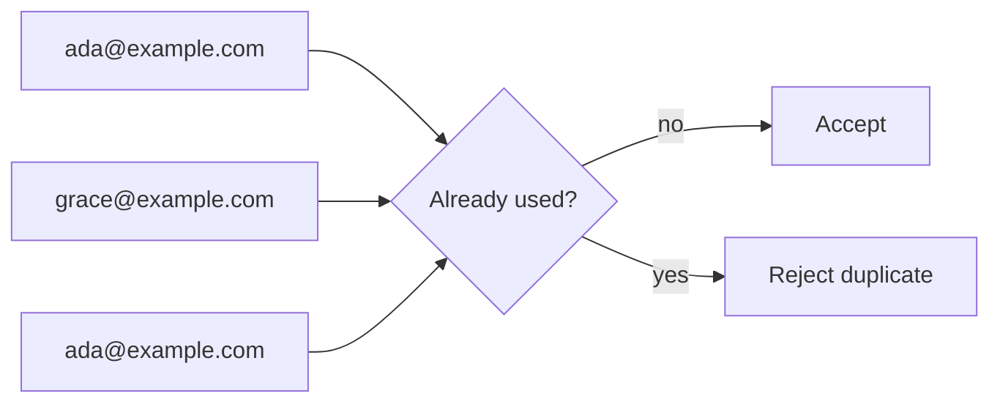
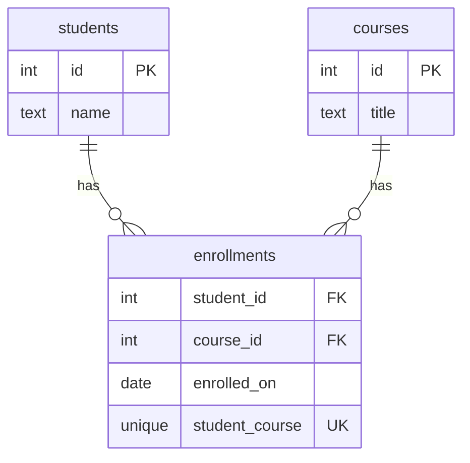
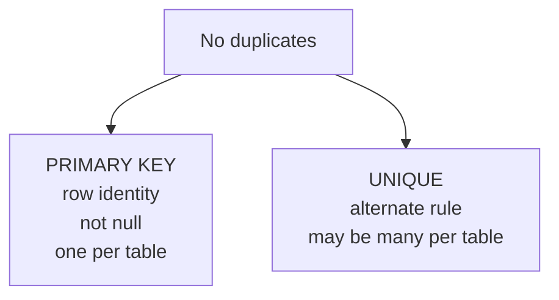
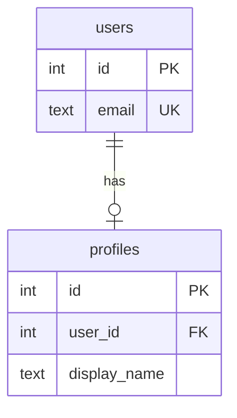

Two people can have the same name, but can two accounts use the same
email address? Usually not. That is a business rule, and it belongs in
the schema.

A **UNIQUE** constraint tells PostgreSQL that a value, or combination of
values, must not repeat.

<svg
  viewBox="0 0 640 180"
  role="img"
  aria-label="A row of distinct dots already contains a green value, so the identical green newcomer is ghosted out and slashed in red — duplicates may not enter"
  style={{ display: "block", width: "100%", maxWidth: "640px", height: "auto", margin: "2.5rem auto" }}
>
  <g style={{ color: "var(--ds-blue-500)" }} fill="currentColor">
    <circle cx="140" cy="90" r="13" />
    <circle cx="380" cy="90" r="13" />
  </g>
  <g style={{ color: "var(--ds-yellow-500)" }} fill="currentColor">
    <circle cx="300" cy="90" r="13" />
  </g>
  <g style={{ color: "var(--ds-green-500)" }} fill="currentColor">
    <circle cx="220" cy="90" r="13" />
    <circle cx="220" cy="90" r="21" fillOpacity="0.18" />
    <circle cx="530" cy="90" r="13" fillOpacity="0.25" />
  </g>
  <g fill="currentColor" opacity="0.22">
    <circle cx="478" cy="90" r="3" />
    <circle cx="455" cy="90" r="3" />
    <circle cx="432" cy="90" r="3" />
  </g>
  <g style={{ color: "var(--ds-red-500)" }} fill="currentColor">
    <rect x="508" y="86" width="44" height="6" rx="3" transform="rotate(-42 530 89)" />
  </g>
</svg>

## Uniqueness beyond the primary key

A primary key already guarantees one kind of uniqueness: every row has a
unique identity. But many tables have other values that must be unique
too.

The `id` identifies the row internally. The `email` or `username` may be
how humans sign in. Those are not always good primary keys, but they
still must not duplicate.

## Watch a duplicate get rejected

Run this block. The first account is already present. The attempted
second account reuses the same email, so PostgreSQL rejects it.

<SqlCodeBlock
  dialect="postgres"
  title="A UNIQUE constraint rejects duplicate email"
  initSql={`CREATE TABLE accounts (
  id       SERIAL PRIMARY KEY,
  email    TEXT NOT NULL UNIQUE,
  username TEXT NOT NULL UNIQUE
);

INSERT INTO accounts (email, username)
VALUES ('ada@example.com', 'ada');`}
  starterCode={`-- This email is already used by Ada.
INSERT INTO
  accounts (email, username)
VALUES
  ('ada@example.com', 'ada_2');

SELECT
  id,
  email,
  username
FROM
  accounts;`}
/>

The database is not merely warning you. It refuses to store the second
row because the table would no longer match the rule "one email belongs
to one account."

## Single-column UNIQUE

A **single-column UNIQUE** constraint protects one column by itself.
Common examples include:

- account email
- username
- employee badge number
- product SKU
- country code

Use this when the business rule says one value identifies, names, or
claims something in the real world.

## Composite UNIQUE

Sometimes one column is not unique by itself, but a **combination** must
be unique. That is a composite unique constraint.

For example, a student may enroll in many courses, and a course may hold
many students. The pair `(student_id, course_id)` should appear only
once, because the same student should not be enrolled in the same course
twice.

In SQL that rule looks like `UNIQUE (student_id, course_id)`. It does
not prevent the same student from taking different courses, or different
students from taking the same course. It only prevents the same pair
from repeating.

<SqlCodeBlock
  dialect="postgres"
  title="A composite UNIQUE constraint blocks duplicate pairs"
  initSql={`CREATE TABLE enrollments (
  student_id INTEGER NOT NULL,
  course_id  INTEGER NOT NULL,
  enrolled_on DATE NOT NULL DEFAULT CURRENT_DATE,
  UNIQUE (student_id, course_id)
);

INSERT INTO enrollments (student_id, course_id) VALUES (1, 10);`}
  starterCode={`-- Same student, same course: duplicate pair.
INSERT INTO
  enrollments (student_id, course_id)
VALUES
  (1, 10);

SELECT
  student_id,
  course_id,
  enrolled_on
FROM
  enrollments;`}
/>

## Quick check

<MultipleChoice
  markdown={`What does a composite \`UNIQUE (student_id, course_id)\` constraint prevent?

- A student from taking more than one course.
  > The student_id may repeat with a different course_id.
- A course from having more than one student.
  > The course_id may repeat with a different student_id.
- [o] The exact same student-course pair from appearing more than once.
  > The combination of both values must be unique, even though each value may repeat separately.
- Any NULL values in the table.
  > NOT NULL controls missing values; UNIQUE controls duplication.

Composite uniqueness protects a repeated combination, not each column by itself.`}
/>

## UNIQUE vs. PRIMARY KEY

A primary key and a unique constraint both prevent duplicates, but they
have different jobs.

A **primary key** is the table's official row identity. Other tables
usually point to it with foreign keys. A table has one primary key.

A **unique constraint** protects another business rule. A table can have
many unique constraints: one on `email`, one on `username`, another on a
relationship pair.

## One-to-one relationships and natural keys

Uniqueness also shapes relationships. If `profiles.user_id` is both a
foreign key and unique, then each user can have at most one profile.
That is a one-to-one pattern.

Unique values can also be **natural keys**: real-world values that are
unique enough to identify something, such as an ISBN for a book or an
ISO country code. Even when you still use a surrogate `id` as the
primary key, a unique constraint can preserve the natural rule.

<Callout type="info" title="Unique does not always mean good primary key">
An email may be unique today but still change later. A surrogate `id`
can remain the primary key while `email UNIQUE` enforces the no-duplicate
business rule.
</Callout>

## Quick check

<MultipleChoice
  markdown={`Why might a table have both \`id PRIMARY KEY\` and \`email UNIQUE\`?

- Because a table must have two primary keys.
  > A table has one primary key; UNIQUE is a separate constraint type.
- [o] The id gives stable row identity, while the email rule prevents duplicate account emails.
  > The two constraints protect different meanings: identity and a business rule.
- Because UNIQUE makes the id auto-increment.
  > Automatic id generation is separate from uniqueness.
- Because primary keys cannot be referenced by foreign keys.
  > Primary keys are commonly referenced by foreign keys.

Primary keys identify rows; unique constraints protect other no-duplicate rules.`}
/>

## Check your understanding

<MultipleChoice
  markdown={`What is the main purpose of a \`UNIQUE\` constraint?

- To require every column in a table to have a value.
  > NOT NULL controls whether values may be missing.
- [o] To prevent duplicate values, or duplicate combinations of values, for a declared rule.
  > UNIQUE makes PostgreSQL reject rows that would repeat the constrained value or value set.
- To connect a row to another table.
  > Foreign keys create references between tables.
- To choose a default value when one is omitted.
  > DEFAULT supplies omitted values; it does not check duplicates.

UNIQUE constraints enforce no-duplicate business rules.`}
/>

<MultipleChoice
  markdown={`Which column is a common candidate for a single-column UNIQUE constraint?

- \`first_name\`
  > Many people can share a first name, so it should not usually be unique.
- \`created_at\`
  > Many rows can be created at the same time or close to it; this is not usually an identity-like value.
- [o] \`email\` on an accounts table.
  > Account emails commonly must not repeat because they identify sign-in accounts.
- \`is_active\`
  > A boolean has only two possible values, so many rows must share it.

Good UNIQUE candidates are values the business expects not to repeat.`}
/>

<MultipleChoice
  markdown={`How is a \`UNIQUE\` constraint different from a \`PRIMARY KEY\`?

- UNIQUE can only be used on primary key columns.
  > UNIQUE is often used on non-primary-key columns such as email or username.
- UNIQUE allows duplicates, but PRIMARY KEY does not.
  > Both prevent duplicates for the constrained values.
- [o] A primary key is the table's official row identity; UNIQUE enforces additional no-duplicate rules.
  > A table can have one primary key and many unique constraints.
- PRIMARY KEY is only documentation, while UNIQUE is enforced.
  > Both are enforced by PostgreSQL.

Primary keys and unique constraints both protect uniqueness, but they serve different design roles.`}
/>
