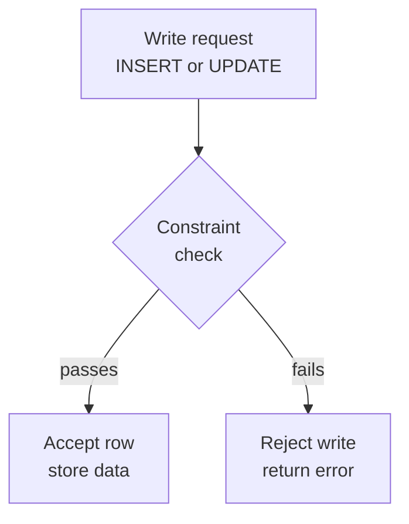
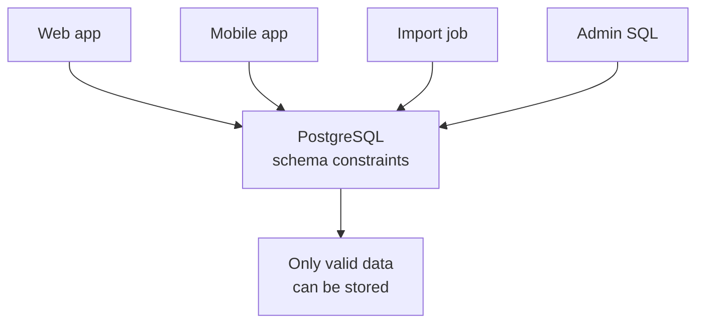
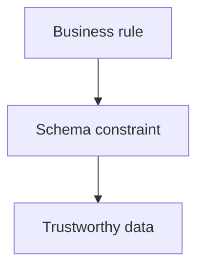

A customer signs up without an email. An order points to no customer.
A product is saved with a negative price. Should your application
remember to catch every one of those mistakes, every time?

A well-designed schema does not merely *suggest* good data. It uses
**constraints** to make bad data impossible to store.

<svg
  viewBox="0 0 640 200"
  role="img"
  aria-label="Valid shapes slip through the gap between two green gate bars while a red triangle is deflected away, constraints rejecting bad data at the door"
  style={{ display: "block", width: "100%", maxWidth: "640px", height: "auto", margin: "2.5rem auto" }}
>
  <g style={{ color: "var(--ds-green-500)" }} fill="currentColor">
    <rect x="302" y="22" width="20" height="56" rx="9" />
    <rect x="302" y="122" width="20" height="56" rx="9" />
  </g>
  <g style={{ color: "var(--ds-blue-500)" }} fill="currentColor">
    <circle cx="150" cy="100" r="12" />
    <path
      d="M170 100 H 214"
      fill="none"
      stroke="currentColor"
      strokeWidth="2"
      strokeLinecap="round"
      strokeOpacity="0.4"
    />
    <circle cx="430" cy="100" r="12" />
  </g>
  <g style={{ color: "var(--ds-green-500)" }} fill="currentColor">
    <rect x="486" y="88" width="24" height="24" rx="7" />
    <path
      d="M348 100 H 386"
      fill="none"
      stroke="currentColor"
      strokeWidth="2"
      strokeLinecap="round"
      strokeOpacity="0.5"
    />
  </g>
  <g style={{ color: "var(--ds-red-500)" }} fill="currentColor">
    <polygon points="246,128 268,166 224,166" />
    <path
      d="M262 134 L 292 104"
      fill="none"
      stroke="currentColor"
      strokeWidth="2"
      strokeLinecap="round"
      strokeOpacity="0.5"
    />
  </g>
</svg>

## Constraints are enforced rules

A **constraint** is a rule the database checks on every write: every
`INSERT`, every `UPDATE`, and sometimes every `DELETE`. If the new data
breaks the rule, PostgreSQL rejects the write.

That rejection is not a failure of the database. It is the database
protecting the meaning of your data.

The key idea is that constraints live in the **schema**. They are part
of the database design itself, not a reminder written in a comment or a
rule hidden in one application screen.

## The database is the last line of defense

Application code should still validate user input. A form can show a
friendly message before it ever talks to the database. But application
validation is not enough by itself.

Many things may write to one database:

- A web app
- A mobile app
- An admin dashboard
- A background import job
- A one-time data migration
- A human running SQL directly

If the rule exists only in one of those places, another path can forget
it. If the rule exists in the schema, **every path** must obey it.

That is why constraints are a design tool. They encode the business
rules that must be true no matter which program touched the data.

<Callout type="success" title="Schema rules beat hope">
A rule in application code says, "please remember to check this." A
constraint says, "this database will not contain rows that violate
this rule."
</Callout>

## Quick check

<MultipleChoice
  markdown={`Why is it valuable to put an important business rule in the **schema**?

- It makes the rule apply only to the main web application.
  > A schema constraint applies inside the database, so it covers every writer, not only one application.
- [o] It makes the database enforce the rule for every write, no matter where the write came from.
  > A constraint is checked by PostgreSQL itself, which makes it the shared last line of defense.
- It lets invalid data in faster.
  > Constraints reject invalid data; they are about integrity, not accepting mistakes quickly.
- It replaces the need to design tables carefully.
  > Constraints are part of table design, not a substitute for design.

Schema constraints protect the database even when many programs write to it.`}
/>

## Watch a constraint reject bad data

This table says every product must have a non-negative price. Run the
SQL and read the error: PostgreSQL refuses the bad row.

<SqlCodeBlock
  dialect="postgres"
  title="A constraint blocks an impossible product"
  initSql={`CREATE TABLE products (
  id    SERIAL PRIMARY KEY,
  name  TEXT NOT NULL,
  price NUMERIC NOT NULL CHECK (price >= 0)
);

INSERT INTO products (name, price) VALUES ('Notebook', 4.50);`}
  starterCode={`-- A negative price violates the CHECK constraint.
INSERT INTO
  products (name, price)
VALUES
  ('Broken price', -3.00);

-- The bad product is not stored.
SELECT
  id,
  name,
  price
FROM
  products;`}
/>

The schema now knows something about the business: a product's price
cannot be negative. Any code path that tries to store `-3.00` gets the
same answer: no.

## The constraint family

PostgreSQL gives you several common kinds of constraints. Each protects
a different part of the design.

- **NOT NULL** means a column must have a value.
- **DEFAULT** supplies a value when the insert does not provide one.
- **UNIQUE** prevents duplicate values such as repeated usernames.
- **CHECK** enforces an expression such as `price >= 0`.
- **PRIMARY KEY** gives every row a unique, non-empty identity.
- **FOREIGN KEY** prevents references to rows that do not exist.

Together, these rules turn a table from a loose bucket of rows into a
model of the real thing.

## Constraints express meaning

Suppose your application has orders. The schema can express facts like
these:

A customer email is required? Use `NOT NULL`. No two accounts may share
one email? Use `UNIQUE`. An order must belong to a real customer? Use a
`FOREIGN KEY`. An order total cannot be negative? Use `CHECK`.

The more essential the rule is to the meaning of the data, the more it
belongs in the schema.

## Quick check

<MultipleChoice
  markdown={`Which rule is best enforced with a database constraint rather than only with a comment in documentation?

- A style preference for how a button should look.
  > Button styling is an interface concern, not a rule about valid rows in the database.
- [o] An order total must never be negative.
  > A negative order total would make the stored data invalid, so the schema should reject it.
- A team's preferred meeting time.
  > Meeting preferences are not part of the database's row validity.
- The color of the company logo.
  > Logo color is not a data-integrity rule for table writes.

Constraints are for rules that determine whether stored data is valid.`}
/>

## Constraints make errors visible early

Without constraints, bad data can sit quietly for months. A report is
wrong, a join loses rows, or a customer cannot sign in, and the cause
is an old invalid row.

With constraints, the mistake is caught at the door. The writer gets an
error immediately, when the bad value is still close to the code or
person that produced it.

That is why constraints are not just syntax. They are how a schema
keeps its promises.

## Check your understanding

<MultipleChoice
  markdown={`What is a **constraint** in a database schema?

- A query that sorts rows for display.
  > Sorting affects how results are returned; it does not decide whether a write is allowed.
- [o] A rule PostgreSQL enforces on writes so invalid data is rejected.
  > Constraints are checked by the database whenever data is inserted or changed.
- A note for developers to read later.
  > Documentation can explain a rule, but a constraint actively enforces it.
- A backup copy of a table.
  > Backups preserve data; constraints protect whether new data is valid.

A constraint is an enforced rule, not merely a suggestion.`}
/>

<MultipleChoice
  markdown={`Why is the database often called the **last line of defense** for data integrity?

- It is the only place users can see error messages.
  > Applications can show errors too; the point is where the final write is accepted or rejected.
- It runs after every report is generated.
  > Constraints run when data is written, not after reports.
- [o] Every application and import path ultimately writes to the database, so schema rules protect all of them.
  > A database constraint applies regardless of which program attempted the write.
- It automatically knows every business rule without being told.
  > The database enforces rules that the schema designer explicitly declares.

The schema is the shared enforcement point for all writers.`}
/>

<MultipleChoice
  markdown={`Which constraint type prevents two rows from using the same non-primary-key value, such as the same email address?

- NOT NULL.
  > NOT NULL requires a value, but it does not prevent duplicates.
- DEFAULT.
  > DEFAULT fills in a missing value; it does not make values distinct.
- [o] UNIQUE.
  > UNIQUE tells PostgreSQL that no two rows may share the constrained value.
- FOREIGN KEY.
  > A foreign key checks that a referenced row exists; it is not the duplicate-prevention rule.

UNIQUE constraints protect values that must not repeat.`}
/>

<MultipleChoice
  markdown={`A table has \`price NUMERIC CHECK (price >= 0)\`. What happens if a writer tries to insert \`price = -5\`?

- PostgreSQL stores the row and fixes the value later.
  > PostgreSQL does not silently repair a CHECK violation.
- PostgreSQL changes the price to zero.
  > A CHECK constraint rejects invalid data; it does not choose replacement values.
- [o] PostgreSQL rejects the write because the row violates the constraint.
  > The CHECK expression must be true for the row to be stored.
- PostgreSQL deletes the whole table.
  > A constraint violation fails the statement; it does not destroy the table.

A CHECK constraint makes impossible values fail at write time.`}
/>
