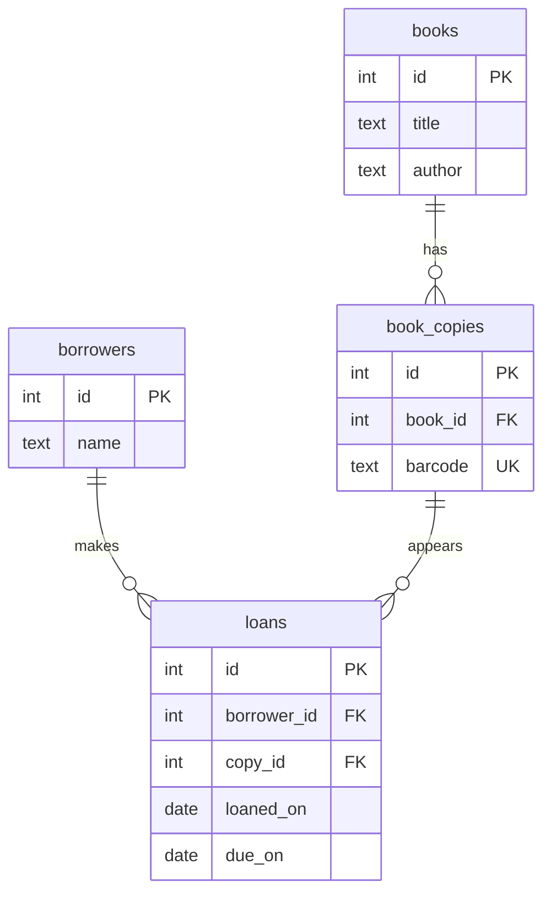
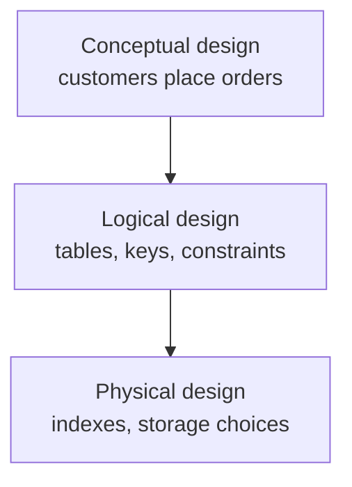

A bad schema rarely feels bad on the first day. You create one table,
put every visible field into it, insert a few rows, and the first
screen works. The demo goes well. Everyone moves on.

<Figure
  slug="db-what-is-database-design-cutout"
  alt="What database design is, an isometric illustration"
/>

The trap is that day-one success can hide design choices that become
expensive only after real data, real users, and real features arrive.
A quick flat table avoids the hard questions, *What is the real
entity here? Which facts repeat? What must be unique? What
relationship should the database protect?*, but those questions do
not disappear. They come back later as bugs, cleanup scripts,
confusing reports, and a creeping fear of changing anything.

## Watch a shortcut go wrong

On the welcome page you saw a flat `orders` table where the
customer's email was copied onto every order row. Here is the moment
that design fails. Ada changes her email address. A rushed update
fixes one of her rows and misses the other. Run the block and look at
the result: the database now claims, with complete confidence, that
the same person has two different email addresses.

<SqlCodeBlock
  dialect="postgres"
  title="An update anomaly in a flat table"
  initSql={`CREATE TABLE order_spreadsheet (
  order_id       INTEGER PRIMARY KEY,
  customer_name  TEXT NOT NULL,
  customer_email TEXT NOT NULL,
  product_name   TEXT NOT NULL,
  quantity       INTEGER NOT NULL CHECK (quantity > 0)
);

INSERT INTO order_spreadsheet VALUES
  (101, 'Ada Lovelace', 'ada@old.example', 'Notebook', 2),
  (102, 'Ada Lovelace', 'ada@old.example', 'Pen', 5),
  (103, 'Grace Hopper', 'grace@example.com', 'Notebook', 1);`}
  starterCode={`-- A rushed fix updates one of Ada's rows and misses the other.
UPDATE order_spreadsheet
SET
  customer_email = 'ada@new.example'
WHERE
  order_id = 101;

SELECT
  customer_name,
  customer_email,
  COUNT(*) AS rows_with_that_email
FROM
  order_spreadsheet
GROUP BY
  customer_name,
  customer_email
ORDER BY
  customer_name;`}
/>

Nothing about that `UPDATE` was illegal SQL. The database did exactly
what it was told. The problem is the *design*: Ada's email was not one
fact anymore, it was many copies of a fact, and every copy had to be
kept in sync forever, by hand, by every program and person who ever
touches the table. This failure has a name, the **update anomaly**,
and it is the single most common symptom of a schema that skipped its
design questions. We will meet it again, along with its siblings, in
the chapter on normalization.

<Callout type="warn" title="Design debt behaves like interest">
A shortcut in the schema can save one hour today and cost ten minutes
on every future change. The problem is not only the first cleanup. It
is the repeated cost paid by every developer and every feature after
that, and unlike code, which you can rewrite tomorrow, data
outlives code. If a million rows store a confused idea, every new
version of the software must either understand that confusion or pay
to clean it up.
</Callout>

## So what is database design?

**Database design** is the work of answering the hard questions
*before* the rest of the software quietly answers them in
inconsistent ways. Concretely, it means deciding:

- Which real-world things become tables?
- Which facts become columns?
- Which rows need stable identity, and what provides it?
- Which tables point to which other tables?
- Which values must be present, unique, or limited, and how will
  the database *enforce* that?

<Figure
  slug="db-what-is-database-design-inline-cutout"
  alt="A bench of loose parts on the left and the same parts fitted into a planned frame on the right"
/>

SQL syntax is how you express a design. It is not the design itself.
Two people can both type flawless `CREATE TABLE` statements and
produce wildly different schemas, because the design is the set of
modeling decisions *behind* the SQL.

Take a library. Before writing a single line of SQL, the designer has
to decide: is a *book* the thing on the catalog page, or the physical
object on the shelf? If the library owns three copies of *Database
Design Basics*, those copies may need their own table, because each
copy has its own barcode and can be loaned out separately. A loan is
about a copy, not a title.

That is design thinking. Not "how many columns can fit in one table?"
but "what distinct things does the system need to remember, and how
do they connect?" No SQL reference manual can answer the
title-versus-copy question for you, it is a question about the
*meaning* of the system, and answering questions like it is the skill
this course teaches.

## Quick check

<MultipleChoice
  markdown={`Which question is most clearly a database design question?

- Which font should reports use?
  > Report styling does not decide tables, relationships, or constraints.
- Which cloud region should host the server?
  > Hosting location is an operations decision, not logical database design.
- [o] Should library loans point to book titles or physical book copies?
  > This decides what real-world thing a relationship represents in the schema.
- What color should the checkout button be?
  > Button color is a user-interface decision, not a schema modeling decision.

Database design is about the meaning and protection of stored facts.`}
/>

<MultipleChoice
  markdown={`Why can a schema that "works on day one" still be a poor design?

- A first feature cannot read from a database table.
  > A first feature can work while still depending on fragile structure.
- [o] Early data may be too small to reveal duplication, missing keys, and vague meanings.
  > Many design problems become visible only after data grows and requirements change.
- Poor design always causes an immediate syntax error.
  > Schema design problems are often logical, not syntax errors.
- Day-one schemas are never allowed in PostgreSQL.
  > PostgreSQL will store many weak designs if the SQL is valid.

A schema can pass the first demo and still create long-term cost.`}
/>

## Three levels of design

Designers usually separate the work into three levels, and beginners
often mix them together, so it is worth naming them once.

**Conceptual design** names the important things in the real world,
in close-to-plain language: customers place orders; orders contain
products; borrowers take out loans on copies.

**Logical design** turns those ideas into relational structure:
tables, columns, primary keys, foreign keys, and constraints. This is
the main focus of this course.

**Physical design** concerns how a particular database stores and
runs that schema: indexes, storage settings, partitioning. Those
topics matter in production, but they are not our focus here.

You will see plenty of PostgreSQL syntax in this course, because
schemas must eventually become real. But the course is about the
logical shape: what the tables mean and what rules preserve that
meaning.

## The schema shapes everything built on it

Why does this deserve a whole course? Because application code does
not talk to vague ideas like "an order" in the abstract. It talks to
tables, columns, keys, and constraints, and it hardens around them.
The schema becomes a contract between the database and every program
that uses it: the web app, the admin dashboard, the import job, the
reporting script, the analyst with a SQL console. A feature may look
like a button or a report, but underneath it is always a question
about stored facts. If the facts are cleanly modeled, the feature is
small. If they are tangled, the feature becomes a rewrite.

<Figure
  slug="db-what-is-database-design-watch-shortcut-go-inline-cutout"
  alt="A cabinet built without its dividers, its contents slumped into one another"
/>

Here is the cheerful version of that story. A product manager asks:
*"Which customers bought a notebook?"* In a cleanly designed schema,
customers, products, orders, and order items as separate, related
tables, the answer is a short join along known relationships:

<SqlCodeBlock
  dialect="postgres"
  title="A new question answered by a clean schema"
  initSql={`CREATE TABLE customers (
  id    INTEGER PRIMARY KEY,
  name  TEXT NOT NULL,
  email TEXT NOT NULL UNIQUE
);

CREATE TABLE products (
  id    INTEGER PRIMARY KEY,
  name  TEXT NOT NULL UNIQUE
);

CREATE TABLE orders (
  id          INTEGER PRIMARY KEY,
  customer_id INTEGER NOT NULL REFERENCES customers(id),
  ordered_on  DATE NOT NULL
);

CREATE TABLE order_items (
  order_id   INTEGER NOT NULL REFERENCES orders(id),
  product_id INTEGER NOT NULL REFERENCES products(id),
  quantity   INTEGER NOT NULL CHECK (quantity > 0),
  PRIMARY KEY (order_id, product_id)
);

INSERT INTO customers VALUES
  (1, 'Ada Lovelace', 'ada@example.com'),
  (2, 'Grace Hopper', 'grace@example.com'),
  (3, 'Katherine Johnson', 'katherine@example.com');

INSERT INTO products VALUES
  (10, 'Notebook'),
  (20, 'Pen'),
  (30, 'Backpack');

INSERT INTO orders VALUES
  (101, 1, DATE '2025-03-01'),
  (102, 2, DATE '2025-03-02'),
  (103, 1, DATE '2025-03-03');

INSERT INTO order_items VALUES
  (101, 10, 2),
  (101, 20, 5),
  (102, 30, 1),
  (103, 10, 1);`}
  starterCode={`SELECT DISTINCT
  customers.name,
  customers.email
FROM
  customers
  JOIN orders ON orders.customer_id = customers.id
  JOIN order_items ON order_items.order_id = orders.id
  JOIN products ON products.id = order_items.product_id
WHERE
  products.name = 'Notebook'
ORDER BY
  customers.name;`}
/>

The query is not magic. It is possible because the schema already
knows what a customer, an order, an order item, and a product *are*.
Now imagine the same store had stored each order as one free-text
note, `Ada bought 2 notebooks and 5 pens`. The same feature request
becomes a project: parse the text, handle misspellings, decide
whether `notebook` and `notebooks` match, clean up old rows, and
*then* maybe get an answer. The difference is not developer talent.
It is whether the schema already answered the modeling questions the
feature depends on.

The same logic applies to rules. If `order_items.quantity` carries
`CHECK (quantity > 0)` in the schema, every report, export, and
calculation can simply trust that stored quantities are positive, no
matter which of the many programs writing to the database produced
them. A rule that lives in one application's validation code protects
one door; a rule that lives in the schema protects the whole
building.

## Quick check

<MultipleChoice
  markdown={`Which schema would best support the question "which customers bought notebooks?"

- One \`orders.note\` text column containing sentences about purchases.
  > Sentence parsing makes the answer depend on wording and cleanup.
- A spreadsheet exported once per month.
  > Exports may help analysis, but they are not a reliable live schema for application features.
- A table with no product identity and only customer names.
  > Without product identity, the database cannot reliably connect purchases to products.
- [o] Related \`customers\`, \`orders\`, \`order_items\`, and \`products\` tables.
  > This model gives the query a clear relationship path from customers to products.

Feature questions become simpler when the schema already models the relationships they need.`}
/>

<MultipleChoice
  markdown={`Why are database constraints useful even when applications also validate input?

- [o] Constraints protect the data no matter which program writes to the table.
  > A database rule is shared by apps, scripts, imports, and admin tools.
- Constraints replace the need to choose tables and relationships.
  > Constraints protect a design; they do not decide the whole model by themselves.
- Constraints make user-friendly error messages unnecessary in every case.
  > Applications still often validate for helpful messages before data reaches the database.
- Constraints allow invalid rows to be stored for later cleanup.
  > Constraints reject invalid rows according to the rule.

Application validation helps users, while database constraints protect shared truth.`}
/>

<MultipleChoice
  markdown={`What is the best plain-English definition of database design?

- Choosing the fastest database server hardware.
  > Hardware choices are operational, not the core modeling work of design.
- Writing queries after all tables already exist.
  > Querying uses a design; it does not decide the schema shape by itself.
- Picking random column names and fixing them later.
  > Careless naming and delayed modeling often create ambiguity and migration cost.
- [o] Deciding what tables, relationships, and rules should represent the system's facts.
  > Design shapes how facts are stored, related, and protected before code depends on them.

Database design is the intentional modeling of stored facts.`}
/>

## Where this course goes from here

In this course, database design means a concrete sequence of skills,
and the chapters follow it:

1. Finding **entities**: customers, orders, products, posts, comments.
2. Choosing **attributes** and their allowed values.
3. Defining **relationships** and their cardinality, and reading the
   diagrams designers use to discuss them.
4. Choosing **keys**: stable identities that other rows can point to.
5. Adding **constraints**: rules that make impossible data impossible.
6. **Normalizing**: giving every fact exactly one home, and knowing
   when to deliberately break that rule.
7. **Evolving** the model safely as requirements change.

None of this was obvious when databases were young. The idea that
data should live in plain tables related by values, rather than in
pointer-linked hierarchies that only programmers could navigate,
was a genuinely radical proposal in 1970, and the company that funded
it was slow to embrace it. That story, and the unlikely path that
leads from a Berkeley research project to the PostgreSQL engine
running in your browser right now, is told in the [Interesting
Discussions](/courses/database-design-postgresql/the-relational-revolution)
section at the end of the course. Read it whenever you want a break
from diagrams.

Next, we start where every design starts: learning to see the
*things*, the entities, hiding inside a plain-English description
of a system.
