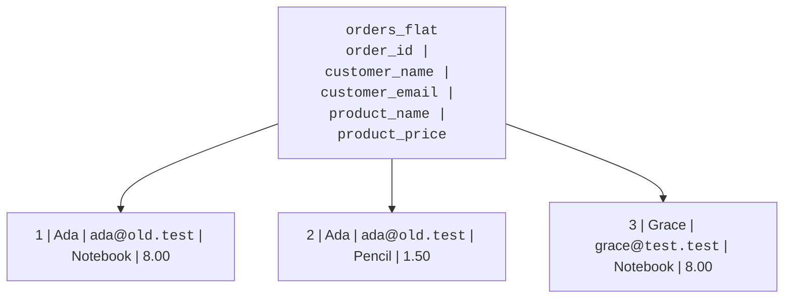
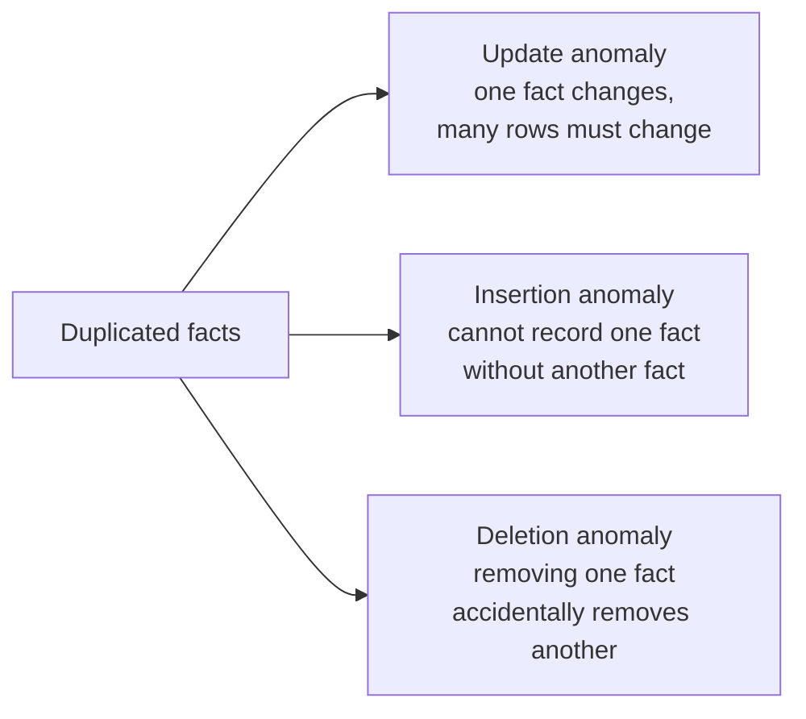
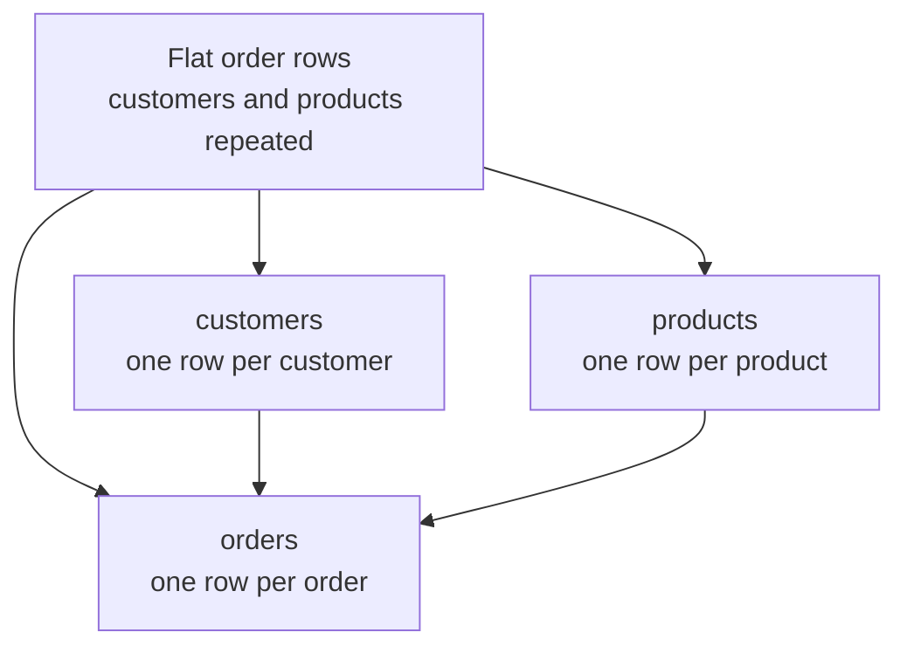
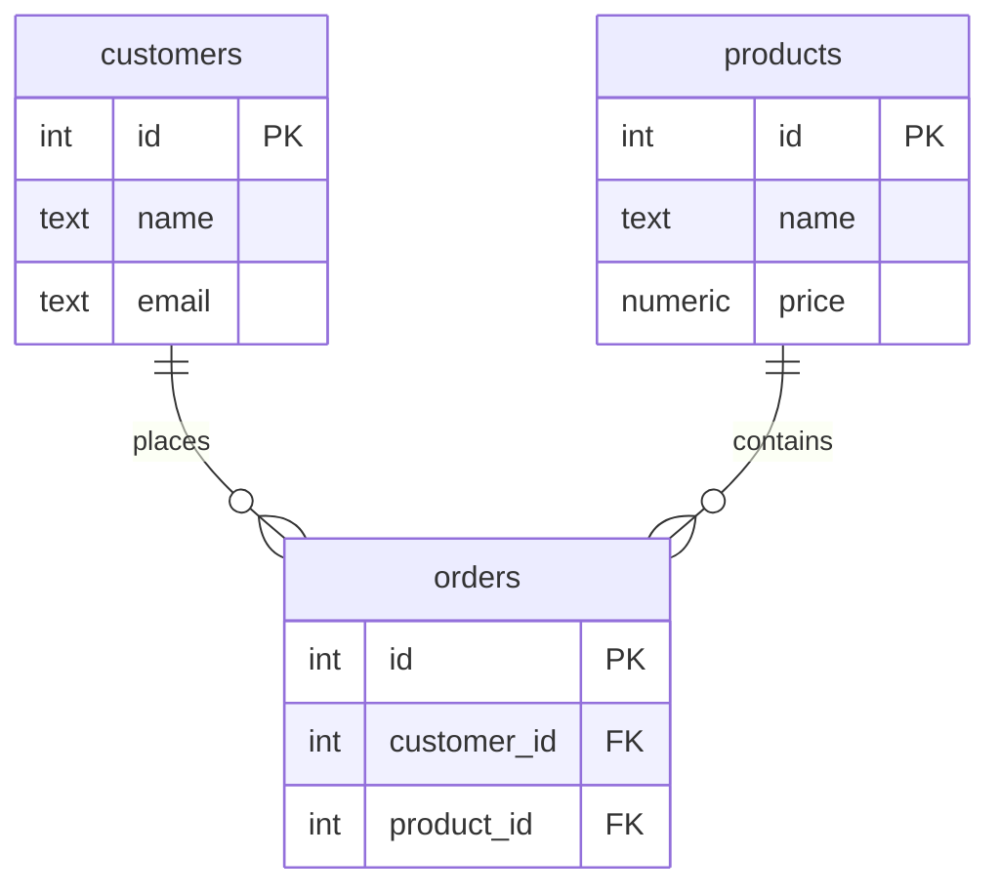
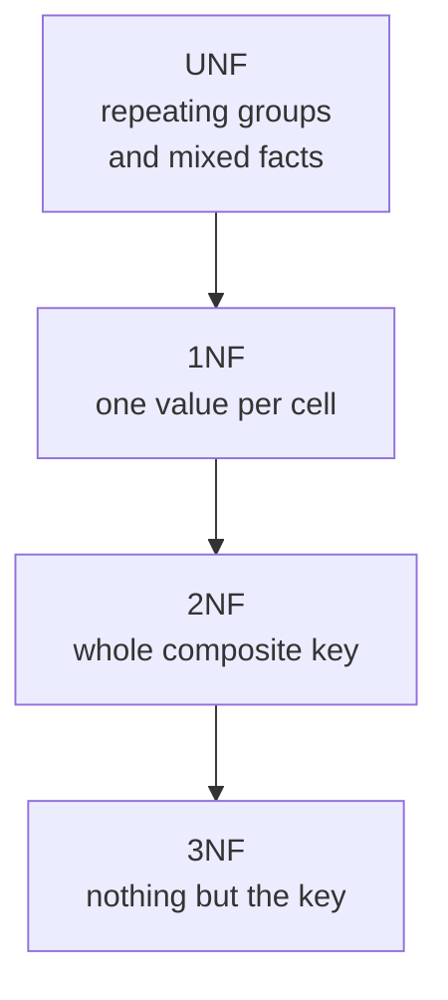

A spreadsheet-style table can feel comforting at first: every order,
customer, product, and price appears in one row. You can scroll across
and see the whole story. So why do database designers so often split
that story into several tables?

Because duplication has a cost. Before learning the cure, you need to
recognize the disease.

The diagnosis is older than you might expect. E. F. Codd, the IBM
mathematician whose 1970 paper invented the relational model, did
not stop at proposing tables. In a follow-up paper published in 1971
he worked out, with mathematical precision, *which table shapes go
wrong and how*, and defined the first **normal forms**: structural
rules a table can satisfy that make whole categories of data
corruption impossible. The next four pages walk that same path, in
the same order Codd laid it out, just with less set theory and more
running SQL. This page covers the part that comes first: what
actually goes wrong.

<svg
  viewBox="0 0 640 210"
  role="img"
  aria-label="In a flat table the same yellow fact is copied into every row, and one copy has already drifted red, duplicated facts quietly falling out of sync"
  style={{ display: "block", width: "100%", maxWidth: "640px", height: "auto", margin: "2.5rem auto" }}
>
  <g fill="currentColor" opacity="0.07">
    <rect x="110" y="36" width="92" height="34" rx="8" />
    <rect x="210" y="36" width="92" height="34" rx="8" />
    <rect x="310" y="36" width="92" height="34" rx="8" />
    <rect x="410" y="36" width="92" height="34" rx="8" />
    <rect x="110" y="120" width="92" height="34" rx="8" />
    <rect x="210" y="120" width="92" height="34" rx="8" />
    <rect x="310" y="120" width="92" height="34" rx="8" />
    <rect x="410" y="120" width="92" height="34" rx="8" />
  </g>
  <g fill="currentColor" opacity="0.11">
    <rect x="110" y="78" width="92" height="34" rx="8" />
    <rect x="210" y="78" width="92" height="34" rx="8" />
    <rect x="310" y="78" width="92" height="34" rx="8" />
    <rect x="410" y="78" width="92" height="34" rx="8" />
    <rect x="110" y="162" width="92" height="34" rx="8" />
    <rect x="210" y="162" width="92" height="34" rx="8" />
    <rect x="310" y="162" width="92" height="34" rx="8" />
    <rect x="410" y="162" width="92" height="34" rx="8" />
  </g>
  <g style={{ color: "var(--ds-blue-500)" }} fill="currentColor">
    <circle cx="142" cy="53" r="7" />
    <circle cx="142" cy="95" r="7" fillOpacity="0.7" />
    <circle cx="142" cy="137" r="7" fillOpacity="0.5" />
    <circle cx="142" cy="179" r="7" fillOpacity="0.3" />
  </g>
  <g style={{ color: "var(--ds-green-500)" }} fill="currentColor">
    <rect x="228" y="48" width="56" height="9" rx="4.5" fillOpacity="0.55" />
    <rect x="228" y="90" width="40" height="9" rx="4.5" fillOpacity="0.45" />
    <rect x="228" y="132" width="62" height="9" rx="4.5" fillOpacity="0.35" />
    <rect x="228" y="174" width="48" height="9" rx="4.5" fillOpacity="0.3" />
  </g>
  <g style={{ color: "var(--ds-yellow-500)" }} fill="currentColor">
    <circle cx="356" cy="53" r="8" />
    <circle cx="356" cy="95" r="8" />
    <circle cx="356" cy="179" r="8" />
  </g>
  <g style={{ color: "var(--ds-red-500)" }} fill="currentColor">
    <circle cx="356" cy="137" r="8" />
  </g>
</svg>

## The disease: duplicated facts

Imagine a shop stores orders in one flat table:

The table is easy to read, but look carefully. Ada's email appears in
two rows. The notebook price appears in two rows. Those are not two
separate facts; they are the same facts copied into several places.

A good design tries to store **each fact in exactly one place**. When a
fact has more than one home, the database can start disagreeing with
itself.

<Callout type="info" title="Duplication is not the same as repetition in a result">
A query result may repeat values because a join is showing related data.
That is fine. The danger here is storing the same fact repeatedly in
base tables, where every copy must be kept consistent by hand.
</Callout>

## The three anomalies

An **anomaly** is a strange or unsafe behavior caused by the shape of
the table. Duplicated data creates three classic anomalies.

### Update anomaly

Ada changes her email address. In a flat orders table, her email is
copied into every order row. If you update one row but miss another,
Ada now has two emails in the same database.

<SqlCodeBlock
  dialect="postgres"
  title="An update anomaly in a flat table"
  initSql={`CREATE TABLE orders_flat (
  order_id       INTEGER PRIMARY KEY,
  customer_name  TEXT NOT NULL,
  customer_email TEXT NOT NULL,
  product_name   TEXT NOT NULL,
  product_price  NUMERIC NOT NULL
);

INSERT INTO orders_flat VALUES
  (1, 'Ada',   'ada@old.test',   'Notebook', 8.00),
  (2, 'Ada',   'ada@old.test',   'Pencil',   1.50),
  (3, 'Grace', 'grace@test.test', 'Notebook', 8.00);`}
  starterCode={`-- A rushed update changes only one of Ada's rows.
UPDATE orders_flat
SET
  customer_email = 'ada@new.test'
WHERE
  order_id = 1;

-- The same customer now appears with two different emails.
SELECT
  customer_name,
  customer_email,
  COUNT(*) AS rows_with_that_email
FROM
  orders_flat
GROUP BY
  customer_name,
  customer_email
ORDER BY
  customer_name,
  customer_email;`}
/>

The update statement is legal SQL. The problem is not syntax; the
problem is the design allowed one fact to have multiple homes.

### Insertion anomaly

Suppose the shop wants to record a new product before anyone orders it.
Where does that row go? The only table is about orders, so a product
cannot exist unless an order exists too.

That is an **insertion anomaly**: you cannot insert one kind of fact
without inventing another kind of fact.

### Deletion anomaly

Now suppose Grace has only one order, and the shop deletes that order
because it was canceled. If Grace's name and email live only in that
order row, deleting the order also deletes the only stored fact about
Grace.

That is a **deletion anomaly**: removing one fact accidentally removes a
different fact.

## Quick check

<MultipleChoice
  markdown={`In the flat \`orders_flat\` table, Ada's email appears on every order row. What makes that dangerous?

- It prevents SQL from filtering rows.
  > Filtering still works; the risk is that repeated copies can drift apart.
- [o] A single real-world fact must be changed in several stored places.
  > When one fact has many stored copies, one missed update can create disagreement.
- It means Ada can place only one order.
  > The table can store many orders; the problem is duplicated customer facts.
- It means every product must have the same price.
  > Product prices can vary; the issue is that any repeated price must be kept consistent.

Duplication turns one real-world change into many database updates.`}
/>

<MultipleChoice
  markdown={`Which situation is the clearest deletion anomaly?

- A query returns no rows because the \`WHERE\` clause is too strict.
  > That is a query issue, not a table-design anomaly.
- A customer changes email and one old row is missed.
  > That is an update anomaly because stored copies no longer match.
- [o] Deleting a customer's last order also removes the only record of the customer's email.
  > The delete removed an order fact and accidentally erased a customer fact.
- A table has a primary key column.
  > A primary key helps identify rows; it is not a deletion anomaly.

Deletion anomalies happen when one row is forced to carry facts about multiple things.`}
/>

## The cure: give each fact one home

Normalization starts with a simple question: *what things are we really
tracking?* In this example, there are customers, products, and orders.
Those are different kinds of facts, so they deserve different homes.

After the split, Ada's email lives once in `customers`. The notebook
price lives once in `products`. An order points to the customer and the
product instead of copying their details.

This does not mean you can never display a flat view again. You can join
the tables whenever you need the readable report. The key difference is
that the repeated-looking output is computed, not stored as duplicate
truth.

## Where normal forms fit

The normal forms are a step-by-step path away from messy, duplicated
storage and toward single-source-of-truth tables.

This page focuses on the reason normalization exists. The next pages
walk through the cure one stage at a time.

## Check your understanding

<MultipleChoice
  markdown={`What is the main design goal behind normalization?

- To make every table contain every fact needed by the application.
  > Putting every fact in every convenient place creates the duplication normalization avoids.
- [o] To store each fact in one place so the database has a single source of truth.
  > A single home for each fact prevents stored copies from disagreeing.
- To avoid all joins forever.
  > Normalized designs often use joins to recombine related facts when reading.
- To remove primary keys from tables.
  > Keys become more important because they connect the split tables.

Normalization protects correctness by controlling where facts live.`}
/>

<MultipleChoice
  markdown={`A shop cannot add a new product until someone buys it because products are stored only inside order rows. Which anomaly is this?

- Update anomaly.
  > An update anomaly happens when changing a fact requires changing many stored copies.
- [o] Insertion anomaly.
  > The design blocks inserting a product fact unless an order fact exists too.
- Deletion anomaly.
  > A deletion anomaly happens when deleting one fact erases another fact accidentally.
- Join anomaly.
  > This course is discussing update, insertion, and deletion anomalies caused by duplication.

Insertion anomalies appear when unrelated facts are forced into the same row.`}
/>

<MultipleChoice
  markdown={`After splitting customers, products, and orders into separate tables, how can you show the familiar all-in-one order report?

- Store the customer email again in \`orders\` for convenience.
  > Copying the email back into orders recreates the original duplication risk.
- [o] Join the related tables when reading the report.
  > Joins rebuild the combined view from facts stored once in their proper tables.
- Delete the product table after orders are inserted.
  > Deleting the product table would remove the source of product facts.
- Put all columns into the primary key.
  > Keys identify rows; they do not by themselves rebuild a report.

A normalized schema stores clean facts; queries can still present a wide view.`}
/>

<MultipleChoice
  markdown={`Which statement best describes an update anomaly?

- A new row cannot be inserted because another fact is missing.
  > That describes an insertion anomaly.
- A row deletion accidentally removes another kind of fact.
  > That describes a deletion anomaly.
- [o] A fact changes, but the database stores several copies that must all be updated.
  > Multiple stored copies make it easy for one update to miss a row.
- A foreign key points to an existing primary key.
  > That is normal referential integrity, not an anomaly.

Update anomalies are the everyday warning sign that a fact is duplicated.`}
/>
