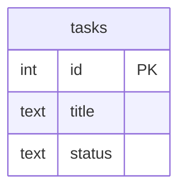
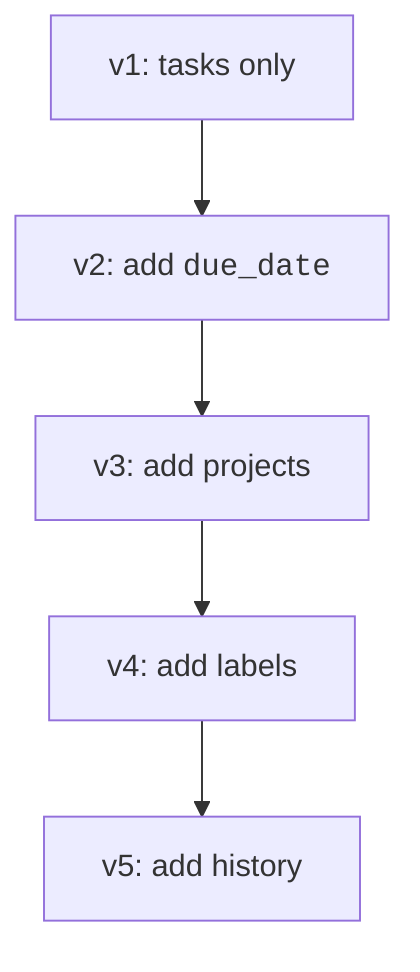
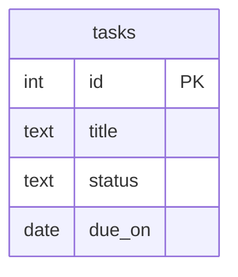
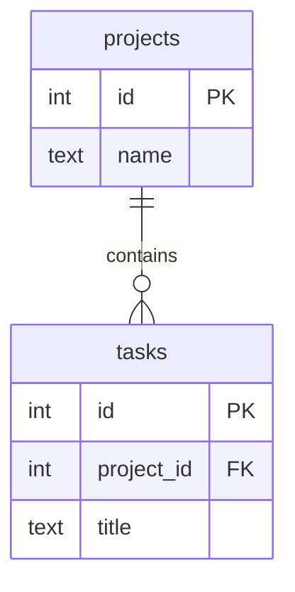
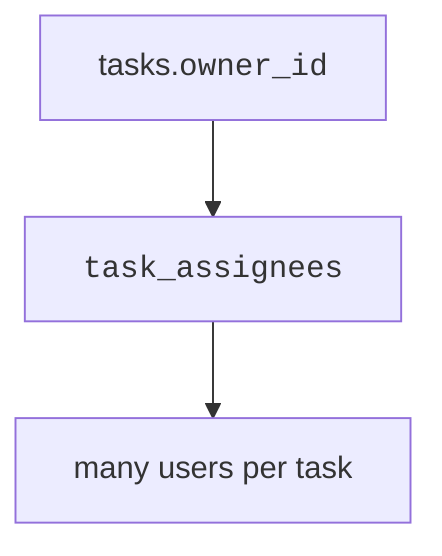
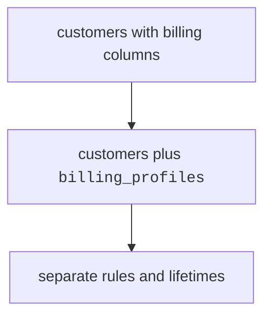
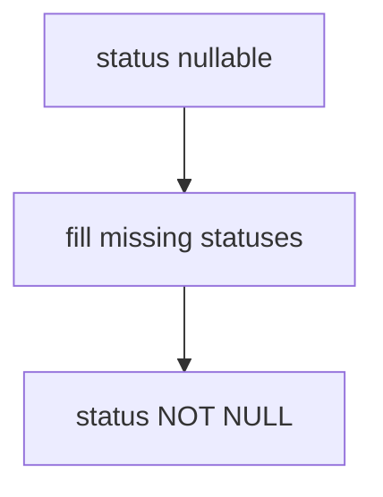
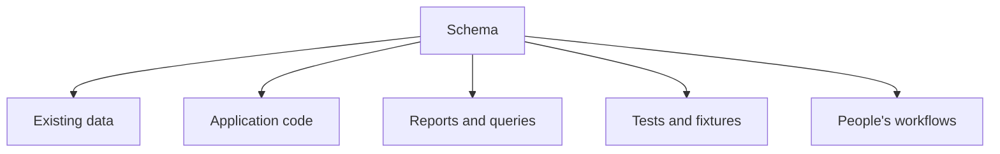
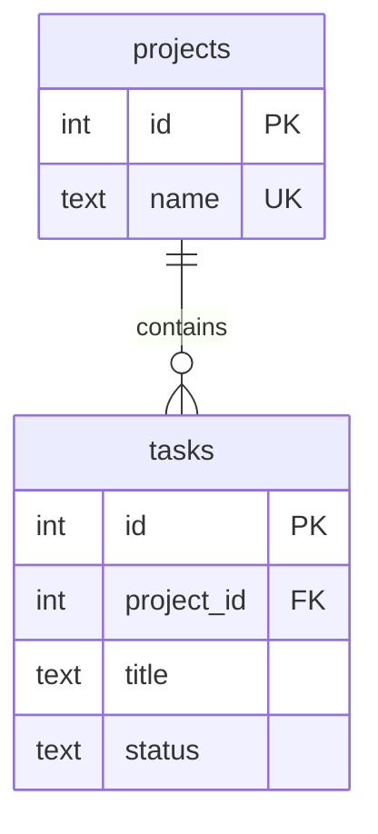

A schema can be well designed and still need to change.

<Figure
  slug="db-why-schemas-change-cutout"
  alt="Why schemas change, an isometric illustration"
/>

That is not failure. It is what happens when software learns more
about the real world.

The design challenge is to understand what kinds of changes happen and
why they carry risk once the database is in use.

## Requirements evolve

At the start, a simple task tracker might store only tasks:

Then users ask for projects, owners, due dates, labels, and audit
history. Each new requirement asks the schema to represent a new fact
or rule.

A relational schema is a living model. As the product meaning changes,
the model must change too.

## Common kinds of change

Schema changes usually fall into a few patterns:

- a new attribute
- a new entity
- a new relationship
- splitting a table
- merging tables
- tightening constraints

### New attributes

A new attribute adds a fact to an existing entity. For example,
`tasks.due_on` says a task may have a due date.

<Figure
  slug="db-why-schemas-change-inline-cutout"
  alt="A cabinet built for three kinds of part with a fourth kind arriving on a trolley beside it"
/>

This is often the safest change when the new column is nullable or has
a sensible default.

### New entities

A new entity appears when a concept needs its own identity and facts.
If tasks now belong to projects, `projects` probably deserves a table.

### New relationships

Sometimes the entities already exist, but the connection changes. A
single owner might become a team of assignees. That turns a one-to-many
relationship into many-to-many.

### Splitting and merging tables

A table may become too broad. For example, customer billing details may
move from `customers` into `billing_profiles` when they gain their own
rules.

Merging is less common, but it can happen when two tables turn out to
represent the same concept.

### Tightening constraints

Early in a product, a column may allow nulls because old data is
messy. Later, the team may learn that the fact is always required.

<MultipleChoice
  markdown={`Which schema change is usually safest to introduce first?

- Replacing a many-to-many table with a comma-separated text column.
  > That change loses relational structure and makes rules harder to enforce.
- [o] Adding a nullable column for a new optional fact.
  > Additive changes usually let old data and old code keep working.
- Dropping a table that application code still reads.
  > Removing a depended-on table is destructive and risky.
- Renaming every primary key at once.
  > Broad changes to identifiers can break many references.

Additive changes are usually easier to roll out than destructive ones.`}
/>

## Why change becomes risky

Once a database has real data and real application code, the schema is
not just a diagram. Other things depend on it.

Changing a table can break inserts, joins, reports, imports, and user
interfaces. A good change plan considers all of those dependencies.

## A small evolution example

Version 1 stores tasks with no project table.

Version 2 adds projects and links tasks to them.

The design meaning changed: a task can now be grouped under a project.
That might affect screens, reports, and validation rules.

<SqlCodeBlock
  dialect="postgres"
  title="Evolve tasks by adding projects"
  initSql={`DROP TABLE IF EXISTS tasks;
DROP TABLE IF EXISTS projects;

CREATE TABLE tasks (
    id INT GENERATED ALWAYS AS IDENTITY PRIMARY KEY,
    title TEXT NOT NULL,
    status TEXT NOT NULL CHECK (status IN ('open', 'done'))
);

INSERT INTO tasks (title, status) VALUES
    ('Draft schema', 'open'),
    ('Review constraints', 'done');
`}
  starterCode={`CREATE TABLE projects (
  id INT GENERATED ALWAYS AS IDENTITY PRIMARY KEY,
  name TEXT NOT NULL UNIQUE
);

INSERT INTO
  projects (name)
VALUES
  ('Database course');

ALTER TABLE tasks
ADD COLUMN project_id INT REFERENCES projects (id);

UPDATE tasks
SET
  project_id = 1;

SELECT
  t.title,
  p.name AS project
FROM
  tasks AS t
  JOIN projects AS p ON p.id = t.project_id
ORDER BY
  t.id;`}
/>

This example adds structure without destroying the existing task rows.
A later migration could make `project_id` required after every task has
a project.

## Check your understanding

<MultipleChoice
  markdown={`Why do schemas change even when the original design was good?

- Tables can store only a few rows.
  > Row count is not the reason requirements evolve.
- Good designs never need to change.
  > Real products learn new requirements over time.
- [o] The schema models requirements, and requirements evolve.
  > When the product needs new facts or rules, the schema may need to represent them.
- PostgreSQL randomly changes table definitions.
  > Schema changes are made deliberately by people or tools.

A schema is a model of a changing product domain.`}
/>

<MultipleChoice
  markdown={`What makes destructive changes risky?

- They automatically create better normalization.
  > Destruction does not guarantee a better model.
- They only affect diagrams, not data.
  > Destructive changes can remove data or columns.
- They are always impossible in PostgreSQL.
  > PostgreSQL can perform destructive changes, but they may break dependencies.
- [o] Existing data, code, and reports may depend on the old shape.
  > Removing or renaming schema objects can break anything that uses them.

Risk comes from dependencies around the schema.`}
/>

<MultipleChoice
  markdown={`When might a new table be better than adding more columns to an old table?

- When SQL queries use \`SELECT\`.
  > Query syntax does not decide entity boundaries.
- When the old table has a primary key.
  > Having a primary key does not prevent adding related tables.
- [o] When the new concept has its own identity, rules, and relationships.
  > This is the kind of concept that often deserves its own entity table.
- When every row has exactly the same value.
  > Repeated identical values may signal a design problem, but identity and rules matter most.

A concept with its own lifecycle often becomes its own table.`}
/>
