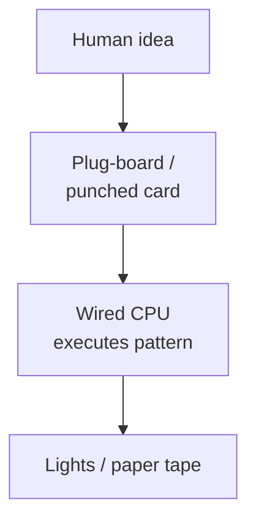
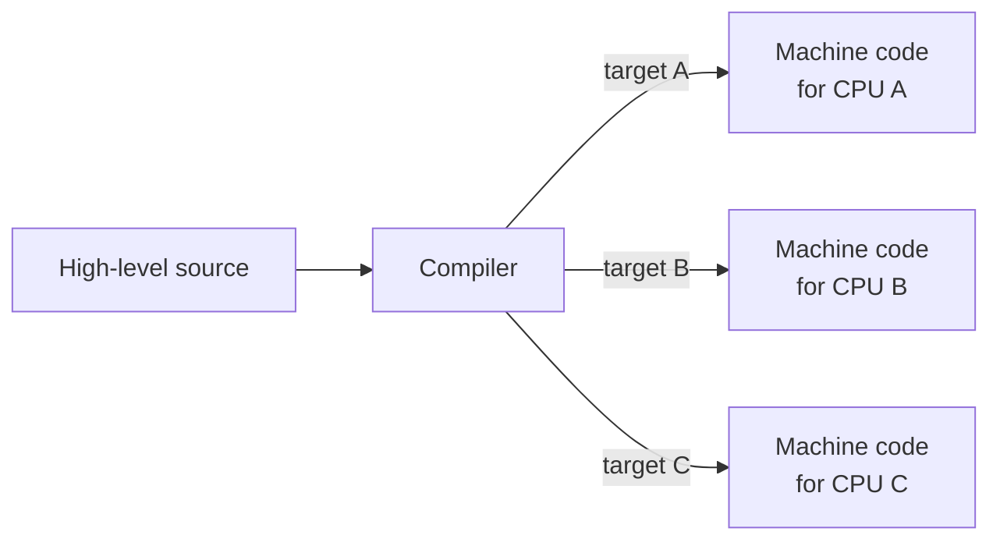
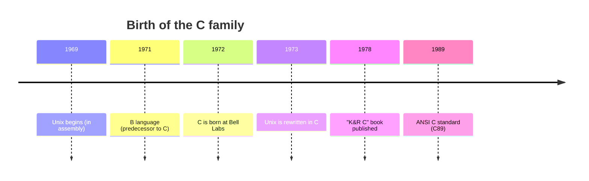
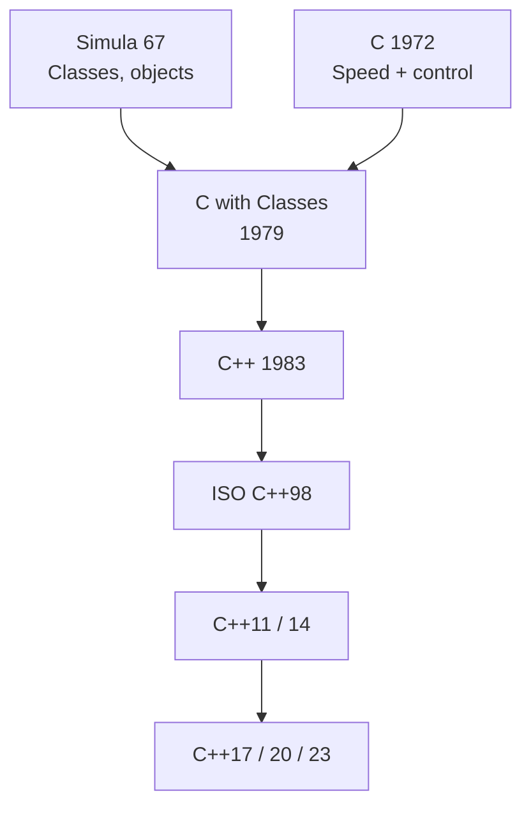
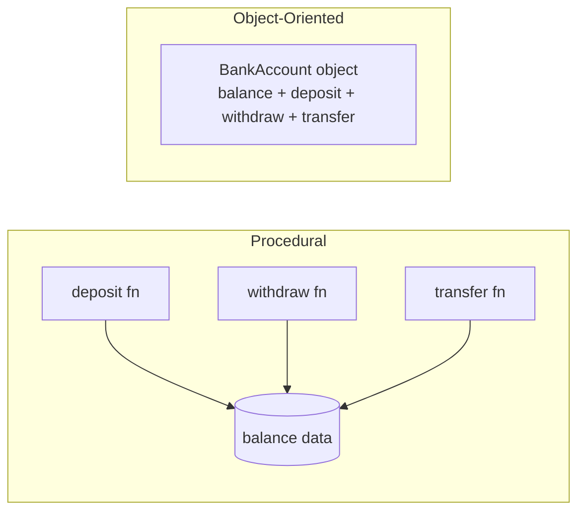
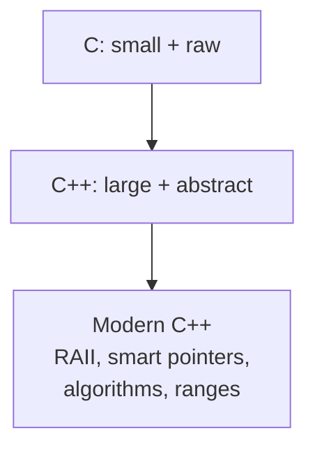

Before we write any C++, it is worth spending a few minutes on
*where C++ came from*. Languages are not handed down from the sky.
Every feature of C++ exists because somebody, at some point, was
solving a real problem with the tools of their day and decided we
could do better. If you understand the **story**, the language will
feel less like an arbitrary set of rules and more like a series of
hard-won lessons.

<svg
  viewBox="0 0 640 210"
  role="img"
  aria-label="Stacked strata of rounded layers grow sharper and bluer toward the top, each era of programming building on the lessons fossilized beneath it"
  style={{ display: "block", width: "100%", maxWidth: "640px", height: "auto", margin: "2.5rem auto" }}
>
  <g fill="currentColor" opacity="0.07">
    <rect x="90" y="172" width="460" height="24" rx="8" />
  </g>
  <g fill="currentColor" opacity="0.12">
    <rect x="110" y="140" width="420" height="24" rx="8" />
  </g>
  <g style={{ color: "var(--ds-blue-500)" }} fill="currentColor">
    <rect x="130" y="108" width="380" height="24" rx="8" fillOpacity="0.25" />
    <rect x="150" y="76" width="340" height="24" rx="8" fillOpacity="0.5" />
    <rect x="170" y="44" width="300" height="24" rx="8" />
  </g>
</svg>

## The first programs were not text

In the 1940s, "programming" a computer meant physically wiring up
switches and plug-boards, or punching holes in paper cards that the
machine would read one at a time. There was no source code in the
modern sense.



Every machine spoke a different "language", its own set of
**machine instructions**, encoded as bit patterns. A program written
for one computer would not run on any other. There were no compilers,
no operating systems, and no library of code to reuse. Each program
was rebuilt from raw electricity every time.

## Assembly: a small step up

By the 1950s, programmers had become tired of writing literal binary.
**Assembly languages** appeared: instead of writing the bit pattern
`10110000 01100001`, you could write the human-readable mnemonic

```
MOV AL, 0x61
```

An **assembler** translated that text into the bit pattern
mechanically. Assembly was a huge improvement, but it still suffered
from two crippling problems:

1. **It was tied to a specific CPU.** Code written for an IBM
   machine could not run on a DEC machine, or a Burroughs machine, or
   anything else.
2. **It was tedious and dangerous.** Every loop, every if-statement,
   every function call had to be hand-coded out of jumps and register
   moves. A single typo could silently corrupt the whole program.

It became obvious that humans were not built for this. We needed
something *closer to mathematics* and *farther from the metal*.

## The rise of high-level languages

In the late 1950s, the first **high-level languages** arrived:
**FORTRAN** (1957) for scientific computing and **COBOL** (1959) for
business data processing. They came with compilers that could
translate human-friendly syntax into machine instructions for
*different* CPUs. For the first time, the same program could (in
principle) be re-compiled and run on a new machine. Programmers
could finally express *algorithms* rather than *electrical signals*.



Many languages followed. ALGOL introduced structured control flow
(`if`, `while`, `for`). LISP introduced functional programming and
garbage collection. By the late 1960s, the industry had a zoo of
languages, and a growing sense that *operating systems* themselves
should be written in something more portable than assembly.

## The creation of C

In 1972, **Dennis Ritchie** at Bell Labs designed the **C language**
to rewrite the **Unix** operating system in something more portable
than the assembly it had originally been written in. C was a
*deliberate* compromise:

- High enough that you could write structured code with `if`, `for`,
  and named functions.
- Low enough that every operation mapped to roughly one CPU
  instruction.
- Small enough that a compiler could fit on the tiny machines of the
  day.



C let you take the address of a variable (`&x`), read or write
arbitrary memory (`*p`), and lay out data exactly as the hardware
expected. It became *the* language for systems software: kernels,
compilers, databases, network stacks. Most of the world still runs
on C code written between 1980 and 2010.

But by the late 1970s, software was outgrowing C.

## Software systems became more complex

A 1970s C program was typically thousands of lines long. By the
mid-1980s, programs were hundreds of thousands of lines long.
By the 2000s, millions. As programs grew:

- Functions multiplied. Reasoning about who called whom became
  difficult.
- Data structures multiplied. Bugs from one part of the program
  corrupted data used by another.
- Teams grew. Multiple people had to read and modify the same code
  without breaking each other's work.

C, with its tiny standard library and no built-in support for
*encapsulation*, was a poor match for this scale. Programmers
started building informal conventions on top of it, naming schemes,
"object-like" structs with function pointers, separate-compilation
tricks. The patterns were powerful but brittle.

## Bjarne Stroustrup and "C with Classes"

In 1979, a Danish computer scientist named **Bjarne Stroustrup**,
also at Bell Labs, started extending C with features inspired by an
older language called **Simula**, a Norwegian research language
that had pioneered the concept of *classes* and *objects*. He
called his extension **"C with Classes"**, and by 1983 it had been
renamed **C++** (a play on the C `++` operator, which means
*increment by one*).



Stroustrup's goal was very specific: he wanted to write large,
complex simulations of the kind he had done in his PhD work, *without
giving up the speed of C*. Existing high-level languages were too
slow; existing low-level languages had no abstractions. C++ would
try to give you both.

## From procedural to object-oriented

C is what we call a **procedural** language: a program is a
collection of *procedures* (functions) that act on *data*.
Procedures and data are separate.

C++ added **classes**, which let you bundle data with the procedures
that operate on it. A `BankAccount` class would contain *both* a
`balance` and the functions `deposit()` and `withdraw()` that act on
that balance.



That single shift, bundling data with its operations, is the heart
of **object-oriented programming (OOP)**. It is not magic. It is
just an organizational tool: it gives you a place to put related
code and a way to *hide* the messy internals from the rest of the
program.

Three classical OOP ideas grew out of this:

1. **Encapsulation**, hide internal data behind a small public
   interface so callers can't break invariants.
2. **Inheritance**, express "is-a" relationships (a `SavingsAccount`
   *is a* `BankAccount`) without copying code.
3. **Polymorphism**, write code that works with any `BankAccount`
   without knowing which exact kind it is.

We will spend several chapters on these later. For now just know
that OOP is one of several **paradigms** C++ supports, not the only
one.

## Why C++ became foundational

C++ thrived for three reasons that still matter today:

1. **Zero-overhead abstraction.** "What you don't use, you don't
   pay for; what you do use, you couldn't write better by hand."
   You can write code that *looks* high-level, and the compiler
   turns it into machine code as tight as hand-written C.
2. **C compatibility.** Almost all C code is also valid C++ code.
   This let the world's existing C codebases adopt C++ feature by
   feature instead of all at once.
3. **Reach.** C++ runs on everything from microcontrollers to
   supercomputers. The same language can drive a robot vacuum, a
   AAA video game, and a Mars rover.

Modern C++ (the versions from 2011 onward, C++11, C++14, C++17,
C++20, C++23) added features that make the language safer and more
expressive: **smart pointers** that automate memory management,
**lambdas** for tiny inline functions, **`auto`** for type
inference, **range-based `for`** loops, **`std::optional`** and
**`std::variant`** for type-safe alternatives, and much more.

## C and C++ today: cousins, not the same language

Many people say "C/C++" as if they were one language. They are not.
C++ has grown enormous abstractions on top of C, and although a
C program will *almost* always compile as C++, the *idiomatic* style
of the two is now very different. In modern C++ you almost never
call `malloc` or `free` directly, you use `std::vector`,
`std::string`, and `std::unique_ptr`. The C parts are still there
under the hood, but you rarely touch them.



That layering is exactly what makes C++ special, and exactly what
this course will teach you to navigate.

## Multi-paradigm by design

Today, C++ supports many styles of programming at once:

| Paradigm | What it means | C++ examples |
| --- | --- | --- |
| **Procedural** | Functions acting on data | Plain free functions |
| **Object-oriented** | Bundling data + operations | `class`, `struct`, virtual methods |
| **Generic** | Code that works for many types | `template`, `std::vector<T>` |
| **Functional** | Composing small pure operations | Lambdas, `std::transform` |
| **Low-level** | Direct memory + bits | Pointers, bitwise operators |

Different problems call for different paradigms. A good C++
programmer learns when to reach for each one. That, more than any
syntactic detail, is what this course will teach you.

## Test your understanding

<MultipleChoice
  markdown={`Who designed C++, and what was its original name?

- Dennis Ritchie, originally called "C2"
  > Ritchie designed **C**, not C++.
- Brian Kernighan, originally called "K&R++"
  > Kernighan co-wrote the famous C book but did not design C++.
- [o] Bjarne Stroustrup, originally called "C with Classes"
  > Stroustrup began the project at Bell Labs in 1979 and renamed it C++ in 1983.
- Alan Kay, originally called "Smalltalk-C"
  > Kay designed Smalltalk, which influenced object-oriented programming but is not C++.`}
/>

<MultipleChoice
  markdown={`Which best describes the relationship between C and C++ today?

- They are two names for the same language.
  > They are different languages, even though they share a lot of syntax.
- C++ is a strict subset of C, with fewer features.
  > It is the opposite, C++ adds many features on top of C.
- [o] C++ began as an extension of C, and although most C programs still compile as C++, idiomatic modern C++ looks very different from idiomatic C.
  > C++ grew classes, templates, RAII, and a large standard library on top of C's core model.
- C and C++ are competitors with no shared history.
  > They share decades of history and a great deal of syntax.`}
/>

<MultipleChoice
  markdown={`Why did C++ add features like classes and encapsulation?

- To make C++ run faster than C.
  > Classes are an organizational tool; they do not by themselves make programs faster.
- To replace C entirely in operating-system kernels.
  > Most kernels are still written in C; C++ adoption in kernels is partial and recent.
- [o] To help programmers manage growing software complexity by bundling data with the functions that operate on it.
  > As programs grew to hundreds of thousands of lines, encapsulation became essential.
- Because the C standard required it.
  > The C and C++ standards are independent of each other.`}
/>

<MultipleChoice
  markdown={`Which of the following is **not** one of C++'s supported paradigms?

- Object-oriented programming
  > C++ supports OOP with classes, inheritance, and virtual functions.
- Generic programming
  > C++ supports generic programming via templates.
- Procedural programming
  > C++ supports plain functions and procedural style; in fact, much C++ code is mostly procedural.
- [o] Pure functional programming with strict immutability enforced by the compiler
  > C++ supports a functional *style* with lambdas and algorithms, but the language does not enforce immutability the way Haskell does.`}
/>

Next, we'll zoom in on the machine itself: what actually happens
when you "run" a program?
