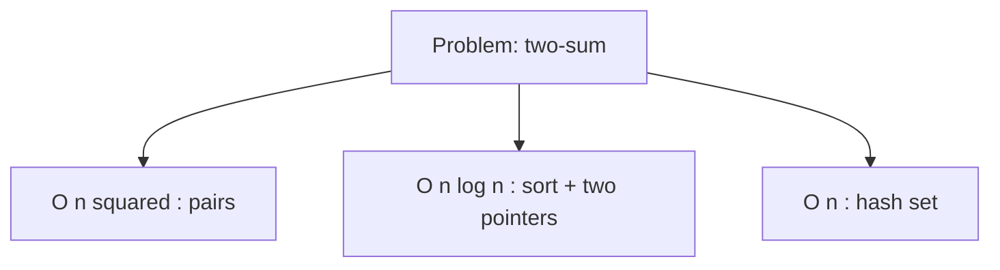

You can write a program that produces the right answer and is still
unusable because it takes hours when it should take milliseconds.
Performance is a separate axis from correctness. Learning to *feel*
how expensive an algorithm is — without doing formal proofs — is
one of the most valuable software-engineering skills.

<svg
  viewBox="0 0 640 230"
  role="img"
  aria-label="Three dotted cost curves rise from one origin: a green line stays flat, a blue line climbs steadily, and a red one rockets off the top of the chart — how different algorithms feel as input grows"
  style={{ display: "block", width: "100%", maxWidth: "640px", height: "auto", margin: "2.5rem auto" }}
>
  <g fill="currentColor" opacity="0.15">
    <rect x="60" y="190" width="520" height="4" rx="2" />
    <rect x="60" y="40" width="4" height="154" rx="2" />
  </g>
  <g style={{ color: "var(--ds-green-500)" }} fill="currentColor">
    <circle cx="100" cy="170" r="4" />
    <circle cx="155" cy="170" r="4" />
    <circle cx="210" cy="170" r="4" />
    <circle cx="265" cy="170" r="4" />
    <circle cx="320" cy="170" r="4" />
    <circle cx="375" cy="170" r="4" />
    <circle cx="430" cy="170" r="4" />
    <circle cx="485" cy="170" r="4" />
    <circle cx="540" cy="170" r="4" />
  </g>
  <g style={{ color: "var(--ds-blue-500)" }} fill="currentColor">
    <circle cx="100" cy="178" r="4" />
    <circle cx="155" cy="164" r="4" />
    <circle cx="210" cy="150" r="4" />
    <circle cx="265" cy="136" r="4" />
    <circle cx="320" cy="122" r="4" />
    <circle cx="375" cy="108" r="4" />
    <circle cx="430" cy="94" r="4" />
    <circle cx="485" cy="80" r="4" />
    <circle cx="540" cy="66" r="4" />
  </g>
  <g style={{ color: "var(--ds-red-500)" }} fill="currentColor">
    <circle cx="100" cy="186" r="4" />
    <circle cx="155" cy="179" r="4" />
    <circle cx="210" cy="161" r="4" />
    <circle cx="265" cy="133" r="4" />
    <circle cx="320" cy="96" r="4" />
    <circle cx="375" cy="50" r="4" />
  </g>
</svg>

## A working mental model of cost

For most everyday code, you care about a simple question: **how many
operations do I do as the input grows?** That count is the
algorithm's *time complexity*.

| Notation | Pronounced | Rough feel |
| --- | --- | --- |
| O(1) | "constant" | Same time no matter the input size. |
| O(log n) | "log n" | Doubling n adds one step. |
| O(n) | "linear" | Doubling n doubles the work. |
| O(n log n) | "n log n" | Slightly worse than linear; the sweet spot for sorting. |
| O(n²) | "n squared" | Doubling n quadruples the work. Fine for n=1000, painful for n=100,000. |
| O(2ⁿ) | "exponential" | Adding one input element doubles the time. Only tractable for tiny n. |

The rows are ordered from cheapest to most expensive: each step down
the table grows faster than the one above it.

You don't need to be a theorist. Just learn to recognize the
shape: nested loops over the same data are usually quadratic; a
single pass is linear; halving the search space each step is
logarithmic.

## Counting in code

<CodeBlock
  adapter="cpp"
  files={[
    {
      filename: "main.cpp",
      starterCode: `#include <iostream>
#include <vector>

int main() {
  std::vector<int> v(8);
  for (size_t i = 0; i < v.size(); ++i)
    v[i] = (int)i;

  // O(n): one pass
  int sum = 0;
  for (int x : v)
    sum += x;

  // O(n^2): nested over the same range
  int pairs = 0;
  for (size_t i = 0; i < v.size(); ++i)
    for (size_t j = i + 1; j < v.size(); ++j)
      if (v[i] + v[j] == 7)
        ++pairs;

  std::cout << "sum = " << sum << ", pairs summing to 7 = " << pairs << "\\n";
  return 0;
}
`,
    },
  ]}
/>

For n=8 the difference is invisible. For n=10,000,000 the linear
loop takes a moment; the quadratic loop is hopeless.

## The standard algorithms

Most of the algorithms you'd want are already in `<algorithm>`.
They're tested, fast, and read clearly. Reach for them before
writing a loop.

<CodeBlock
  adapter="cpp"
  files={[
    {
      filename: "main.cpp",
      starterCode: `#include <algorithm>
#include <iostream>
#include <numeric>
#include <vector>

int main() {
  std::vector<int> v = {5, 2, 9, 1, 7, 3};

  std::sort(v.begin(), v.end());                      // O(n log n)
  int total = std::accumulate(v.begin(), v.end(), 0); // O(n)
  auto it = std::find(v.begin(), v.end(), 7);         // O(n)
  auto pos = std::lower_bound(v.begin(), v.end(), 5); // O(log n) — sorted!
  int count = (int)std::count_if(v.begin(), v.end(),
                                  { return x % 2 == 0; }); // O(n)

  for (int x : v)
    std::cout << x << ' ';
  std::cout << "\\n";
  std::cout << "total = " << total << "\\n";
  std::cout << "found 7 at index = " << (it - v.begin()) << "\\n";
  std::cout << "5 belongs at index = " << (pos - v.begin()) << "\\n";
  std::cout << "even count = " << count << "\\n";
  return 0;
}
`,
    },
  ]}
/>

A few rules of thumb:

- `std::sort` is **O(n log n)** — your default sorting tool.
- `std::find`, `std::count`, `std::accumulate` are **linear**.
- `std::lower_bound`, `std::upper_bound`, `std::binary_search`
  require a *sorted* range and are **logarithmic**.
- Algorithms that produce output (`std::copy`, `std::transform`)
  generally match the size of the input.

## Algorithmic thinking, step by step

Suppose you must check whether any two of `n` numbers sum to a
target. Three approaches with very different costs:

| Approach | Cost | Idea |
| --- | --- | --- |
| Try every pair | O(n²) | Nested loops |
| Sort, then two pointers | O(n log n) | Sort once; walk from both ends |
| Hash set | O(n) average | For each x, check if `target - x` is in a set |

The fastest is also the easiest to get wrong (hash collisions, edge
cases). The point of these chapters is not to memorize "the best"
algorithm — it's to recognize that *multiple* approaches exist and
that the cost is a deliberate choice.

## Premature optimization vs. algorithmic thinking

The famous quote "premature optimization is the root of all evil" is
about *micro*-optimizations — tweaking individual instructions,
caches, branch predictors. It does **not** mean "ignore complexity."
Picking O(n²) when O(n log n) is one extra line of code is not
optimization, it's negligence at scale.

The right discipline:

1. Pick the right *algorithmic* shape from the start.
2. Write the clearest possible code at that complexity.
3. Measure. Only then optimize the hot spot.

## Challenge

<ChallengeCard
  adapter="cpp"
  title="Sort and median"
  instructions={`Given a hard-coded vector of 7 integers, sort it ascending and print the median (middle element). Use \`std::sort\`. Expected output for \`{8, 1, 6, 4, 2, 9, 3}\` is \`4\`.`}
  files={[
    {
      filename: "main.cpp",
      starterCode: `#include <algorithm>
#include <iostream>
#include <vector>

int main() {
  std::vector<int> v = {8, 1, 6, 4, 2, 9, 3};
  // your code
  return 0;
}
`,
      solutionCode: `#include <algorithm>
#include <iostream>
#include <vector>

int main() {
  std::vector<int> v = {8, 1, 6, 4, 2, 9, 3};
  std::sort(v.begin(), v.end());
  std::cout << v[v.size() / 2];
  return 0;
}
`,
    },
  ]}
  tests={[
    {
      id: "med",
      name: "Median is 4",
      description: "Exact stdout match",
      expect: { stdoutEquals: "4" },
    },
  ]}
/>

## Test your understanding

<MultipleChoice
  markdown={`Two nested loops, each iterating from 0 to n, that do constant work per pair — what is the time complexity?

- O(n)
  > That would be a single loop.
- O(log n)
  > That would be repeatedly halving.
- [o] O(n²)
  > Each of the n outer iterations does n inner iterations.
- O(n log n)
  > That is the cost of typical sorting algorithms.`}
/>

<MultipleChoice
  markdown={`Why does \`std::lower_bound\` require a sorted range?

- The compiler enforces it.
  > The compiler does not check sortedness.
- It does not; it works on any range.
  > It works, but produces nonsense on unsorted input.
- [o] It uses binary search internally; binary search is correct only if the elements are arranged in order.
  > Each comparison discards half the range, which only works when the data is sorted.
- It uses hashing.
  > It does not.`}
/>

Next: the *containers* that hold those algorithms' inputs — and
their trade-offs.
