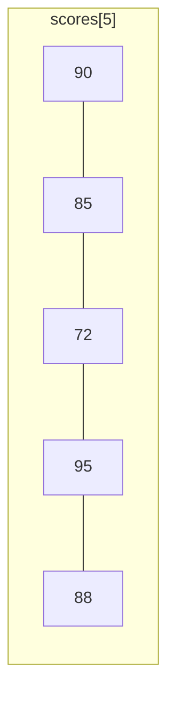
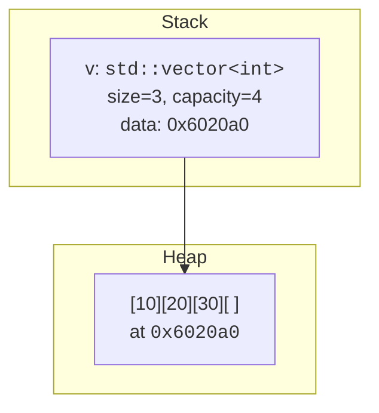

Almost every program needs to hold *many* values of the same type:
a list of scores, the pixels in an image, the characters of a name.
C++ gives you several tools for this, ranging from very low-level
(raw arrays) to very high-level (`std::vector`). Knowing which to
pick is one of the most useful judgement calls in the language.

<Figure
  slug="cpp-arrays-and-strings-cutout"
  alt="Arrays and strings, an isometric illustration"
/>

## Raw C arrays

The oldest form, inherited from C:

```cpp
int scores[5] = {90, 85, 72, 95, 88};
```

This puts five `int`s in **contiguous** memory. The size is part of
the type (`int[5]`) and is fixed at compile time.



You index it with `[i]` starting at 0:

<CodeBlock
  adapter="cpp"
  files={[
    {
      filename: "main.cpp",
      starterCode: `#include <iostream>

int main() {
  int scores[5] = {90, 85, 72, 95, 88};
  int total = 0;
  for (int i = 0; i < 5; ++i)
    total += scores[i];
  std::cout << "average = " << total / 5 << "\\n";
  return 0;
}
`,
    },
  ]}
/>

Raw arrays have two well-known weaknesses:

1. **They forget their size.** Pass one to a function and you get a
   pointer; you must pass the length separately.
2. **They don't bounds-check.** `scores[10]` compiles and silently
   reads random memory.

These two problems together cause a huge fraction of all C/C++ bugs.
For new code, prefer the standard library containers.

<Figure
  slug="cpp-arrays-and-strings-raw-c-arrays-inline-cutout"
  alt="A fixed strip of cells with no guard at either end, a marker resting just past the final cell"
  caption="A raw array has no guard at either end, so overrunning it is silent."
/>

## `std::array<T, N>`: a safer fixed array

`std::array` wraps a raw array and remembers its size. It can be
copied, returned from functions, and works with all standard
algorithms.

<Figure
  slug="cpp-arrays-and-strings-std-array-t-inline-cutout"
  alt="A fixed strip of cells inside a rigid frame with stop blocks fitted at both ends"
  caption="`std::array` remembers its own size, which a raw array never does."
/>

<CodeBlock
  adapter="cpp"
  files={[
    {
      filename: "main.cpp",
      starterCode: `#include <array>
#include <iostream>

int main() {
  std::array<int, 5> scores = {90, 85, 72, 95, 88};
  int total = 0;
  for (int s : scores)
    total += s; // range-based for
  std::cout << "size  = " << scores.size() << "\\n";
  std::cout << "total = " << total << "\\n";
  return 0;
}
`,
    },
  ]}
/>

Use `std::array` whenever the size is known at compile time.

## `std::vector<T>`: a growable array

`std::vector` is the workhorse container of C++. It looks like an
array but can grow at runtime. You'll reach for it constantly.

<CodeBlock
  adapter="cpp"
  files={[
    {
      filename: "main.cpp",
      starterCode: `#include <iostream>
#include <vector>

int main() {
  std::vector<int> v; // empty
  v.push_back(10);
  v.push_back(20);
  v.push_back(30);

  std::cout << "size = " << v.size() << "\\n";
  for (int x : v)
    std::cout << x << " ";
  std::cout << "\\n";
  return 0;
}
`,
    },
  ]}
/>

Under the hood:



A vector owns three things internally: a pointer to its heap buffer,
its current size (how many elements you've put in), and its capacity
(how many it could hold before having to reallocate).

`push_back()` is cheap *on average* because the vector doubles its
capacity when it runs out of room. Occasional growth is expensive
(it has to copy/move everything), but amortized over many pushes the
cost per element stays constant.

## `std::string`: a vector of characters, basically

A `std::string` is to `char` what `std::vector` is to `int`. It owns
its character storage, knows its length, and resizes as needed.

<Figure
  slug="cpp-arrays-and-strings-inline-cutout"
  alt="A fixed strip of cells holding blocks beside a fixed strip of letter tiles ending in a small stop mark"
  caption="A string is an array of characters that manages its own storage."
/>

<CodeBlock
  adapter="cpp"
  files={[
    {
      filename: "main.cpp",
      starterCode: `#include <iostream>
#include <string>

int main() {
  std::string greeting = "Hello";
  greeting += ", world!";

  std::cout << greeting << "\\n";
  std::cout << "length = " << greeting.size() << "\\n";

  // index like a vector
  std::cout << "first = " << greeting[0] << "\\n";
  std::cout << "last  = " << greeting.back() << "\\n";
  return 0;
}
`,
    },
  ]}
/>

Beware the C-style string (`const char*`, `char[]`). It's a raw
array of characters terminated by a `'\0'` byte. You'll meet it when
calling C libraries, but in pure C++ code you should almost always
use `std::string`.

## Iterating safely

There are three common patterns:

```cpp
// 1. classic index loop
for (size_t i = 0; i < v.size(); ++i) {
    use(v[i]);
}

// 2. range-based for (read-only)
for (int x : v) {
    use(x);
}

// 3. range-based for (by reference, to modify)
for (int& x : v) {
    x *= 2;
}
```

Prefer #2 and #3 when you don't actually need the index, they're
shorter and harder to get wrong.

> **Indexing safety.** `v[i]` does *not* bounds-check. `v.at(i)`
> throws `std::out_of_range` if `i` is invalid. In tight loops use
> `[]`; in code that handles untrusted input, prefer `at()`.

## Two-dimensional data

A grid is naturally a vector of vectors:

<CodeBlock
  adapter="cpp"
  files={[
    {
      filename: "main.cpp",
      starterCode: `#include <iostream>
#include <vector>

int main() {
  int rows = 3, cols = 4;
  std::vector<std::vector<int>> grid(rows, std::vector<int>(cols, 0));

  // fill with row * cols + col
  for (int r = 0; r < rows; ++r)
    for (int c = 0; c < cols; ++c)
      grid[r][c] = r * cols + c;

  for (int r = 0; r < rows; ++r) {
    for (int c = 0; c < cols; ++c)
      std::cout << grid[r][c] << '\\t';
    std::cout << '\\n';
  }
  return 0;
}
`,
    },
  ]}
/>

For performance-critical code you'd use a single flat vector and
compute the index yourself (`r * cols + c`). That keeps everything
in one contiguous block, friendlier to the CPU cache.

## Challenges

<ChallengeCard
  adapter="cpp"
  title="Vector statistics"
  instructions={`Read 5 ints from the input \`{4, 8, 15, 16, 23}\` (already wired in \`main\`). Print the smallest, the largest, and the sum, separated by spaces. Expected output: \`4 23 66\`.`}
  files={[
    {
      filename: "main.cpp",
      starterCode: `#include <iostream>
#include <vector>

int main() {
  std::vector<int> v = {4, 8, 15, 16, 23};
  // your code: compute min, max, sum and print them space-separated
  return 0;
}
`,
      solutionCode: `#include <iostream>
#include <vector>

int main() {
  std::vector<int> v = {4, 8, 15, 16, 23};
  int mn = v[0], mx = v[0], sum = 0;
  for (int x : v) {
    if (x < mn)
      mn = x;
    if (x > mx)
      mx = x;
    sum += x;
  }
  std::cout << mn << ' ' << mx << ' ' << sum;
  return 0;
}
`,
    },
  ]}
  tests={[
    {
      id: "stat",
      name: "Stats are correct",
      description: "Exact stdout match",
      expect: { stdoutEquals: "4 23 66" },
    },
  ]}
/>

<ChallengeCard
  adapter="cpp"
  title="Reverse a string"
  instructions={`Read the literal string \`"computational"\` (already in main) and print its reverse: \`lanoitatupmoc\`. You may use indexing or a standard algorithm.`}
  files={[
    {
      filename: "main.cpp",
      starterCode: `#include <iostream>
#include <string>

int main() {
  std::string s = "computational";
  // your code
  return 0;
}
`,
      solutionCode: `#include <iostream>
#include <string>

int main() {
  std::string s = "computational";
  for (int i = (int)s.size() - 1; i >= 0; --i)
    std::cout << s[i];
  return 0;
}
`,
    },
  ]}
  tests={[
    {
      id: "rev",
      name: "Reversed",
      description: "Exact stdout match",
      expect: { stdoutEquals: "lanoitatupmoc" },
    },
  ]}
/>

## Test your understanding

<MultipleChoice
  markdown={`What is the main difference between a raw \`int[10]\` and \`std::array<int, 10>\`?

- [o] \`std::array\` knows its size, can be copied and returned by value, and works with standard algorithms, while raw arrays decay to pointers and forget their length.
  > \`std::array\` removes most of the footguns without any runtime cost.
- Raw arrays are faster at runtime.
  > They are typically the same speed; \`std::array\` is a zero-cost wrapper.
- They are interchangeable; the names are just different.
  > They differ in how they propagate type information.
- Raw arrays live on the heap.
  > Raw arrays declared as locals live on the stack just like \`std::array\`.`}
/>

<MultipleChoice
  markdown={`Why is \`push_back()\` on a \`std::vector\` considered $O(1)$ *amortized*?

- It is $O(\\log n)$.
  > Logarithmic growth would make growth too slow; vectors double (or similar).
- It is always $O(1)$.
  > Occasionally it triggers a reallocation and copy, which is $O(n)$.
- [o] Most pushes are $O(1)$; when capacity is exceeded the vector reallocates and copies, but it grows geometrically, so the *average* cost per push is constant.
  > This is the classic amortized-analysis argument.
- It is $O(n)$ every time.
  > That would make any vector-based algorithm slow; this isn't the case.`}
/>

<MultipleChoice
  markdown={`What does \`v.at(i)\` do that \`v[i]\` does not?

- [o] It checks the index against the vector's size and throws \`std::out_of_range\` if it is invalid; \`[]\` performs no such check.
  > Use \`at()\` when handling unvalidated input.
- It allocates new storage.
  > Neither does.
- It is significantly faster.
  > It is slightly *slower* because of the check.
- It returns a copy instead of a reference.
  > Both return references.`}
/>

Next: how to bundle multiple values together into a single named
type, *structs* and aggregates.
