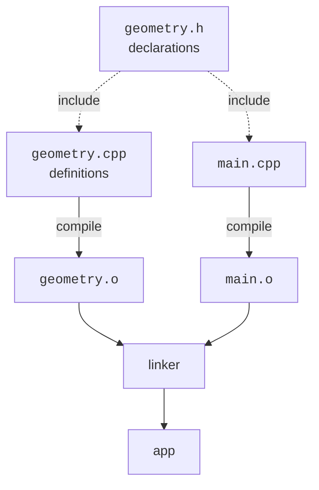

Programs that you'll throw away after lunch don't need much
structure. Programs you'll come back to in six months, or that
five other people will read this week, do. This chapter is a
collection of practices that distinguish a codebase you can grow
into from one that grows around you.

<svg
  viewBox="0 0 640 220"
  role="img"
  aria-label="A murky overlapping tangle of blobs on the left becomes a tidy grid of evenly spaced colored tiles on the right, structure that lets a codebase grow without growing around you"
  style={{ display: "block", width: "100%", maxWidth: "640px", height: "auto", margin: "2.5rem auto" }}
>
  <g fill="currentColor" opacity="0.12">
    <circle cx="110" cy="90" r="30" />
    <circle cx="95" cy="140" r="24" />
    <circle cx="170" cy="100" r="16" />
  </g>
  <g style={{ color: "var(--ds-blue-500)" }} fill="currentColor">
    <circle cx="150" cy="120" r="26" fillOpacity="0.12" />
    <circle cx="140" cy="70" r="20" fillOpacity="0.1" />
  </g>
  <g style={{ color: "var(--ds-gray-400)" }}>
    <path
      d="M238 110 H 324"
      fill="none"
      stroke="currentColor"
      strokeWidth="2"
      strokeLinecap="round"
    />
  </g>
  <g style={{ color: "var(--ds-blue-500)" }} fill="currentColor">
    <rect x="360" y="60" width="36" height="36" rx="9" fillOpacity="0.85" />
    <rect x="460" y="60" width="36" height="36" rx="9" fillOpacity="0.85" />
    <rect x="410" y="110" width="36" height="36" rx="9" fillOpacity="0.85" />
    <rect x="360" y="160" width="36" height="36" rx="9" fillOpacity="0.85" />
    <rect x="460" y="160" width="36" height="36" rx="9" fillOpacity="0.85" />
  </g>
  <g style={{ color: "var(--ds-green-500)" }} fill="currentColor">
    <rect x="410" y="60" width="36" height="36" rx="9" fillOpacity="0.85" />
    <rect x="510" y="110" width="36" height="36" rx="9" fillOpacity="0.85" />
    <rect x="410" y="160" width="36" height="36" rx="9" fillOpacity="0.85" />
  </g>
  <g style={{ color: "var(--ds-yellow-500)" }} fill="currentColor">
    <rect x="360" y="110" width="36" height="36" rx="9" fillOpacity="0.85" />
    <rect x="510" y="60" width="36" height="36" rx="9" fillOpacity="0.85" />
    <rect x="510" y="160" width="36" height="36" rx="9" fillOpacity="0.85" />
  </g>
  <g style={{ color: "var(--ds-blue-500)" }} fill="currentColor">
    <rect x="460" y="110" width="36" height="36" rx="9" fillOpacity="0.85" />
  </g>
</svg>

## Names carry most of the meaning

The single highest-impact practice in software is choosing good
names. A well-named function explains itself; a poorly-named one
needs comments and breeds bugs.

Guidelines:

- **Verbs for functions, nouns for variables.** `compute_total(orders)`
  is a function; `total` is a variable.
- **Specific over generic.** `customer_email` beats `data`.
- **Length proportional to scope.** A loop index in a 3-line loop
  can be `i`. A variable used across 200 lines deserves a real
  name.
- **Names should not lie.** If you rename what a function does,
  rename the function.
- **Avoid abbreviations** unless they are standard in the domain
  (`url`, `id`, `db`).

## One thing per function

A function that does one clearly-named thing is easy to read, easy
to test, and easy to reuse. If you find yourself saying *and* in a
function's name (`load_and_parse_and_print`), you have at least
three functions trying to be one.

A useful self-check: can you explain what the function does in one
sentence without using *and* or *or*? If not, split it.

## Headers and source files

C++ code is typically split across two kinds of file:

- **Header files (`.h`, `.hpp`)** declare what exists, class
  layouts, function signatures, templates. They are `#include`d by
  any code that needs to *use* the declarations.
- **Source files (`.cpp`)** define the implementations.



Rules of thumb:

- Put the *minimum* in headers, only what callers need to see.
- Use `#pragma once` (or include guards) to prevent multiple
  inclusion.
- Don't put implementations of big functions in headers unless
  they're templates.

## Use the type system to your advantage

Every time you choose a type, you give the compiler an opportunity
to catch mistakes for you.

- Prefer `enum class Color { Red, Green, Blue }` over raw ints.
- Prefer `std::chrono::seconds` over a bare `int` for durations.
- Prefer typed wrappers for IDs that mustn't be mixed up
  (`UserId`, `OrderId`).
- Prefer `const` and references over mutable parameters.

Each of these turns a class of "looks fine, runs wrong" bug into a
compile error.

## Write tests

Tests do four things at once:

1. Verify your code works *today*.
2. Catch regressions *tomorrow*.
3. Document how the code is meant to be used.
4. Force you to design code that *can* be tested, usually a
   pressure toward smaller, less-coupled pieces.

You don't need a framework to start. A `main()` that runs a few
assertions is already a test:

```cpp
#include <cassert>
#include "calculator.h"

int main() {
    assert(add(2, 3) == 5);
    assert(add(-1, 1) == 0);
    return 0;
}
```

For real projects, frameworks like GoogleTest or Catch2 add
test discovery, prettier output, and parametric tests.

## Comments, when and how

Good code is mostly self-explanatory. Comments are for the *why*,
the context a reader cannot reconstruct from the code alone, not
the *what*.

```cpp
// good: explains why this surprising thing exists
// We use a fixed buffer of 4096 because POSIX guarantees atomic writes up to that size.
constexpr size_t kBufSize = 4096;

// bad: tells you what the code already says
i = i + 1;   // increment i
```

Outdated comments are worse than no comments. If you change a
function's behaviour, update its comments at the same time.

## Code review

Once you're working with other people, code review is the highest-
leverage quality practice. A second pair of eyes catches bugs,
suggests clearer designs, and spreads knowledge across the team.

When reviewing:

- Focus on correctness and clarity first; nit-pick style last.
- Ask questions instead of issuing commands; the author often has
  context you don't.
- Praise good things, not just bad ones. Reviews are a learning
  channel in both directions.

When having your code reviewed:

- Keep changes small. A 100-line PR gets thoughtful feedback; a
  10,000-line PR gets a thumbs-up.
- Explain *why* you made each non-obvious choice in the description.
- Assume the reviewer is trying to help, even when the feedback
  stings.

## Avoid clever code

There's a tempting trap: write a one-liner you're proud of, instead
of three plain lines. The cost shows up six months later when
someone, possibly you, has to understand it.

A useful heuristic: **the audience for your code is a tired colleague at
11 PM trying to fix an unrelated bug.** Write for them.

## A small checklist for every change

- [ ] Does it do one thing?
- [ ] Is each name accurate and specific?
- [ ] Are the public functions and classes documented (briefly)?
- [ ] Are there tests for the new behaviour?
- [ ] Do the tests still pass?
- [ ] Have you removed any dead code, debug prints, or TODOs you
      resolved?

These are unglamorous habits. They are also what separates code
that lasts from code that gets rewritten every two years.

## Test your understanding

<MultipleChoice
  markdown={`What's the strongest reason to keep functions small and focused?

- The compiler inlines them better.
  > Modern compilers inline freely; this isn't the main point.
- It reduces the executable size.
  > Often the opposite, very slightly.
- [o] Small functions with one responsibility are easier to read, name accurately, test in isolation, and reuse, which compounds into a much more maintainable codebase.
  > Readability and testability are the lasting payoff, not any micro-optimization.
- It is required by the C++ standard.
  > It is not.`}
/>

<MultipleChoice
  markdown={`Which kind of comment is most valuable?

- A comment that restates the next line of code in English.
  > Those tend to drift out of sync and add noise.
- [o] A comment that captures *why* a non-obvious decision was made, context the reader cannot reconstruct from the code alone.
  > The code already shows *what* it does; the *why* is the part a comment can add.
- A header banner of equal signs.
  > Decoration is not insight.
- A comment marking the end of every block.
  > Indentation already conveys that.`}
/>

Next: where to go from here.
