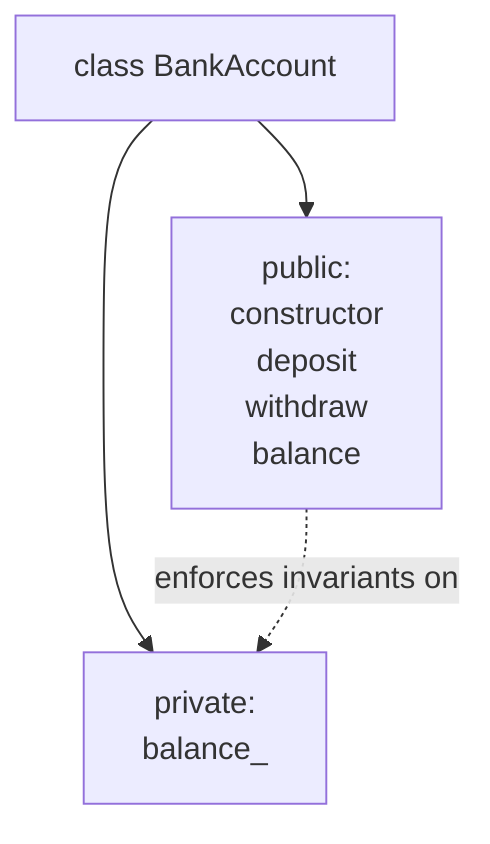
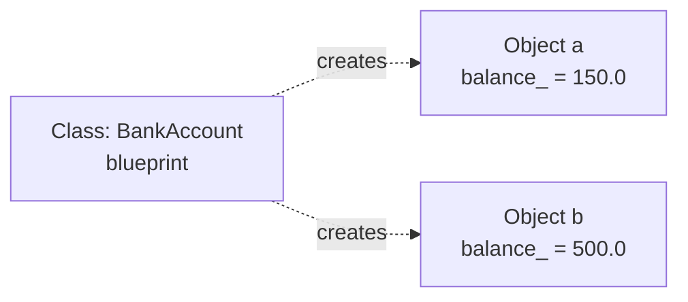

A struct that holds data is useful. But often the data only makes
sense together with certain *operations*. A `BankAccount` is its
balance *plus* the rules for deposits and withdrawals. A `Timer` is
its start time *plus* the way you start, stop, and read it. Putting
data and behaviour together is the central idea of
**object-oriented programming (OOP)**, and in C++ it's done with
**classes**.

<Figure
  slug="cpp-classes-and-objects-cutout"
  alt="Classes and objects, an isometric illustration"
/>

## From struct to class

Here is a struct holding bank account data:

```cpp
struct BankAccount {
    double balance;
};
```

The trouble: any code anywhere can do `account.balance = -1e9;`,
nothing protects the rule that balances should not go negative.

A class lets us say: "the balance belongs to the account; outside
code may only ask it to deposit or withdraw."

<CodeBlock
  adapter="cpp"
  files={[
    {
      filename: "main.cpp",
      starterCode: `#include <iostream>

class BankAccount {
public:
  BankAccount(double opening) : balance_(opening) {}

  void deposit(double amount) {
    if (amount > 0)
      balance_ += amount;
  }
  bool withdraw(double amount) {
    if (amount > 0 && amount <= balance_) {
      balance_ -= amount;
      return true;
    }
    return false;
  }
  double balance() const { return balance_; }

private:
  double balance_;
};

int main() {
  BankAccount a(100.0);
  a.deposit(50.0);
  bool ok = a.withdraw(200.0); // refused
  std::cout << "ok = " << ok << "\\n";
  std::cout << "bal = " << a.balance() << "\\n";
  return 0;
}
`,
    },
  ]}
/>

What changed:

- **Access modifiers** `public:` and `private:` split the class into
  "the part the outside world sees" and "the part only methods may
  touch."
- The data field is now named `balance_` (trailing underscore is a
  common convention to mark members).
- A **constructor** sets the field at creation time. We'll devote a
  whole chapter to constructors next.
- **Methods** (also called *member functions*) operate on the
  object. `const` after the parameter list means "I promise not to
  modify the object."

## Anatomy of a class



The public methods form the **interface**. The private fields are
the **implementation**. The interface promises that the balance is
always sensible; the implementation guards that promise.

## Objects vs. classes

A **class** is a *type*, a description. An **object** is a *value*
of that type, a specific instance.

```cpp
BankAccount a(100.0);    // a is an object
BankAccount b(500.0);    // b is another, independent object

a.deposit(50.0);         // affects only a
```



Each object has its *own copy* of the private fields. Methods, on
the other hand, exist once per class and operate on whichever object
they were called on.

## The hidden `this` pointer

When you call `a.deposit(50.0)`, the compiler passes `a`'s address
as a hidden first argument. Inside the method, the implicit pointer
`this` refers to the object:

```cpp
void deposit(double amount) {
    if (amount > 0) this->balance_ += amount;   // same as balance_ += amount
}
```

You rarely write `this->` explicitly, but it's there. It's how the
method knows *which* account's balance to change.

## Constness on methods

Methods marked `const` may be called on `const` objects and may not
modify the object. Methods without `const` may modify it.

```cpp
class Timer {
public:
    void start();                  // modifies, non-const
    double seconds() const;        // observes, const
};
```

Mark every method that doesn't change state as `const`. This is one
of the most useful disciplines in C++.

## A small but complete example

<CodeBlock
  adapter="cpp"
  files={[
    {
      filename: "main.cpp",
      starterCode: `#include <iostream>
#include <string>

class Counter {
public:
  Counter(std::string name) : name_(std::move(name)), count_(0) {}

  void tick() { ++count_; }
  int count() const { return count_; }
  const std::string &name() const { return name_; }

private:
  std::string name_;
  int count_;
};

int main() {
  Counter clicks("clicks");
  clicks.tick();
  clicks.tick();
  clicks.tick();

  std::cout << clicks.name() << ": " << clicks.count() << "\\n";
  return 0;
}
`,
    },
  ]}
/>

The class hides its fields, exposes a small clear interface, and
keeps an obvious invariant ("count_ only ever goes up by one").

## Challenge

<ChallengeCard
  adapter="cpp"
  title="A Counter class"
  instructions={`Complete the \`Counter\` class so that it supports \`tick()\` (increments by 1), \`reset()\` (sets back to 0), and \`value() const\` (returns the current count). The \`main\` function is wired to call them and print \`2 0\` if your class works correctly.`}
  files={[
    {
      filename: "main.cpp",
      starterCode: `#include <iostream>

class Counter {
public:
  // your members and methods here
};

int main() {
  Counter c;
  c.tick();
  c.tick();
  std::cout << c.value();
  c.reset();
  std::cout << ' ' << c.value();
  return 0;
}
`,
      solutionCode: `#include <iostream>

class Counter {
public:
  Counter() : n_(0) {}
  void tick() { ++n_; }
  void reset() { n_ = 0; }
  int value() const { return n_; }

private:
  int n_;
};

int main() {
  Counter c;
  c.tick();
  c.tick();
  std::cout << c.value();
  c.reset();
  std::cout << ' ' << c.value();
  return 0;
}
`,
    },
  ]}
  tests={[
    {
      id: "ctr",
      name: "Counter behaves",
      description: "Exact stdout match",
      expect: { stdoutEquals: "2 0" },
    },
  ]}
/>

## Test your understanding

<MultipleChoice
  markdown={`What is the difference between a class and an object?

- [o] A class is a type, a blueprint describing data and operations. An object is an *instance* of that type, with its own copy of the data.
  > Code creates many objects from one class.
- A class can only exist once per program.
  > Classes are types; you can create as many objects as you like.
- They are the same thing.
  > They are distinct concepts.
- An object is a class with no methods.
  > That is incorrect.`}
/>

<MultipleChoice
  markdown={`Why mark a method \`const\`?

- It is required by the compiler.
  > It is optional.
- It makes the method run faster.
  > Performance is not the main reason; the compiler can optimize either way.
- [o] It documents and enforces that the method does not modify the object, allowing it to be called on \`const\` instances and helping readers reason about behaviour.
  > Mark every observer method \`const\`.
- It hides the method from outside code.
  > That is what \`private:\` does.`}
/>

Next: why we hide fields, *encapsulation* and the idea of an
*invariant*.
