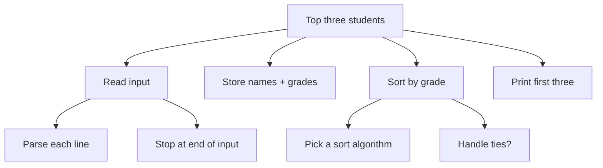

The hardest part of programming is not the language. It is teaching
yourself a particular way of *thinking* about problems. Computer
scientists call this **computational thinking**, and it has four
classic ingredients:

<Figure
  slug="cpp-computational-thinking-cutout"
  alt="Computational thinking, an isometric illustration"
/>

1. **Decomposition**, break a big problem into small pieces.
2. **Pattern recognition**, notice that two pieces are similar.
3. **Abstraction**, ignore irrelevant details and focus on what
   matters.
4. **Algorithms**, write a precise, step-by-step procedure.

Most beginner frustration comes from trying to write code *before*
doing those four things. This chapter is mostly prose, with a few
code blocks for illustration. The goal is to install a habit.

## Why "computational" thinking?

Computers cannot guess. They cannot pick up on context. Anything
that you do not spell out explicitly does not happen. If you forget
to handle an empty list, the empty list will arrive and your program
will misbehave. If you do not consider negative numbers, negative
numbers will appear and ruin your day.

The job of a programmer is therefore to:

- Imagine every input the program might see.
- Decide exactly what should happen for each one.
- Write that down in a form the computer can execute.

That requires almost-paranoid precision. With practice it becomes a
mostly enjoyable habit.

## Decomposition: break the problem down

Suppose your task is "*write a program that reads a list of student
names and grades and prints the top three students.*" That sounds
hard. Before writing a single line of C++, decompose it:



Each leaf of that tree is small enough that you could probably write
it in 5–15 lines of C++. *That* is what you should code first, the
leaves, not the whole thing at once.

<Figure
  slug="cpp-computational-thinking-decomposition-break-problem-inline-cutout"
  alt="One awkward slab split along scored lines into four blocks that each fit a waiting slot"
  caption="Split the problem until each piece is small enough to write in a few lines."
/>

## Pattern recognition: spot the repetition

After decomposing, look for parts that are *the same* in shape. Two
nearly-identical pieces of code is your cue to invent an
abstraction.

Here is a pre-pattern-recognition version of a simple program:

<CodeBlock
  adapter="cpp"
  files={[
    {
      filename: "main.cpp",
      starterCode: `#include <iostream>

int main() {
  int a = 5, b = 10, c = 3;

  // distance from average for each value (clunky version)
  double avg = (a + b + c) / 3.0;
  double da = a - avg;
  if (da < 0)
    da = -da;
  double db = b - avg;
  if (db < 0)
    db = -db;
  double dc = c - avg;
  if (dc < 0)
    dc = -dc;

  std::cout << "a deviation: " << da << "\\n";
  std::cout << "b deviation: " << db << "\\n";
  std::cout << "c deviation: " << dc << "\\n";
  return 0;
}
`,
    },
  ]}
/>

Three lines look almost identical: *take a value, subtract the
average, drop the sign.* That repetition is screaming for a
function.

<CodeBlock
  adapter="cpp"
  files={[
    {
      filename: "main.cpp",
      starterCode: `#include <cmath> // std::abs
#include <iostream>

double deviation(double v, double avg) { return std::abs(v - avg); }

int main() {
  int a = 5, b = 10, c = 3;
  double avg = (a + b + c) / 3.0;
  std::cout << "a deviation: " << deviation(a, avg) << "\\n";
  std::cout << "b deviation: " << deviation(b, avg) << "\\n";
  std::cout << "c deviation: " << deviation(c, avg) << "\\n";
  return 0;
}
`,
    },
  ]}
/>

We *named the pattern* (`deviation`) and used it three times. The
program got smaller, easier to read, and easier to change.

## Abstraction: ignore what doesn't matter

**Abstraction** is the act of forgetting details that do not change
the answer. When you say "*the average of these grades*," you do
not care whether the grades are stored in an array, a vector, or a
linked list. You only care that you can *iterate over them and add
them up*.

<Figure
  slug="cpp-computational-thinking-inline-cutout"
  alt="A working machine with its casing lowered over it so only the handle and the chute remain visible"
  caption="Ignoring what does not change the answer is what makes a problem tractable."
/>

C++ rewards abstraction: the standard library is full of generic
algorithms that work on *anything that behaves like a sequence*.

<CodeBlock
  adapter="cpp"
  files={[
    {
      filename: "main.cpp",
      starterCode: `#include <iostream>
#include <numeric> // std::accumulate
#include <vector>

int main() {
  std::vector<int> grades = {91, 82, 73, 88, 95};
  int total = std::accumulate(grades.begin(), grades.end(), 0);
  double avg = static_cast<double>(total) / grades.size();
  std::cout << "average = " << avg << "\\n";
  return 0;
}
`,
    },
  ]}
/>

`std::accumulate` does not know or care that the data lives in a
`vector`. It just walks from a *beginning* iterator to an *end*
iterator, accumulating. That is abstraction at work.

## Algorithms: precise step-by-step procedures

An **algorithm** is a finite, unambiguous, terminating procedure for
solving a problem. Every program is built out of algorithms, big
and small. Before writing code, it is enormously useful to write
the algorithm out in *plain language* (called **pseudocode**) first.

Here is the algorithm for "find the maximum element of a list":

```
1. If the list is empty, there is no maximum. Report an error.
2. Let `best` = the first element.
3. For each remaining element `x`:
       if x > best, set best = x.
4. After the loop ends, `best` holds the maximum. Return it.
```

Now the translation into C++ is almost mechanical:

```cpp
#include <iostream>
#include <stdexcept>
#include <vector>

int max_element(const std::vector<int> &xs) {
  if (xs.empty()) {
    throw std::runtime_error("cannot take max of empty vector");
  }
  int best = xs[0];
  for (std::size_t i = 1; i < xs.size(); ++i) {
    if (xs[i] > best) {
      best = xs[i];
    }
  }
  return best;
}

int main() {
  std::vector<int> v = {3, 1, 4, 1, 5, 9, 2, 6};
  std::cout << "max = " << max_element(v) << "\n";
  return 0;
}
```

<Callout type="info" title="Not runnable in the browser">
The C++ toolchain behind these pages compiles with `-fno-exceptions`, because
its WebAssembly sysroot ships no exception runtime at all. `throw` therefore
does not compile here. The code is correct on any ordinary compiler; it is
shown rather than run.
</Callout>

If you ever feel stuck staring at a blank editor, drop down a level:
write the algorithm in English first, then translate.

## A worked example: FizzBuzz, deliberately

The classic warm-up problem: print the numbers 1 to 100, but for
multiples of 3 print "Fizz", for multiples of 5 print "Buzz", and
for multiples of both print "FizzBuzz".

Let's *not* leap into code. Walk through computational thinking
first.

**Decompose:**

- A loop from 1 to 100.
- A decision at each number: print Fizz / Buzz / FizzBuzz / the
  number.

**Pattern-recognize:**

- "Is it a multiple of N?" appears twice (3 and 5). That is a
  reusable predicate: `n % m == 0`.

**Abstract:**

- The *core idea* is: classify each number into one of four
  categories.

**Algorithm:**

```
For i from 1 to 100:
    if i divisible by 15: print "FizzBuzz"
    else if i divisible by 3: print "Fizz"
    else if i divisible by 5: print "Buzz"
    else: print i
```

Now the C++ practically writes itself:

<CodeBlock
  adapter="cpp"
  files={[
    {
      filename: "main.cpp",
      starterCode: `#include <iostream>

int main() {
  for (int i = 1; i <= 15; ++i) { // shortened to 15 for brevity
    if (i % 15 == 0)
      std::cout << "FizzBuzz";
    else if (i % 3 == 0)
      std::cout << "Fizz";
    else if (i % 5 == 0)
      std::cout << "Buzz";
    else
      std::cout << i;
    std::cout << "\\n";
  }
  return 0;
}
`,
    },
  ]}
/>

Notice that we *thought through* the order of the checks: the most
specific case (multiples of 15) goes first, otherwise the multiples
of 3 would always win. That kind of ordering bug is one of the most
common reasons FizzBuzz interviews go wrong. Decomposition catches
it for free.

## Edge cases: the secret weapon

The strongest habit you can build is asking, after every algorithm,
*"what about the weird inputs?"* For a function that takes a list:

- What if the list is empty?
- What if the list has exactly one element?
- What if all elements are equal?
- What if the elements are negative?
- What if the list is huge?
- What if the input has duplicates?

Most production bugs are edge cases the programmer forgot. Train
yourself to enumerate them *before* you finish the code.

## A challenge: practice computational thinking

<ChallengeCard
  adapter="cpp"
  title="Count vowels"
  instructions={`Implement a function \`int count_vowels(const std::string& s)\` that returns how many characters in \`s\` are vowels. Treat both upper- and lower-case \`a, e, i, o, u\` as vowels. \`main\` already prints the result for a fixed input, your job is to implement the function.\n\nThink through edge cases: empty string, all-vowel string, no vowels, mixed case.`}
  files={[
    {
      filename: "main.cpp",
      starterCode: `#include <iostream>
#include <string>

int count_vowels(const std::string &s) {
  // your code here
  return 0;
}

int main() {
  std::cout << count_vowels("Hello, World!") << "\\n";
  return 0;
}
`,
      solutionCode: `#include <iostream>
#include <string>

int count_vowels(const std::string &s) {
  int n = 0;
  for (char c : s) {
    switch (c) {
    case 'a':
    case 'e':
    case 'i':
    case 'o':
    case 'u':
    case 'A':
    case 'E':
    case 'I':
    case 'O':
    case 'U':
      ++n;
      break;
    default:
      break;
    }
  }
  return n;
}

int main() {
  std::cout << count_vowels("Hello, World!") << "\\n";
  return 0;
}
`,
    },
  ]}
  tests={[
    {
      id: "hw",
      name: "Hello, World! has 3 vowels",
      description: "e, o, o",
      expect: { stdoutEquals: "3" },
    },
  ]}
/>

## Test your understanding

<MultipleChoice
  markdown={`Which of the following best describes "decomposition" in computational thinking?

- Memorizing the syntax of the language you are using.
  > Syntax knowledge is useful but unrelated to decomposition.
- [o] Breaking a large problem into smaller, more manageable sub-problems.
  > Decomposition is the first step in turning a vague task into something programmable.
- Deleting unnecessary features from a finished program.
  > That is refactoring, not decomposition.
- Writing the answer in as few lines of code as possible.
  > Code golf is not decomposition.`}
/>

<MultipleChoice
  markdown={`Pattern recognition is most useful for identifying...

- Which programming language to use.
  > That is a different kind of decision.
- The fastest possible algorithm for a problem.
  > Selecting algorithms is more about analysis than pattern matching.
- Bugs in your code.
  > Debugging is its own skill.
- [o] Repetition that could be replaced by a single function or loop.
  > Spotting repeated structure is the cue to abstract it.`}
/>

<MultipleChoice
  markdown={`Why is writing pseudocode before C++ often a good habit?

- Pseudocode is faster to compile than C++.
  > Pseudocode is not compiled at all.
- Pseudocode automatically handles all edge cases.
  > Pseudocode only captures whatever you bother to write.
- [o] It lets you reason about the algorithm without being distracted by syntax, and exposes flaws before you've committed to code.
  > Many beginner bugs come from rushing into syntax before the algorithm is clear.
- The compiler will refuse C++ that wasn't preceded by pseudocode.
  > It will happily compile any valid C++.`}
/>

<MultipleChoice
  markdown={`Which is **not** a good edge case to consider for a function that takes a list of integers?

- A list of all-equal elements.
  > Often a useful edge case.
- A list of one element.
  > Always worth considering.
- The empty list.
  > Always worth considering.
- [o] The exact list the interviewer happens to have in mind.
  > Real programs do not know in advance what input they'll get; you must reason about *categories* of input, not specific cases.`}
/>

Next: variables and memory, what *is* a variable, really?
