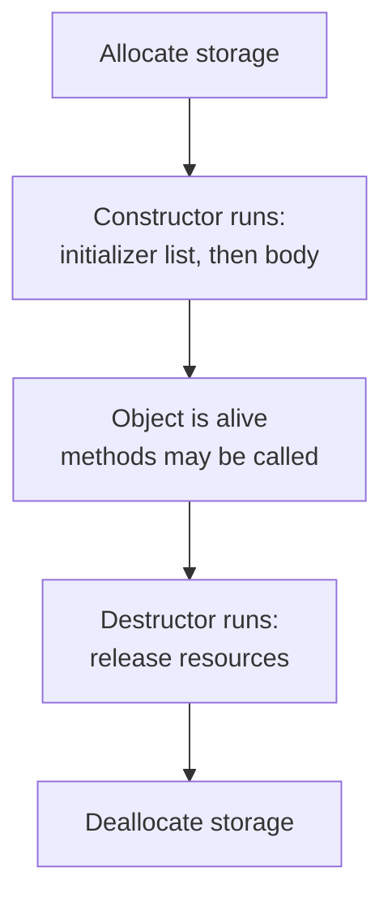

Every C++ object has a beginning and an end. The **constructor**
runs at the beginning to put the object in a valid state. The
**destructor** runs at the end to release whatever the object was
holding onto. These two functions are the spine of resource
management in C++.

<Figure
  slug="cpp-constructors-destructors-cutout"
  alt="Constructors and destructors, an isometric illustration"
/>

## Constructors put fields into a valid state

A constructor is a special method named after the class. It runs
once, automatically, when an object is created.

<CodeBlock
  adapter="cpp"
  files={[
    {
      filename: "main.cpp",
      starterCode: `#include <iostream>
#include <string>

class Greeter {
public:
  Greeter(std::string who) : who_(std::move(who)) {
    std::cout << "constructed " << who_ << "\\n";
  }
  void greet() const { std::cout << "hello, " << who_ << "\\n"; }

private:
  std::string who_;
};

int main() {
  Greeter g("world");
  g.greet();
  return 0;
}
`,
    },
  ]}
/>

The `: who_(std::move(who))` part is the **member initializer
list**. It runs *before* the constructor's body and initializes
each field. Always prefer the initializer list over assignment
inside the body, it constructs each field directly instead of
default-constructing and then overwriting.

## Multiple constructors (overloads)

A class can have several constructors with different signatures:

<CodeBlock
  adapter="cpp"
  files={[
    {
      filename: "main.cpp",
      starterCode: `#include <iostream>

class Rect {
public:
  Rect() : w_(0), h_(0) {}               // default
  Rect(int side) : w_(side), h_(side) {} // square
  Rect(int w, int h) : w_(w), h_(h) {}   // rectangle

  int area() const { return w_ * h_; }

private:
  int w_, h_;
};

int main() {
  Rect a;
  Rect b(5);
  Rect c(3, 4);
  std::cout << a.area() << ' ' << b.area() << ' ' << c.area() << "\\n";
  return 0;
}
`,
    },
  ]}
/>

If you write *no* constructors, the compiler gives you a default
constructor that default-initializes each field. The moment you
write *any* constructor, the compiler-generated default goes away.
If you still want it, write `Rect() = default;`.

## The destructor releases resources

The destructor is a method named `~ClassName` that takes no
parameters. It runs automatically when an object's lifetime ends,
at the closing brace of its scope for a local, at `delete` for a
heap object, when the program ends for a global.

<CodeBlock
  adapter="cpp"
  files={[
    {
      filename: "main.cpp",
      starterCode: `#include <iostream>

class Loud {
public:
  Loud(int id) : id_(id) { std::cout << "[ctor " << id_ << "]\\n"; }
  ~Loud() { std::cout << "[dtor " << id_ << "]\\n"; }

private:
  int id_;
};

int main() {
  Loud a(1);
  {
    Loud b(2);
    Loud c(3);
  } // <- c and b destroyed here, in reverse order
  Loud d(4);
  return 0; // <- d then a destroyed here
}
`,
    },
  ]}
/>

Watch the output carefully. Destruction happens in **reverse order
of construction**, on scope exit. This deterministic, automatic
cleanup is the magic that makes RAII possible.

## Lifecycle of an object

For a local on the stack, "allocate storage" and "deallocate" are
free, just adjusting the stack pointer. For a heap object created
with `new`, allocation happens first and deallocation happens at
`delete`.

## Why constructors matter for invariants

Recall the `Date` from the previous chapter. The constructor was
the *only* way to set the fields. That meant that once a `Date`
existed, we *knew* its month and day were sensible. The
constructor's job is to put the object in a state that satisfies the
class invariants. The rest of the class's methods can then assume
the invariants hold.

## A first taste of the Rule of Three

If your class manages a resource that the compiler doesn't know how
to copy (a raw `new`-allocated buffer, an open file handle, a
socket), you usually need three coordinated functions:

1. The **destructor**, releases the resource.
2. The **copy constructor**, defines what it means to copy the
   object.
3. The **copy assignment operator**, defines what it means to
   replace an existing object's contents with another's.

This trio is called the **Rule of Three**. The standard library
containers already implement it correctly, which is the deeper
reason to prefer `std::vector` and `std::string` to raw `new`/`delete`.

We'll see the modern extension (the *Rule of Five*) when we cover
move semantics. For now, the practical takeaway is: **prefer types
that already manage their own resources**, and you almost never need
to write any of these by hand.

## Challenge

<ChallengeCard
  adapter="cpp"
  title="A Stopwatch class"
  instructions={`Write a \`Stopwatch\` class with a constructor that takes an initial integer reading (default 0), a \`tick()\` method that increases the reading by 1, and a \`read() const\` method that returns the current reading. The provided \`main\` constructs one with starting value 10, ticks twice, prints \`12\`.`}
  files={[
    {
      filename: "main.cpp",
      starterCode: `#include <iostream>

class Stopwatch {
public:
  // your members here
};

int main() {
  Stopwatch s(10);
  s.tick();
  s.tick();
  std::cout << s.read();
  return 0;
}
`,
      solutionCode: `#include <iostream>

class Stopwatch {
public:
  Stopwatch(int start = 0) : n_(start) {}
  void tick() { ++n_; }
  int read() const { return n_; }

private:
  int n_;
};

int main() {
  Stopwatch s(10);
  s.tick();
  s.tick();
  std::cout << s.read();
  return 0;
}
`,
    },
  ]}
  tests={[
    {
      id: "sw",
      name: "Reads 12",
      description: "Exact stdout match",
      expect: { stdoutEquals: "12" },
    },
  ]}
/>

## Test your understanding

<MultipleChoice
  markdown={`When does a destructor run for a local stack object?

- When the program exits.
  > That happens only for globals.
- [o] At the closing brace of the scope in which the object was created, in reverse order of construction.
  > This is what makes RAII reliable.
- Whenever the compiler decides.
  > It runs deterministically.
- When you explicitly call \`delete\` on it.
  > \`delete\` is only for objects created with \`new\`.`}
/>

<MultipleChoice
  markdown={`Why prefer a member initializer list over assigning inside the constructor body?

- The body cannot reference members.
  > It can.
- It causes the constructor to run twice.
  > It does not.
- [o] The initializer list constructs each field directly with the right value, instead of default-constructing it first and then overwriting it. This is more efficient and required for \`const\` and reference members.
  > One construction with the final value beats default-construct-then-assign.
- It is the only legal form.
  > Assigning in the body is legal too.`}
/>

Next: how classes can extend other classes, *inheritance* and the
runtime polymorphism that makes interfaces dynamic.
