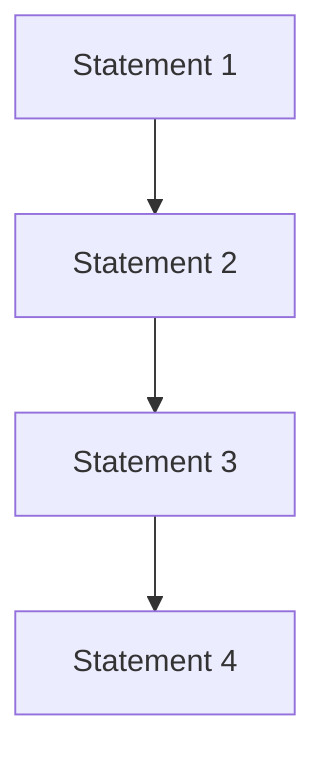
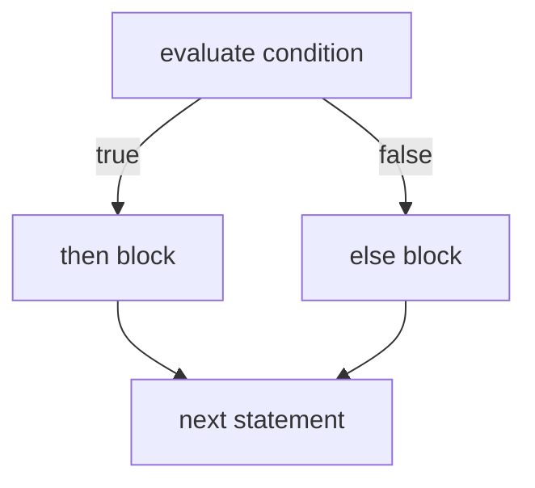
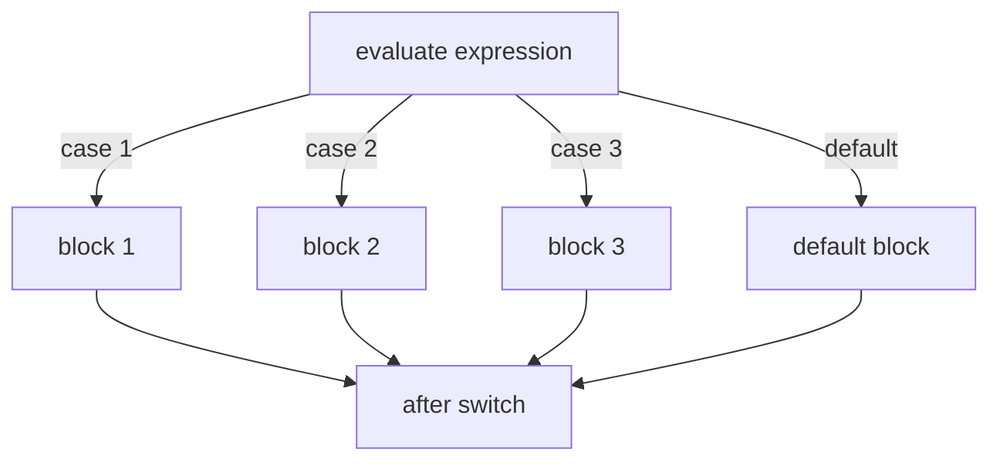
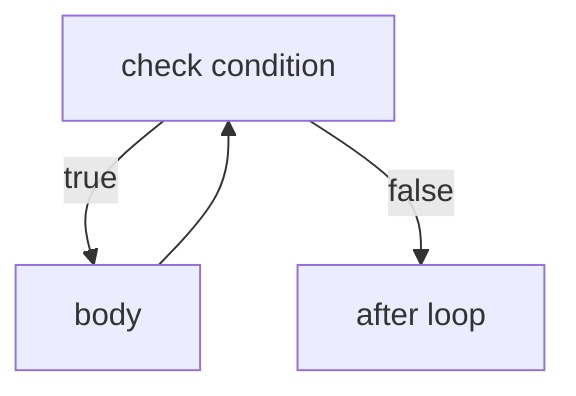

So far our programs have executed top to bottom, one line at a time.
Real programs need to **make decisions** and **repeat work**. The
constructs that let them do so, `if`, `switch`, `while`, `for`,
`break`, `continue`, `return`, are collectively called **control
flow**.

<Figure
  slug="cpp-control-flow-cutout"
  alt="Control flow, an isometric illustration"
/>

A useful mental model: at every moment, the CPU is following exactly
one path through your program. Control-flow statements are
*forks* and *loops* in that path.

## Sequential flow

The simplest flow is straight-line execution: one statement after
another.

<Figure
  slug="cpp-control-flow-inline-cutout"
  alt="A rail splitting at a set of points into a branch and a loop, a cart taking the branch while the loop track curls back on itself behind it"
/>



Every program starts this way at `main`'s opening brace.

## `if` and `else`: decisions

An `if` statement tests a condition (a `bool` expression) and runs
its block only when the condition is true. An optional `else` block
runs when the condition is false.



<CodeBlock
  adapter="cpp"
  files={[
    {
      filename: "main.cpp",
      starterCode: `#include <iostream>

int main() {
  int age = 17;
  if (age >= 18) {
    std::cout << "You can vote.\\n";
  } else {
    std::cout << "Too young to vote (yet).\\n";
  }
  return 0;
}
`,
    },
  ]}
/>

`else` can chain into another `if`, building a ladder:

<CodeBlock
  adapter="cpp"
  files={[
    {
      filename: "main.cpp",
      starterCode: `#include <iostream>

int main() {
  int score = 73;

  if (score >= 90) {
    std::cout << "A\\n";
  } else if (score >= 80) {
    std::cout << "B\\n";
  } else if (score >= 70) {
    std::cout << "C\\n";
  } else if (score >= 60) {
    std::cout << "D\\n";
  } else {
    std::cout << "F\\n";
  }
  return 0;
}
`,
    },
  ]}
/>

Two beginner footguns:

1. **`=` is assignment, `==` is comparison.** `if (x = 5)` compiles
   (it assigns 5 to x, then tests truthiness), and it is almost
   never what you meant.
2. **Always use braces.** Without braces, only the *next single
   statement* belongs to the `if`. This is a famous source of
   security bugs (the "goto fail" incident in Apple's TLS code).

```cpp
// dangerous:
if (logged_in)
    grant_access();
    audit();         // <-- always runs, regardless of logged_in!

// safe:
if (logged_in) {
    grant_access();
    audit();
}
```

## Boolean operators

Conditions can be combined with:

- `&&`, logical AND (true only if both sides are true)
- `||`, logical OR (true if either side is true)
- `!`, logical NOT (flips true/false)

Both `&&` and `||` are **short-circuited**: the right side is only
evaluated if the left side could not already determine the answer.
This is what lets you write `if (p != nullptr && p->value > 0)`
safely.

<CodeBlock
  adapter="cpp"
  files={[
    {
      filename: "main.cpp",
      starterCode: `#include <iostream>

int main() {
  int age = 25;
  bool has_ticket = true;
  bool over_18 = age >= 18;

  if (over_18 && has_ticket) {
    std::cout << "Welcome!\\n";
  } else if (!over_18) {
    std::cout << "Too young.\\n";
  } else {
    std::cout << "Buy a ticket first.\\n";
  }
  return 0;
}
`,
    },
  ]}
/>

## `switch`: multi-way dispatch

When the same expression should be compared against many specific
*constant* values, `switch` is clearer than a ladder of `else if`s.



<CodeBlock
  adapter="cpp"
  files={[
    {
      filename: "main.cpp",
      starterCode: `#include <iostream>

int main() {
  int dayOfWeek = 3; // 0 = Sun, 1 = Mon, ..., 6 = Sat
  switch (dayOfWeek) {
  case 0:
  case 6:
    std::cout << "Weekend\\n";
    break;
  case 1:
  case 2:
  case 3:
  case 4:
  case 5:
    std::cout << "Weekday\\n";
    break;
  default:
    std::cout << "Invalid\\n";
    break;
  }
  return 0;
}
`,
    },
  ]}
/>

A few rules:

- Each `case` must be a *constant* known at compile time (an int, a
  char, or an `enum`).
- Without `break`, execution **falls through** to the next case. That
  is rarely what you want; almost always include `break`.
- `default` handles any value not matched.

## `while`: loop with a condition

A `while` loop runs its body as long as the condition is true. The
condition is checked **before** each iteration; if it's false the
first time, the body never runs at all.



<CodeBlock
  adapter="cpp"
  files={[
    {
      filename: "main.cpp",
      starterCode: `#include <iostream>

int main() {
  int n = 1;
  while (n <= 100) {
    n *= 2; // double each time
  }
  std::cout << "first power of 2 above 100 = " << n << "\\n";
  return 0;
}
`,
    },
  ]}
/>

A `do { ... } while (cond);` variant exists where the body runs
*first*, then the condition is checked. It is rarely needed but
useful for prompt-and-validate loops.

## `for`: counting loops

The `for` loop bundles three pieces of a typical counting loop
(initialization, condition, increment) into a single header:

```cpp
for (init; condition; update) {
    body
}
```

<CodeBlock
  adapter="cpp"
  files={[
    {
      filename: "main.cpp",
      starterCode: `#include <iostream>

int main() {
  // Print 1, 2, ..., 10
  for (int i = 1; i <= 10; ++i) {
    std::cout << i << " ";
  }
  std::cout << "\\n";

  // Count down 10, 9, ..., 1
  for (int i = 10; i >= 1; --i) {
    std::cout << i << " ";
  }
  std::cout << "\\n";

  // Step by 2: 0, 2, 4, 6, 8
  for (int i = 0; i < 10; i += 2) {
    std::cout << i << " ";
  }
  std::cout << "\\n";
  return 0;
}
`,
    },
  ]}
/>

The variable declared inside the `for` header (here `i`) is **scoped
to the loop only**. After the loop, `i` is gone. Good, that's
exactly the smallest-scope principle we mentioned earlier.

## Range-based `for`

For containers (and anything with `.begin()` / `.end()`), the
range-based `for` is cleaner:

<CodeBlock
  adapter="cpp"
  files={[
    {
      filename: "main.cpp",
      starterCode: `#include <iostream>
#include <string>
#include <vector>

int main() {
  std::vector<std::string> names = {"Ada", "Linus", "Grace"};
  for (const std::string &name : names) {
    std::cout << "Hi, " << name << "!\\n";
  }
  return 0;
}
`,
    },
  ]}
/>

Notes:

- `const std::string&` says "I'll just read each element, by
  reference." Without the `&`, each element would be *copied*,
  which would be wasteful for big strings.
- You can also use `auto`: `for (const auto& name : names) ...`

## `break` and `continue`

Inside any loop:

- `break` exits the loop entirely.
- `continue` skips the rest of the current iteration and jumps back
  to the condition (or to the update for `for`).

<CodeBlock
  adapter="cpp"
  files={[
    {
      filename: "main.cpp",
      starterCode: `#include <iostream>

int main() {
  // Print first odd number above 100 that is divisible by 7.
  for (int n = 101;; n += 2) { // infinite-looking loop
    if (n % 7 != 0)
      continue; // skip non-multiples of 7
    std::cout << n << "\\n";
    break; // found it -- stop
  }
  return 0;
}
`,
    },
  ]}
/>

Use these sparingly. A loop with three `break`s and four `continue`s
is usually a sign that the condition could be rewritten more
cleanly.

## Infinite loops on purpose

Sometimes you do want a loop that runs forever and is exited by an
internal condition. Two idiomatic forms:

```cpp
while (true) { ... }
for (;;)     { ... }
```

Both compile to the same code. Use whichever you find clearer.

## Mapping algorithms to control flow

When you turn an algorithm into code, every "for each" becomes a
loop, every "if/then" becomes an `if`, and every "do until" becomes
a `while`. Practice that translation by writing the algorithm in
English first.

**Algorithm:** *"Print the first 10 Fibonacci numbers."*

1. Start with `a = 0`, `b = 1`.
2. Print `a`.
3. Compute `c = a + b`. Set `a = b`, `b = c`.
4. Repeat steps 2–3 nine more times.

<CodeBlock
  adapter="cpp"
  files={[
    {
      filename: "main.cpp",
      starterCode: `#include <iostream>

int main() {
  int a = 0, b = 1;
  for (int i = 0; i < 10; ++i) {
    std::cout << a << " ";
    int c = a + b;
    a = b;
    b = c;
  }
  std::cout << "\\n";
  return 0;
}
`,
    },
  ]}
/>

## Common loop bugs

| Bug | What happens | Fix |
| --- | --- | --- |
| **Off-by-one** | Loop runs one too few or one too many times. | Decide consciously: do you want `<` or `<=`? Test on small cases. |
| **Infinite loop** | Condition never becomes false. | Make sure the body actually modifies the variable in the condition. |
| **Wrong loop variable updated** | You typed `j` instead of `i`. | Use short, distinct names; let nested loops use `i`, `j`, `k`. |
| **Mutating a container while iterating** | Crash or weird output. | Build a new container or use index-based iteration. |

## Challenges

<ChallengeCard
  adapter="cpp"
  title="FizzBuzz to 15"
  instructions={`Implement a loop from \`1\` to \`15\` (inclusive). For each number, print:\n\n- \`"FizzBuzz"\` if it is divisible by both 3 and 5,\n- \`"Fizz"\` if it is divisible by only 3,\n- \`"Buzz"\` if it is divisible by only 5,\n- otherwise the number itself.\n\nEach output goes on its own line.`}
  files={[
    {
      filename: "main.cpp",
      starterCode: `#include <iostream>

int main() {
  // your code here
  return 0;
}
`,
      solutionCode: `#include <iostream>

int main() {
  for (int i = 1; i <= 15; ++i) {
    if (i % 15 == 0)
      std::cout << "FizzBuzz\\n";
    else if (i % 3 == 0)
      std::cout << "Fizz\\n";
    else if (i % 5 == 0)
      std::cout << "Buzz\\n";
    else
      std::cout << i << "\\n";
  }
  return 0;
}
`,
    },
  ]}
  tests={[
    {
      id: "fizzbuzz",
      name: "Classic FizzBuzz output",
      description: "15 lines",
      expect: {
        stdoutLines: [
          "1","2","Fizz","4","Buzz","Fizz","7","8","Fizz","Buzz",
          "11","Fizz","13","14","FizzBuzz"
        ],
        stdoutLinesExact: true,
      },
    },
  ]}
/>

<ChallengeCard
  adapter="cpp"
  title="Largest digit"
  instructions={`Read the integer \`n = 729384\` (already provided) and print the largest of its decimal digits. For \`729384\` the answer is \`9\`. Use a loop that strips one digit at a time with \`% 10\` and \`/ 10\`. Print just the digit followed by a newline.`}
  files={[
    {
      filename: "main.cpp",
      starterCode: `#include <iostream>

int main() {
  int n = 729384;
  // your code here
  return 0;
}
`,
      solutionCode: `#include <iostream>

int main() {
  int n = 729384;
  int best = 0;
  while (n > 0) {
    int d = n % 10;
    if (d > best)
      best = d;
    n /= 10;
  }
  std::cout << best << "\\n";
  return 0;
}
`,
    },
  ]}
  tests={[
    {
      id: "biggest",
      name: "Largest digit is 9",
      description: "Exact stdout match",
      expect: { stdoutEquals: "9" },
    },
  ]}
/>

## Test your understanding

<MultipleChoice
  markdown={`What is the difference between \`==\` and \`=\` in a condition?

- [o] \`==\` compares two values; \`=\` assigns the right-hand side to the left-hand side.
  > \`if (x = 5)\` is almost certainly a bug.
- \`=\` compares; \`==\` assigns.
  > It is the other way around.
- They are interchangeable.
  > They are very different.
- Both compare values, but \`==\` is faster.
  > They do completely different things.`}
/>

<MultipleChoice
  markdown={`Why does C++ short-circuit \`&&\` and \`||\`?

- It is a quirk inherited from C with no real benefit.
  > It has a clear and intentional benefit.
- To make code run faster on multi-core CPUs.
  > Short-circuiting is unrelated to multi-core execution.
- For backwards compatibility with Fortran.
  > That is not the reason.
- [o] So the right-hand side is only evaluated when needed, which lets you write safe guards like \`p != nullptr && p->value > 0\`.
  > Short-circuiting is essential for safe pointer access.`}
/>

<MultipleChoice
  markdown={`In a \`switch\` statement, what does it mean to "fall through" a case?

- The compiler emitted a warning that the user can ignore.
  > Fall-through is a runtime behavior, not just a warning.
- The case threw an exception that fell through to a handler.
  > \`switch\` is unrelated to exceptions.
- [o] Without \`break\`, execution continues into the next case's body, running its code as well.
  > Fall-through is occasionally useful but usually a bug; modern compilers warn about it.
- The switch matched no case and fell through to \`default\`.
  > That is just \`default\` doing its job.`}
/>

<MultipleChoice
  markdown={`What is the scope of \`i\` in \`for (int i = 0; i < 10; ++i) { ... }\`?

- [o] Only inside the loop header and body; \`i\` ceases to exist after the loop ends.
  > This is exactly the smallest-scope principle from the previous chapter.
- The current file.
  > Definitely not.
- All functions called from inside the loop.
  > A called function cannot see the caller's local variables.
- The entire \`main\` function.
  > That would be too wide a scope.`}
/>

Next: how to package code into reusable units, *functions*.
