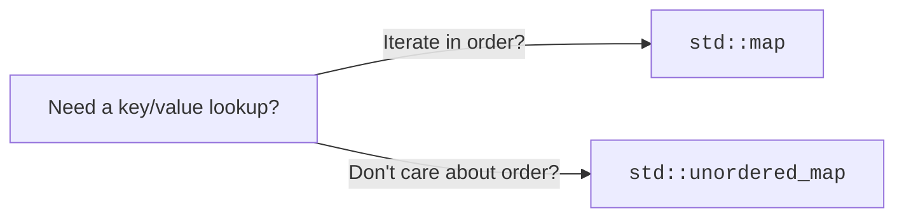

A container is a place to keep a collection of values. Different
containers have different *shapes* of cost: some are fast at the
end, slow in the middle; some are sorted, some are not; some give
you constant-time lookup by key. Picking the right container is
often a bigger performance win than any micro-optimization.

<Figure
  slug="cpp-data-structures-cutout"
  alt="Data structures intuition, an isometric illustration"
/>

This chapter sketches the standard containers and when to reach for
each, without diving into their implementations.

<Figure
  slug="cpp-data-structures-intuition-associative-containers-inline-cutout"
  alt="A wall of small drawers each with a keyhole, a key going straight to one drawer"
  caption="An associative container goes straight to a value by its key."
/>

## A map of the standard containers

| Family | Container | What it is |
| --- | --- | --- |
| Sequence | `std::vector` | contiguous, grow at the end |
| Sequence | `std::deque` | like vector, grow at both ends |
| Sequence | `std::list` | doubly linked |
| Sequence | `std::array` | fixed size |
| Associative, ordered | `std::map` | sorted key → value |
| Associative, ordered | `std::set` | sorted unique keys |
| Associative, hashed | `std::unordered_map` | hash key → value |
| Associative, hashed | `std::unordered_set` | hash unique keys |

## Sequence containers

### `std::vector<T>`, the default

- Contiguous in memory.
- Indexing `v[i]` is O(1).
- Appending `push_back()` is amortized O(1).
- Inserting or erasing in the middle is O(n).

Use it for almost everything. The CPU loves contiguous memory.

<Figure
  slug="cpp-data-structures-intuition-sequence-containers-inline-cutout"
  alt="Three containers in a row, a fixed strip, a growing rail, and separate blocks joined by cords"
  caption="Fixed, growable, or linked: the three shapes a sequence can take."
/>

### `std::array<T, N>`, fixed size

- Like `std::vector` but the size is part of the type and there is no
  heap allocation.
- Use when the size is known at compile time.

### `std::deque<T>`, double-ended

- Push/pop at *both* ends in amortized O(1).
- Indexing is O(1) but slower than vector (the storage is broken
  into chunks).
- Use when you need a queue or you frequently prepend.

### `std::list<T>`, doubly linked

- Insert/erase anywhere in O(1) **if** you already have an iterator
  to the position.
- Indexing is O(n), there's no `[i]`.
- Each node lives on the heap; cache-hostile.
- In practice, used rarely. `std::vector` wins on most workloads.

## Associative containers

### `std::map<K, V>`, sorted dictionary

- Keys are unique, kept in sorted order.
- Lookup, insert, erase: **O(log n)**.
- Iteration visits keys in order.
- Implemented as a balanced tree.

### `std::set<K>`, sorted set

- Same as `map` but stores keys only.

### `std::unordered_map<K, V>`, hash dictionary

- Keys are unique; *no* ordering.
- Average lookup, insert, erase: **O(1)**. Worst case O(n).
- Implemented as a hash table.

### `std::unordered_set<K>`, hash set

- Same as `unordered_map` but stores keys only.

## A concrete comparison

<CodeBlock
  adapter="cpp"
  files={[
    {
      filename: "main.cpp",
      starterCode: `#include <iostream>
#include <map>
#include <string>
#include <unordered_map>
#include <vector>

int main() {
  // Count occurrences of each word.
  std::vector<std::string> words = {"the", "quick", "brown", "fox",
                                    "the", "fox",   "the"};

  std::map<std::string, int> ordered_counts;
  std::unordered_map<std::string, int> hash_counts;

  for (const auto &w : words) {
    ++ordered_counts[w]; // map: lookup is O(log n)
    ++hash_counts[w];    // unordered_map: O(1) average
  }

  std::cout << "[ordered iteration]\\n";
  for (const auto &[w, n] : ordered_counts) {
    std::cout << "  " << w << " : " << n << "\\n";
  }

  std::cout << "[hashed iteration order is unspecified]\\n";
  for (const auto &[w, n] : hash_counts) {
    std::cout << "  " << w << " : " << n << "\\n";
  }
  return 0;
}
`,
    },
  ]}
/>

## Picking a container

A short checklist:

1. **Default to `std::vector`.** It is contiguous, cache-friendly,
   and good at almost everything.
2. **Need a key/value lookup?** Reach for `std::unordered_map` unless
   you need keys in sorted order, in which case `std::map`.
3. **Need a unique set of values?** `std::unordered_set` or
   `std::set` by the same rule.
4. **Need stable insertion order with frequent lookups?** Combine a
   vector (order) with an unordered_map (index).
5. **Fixed compile-time size?** `std::array`.
6. **Need to push/pop at both ends?** `std::deque` (or just two
   vectors, depending).
7. **Need fast insertion in the middle by iterator?** Maybe
   `std::list`, but profile first.

## A note on iteration cost

The CPU loads memory in cache lines. Contiguous data (vector, array)
is read in big efficient chunks. Pointer-chasing data (list, set,
map, unordered_map) jumps around the heap and often pays a cache
miss for every element. For workloads dominated by iteration,
`std::vector` is usually fastest, sometimes dramatically so,
even when an algorithmic analysis suggests otherwise.

Rule of thumb: **don't choose `std::list` to "save copies." It will
almost always be slower than a vector.**

## Challenge: pick the right container

The classic use case for an ordered map, in one tiny exercise:

<ChallengeCard
  adapter="cpp"
  title="Word frequency"
  instructions={`Count how many times each word appears in the vector \`words\`, then print each distinct word and its count, separated by a single space, one pair per line, in **alphabetical order**.

For the provided input, the expected output is exactly:

\`\`\`
be 2
not 1
or 1
to 2
\`\`\`

Hint: \`std::map<std::string, int>\` keeps its keys sorted, so iterating it gives you alphabetical order for free. \`++counts[w]\` inserts a zero-initialized entry the first time it sees \`w\`.`}
  files={[
    {
      filename: "main.cpp",
      starterCode: `#include <iostream>
#include <map>
#include <string>
#include <vector>

int main() {
  std::vector<std::string> words = {"to", "be", "or", "not", "to", "be"};
  // your code here
  return 0;
}
`,
      solutionCode: `#include <iostream>
#include <map>
#include <string>
#include <vector>

int main() {
  std::vector<std::string> words = {"to", "be", "or", "not", "to", "be"};
  std::map<std::string, int> counts;
  for (const auto &w : words)
    ++counts[w];
  for (const auto &[word, n] : counts)
    std::cout << word << ' ' << n << "\\n";
  return 0;
}
`,
    },
  ]}
  tests={[
    {
      id: "freq",
      name: "Counts in alphabetical order",
      description: "Four lines: be 2 / not 1 / or 1 / to 2",
      expect: {
        stdoutLines: ["be 2", "not 1", "or 1", "to 2"],
        stdoutLinesExact: true,
      },
    },
  ]}
/>

## Test your understanding

<MultipleChoice
  markdown={`Which container should you default to for a sequence of values you'll iterate over?

- [o] \`std::vector\`
  > Contiguous storage is fast for iteration and most operations.
- \`std::deque\`
  > Use it only when you really need double-ended push/pop.
- \`std::list\`
  > Linked lists are cache-hostile and rarely the right default.
- \`std::map\`
  > That is a key/value container, not a plain sequence.`}
/>

<MultipleChoice
  markdown={`When would you choose \`std::map\` over \`std::unordered_map\`?

- [o] When you need to iterate keys in sorted order, or want bounded worst-case complexity instead of average-case.
  > Otherwise \`unordered_map\` is usually faster.
- When the data fits in cache.
  > Both can.
- When you want average O(1) lookup.
  > That's the hashed container's selling point.
- Whenever performance matters.
  > \`unordered_map\` is generally faster for plain lookup.`}
/>

Next: the meta-skill that ties this all together, *debugging* and
reasoning about programs.
