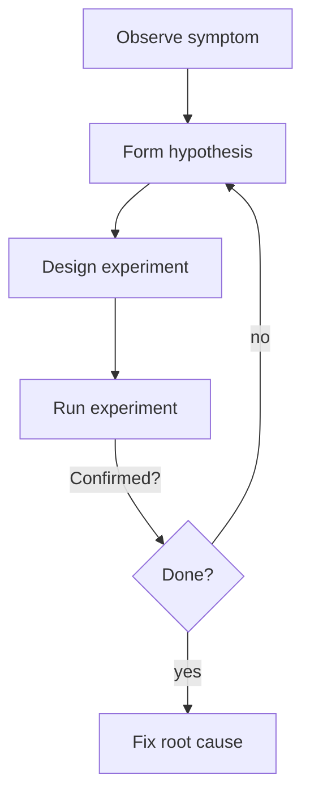

Every program is buggy at some point in its life. Debugging, the
craft of figuring out *why* a program does what it does, is at
least half of professional programming. The good news is that it's a
learnable skill, not a talent.

<Figure
  slug="cpp-debugging-cutout"
  alt="Debugging and reasoning, an isometric illustration"
/>

The word itself comes with a story. On September 9, 1947, operators
of the Harvard Mark II, an electromechanical computer built of
relays, traced a malfunction to an actual moth crushed between the
contacts of relay #70. Grace Hopper's team taped the moth into the
machine's logbook with the note *"First actual case of bug being
found."* The joke, of course, was that engineers had been calling
faults "bugs" since Edison's day, but the moth made it literal,
and the logbook page (moth included) is now preserved at the
Smithsonian. Most of the bugs you will hunt are less photogenic.
The method for finding them, though, hasn't changed: observe,
hypothesize, test, repeat.

## The debugging mindset

A bug is a contradiction between what you *believe* the program does
and what it *actually* does. Every step of debugging chips away at
that gap.

The instinct to fix is loud and unhelpful. The instinct to
*understand*, to slow down, form a hypothesis, and test it, is
how bugs actually get fixed.



Beginners often skip the *hypothesis* step. They poke at random
lines hoping the bug will go away. It rarely does, and when it
does, they have learned nothing. Force yourself to articulate, in
words, what you believe is wrong *before* changing anything.

## The cheapest tool: `std::cout`

Print statements get a bad reputation, but they are the right tool
when you need to *trace what the program is actually doing*.

<CodeBlock
  adapter="cpp"
  files={[
    {
      filename: "main.cpp",
      starterCode: `#include <iostream>

int factorial(int n) {
  std::cerr << "[factorial called with n=" << n << "]\\n";
  if (n <= 1)
    return 1;
  int r = n * factorial(n - 1);
  std::cerr << "[factorial n=" << n << " returning " << r << "]\\n";
  return r;
}

int main() {
  std::cout << factorial(5) << "\\n";
  return 0;
}
`,
    },
  ]}
/>

Use `std::cerr` (the standard *error* stream) for diagnostics so
they don't intermingle with real output. Remove them once you're
done.

## Asserts: cheap correctness checks

`assert(expr)` (from `<cassert>`) crashes immediately if `expr` is
false. Use it to enforce assumptions you believe must hold.

```cpp
#include <cassert>

double divide(double a, double b) {
    assert(b != 0.0 && "divide by zero");
    return a / b;
}
```

Asserts catch bugs *near* their cause instead of letting them
propagate into mysterious symptoms later. They are removed in
release builds, so they're free at runtime in production.

> **Don't put logic in asserts.** They may be compiled out. If the
> check matters at runtime, use a real `if`.

## The debugger

A debugger lets you pause a running program, step line by line,
inspect variables, and walk up the call stack. Most IDEs include one
(gdb, lldb, MSVC's debugger). Three commands cover 90% of usage:

- **Break** at a line.
- **Step** over / into / out of the next statement.
- **Print** the value of a variable or expression.

Whenever a bug is mysterious and not obviously print-debuggable,
*reach for the debugger first*. An hour saved per bug adds up
quickly.

## Sanitizers

Modern compilers (Clang, GCC) ship runtime *sanitizers* that
instrument your code to catch entire classes of bug:

- **AddressSanitizer (ASan)**, detects out-of-bounds access,
  use-after-free, double-free, leaks.
- **UndefinedBehaviorSanitizer (UBSan)**, catches signed overflow,
  null dereference, misaligned loads, and more.
- **ThreadSanitizer (TSan)**, finds data races in multithreaded
  code.

A typical command line:

```bash
g++ -std=c++20 -O1 -g -fsanitize=address,undefined main.cpp -o app
./app
```

Run your tests with sanitizers on at least sometimes. They are
extraordinarily good at finding latent bugs that occasionally crash
in production.

## Mental simulation

The fastest debugger is the one between your ears. Read a function
slowly and ask: "given these inputs, what should each variable be
*right here*?" Then run the program and see whether reality agrees.
When it doesn't, you have a precise contradiction to chase.

<Figure
  slug="cpp-debugging-and-reasoning-inline-cutout"
  alt="A conveyor halted mid-run by a raised gate, the blocks on the belt frozen where they stand for inspection"
  caption="Stop the program where you doubt it, and check reality against your model."
/>

Some techniques that help:

- **Tracing tables.** On paper, write a column for each variable and
  step through a small input by hand.
- **Postcondition reasoning.** What should be true after this loop?
  After this function returns? Compare to what actually is.
- **Smaller inputs.** A bug that appears on a million-row file
  *probably* appears on a 5-row file. Shrink until you can hold the
  whole thing in your head.

## Reproduce first, then debug

A bug you can reliably reproduce is half-solved. Spend serious
effort getting a small input that triggers it on demand before doing
anything else. Tests, sample inputs, even hand-crafted commands,
whatever it takes.

## When you're stuck

A few standard tricks:

1. **Read the error message word by word.** Compilers and runtime
   errors *usually* tell you exactly what is wrong if you slow down.
2. **Rubber-duck.** Explain the code, line by line, out loud (or to
   a coworker, or a literal rubber duck). The act of putting your
   reasoning into words exposes wrong assumptions.
3. **Bisect.** When did this bug appear? `git bisect` automates
   finding the commit that introduced it.
4. **Take a break.** Walk away for ten minutes. Bugs are
   embarrassingly often solved by your subconscious.

## Test your understanding

<MultipleChoice
  markdown={`What is the chief value of \`assert\` statements?

- They make the program faster in release builds.
  > They are often removed in release builds; performance is not the point.
- They are the only way to handle errors.
  > For real runtime errors, use \`if\` plus exceptions or status codes.
- [o] They catch broken assumptions *near* the cause, by crashing immediately when an invariant is violated, instead of letting bad state propagate.
  > They make bugs loud and local.
- They throw a recoverable exception.
  > A failed assert typically calls \`abort()\`; it is not recoverable.`}
/>

<MultipleChoice
  markdown={`Why is reproducing a bug reliably the first goal of debugging?

- It makes the bug worse so it's easier to see.
  > That is not the point.
- The compiler refuses to debug intermittent bugs.
  > Debuggers handle intermittent bugs; they're just harder.
- It is required by the C++ standard.
  > The standard says nothing about debugging methodology.
- [o] Until you can trigger the bug on demand, you cannot verify a fix or apply any debugging tool consistently; reproduction turns a mystery into a test case.
  > A reliable repro lets you confirm whether a change actually fixed the problem.`}
/>

Next: stepping back from individual bugs to entire *codebases*,
how to build software that stays maintainable.

<Figure
  slug="cpp-debugging-and-reasoning-debugging-mindset-inline-cutout"
  alt="A figure standing back from a stopped machine with hands behind their back, looking rather than reaching"
  caption="Read before you reach: most bugs are found by thinking, not by changing."
/>
