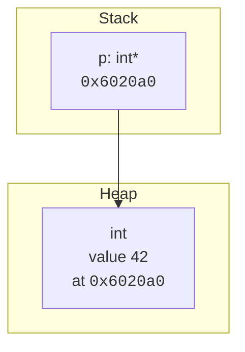
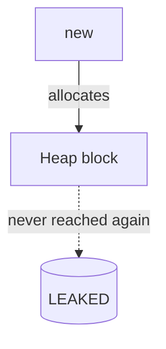
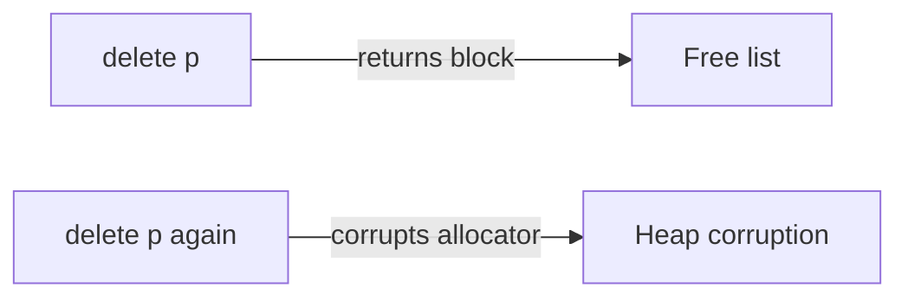

So far every variable we created lived on the **stack**: created at
function entry, destroyed at function exit, sized at compile time.
That is fast and safe, but it is not enough for every program.

<Figure
  slug="cpp-dynamic-memory-cutout"
  alt="Dynamic memory, an isometric illustration"
/>

What if you don't know how big something will be until the program
is running? What if an object needs to outlive the function that
created it? You need a different region of memory whose lifetime you
control: the **heap**.

## Stack vs. heap, one more time

| Stack | Heap |
| --- | --- |
| Automatic variables | Manually requested storage |
| Function frames | Lifetime decided by the program |
| Tiny, fixed-size, super fast | Large, flexible, slower |

Asking for heap memory used to be done with raw `new` and `delete`.
Modern C++ has *much* better tools (we'll meet them in the smart
pointer chapter). But you need to understand the raw mechanism
first, because every higher-level tool is built on top of it.

## `new` and `delete`

The `new` expression does two things:

1. Asks the allocator for enough bytes to hold one object of the
   given type.
2. Constructs an object in those bytes and returns a pointer to it.

`delete` undoes both steps: it runs the object's destructor and
returns the bytes to the allocator.

<CodeBlock
  adapter="cpp"
  files={[
    {
      filename: "main.cpp",
      starterCode: `#include <iostream>

int main() {
  int *p = new int(42);    // allocate one int on the heap, initialized to 42
  std::cout << *p << "\\n"; // 42

  *p = 100;
  std::cout << *p << "\\n"; // 100

  delete p;    // give the memory back
  p = nullptr; // good habit: don't keep stale pointers around
  return 0;
}
`,
    },
  ]}
/>

A picture of what happened:



After `delete p`, the heap slot is gone but `p` still holds the old
address, it has become a **dangling pointer**. That is why we set
`p = nullptr;` immediately after.

## Arrays on the heap

To allocate `n` objects in a row, use `new[]` and pair it with
`delete[]`:

<CodeBlock
  adapter="cpp"
  files={[
    {
      filename: "main.cpp",
      starterCode: `#include <iostream>

int main() {
  int n = 5;
  int *arr = new int[n]{1, 2, 3, 4, 5};

  for (int i = 0; i < n; ++i) {
    std::cout << arr[i] << (i + 1 == n ? '\\n' : ' ');
  }

  delete[] arr; // [] is mandatory: must match new[]
  return 0;
}
`,
    },
  ]}
/>

> **The mismatch trap.** `new` must be matched with `delete`, and
> `new[]` with `delete[]`. Mixing them is undefined behavior. The
> easiest way to never get this wrong is to *not write `new`/`delete`
> at all* and let containers and smart pointers do it for you.

## What can go wrong

There are essentially three categories of bug, and you must learn to
recognize all of them.

### 1. Memory leak

You allocated, but never freed. The OS will reclaim it when the
process ends, but a long-running program will slowly eat all
available memory.

```cpp
void leaker() {
    int* p = new int(1);
    // ... forgot delete p ...
}   // p is gone; the heap object is now unreachable but still allocated
```



### 2. Use-after-free

You used the pointer *after* deleting it.

```cpp
int* p = new int(1);
delete p;
std::cout << *p;   // UNDEFINED BEHAVIOR, anything can happen
```

### 3. Double-delete

You called `delete` on the same pointer twice.

```cpp
int* p = new int(1);
delete p;
delete p;   // UNDEFINED BEHAVIOR
```



Heap corruption is particularly nasty because the crash often
happens *somewhere else*, much later, in code that has nothing to do
with your bug.

## Why this is the **wrong** style for everyday code

Look at how much energy these examples spend on bookkeeping. Every
`new` must be balanced by exactly one `delete`, on every code path,
including exception paths. That is fragile.

Modern C++ flips the model around: instead of writing `new` and
`delete` by hand, you let objects *own* their resources, and the
language calls the destructor automatically when those objects go
out of scope. This is called **RAII** (Resource Acquisition Is
Initialization), and it's the single most important idea in C++.

Two everyday examples of RAII you've already seen without realizing
it:

- `std::vector<int>` calls `new[]`/`delete[]` for you. You write
  `vec.push_back(x)`, the vector takes care of the heap.
- `std::string` does the same for character storage.

A preview of the safer version of dynamic memory, using
`std::unique_ptr`:

<CodeBlock
  adapter="cpp"
  files={[
    {
      filename: "main.cpp",
      starterCode: `#include <iostream>
#include <memory>

int main() {
  auto p = std::make_unique<int>(42); // allocates and owns
  std::cout << *p << "\\n";
  // no delete needed, the unique_ptr's destructor frees it on scope exit
  return 0;
}
`,
    },
  ]}
/>

We'll devote a whole chapter to smart pointers. For now, just know
that **raw `new`/`delete` are advanced tools you should rarely need
in modern application code.** When you do need them, implementing
your own container, or interfacing with a C library, you'll know
why.

## Sizing intuition

You can ask the language how big a type is. This is useful when
estimating memory usage.

<CodeBlock
  adapter="cpp"
  files={[
    {
      filename: "main.cpp",
      starterCode: `#include <iostream>

int main() {
  std::cout << "int:    " << sizeof(int) << " bytes\\n";
  std::cout << "double: " << sizeof(double) << " bytes\\n";
  std::cout << "int*:   " << sizeof(int *) << " bytes\\n";

  int *arr = new int[1000];
  // ~4000 bytes were just requested from the OS.
  delete[] arr;
  return 0;
}
`,
    },
  ]}
/>

The exact numbers depend on the target. On the WebAssembly target
used by this course's runtime, `int*` is 4 bytes; on a typical
64-bit desktop it would be 8.

## Challenges

<ChallengeCard
  adapter="cpp"
  title="Allocate, use, free"
  instructions={`Allocate a single \`int\` on the heap with the value \`123\`. Print it. Then free it. The output should be exactly \`123\`. Make sure you do not leak memory.`}
  files={[
    {
      filename: "main.cpp",
      starterCode: `#include <iostream>

int main() {
  // your code here
  return 0;
}
`,
      solutionCode: `#include <iostream>

int main() {
  int *p = new int(123);
  std::cout << *p;
  delete p;
  return 0;
}
`,
    },
  ]}
  tests={[
    {
      id: "alloc",
      name: "Prints 123",
      description: "Exact stdout match",
      expect: { stdoutEquals: "123" },
    },
  ]}
/>

<ChallengeCard
  adapter="cpp"
  title="A dynamic array of squares"
  instructions={`Read an integer \`n\` (assume 5 for testing). Allocate a heap array of \`n\` ints, fill it with the squares of \`1..n\` (so for \`n = 5\` you get \`1 4 9 16 25\`), print the numbers space-separated, then \`delete[]\` the array. For the test, \`main\` is already wired with \`n = 5\` and expects \`1 4 9 16 25\` followed by a newline.`}
  files={[
    {
      filename: "main.cpp",
      starterCode: `#include <iostream>

int main() {
  int n = 5;
  int *arr = nullptr;
  // your code: allocate, fill, print, free
  return 0;
}
`,
      solutionCode: `#include <iostream>

int main() {
  int n = 5;
  int *arr = new int[n];
  for (int i = 0; i < n; ++i)
    arr[i] = (i + 1) * (i + 1);
  for (int i = 0; i < n; ++i) {
    std::cout << arr[i];
    std::cout << (i + 1 == n ? '\\n' : ' ');
  }
  delete[] arr;
  return 0;
}
`,
    },
  ]}
  tests={[
    {
      id: "sq",
      name: "Squares 1..5",
      description: "Exact stdout match",
      expect: { stdoutEquals: "1 4 9 16 25\n" },
    },
  ]}
/>

## Test your understanding

<MultipleChoice
  markdown={`What does the expression \`new T(args...)\` do?

- Reserves a slot on the stack.
  > \`new\` allocates on the heap, not the stack.
- Frees existing memory and reallocates it.
  > That would be \`realloc\`, which is a C concept and not what \`new\` does.
- Returns a copy of \`T\`.
  > It returns a *pointer* to a newly constructed object.
- [o] Allocates enough memory for one \`T\` on the heap, constructs a \`T\` in it, and returns a pointer to it.
  > Allocation + construction in one step.`}
/>

<MultipleChoice
  markdown={`Why must \`new[]\` be paired with \`delete[]\` (not plain \`delete\`)?

- [o] \`new[]\` may record an element count alongside the allocation, and \`delete[]\` knows how to invoke each destructor and release the whole block; \`delete\` does not.
  > Mixing them is undefined behavior.
- The OS tracks them separately on disk.
  > The OS is not involved at that level of detail.
- The compiler will refuse to compile mismatched calls.
  > It will not; mismatch is a runtime/UB problem, not a compile error.
- They are interchangeable in modern C++.
  > They are not.`}
/>

<MultipleChoice
  markdown={`What is the primary danger of a memory leak?

- It triggers a compile-time error.
  > Compilers don't track allocation/free pairs in general.
- It causes data corruption in unrelated objects.
  > That is *use-after-free* or buffer overflow, not a leak.
- [o] Memory is allocated but never freed, so a long-running program can exhaust available memory over time.
  > Leaks degrade reliability and performance of long-running services.
- The program will crash immediately.
  > It usually does not crash immediately, which is part of why leaks are dangerous.`}
/>

<MultipleChoice
  markdown={`Which of the following is the *modern* way to manage a single heap-allocated object?

- Use \`malloc\`/\`free\`.
  > Those are C functions; they don't construct C++ objects.
- Allocate it on the stack with \`new\` followed by no \`delete\`.
  > \`new\` does not allocate on the stack.
- Call \`new\` and remember to \`delete\` it on every code path.
  > That is the raw, error-prone style this chapter warns against.
- [o] Use \`std::unique_ptr\` (often via \`std::make_unique\`); its destructor frees the object automatically.
  > This applies the RAII pattern and removes the need for manual \`delete\`.`}
/>

Next: aggregates and strings, how to bundle data, and the tools
the standard library gives you so you almost never need raw arrays
again.
