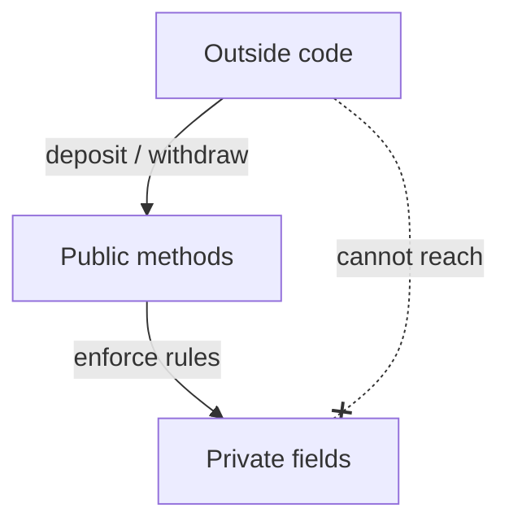
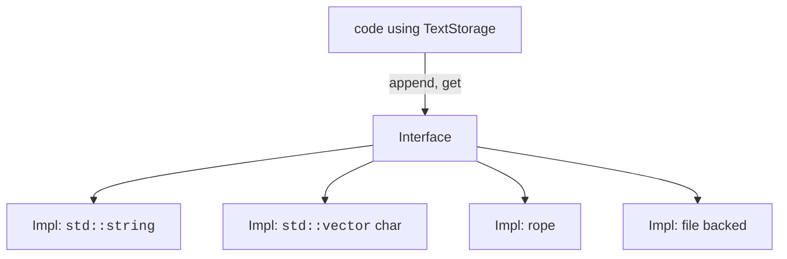

A class is a *contract*. From the outside, it offers a set of
operations and promises certain things will always be true. From the
inside, it is whatever code is needed to keep those promises.

Two ideas make this work:

- **Encapsulation** — bundling data with the code that controls it
  and hiding the data from the outside world.
- **Abstraction** — exposing a simple interface that captures the
  *what* without committing to the *how*.

These aren't C++ features; they are *design principles* that the
language gives you tools to apply.

<svg
  viewBox="0 0 640 230"
  role="img"
  aria-label="A watch with a translucent case: faint gears hide behind the glass while only two crisp green hands, a yellow crown dot, and four hour marks face the viewer — a class shows a simple interface and keeps its machinery private"
  style={{ display: "block", width: "100%", maxWidth: "640px", height: "auto", margin: "2.5rem auto" }}
>
  <g fill="currentColor" opacity="0.12">
    <circle cx="270" cy="110" r="24" />
    <rect x="292" y="104" width="12" height="12" rx="3" />
    <rect x="278" y="128" width="12" height="12" rx="3" />
    <rect x="250" y="128" width="12" height="12" rx="3" />
    <rect x="236" y="104" width="12" height="12" rx="3" />
    <rect x="250" y="80" width="12" height="12" rx="3" />
    <rect x="278" y="80" width="12" height="12" rx="3" />
    <circle cx="330" cy="150" r="16" />
    <rect x="344" y="145" width="10" height="10" rx="3" />
    <rect x="325" y="164" width="10" height="10" rx="3" />
    <rect x="306" y="145" width="10" height="10" rx="3" />
    <rect x="325" y="126" width="10" height="10" rx="3" />
  </g>
  <g style={{ color: "var(--ds-blue-500)" }} fill="currentColor">
    <circle cx="320" cy="115" r="78" fillOpacity="0.1" />
    <path fillRule="evenodd" d="M242 115 a78 78 0 1 0 156 0 a78 78 0 1 0 -156 0 M250 115 a70 70 0 1 0 140 0 a70 70 0 1 0 -140 0" fillOpacity="0.8" />
    <g
      fill="none"
      stroke="currentColor"
      strokeWidth="3"
      strokeLinecap="round"
      strokeOpacity="0.5"
    >
      <path d="M320 49 V 61" />
      <path d="M386 115 H 374" />
      <path d="M320 181 V 169" />
      <path d="M254 115 H 266" />
    </g>
  </g>
  <g style={{ color: "var(--ds-green-500)" }} fill="currentColor">
    <rect x="316" y="61" width="8" height="58" rx="4" />
    <rect x="320" y="111" width="42" height="8" rx="4" />
  </g>
  <g style={{ color: "var(--ds-yellow-500)" }} fill="currentColor">
    <circle cx="320" cy="115" r="7" />
  </g>
</svg>

## Invariants: truths your class must keep

An **invariant** is a rule about a class's state that must always
hold while no method is in progress. Some examples:

| Class | Invariant |
| --- | --- |
| `BankAccount` | `balance >= 0` |
| `Date` | `1 <= month <= 12` |
| `Stack<T>` | `size <= capacity` and `size >= 0` |
| `SortedVector<int>` | the elements are non-decreasing |

If a field is `public`, anyone can break the invariant by assigning
to it. Making it `private` and offering controlled methods is how
you defend the invariant.



## A `Date` that cannot be invalid

<CodeBlock
  adapter="cpp"
  files={[
    {
      filename: "main.cpp",
      starterCode: `#include <iostream>

class Date {
public:
  Date(int y, int m, int d) {
    if (m < 1 || m > 12)
      m = 1;
    if (d < 1 || d > 31)
      d = 1;
    year_ = y;
    month_ = m;
    day_ = d;
  }

  int year() const { return year_; }
  int month() const { return month_; }
  int day() const { return day_; }

private:
  int year_, month_, day_;
};

int main() {
  Date d1(2025, 11, 7);
  Date d2(2025, 99, 99); // invalid -> snapped to 1/1
  std::cout << d1.year() << "-" << d1.month() << "-" << d1.day() << "\\n";
  std::cout << d2.year() << "-" << d2.month() << "-" << d2.day() << "\\n";
  return 0;
}
`,
    },
  ]}
/>

There is no way a `Date` object can exist with `month == 99`.
Outside code never sees the fields, only the safe getters. The
class is **encapsulated**.

## Abstraction: same interface, different implementations

Imagine a `TextStorage` that you can `append` to and read by index.
You could implement it as a `std::string`, a `std::vector<char>`, a
rope data structure, even an on-disk file. The *interface* — the
public method names and meanings — stays the same. Code that uses a
`TextStorage` does not care which implementation it got.



That is abstraction. You name the *what* (`append`, `get`) and hide
the *how* (the data structure). Later you can swap implementations
without changing any caller.

## When the interface leaks: Hyrum's Law

There is a famous observation about why hiding details matters so
much in practice. Hyrum Wright, a Google engineer who spent years
doing large-scale refactoring across one of the biggest C++
codebases in the world, summarized what he kept running into:

> With a sufficient number of users of an API, it does not matter
> what you promise in the contract: all observable behaviors of your
> system will be depended on by somebody.

This became known as **Hyrum's Law**. If your class exposes a field,
someone will write code that depends on its exact representation.
If your function happens to return results in sorted order — even
though you never promised that — someone's code will break the day
it stops. Every detail you fail to hide eventually becomes a detail
you can never change.

Language designers take this seriously. The Go team deliberately
*randomizes* the iteration order of its built-in hash maps on every
run, precisely so that no program can accidentally start depending
on an order that was never guaranteed. They turned the contract into
something the runtime *enforces*, rather than a comment nobody
reads.

Encapsulation is your everyday tool for the same job: the smaller
the observable surface of your class, the more freedom you keep to
improve it later. `private:` is not bureaucracy — it is you,
protecting your future self's ability to change the code.

## Why this matters

When a program is small you can keep everything in your head. When
it grows past a few hundred lines, you need ways to reason about
*pieces* without re-reading the whole codebase. Encapsulation gives
you those pieces:

- You can change a class's internals without breaking its users, as
  long as you keep its public interface stable.
- You can test a class in isolation.
- You can let multiple people work on different classes without
  stepping on each other.

This is the difference between programs that grow gracefully and
programs that calcify under their own weight.

## Getters, setters, and a word of caution

It's tempting to write a getter and a setter for every field. That
turns your class right back into a struct with extra steps:

```cpp
// anti-pattern
class Point {
public:
    int x() const { return x_; }
    void set_x(int v) { x_ = v; }
    int y() const { return y_; }
    void set_y(int v) { y_ = v; }
private:
    int x_, y_;
};
```

If a class has no invariants and no behaviour, just use a `struct`.
Reach for `class` when you have something to protect.

## Challenge: defend an invariant

Practice the core move of this chapter: write a class whose
invariant — *the count can never go negative* — is impossible to
break from the outside.

<ChallengeCard
  adapter="cpp"
  title="An Inventory that can't go negative"
  instructions={`Implement the \`Inventory\` class with three members:

- \`void add(int n)\` — increases the count by \`n\`, but only if \`n\` is positive.
- \`bool remove(int n)\` — if \`n\` is positive and at most the current count, decreases the count by \`n\` and returns \`true\`; otherwise changes nothing and returns \`false\`.
- \`int count() const\` — returns the current count.

The count starts at 0 and must never go negative. The provided \`main\` adds 5, removes 3 (succeeds), tries to remove 9 (must be refused), and prints exactly \`1 0 2\`.`}
  files={[
    {
      filename: "main.cpp",
      starterCode: `#include <iostream>

class Inventory {
public:
  // your code here
};

int main() {
  Inventory inv;
  inv.add(5);
  bool ok1 = inv.remove(3); // should succeed
  bool ok2 = inv.remove(9); // should be refused
  std::cout << ok1 << ' ' << ok2 << ' ' << inv.count();
  return 0;
}
`,
      solutionCode: `#include <iostream>

class Inventory {
public:
  void add(int n) {
    if (n > 0)
      count_ += n;
  }
  bool remove(int n) {
    if (n > 0 && n <= count_) {
      count_ -= n;
      return true;
    }
    return false;
  }
  int count() const { return count_; }

private:
  int count_ = 0;
};

int main() {
  Inventory inv;
  inv.add(5);
  bool ok1 = inv.remove(3); // should succeed
  bool ok2 = inv.remove(9); // should be refused
  std::cout << ok1 << ' ' << ok2 << ' ' << inv.count();
  return 0;
}
`,
    },
  ]}
  tests={[
    {
      id: "invariant",
      name: "Invariant holds",
      description: "remove(3) succeeds, remove(9) is refused, count ends at 2",
      expect: { stdoutEquals: "1 0 2" },
    },
  ]}
/>

## Test your understanding

<MultipleChoice
  markdown={`What is an *invariant* of a class?

- A method that never changes.
  > That would be a constant method.
- A field whose value is fixed.
  > That would be a \`const\` member.
- [o] A property of the object's state that must always hold whenever no method is in progress.
  > The class's public methods are responsible for maintaining it.
- A type alias used by the class.
  > That is not the meaning here.`}
/>

<MultipleChoice
  markdown={`What is the main reason to make fields \`private\`?

- The compiler runs faster.
  > Access level doesn't affect runtime performance.
- It hides the field from the debugger.
  > It does not; debuggers can see private members.
- [o] It prevents outside code from putting the object in an invalid state, letting the class defend its invariants.
  > It also lets you change the storage without breaking callers.
- It is required for inheritance.
  > It isn't.`}
/>

Next: how objects come to life and how they clean up after
themselves — *constructors* and *destructors*.
