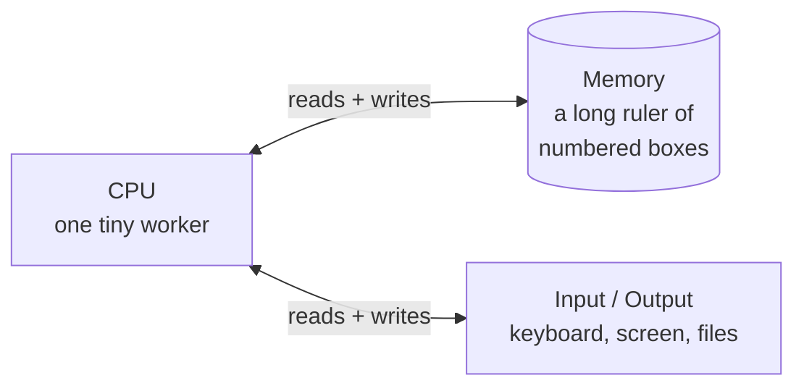
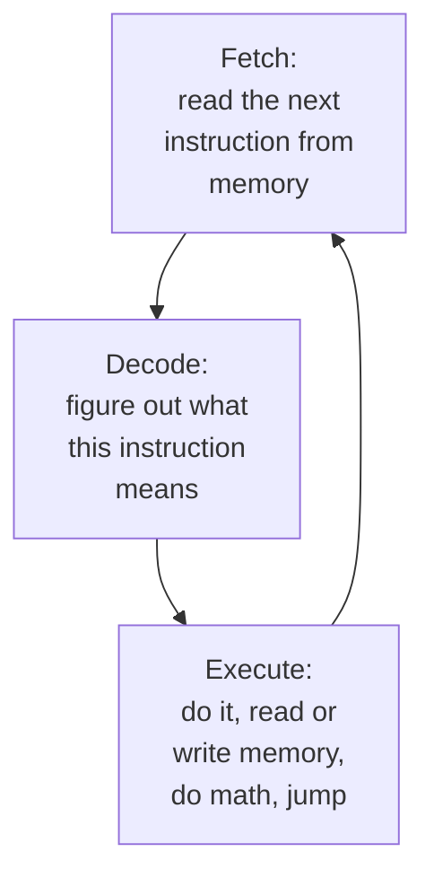
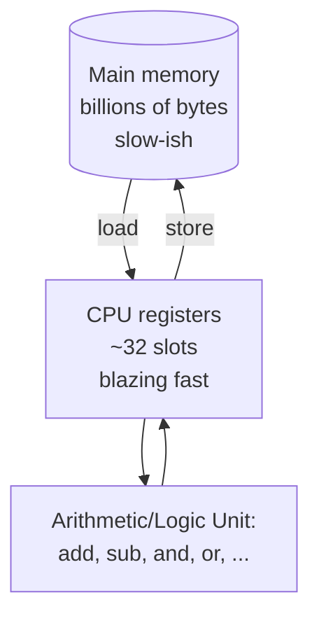
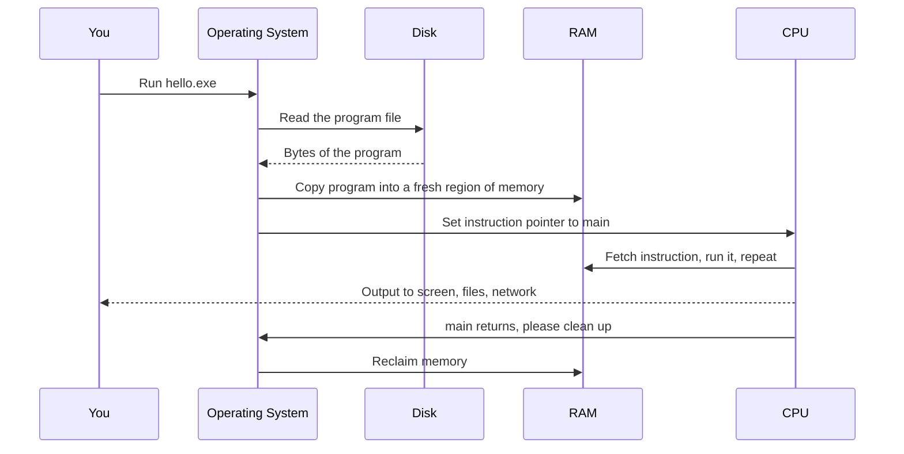

Before we keep writing C++, we need a mental model of what a computer
actually *is* and how it runs a program. You do not need to be an
electrical engineer to write good code, but the more accurate your
mental model, the easier every later concept (variables, pointers,
the stack) will be.

<Figure
  slug="cpp-how-computers-execute-cutout"
  alt="How computers run programs, an isometric illustration"
/>

## The simplest useful model

Strip away every detail and a computer is just three things:



1. **Memory** is one long row of numbered boxes. Each box holds a
   single **byte** (a number from 0 to 255). The boxes are numbered
   starting at 0; that number is called the box's **address**.
2. **A CPU** is a small worker that does *one tiny operation at a
   time*: copy this box into that box, add the numbers in these two
   boxes, jump back ten boxes, and so on.
3. **Input/Output devices**, the keyboard, the screen, the disk, the
   network, let memory and the outside world exchange data.

Everything more complicated is built on top of those three ideas.

## Bytes, bits, and addresses

Inside a single box (one byte), data is stored as eight tiny
on/off switches called **bits**. Eight bits give you `2^8 = 256`
possible patterns, which is why one byte can hold a number from 0 to
255.

```
Address:  0     1     2     3     4     5     6     7
Box:     [42]  [13]  [ 0]  [97]  [98]  [99]  [ 0]  [255]
                              'a'   'b'   'c'
```

Letters are just numbers under an agreement called **ASCII** or
**Unicode**. The letter `a` is the number 97. The letter `b` is 98.
Larger numbers are stored across *several* boxes side by side. The
integer 1000 fits in two bytes; on a typical modern machine an `int`
is stored in **four** consecutive bytes.

<CodeBlock
  adapter="cpp"
  files={[
    {
      filename: "main.cpp",
      starterCode: `#include <cstddef>
#include <iostream>

int main() {
  std::cout << "char    is " << sizeof(char) << " byte\\n";
  std::cout << "short   is " << sizeof(short) << " bytes\\n";
  std::cout << "int     is " << sizeof(int) << " bytes\\n";
  std::cout << "long    is " << sizeof(long) << " bytes\\n";
  std::cout << "double  is " << sizeof(double) << " bytes\\n";
  std::cout << "void *  is " << sizeof(void *) << " bytes\\n";
  return 0;
}
`,
    },
  ]}
/>

The `sizeof` operator tells you, in bytes, how big a type is on the
machine the program is currently running on. Try running the block
above, the numbers depend on the CPU. (On the in-browser WebAssembly
target, pointers are 4 bytes.)

## The CPU's instruction loop

The CPU does *exactly one thing*, over and over, billions of times
per second. It is called the **fetch–decode–execute loop**:



The CPU keeps a special variable called the **instruction pointer**
that says "the next instruction is at memory address X". After
each instruction, the pointer advances. A `jump` instruction *sets*
the pointer to a different address, which is how loops, `if`
branches, and function calls work under the hood.

<Figure
  slug="cpp-how-computers-execute-inline-cutout"
  alt="A small unit repeating a three-station cycle, taking a card, reading it, and acting on it before returning for the next"
  caption="Fetch, decode, execute, and round again: the loop under every program."
/>

The CPU also has a tiny set of very fast storage slots called
**registers** (typically 16 to 32 of them, each holding 4 or 8
bytes). Registers are where actual arithmetic happens. Adding two
numbers means: copy them into registers, add the registers, copy
the result back to memory.



## What "running a program" actually means

When you double-click an `.exe` file (or run `./a.out` from a
terminal), the **operating system** does roughly this:



That fresh region of memory is called the program's **process
address space**. It is a private playground: the program thinks it
is the only thing in memory, even though many other programs are
running at the same time. The operating system uses hardware
trickery called **virtual memory** to keep them separated.

## A program's memory has regions

Within its address space, your program organises memory into a few
distinct regions. You will hear about these for the rest of the
course, so it helps to meet them now:

- **Text / code**, the actual machine instructions of your program.
  Usually read-only.
- **Data**, global variables, string literals, and other things that
  exist for the entire run of the program.
- **Heap**, memory you ask for *while the program runs*, often with
  `new` (or `malloc()` in C). It stays alive until you release it.
- **Stack**, a tidy area used for *function calls* and *local
  variables*. Each time you call a function, the CPU grows the
  stack by a small "frame"; when the function returns, the frame is
  popped off.

We will spend an entire section on each of these. For now you only
need the picture: **memory is split into regions, each with rules
about who can put what there and for how long.**

## Why this matters for C++

Languages like Python or JavaScript *hide* memory from you. They
give you "objects" and "lists" and quietly manage everything else.
That is wonderful for productivity, but it means you cannot really
predict where your data lives, how fast access will be, or when
memory is freed.

C++ exposes the model. When you write

```cpp
int x = 42;
```

you are saying *"allocate four bytes on the stack, in this function's
frame, and put the number 42 in them."* When you write

```cpp
int* p = new int(42);
```

you are saying *"allocate four bytes on the heap, store 42 in them,
and give me back the address as `p`."* That distinction has real
performance and lifetime consequences. By the end of the course you
will be making it without thinking.

## A tiny step through a program

Let's mentally execute a real example. Read the code, predict what
prints, then run it.

<CodeBlock
  adapter="cpp"
  files={[
    {
      filename: "main.cpp",
      starterCode: `#include <iostream>

int square(int n) {
  int result = n * n;
  return result;
}

int main() {
  int x = 5;
  int y = square(x);
  std::cout << "x = " << x << ", y = " << y << "\\n";
  return 0;
}
`,
    },
  ]}
/>

Step by step:

1. The OS loads the program into memory and jumps to `main`.
2. `int x = 5;` reserves 4 bytes on the stack inside `main`'s frame
   and writes `5` into them.
3. `square(x)` pushes a new frame on the stack for `square`,
   copies the value `5` into a parameter named `n`.
4. Inside `square`, `int result = n * n;` reserves another 4 bytes
   and stores `25`.
5. `return result;` writes `25` into a special "return value" slot,
   then pops `square`'s frame off the stack.
6. Back in `main`, `25` is copied into the 4-byte slot for `y`.
7. `std::cout` writes characters to the screen via the operating
   system.
8. `return 0;` signals "this program succeeded" to whoever launched
   it; the OS reclaims memory.

You just simulated a CPU in your head. That is the right level of
detail to keep in mind for the next several chapters.

## Test your understanding

<MultipleChoice
  markdown={`What is the smallest individually-addressable unit of memory in this model?

- A page (typically 4096 bytes)
  > Pages matter for virtual memory, but each byte inside still has its own address.
- A word (4 or 8 bytes)
  > Words are read or written in groups, but the underlying addressing is by byte.
- [o] A byte
  > Each byte has its own numeric address.
- A bit
  > Bits are smaller, but most CPUs address memory in bytes, not bits.`}
/>

<MultipleChoice
  markdown={`What does the CPU's instruction pointer do?

- [o] It holds the memory address of the next instruction to execute.
  > After each instruction it advances, except when a jump changes it.
- It points to the start of the program file on disk.
  > Programs are loaded into memory before execution; the IP points within memory, not disk.
- It stores the result of the most recent arithmetic operation.
  > That role is played by registers and flags, not the IP.
- It tells the operating system which process to schedule next.
  > Scheduling is done by the OS, not by the instruction pointer.`}
/>

<MultipleChoice
  markdown={`When you call a function in C++, where do its local variables typically live?

- In CPU registers exclusively.
  > Some small variables may live in registers, but the model and the language describe them as living on the stack.
- On the heap, allocated by \`new\`.
  > Only variables explicitly allocated with \`new\` go on the heap.
- [o] In a new frame on the call stack.
  > Each function call grows the stack; returning pops the frame.
- In the data segment, alongside global variables.
  > The data segment is for globals and statics, not local variables.`}
/>

<MultipleChoice
  markdown={`Why does C++ care so much about *where* memory comes from (stack vs heap)?

- The stack is faster to read than the heap.
  > Allocation on the stack is much faster, but reads from either can be cached and equally fast.
- [o] Because the lifetime, allocation cost, and management rules of stack and heap memory are different, and C++ exposes those differences so you can reason about them.
  > C++ trades convenience for control on purpose.
- It does not, they are interchangeable.
  > They are not. The lifetime, cost, and management rules differ.
- Only the heap can be freed; the stack lives forever.
  > It is the other way around, stack frames are freed automatically when functions return.`}
/>

Next: *how* your source code becomes machine instructions in the
first place.

<Figure
  slug="cpp-how-computers-execute-simplest-useful-model-inline-cutout"
  alt="One small engine, one wall of slots and one card feeder, joined in a triangle by short cords"
  caption="A processor, memory and a stream of instructions is the whole model."
/>
