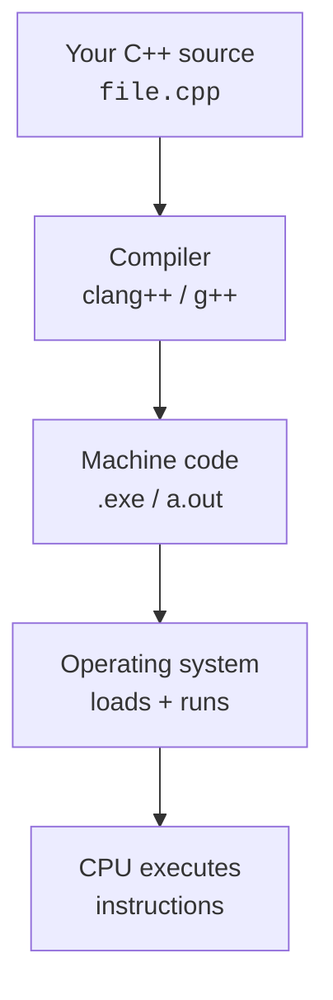

<Figure
  slug="ram"
  alt="A stick of RAM, the memory that C++ lets you manage by hand"
  priority
/>

Welcome to **From Zero to C++ Programming**. This course is written for
people who have *never written a line of code*, or who have dabbled
in a scripting language but never really learned what a program *is*,
what memory actually *looks like*, or how a CPU ends up executing the
text you typed into an editor.

You will not be asked to memorize syntax tables, race against a
stopwatch, or solve cryptic interview puzzles. Instead, we will build
two things together, slowly and on purpose:

1. **A mental model of the machine.** What is memory? What is a
   stack? What is a heap? What happens between the moment you press
   *Run* and the moment "Hello, World!" appears on screen?
2. **A mental model of the software.** How do humans tame complexity?
   What are variables, functions, types, objects, and modules really
   for? Why did programmers eventually invent classes, references,
   smart pointers, and RAII?

Once those two models click, *the syntax becomes the easy part*.

<svg
  viewBox="0 0 640 220"
  role="img"
  aria-label="A faint zero-shaped ring leads up four stepping stones to a solid blue block followed by two green plus signs, the journey from zero to C++"
  style={{ display: "block", width: "100%", maxWidth: "640px", height: "auto", margin: "2.5rem auto" }}
>
  <g fill="currentColor" opacity="0.2">
    <path fillRule="evenodd" d="M56 150 a34 34 0 1 0 68 0 a34 34 0 1 0 -68 0 M71 150 a19 19 0 1 0 38 0 a19 19 0 1 0 -38 0" />
  </g>
  <g style={{ color: "var(--ds-blue-500)" }} fill="currentColor">
    <rect x="150" y="176" width="54" height="14" rx="7" fillOpacity="0.25" />
    <rect x="220" y="148" width="54" height="14" rx="7" fillOpacity="0.45" />
    <rect x="290" y="120" width="54" height="14" rx="7" fillOpacity="0.65" />
    <rect x="360" y="92" width="54" height="14" rx="7" fillOpacity="0.85" />
    <rect x="440" y="58" width="86" height="86" rx="18" />
  </g>
  <g style={{ color: "var(--ds-green-500)" }} fill="currentColor">
    <rect x="542" y="95" width="36" height="12" rx="5" />
    <rect x="554" y="83" width="12" height="36" rx="5" />
    <rect x="588" y="95" width="36" height="12" rx="5" />
    <rect x="600" y="83" width="12" height="36" rx="5" />
  </g>
</svg>

## Try it right now

This whole course runs in your browser. Every C++ snippet you see
compiles with a real compiler (`clang++`, built to WebAssembly) and
runs right on the page, there is nothing to install, ever. Here is
your first program. Press **Run**:

<CodeBlock
  adapter="cpp"
  files={[
    {
      filename: "main.cpp",
      starterCode: `#include <iostream>
#include <string>

int main() {
  int height = 4; // <-- try changing this to 8, then Run again
  for (int i = 1; i <= height; ++i) {
    std::cout << std::string(i, '*') << "\\n";
  }
  std::cout << "Welcome to From Zero to C++!\\n";
  return 0;
}
`,
    },
  ]}
/>

You just compiled and executed a C++ program. Now change `height`
to `8` and run it again, the staircase grows. Don't worry about
what `#include` or `std::cout` mean yet; we will take that program
apart line by line in a few pages. The point, for now, is that this
is a course you *do*, not just read. (The very first run may take a
few seconds while the compiler loads.)

## What is C++, and why learn it?

C++ is one of the most influential programming languages ever
written. It powers operating systems, web browsers, video games,
financial trading systems, machine-learning frameworks, databases,
embedded controllers in cars and aircraft, and almost every other
piece of software where speed, predictability, or direct hardware
access matters.

C++ also has a reputation for being *difficult*. That reputation is
half-earned: the language is large, and it gives you tools that other
languages hide. But the *core* of C++, the parts that beginners need,
is small, precise, and rewarding. By the end of this course you
will be writing programs that allocate memory, manage their own
resources, define classes, and reason about performance with the
confidence of someone who knows *why* their code works.

## How this course is structured

The course is organized into ten short sections. Each builds on the
previous one, but every page also stands on its own.

You will see three kinds of interactive widgets on most pages:

1. **Executable code blocks.** Every C++ snippet compiles with
   `clang++` *in your browser* and runs as a tiny WebAssembly binary
   under WASI. There is nothing to install. Edit any block and click
   *Run*.
2. **Challenge cards.** Test-backed exercises that ask you to fill in
   a function, fix a bug, or build a small program. Some span
   multiple files so you can practice the header / implementation
   split used in real C++ projects.
3. **Multiple-choice questions.** Quick comprehension checks at the
   end of most pages. Every option has its own explanation, so even
   a wrong answer teaches you something.

<Callout type="warn" title="What this course is not">
This is not a competitive-programming bootcamp, an interview-prep
course, or a framework tutorial. We will not cover advanced template
metaprogramming, GUI toolkits, web frameworks, or DevOps. The goal
is to make you a *thoughtful programmer* who happens to use C++.
Everything else can be learned later, more easily, once that
foundation is in place.
</Callout>

## What you will be able to do at the end

By the time you finish the last page, you should be able to:

- Read a small C++ program and predict, step by step, what it does.
- Explain, to yourself or someone else, what *the stack* and *the
  heap* are, and which one your data lives on.
- Decide when to use a value, a reference, a pointer, or a smart
  pointer.
- Design a small class with constructors, a destructor, and a clean
  public interface.
- Use the standard library's containers (`std::vector`, `std::string`,
  `std::map`) without fearing them.
- Recognize and fix common beginner bugs: uninitialized variables,
  use-after-free, double-free, dangling references, infinite loops,
  off-by-one errors.
- Reason about whether one program will be faster than another, and
  why, without measuring.

That is more than enough to be a productive C++ programmer and a
strong general software engineer. Let's begin.
