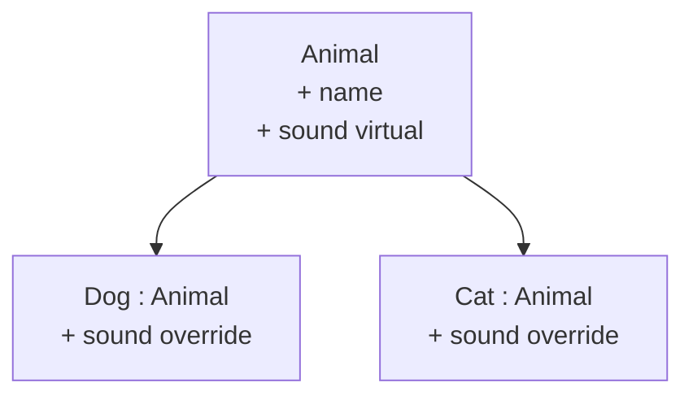
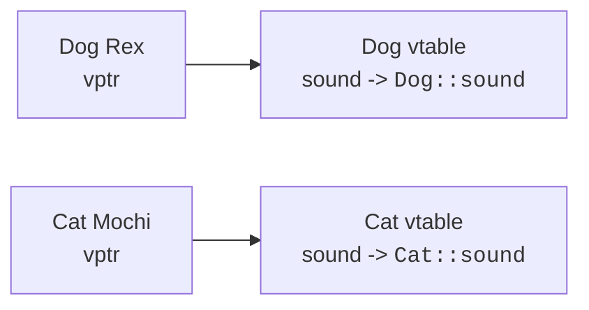

Sometimes two classes share *most* of their behaviour and differ in
only a small way. A `Square` is a `Rectangle` where width equals
height. A `Dog`, a `Cat`, and a `Cow` are all `Animal`s that
differ in how they make a sound. C++ offers two complementary
features for these situations:

- **Inheritance** lets one class extend another, taking its
  interface and adding to or refining it.
- **Polymorphism** lets a single call site invoke different code
  depending on the actual type of the object at runtime.

Used carefully, this combination is powerful. Used carelessly, it
produces tangled hierarchies that are hard to change. We'll lean
toward small examples and clear rules.

<svg
  viewBox="0 0 640 240"
  role="img"
  aria-label="A faint base card branches into three colored child cards that all carry the same white dot, yet each emits a different little shape below, shared interface, different behavior at runtime"
  style={{ display: "block", width: "100%", maxWidth: "640px", height: "auto", margin: "2.5rem auto" }}
>
  <g style={{ color: "var(--ds-blue-500)" }} fill="currentColor">
    <rect x="270" y="30" width="100" height="56" rx="14" fillOpacity="0.2" />
    <circle cx="320" cy="58" r="10" fillOpacity="0.5" />
  </g>
  <g fill="currentColor" opacity="0.25">
    <rect x="318" y="86" width="4" height="24" rx="2" />
    <rect x="158" y="110" width="324" height="4" rx="2" />
    <rect x="158" y="110" width="4" height="26" rx="2" />
    <rect x="478" y="110" width="4" height="26" rx="2" />
    <rect x="318" y="110" width="4" height="26" rx="2" />
  </g>
  <g style={{ color: "var(--ds-blue-500)" }} fill="currentColor">
    <rect x="112" y="136" width="96" height="56" rx="12" />
  </g>
  <g style={{ color: "var(--ds-green-500)" }} fill="currentColor">
    <rect x="272" y="136" width="96" height="56" rx="12" />
  </g>
  <g style={{ color: "var(--ds-yellow-500)" }} fill="currentColor">
    <rect x="432" y="136" width="96" height="56" rx="12" />
  </g>
  <g style={{ color: "var(--ds-white)" }} fill="currentColor">
    <circle cx="136" cy="164" r="8" fillOpacity="0.9" />
    <circle cx="296" cy="164" r="8" fillOpacity="0.9" />
    <circle cx="456" cy="164" r="8" fillOpacity="0.9" />
  </g>
  <g style={{ color: "var(--ds-blue-500)" }} fill="currentColor">
    <circle cx="160" cy="215" r="6" />
  </g>
  <g style={{ color: "var(--ds-green-500)" }} fill="currentColor">
    <polygon points="308,208 320,226 296,226" />
  </g>
  <g style={{ color: "var(--ds-yellow-500)" }} fill="currentColor">
    <rect x="462" y="208" width="16" height="16" rx="4" />
  </g>
</svg>

## A first hierarchy

```cpp
class Animal {
public:
    Animal(std::string name) : name_(std::move(name)) {}
    const std::string& name() const { return name_; }

    virtual std::string sound() const { return "(generic sound)"; }
    virtual ~Animal() = default;     // important, see below

protected:
    std::string name_;
};

class Dog : public Animal {
public:
    Dog(std::string name) : Animal(std::move(name)) {}
    std::string sound() const override { return "woof"; }
};

class Cat : public Animal {
public:
    Cat(std::string name) : Animal(std::move(name)) {}
    std::string sound() const override { return "meow"; }
};
```

Three new keywords to absorb:

- `: public Animal`, `Dog` and `Cat` are **derived** from
  `Animal`. They inherit its public members.
- `virtual`, marks `sound` as overridable; calls go through a
  runtime dispatch mechanism (the *vtable*) so the correct override
  runs even via a base-class pointer or reference.
- `override`, tells the compiler "this is meant to override a
  virtual function." If the signature doesn't match a base virtual,
  you get a compile error instead of a silent mismatch.



## Polymorphism in action

Once `sound` is virtual, code that holds an `Animal*` or `Animal&`
will dispatch to the actual concrete class's version:

<CodeBlock
  adapter="cpp"
  files={[
    {
      filename: "main.cpp",
      starterCode: `#include <iostream>
#include <memory>
#include <string>
#include <vector>

class Animal {
public:
  Animal(std::string name) : name_(std::move(name)) {}
  const std::string &name() const { return name_; }
  virtual std::string sound() const { return "(none)"; }
  virtual ~Animal() = default;

protected:
  std::string name_;
};

class Dog : public Animal {
public:
  Dog(std::string n) : Animal(std::move(n)) {}
  std::string sound() const override { return "woof"; }
};
class Cat : public Animal {
public:
  Cat(std::string n) : Animal(std::move(n)) {}
  std::string sound() const override { return "meow"; }
};

int main() {
  std::vector<std::unique_ptr<Animal>> zoo;
  zoo.push_back(std::make_unique<Dog>("Rex"));
  zoo.push_back(std::make_unique<Cat>("Mochi"));

  for (auto &a : zoo) {
    std::cout << a->name() << " says " << a->sound() << "\\n";
  }
  return 0;
}
`,
    },
  ]}
/>

Even though the loop variable's static type is "pointer to
`Animal`", the call `a->sound()` runs `Dog::sound` or `Cat::sound`
depending on what each pointer actually points to. That is **runtime
polymorphism**.

## How the compiler does this

For each class with virtual functions, the compiler builds a small
hidden table, the **vtable**, listing the address of each virtual
function for that class. Each object of that class stores a
**vptr** to its class's vtable.



When you call `a->sound()`, the compiler emits "look up `sound` in
`a`'s vtable and call it." That's the one indirect call that gives
you polymorphism, small but not free, which is why virtual is
opt-in in C++.

## Virtual destructors: don't forget

If you ever delete a derived object through a base-class pointer:

```cpp
Animal* a = new Dog("Rex");
delete a;     // calls ~Animal, but Dog parts may leak unless dtor is virtual
```

A non-virtual destructor would only run `~Animal`, leaving any
`Dog`-specific resources unreleased. **Any class that's intended to
be a polymorphic base must give its destructor `virtual`.** That's
why we wrote `virtual ~Animal() = default;` above.

## `protected` access

The base class above used `protected:` for `name_`. `protected` is
like `private` but also accessible from derived classes. Use it
sparingly, it weakens encapsulation. Often it's better to keep
fields `private` and let derived classes call public methods.

## Inheritance versus composition

It's tempting to use inheritance whenever two classes share fields
or behaviour. Often the better tool is **composition**, one class
*has* the other as a member.

```cpp
// Inheritance: Car is-a Vehicle
class Car : public Vehicle { ... };

// Composition: Car has-an Engine
class Car {
    Engine engine_;
    ...
};
```

A useful rule: ask "is the relationship really 'is-a' in every
sense?" If a `Square` *is-a* `Rectangle`, then you should be able
to use a `Square` wherever a `Rectangle` is expected. (Famously,
this fails in many ways, set a "rectangle's" width and its height
changes too, which is why "Square inherits from Rectangle" is a
textbook OOP anti-example.)

That test has a name: the **Liskov Substitution Principle**, after
computer scientist Barbara Liskov, who formulated the idea in a 1987
keynote. The principle says a derived class must be usable anywhere
its base class is expected, *without the caller noticing any broken
promises*. Liskov went on to win the 2008 Turing Award, computing's
highest honor, in part for this work on data abstraction. When a
hierarchy starts requiring "well, unless it's actually a Square"
checks in calling code, the substitution principle is being
violated, and composition is usually the way out.

When in doubt, compose.

## Pure virtuals and abstract classes

You can declare a virtual function with no body, forcing every
derived class to provide its own:

```cpp
class Shape {
public:
    virtual double area() const = 0;     // pure virtual
    virtual ~Shape() = default;
};
```

A class with at least one pure virtual is **abstract**, you cannot
create an instance of it directly. It serves as an **interface**
that derived classes must implement.

<CodeBlock
  adapter="cpp"
  files={[
    {
      filename: "main.cpp",
      starterCode: `#include <iostream>
#include <memory>
#include <vector>

class Shape {
public:
  virtual double area() const = 0;
  virtual ~Shape() = default;
};

class Circle : public Shape {
public:
  Circle(double r) : r_(r) {}
  double area() const override { return 3.14159265 * r_ * r_; }

private:
  double r_;
};

class Square : public Shape {
public:
  Square(double s) : s_(s) {}
  double area() const override { return s_ * s_; }

private:
  double s_;
};

int main() {
  std::vector<std::unique_ptr<Shape>> shapes;
  shapes.push_back(std::make_unique<Circle>(1.0));
  shapes.push_back(std::make_unique<Square>(2.0));

  double total = 0;
  for (auto &s : shapes)
    total += s->area();
  std::cout << "total area = " << total << "\\n";
  return 0;
}
`,
    },
  ]}
/>

## Challenge

<ChallengeCard
  adapter="cpp"
  title="Shapes hierarchy"
  instructions={`Add a \`Rectangle\` class derived from the abstract \`Shape\` that takes \`width\` and \`height\` and returns \`width * height\` from \`area()\`. \`main\` already creates a \`Rectangle(3.0, 4.0)\`, calls \`area()\`, and expects \`12\` on stdout.`}
  files={[
    {
      filename: "main.cpp",
      starterCode: `#include <iostream>
#include <memory>

class Shape {
public:
  virtual double area() const = 0;
  virtual ~Shape() = default;
};

// add Rectangle here

int main() {
  std::unique_ptr<Shape> s = /* construct a Rectangle(3.0, 4.0) */ nullptr;
  std::cout << s->area();
  return 0;
}
`,
      solutionCode: `#include <iostream>
#include <memory>

class Shape {
public:
  virtual double area() const = 0;
  virtual ~Shape() = default;
};

class Rectangle : public Shape {
public:
  Rectangle(double w, double h) : w_(w), h_(h) {}
  double area() const override { return w_ * h_; }

private:
  double w_, h_;
};

int main() {
  std::unique_ptr<Shape> s = std::make_unique<Rectangle>(3.0, 4.0);
  std::cout << s->area();
  return 0;
}
`,
    },
  ]}
  tests={[
    {
      id: "rect",
      name: "Area is 12",
      description: "Exact stdout match",
      expect: { stdoutEquals: "12" },
    },
  ]}
/>

## Test your understanding

<MultipleChoice
  markdown={`What does the \`virtual\` keyword on a member function do?

- It marks the function as faster to call.
  > Virtual functions are slightly *slower* due to the indirect call.
- [o] It makes the function dispatched at runtime through the vtable, so calls via a base pointer/reference run the most-derived override.
  > This is the mechanism for runtime polymorphism.
- It hides the function from derived classes.
  > That is what \`private\` does.
- It is required for any inherited function.
  > Inherited non-virtual functions work fine; they just don't dispatch dynamically.`}
/>

<MultipleChoice
  markdown={`Why give a polymorphic base class a \`virtual\` destructor?

- The compiler refuses to compile otherwise.
  > It only warns in some configurations.
- It makes destruction faster.
  > It is slightly slower.
- [o] So that \`delete\` through a base-class pointer also calls the derived destructor and releases derived-class resources; otherwise you get a partial cleanup which is undefined behavior.
  > The virtual destructor ensures the full chain of destructors runs.
- It is purely stylistic.
  > It has real semantic consequences.`}
/>

Next: how to *own* resources properly, the RAII pattern that
underpins all robust C++ programs.
